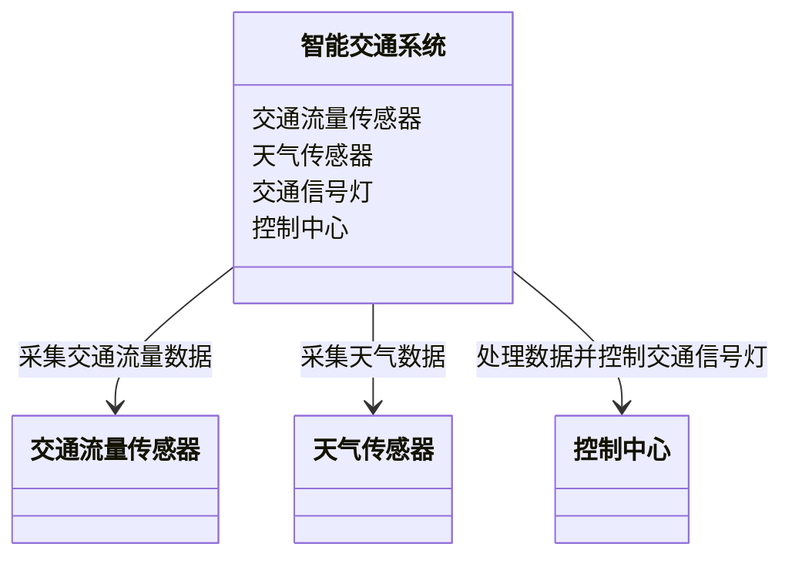
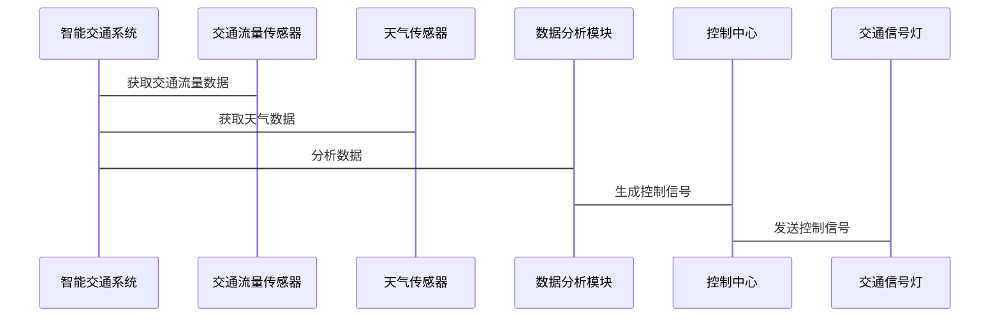

                 


# 情境感知技术的应用

> 关键词：情境感知，传感器数据融合，语义理解，实时处理，智能系统，物联网

> 摘要：情境感知技术是一种通过感知环境、用户和设备的状态，结合上下文信息，动态调整系统行为的技术。本文将从情境感知的基本概念、核心技术、算法原理、系统架构、项目实战等多个方面进行详细探讨，旨在帮助读者全面理解情境感知技术的应用及其在智能系统中的重要性。

---

## 第1章: 情境感知技术的概述

### 1.1 情境感知的基本概念

#### 1.1.1 情境感知的定义
情境感知（Context-Awareness）是一种技术，通过感知环境、用户和设备的状态，结合上下文信息，动态调整系统行为。它旨在为用户提供智能化的服务，使系统能够根据当前情境做出最优决策。

#### 1.1.2 情境感知的核心要素
情境感知的核心要素包括：
1. **环境**：物理环境的状态，如温度、光照、位置等。
2. **用户**：用户的特征、行为和需求。
3. **设备**：设备的类型、状态和能力。
4. **上下文**：将环境、用户和设备的信息综合起来，形成有意义的上下文。

#### 1.1.3 情境感知的应用场景
情境感知技术广泛应用于多个领域：
- **智能设备**：如智能手机、可穿戴设备，根据用户的使用习惯调整显示亮度、屏幕旋转等。
- **物联网**：通过感知环境数据，实现智能设备的协同工作，如智能家居中的温度调节。
- **智能交通**：通过实时感知交通状况，优化交通流量，减少拥堵。
- **智能医疗**：根据患者的生理数据和医疗环境，提供个性化的医疗建议。

### 1.2 情境感知技术的背景与技术背景

#### 1.2.1 情境感知技术的发展历程
情境感知技术起源于20世纪90年代，随着传感器技术、数据处理能力和人工智能的发展，逐渐从理论研究走向实际应用。近年来，随着物联网和人工智能的快速发展，情境感知技术得到了广泛应用。

#### 1.2.2 情境感知技术的技术基础
情境感知技术依赖于以下几个方面：
1. **传感器技术**：用于采集环境数据。
2. **数据融合技术**：将多源数据进行融合，提高感知准确性。
3. **语义理解技术**：将感知数据转换为有意义的上下文信息。
4. **实时处理技术**：快速处理感知数据，做出实时决策。

#### 1.2.3 情境感知技术的核心挑战
情境感知技术面临以下挑战：
1. **数据多样性**：环境数据来源多样，如何有效融合是一个难题。
2. **实时性要求高**：需要快速处理数据并做出决策。
3. **隐私保护**：用户数据的安全性和隐私性需要严格保护。

### 1.3 情境感知技术的应用领域

#### 1.3.1 智能设备与物联网
在智能设备中，情境感知技术用于根据用户的使用习惯和环境条件调整设备行为。例如，智能手机可以根据用户的位置和时间自动切换网络。

#### 1.3.2 智能交通系统
智能交通系统通过感知交通流量、天气状况等信息，优化交通信号灯控制，减少拥堵。

#### 1.3.3 智能医疗与健康监测
智能医疗系统可以根据患者的生理数据和医疗环境，提供个性化的医疗建议。

#### 1.3.4 智能家居与环境控制
智能家居系统可以根据用户的习惯和环境条件，自动调节室内温度、照明等。

---

## 第2章: 情境感知的核心概念与联系

### 2.1 情境感知的核心概念

#### 2.1.1 情境感知的定义与属性
情境感知是一种动态技术，能够根据环境、用户和设备的状态调整系统行为。其核心属性包括实时性、动态性、个性化和上下文相关性。

#### 2.1.2 情境感知的体系结构
情境感知的体系结构通常包括以下几个部分：
1. **感知层**：采集环境数据。
2. **理解层**：将感知数据转换为有意义的上下文信息。
3. **决策层**：根据上下文信息做出决策。
4. **执行层**：执行决策结果。

#### 2.1.3 情境感知的数据来源
情境感知的数据来源包括：
- **环境数据**：如温度、湿度、光照等。
- **用户数据**：如用户的位置、行为、偏好等。
- **设备数据**：如设备的状态、类型等。

### 2.2 情境感知的关键特征

#### 2.2.1 数据的实时性与准确性
情境感知需要实时采集和处理数据，以确保决策的及时性和准确性。

#### 2.2.2 环境的动态性与多样性
环境条件是动态变化的，情境感知需要能够适应不同环境的变化。

#### 2.2.3 用户需求的个性化与情境关联性
用户需求具有个性化，情境感知需要根据用户的个性化需求和当前情境提供服务。

### 2.3 情境感知的ER实体关系图

```mermaid
er
  entity 情境感知系统 {
    attribute 情境ID, 感知数据, 时间戳, 用户ID
  }
  entity 用户 {
    attribute 用户ID, 用户特征
  }
  entity 环境 {
    attribute 环境ID, 环境特征
  }
  entity 设备 {
    attribute 设备ID, 设备类型
  }
  relationship 感知数据关联 {
    情境感知系统 -[0..n] 感知数据
  }
  relationship 用户关联 {
    用户 -[0..n] 情境感知系统
  }
  relationship 环境关联 {
    环境 -[0..n] 情境感知系统
  }
  relationship 设备关联 {
    设备 -[0..n] 情境感知系统
  }
```

---

## 第3章: 情境感知的关键技术

### 3.1 传感器数据融合技术

#### 3.1.1 数据融合的基本原理
传感器数据融合技术是指将来自多个传感器的数据进行综合处理，以提高感知准确性。常用的方法包括加权平均和卡尔曼滤波。

#### 3.1.2 多源数据融合的方法
多源数据融合方法包括：
1. **基于规则的融合**：根据预定义的规则进行数据融合。
2. **基于统计的融合**：利用统计方法进行数据融合，如卡尔曼滤波。

#### 3.1.3 数据融合的优化策略
数据融合的优化策略包括：
1. **选择合适的融合方法**：根据应用场景选择合适的融合方法。
2. **处理传感器噪声**：通过滤波等方法消除传感器噪声。

### 3.2 情境语义理解技术

#### 3.2.1 语义理解的基本概念
语义理解是指将感知数据转换为有意义的上下文信息。常用的技术包括基于规则的语义分析和基于知识图谱的语义推理。

#### 3.2.2 基于上下文的语义分析
基于上下文的语义分析需要考虑感知数据的时空关系和语义关联。

#### 3.2.3 基于知识图谱的语义推理
基于知识图谱的语义推理通过构建知识图谱，推理出隐含的语义信息。

### 3.3 情境实时处理技术

#### 3.3.1 实时处理的基本原理
实时处理技术是指在感知数据采集后，快速处理并做出决策。常用的方法包括事件驱动和时间戳处理。

#### 3.3.2 实时处理的优化策略
实时处理的优化策略包括：
1. **减少计算复杂度**：通过优化算法减少计算量。
2. **提高处理速度**：使用并行计算和异步处理。

---

## 第4章: 情境感知算法原理

### 4.1 算法概述

#### 4.1.1 算法分类
情境感知算法主要分为基于规则的算法、基于统计学习的算法和基于深度学习的算法。

#### 4.1.2 算法选择依据
算法选择依据包括数据类型、处理速度和准确性要求。

### 4.2 基于规则的算法

#### 4.2.1 算法原理
基于规则的算法通过预定义的规则进行决策。例如，当温度超过30度时，开启空调。

#### 4.2.2 算法实现
```python
def rule_based_decision(temperature):
    if temperature > 30:
        return "开启空调"
    else:
        return "关闭空调"
```

#### 4.2.3 算法优缺点
- 优点：简单易懂，实现成本低。
- 缺点：难以处理复杂的情境，规则需要手动维护。

### 4.3 基于统计学习的算法

#### 4.3.1 算法原理
基于统计学习的算法通过训练数据，学习上下文特征，进行分类或回归。

#### 4.3.2 算法实现
```python
from sklearn.tree import DecisionTreeClassifier

# 训练数据
X = [[25, '晴'], [30, '阴'], [35, '雨']]
y = ['关闭', '开启', '关闭']

# 训练模型
model = DecisionTreeClassifier()
model.fit(X, y)

# 预测
new_data = [[30, '晴']]
print(model.predict(new_data))
```

#### 4.3.3 算法优缺点
- 优点：能够处理复杂的情境，准确性高。
- 缺点：需要大量的训练数据，实现复杂。

### 4.4 基于深度学习的算法

#### 4.4.1 算法原理
基于深度学习的算法通过神经网络模型，学习感知数据的特征，进行分类或回归。

#### 4.4.2 算法实现
```python
import tensorflow as tf

# 定义模型
model = tf.keras.Sequential([
    tf.keras.layers.Dense(64, activation='relu'),
    tf.keras.layers.Dense(1, activation='sigmoid')
])

# 编译模型
model.compile(optimizer='adam', loss='binary_crossentropy', metrics=['accuracy'])

# 训练模型
model.fit(X_train, y_train, epochs=10, batch_size=32)
```

#### 4.4.3 算法优缺点
- 优点：能够处理复杂的非线性关系，准确性高。
- 缺点：需要大量的训练数据和计算资源。

---

## 第5章: 情境感知系统架构设计

### 5.1 问题场景介绍

#### 5.1.1 问题背景
以智能交通系统为例，需要实时感知交通流量、天气状况等信息，优化交通信号灯控制。

#### 5.1.2 项目介绍
设计一个智能交通管理系统，实现交通流量的实时监控和优化。

### 5.2 系统功能设计

#### 5.2.1 领域模型设计


#### 5.2.2 系统架构设计


#### 5.2.3 系统接口设计
- **输入接口**：交通流量传感器和天气传感器的数据接口。
- **输出接口**：交通信号灯的控制信号。

#### 5.2.4 系统交互流程


---

## 第6章: 情境感知项目实战

### 6.1 项目环境安装

#### 6.1.1 安装Python和必要的库
```bash
pip install numpy pandas scikit-learn tensorflow
```

#### 6.1.2 安装传感器和设备驱动
安装相应的传感器驱动和设备连接库。

### 6.2 系统核心实现

#### 6.2.1 数据采集模块
```python
import time

def采集数据():
    # 采集交通流量数据
    traffic_flow = get_traffic_flow()
    # 采集天气数据
    weather = get_weather()
    return traffic_flow, weather
```

#### 6.2.2 数据处理模块
```python
def 处理数据(traffic_flow, weather):
    # 数据融合
    context = 融合数据(traffic_flow, weather)
    # 语义理解
    semantic_context = 理解上下文(context)
    return semantic_context
```

#### 6.2.3 决策模块
```python
def 决策(semantic_context):
    # 基于上下文的决策
    decision = 分析上下文(semantic_context)
    return decision
```

#### 6.2.4 执行模块
```python
def 执行决策(decision):
    # 执行决策
    执行操作(decision)
```

### 6.3 项目实战总结

#### 6.3.1 功能解读
- 数据采集模块：实时采集交通流量和天气数据。
- 数据处理模块：将数据进行融合和语义理解。
- 决策模块：根据上下文信息做出决策。
- 执行模块：执行决策结果。

#### 6.3.2 案例分析
通过实际案例分析，验证系统的设计和实现是否满足需求。

#### 6.3.3 项目小结
总结项目实施过程中的经验和教训，提出改进建议。

---

## 第7章: 情境感知技术的扩展阅读

### 7.1 情境感知技术的研究热点

#### 7.1.1 多模态数据融合
多模态数据融合是当前研究的热点之一，旨在提高感知的准确性和鲁棒性。

#### 7.1.2 情境感知与边缘计算
情境感知与边缘计算的结合，能够实现更高效的实时处理。

### 7.2 情境感知技术的未来趋势

#### 7.2.1 智能化与自动化
未来情境感知技术将更加智能化和自动化，能够自主学习和优化。

#### 7.2.2 人机协作
情境感知技术将更加注重人机协作，提供更自然的交互方式。

### 7.3 推荐的书籍和资源

#### 7.3.1 书籍推荐
1. 《情境感知技术与应用》
2. 《传感器数据融合：算法与应用》

#### 7.3.2 在线资源
1. 情境感知技术的论文和研究报告。
2. 开源项目和工具。

---

## 第8章: 附录

### 8.1 情境感知技术相关的数据集

#### 8.1.1 公开数据集
1. **UCI Machine Learning Repository**：提供多种传感器数据集。
2. **Kaggle**：提供丰富的机器学习数据集。

#### 8.1.2 数据集格式
数据集通常以CSV或JSON格式存储，方便数据处理和分析。

### 8.2 情境感知技术相关的工具与库

#### 8.2.1 Python库
1. **NumPy**：用于数值计算。
2. **Pandas**：用于数据分析。
3. **Scikit-learn**：用于机器学习算法。

#### 8.2.2 开源框架
1. **TensorFlow**：用于深度学习。
2. **Keras**：用于深度学习模型的快速构建。

### 8.3 参考文献

#### 8.3.1 中文文献
1. 王某某，情境感知技术的研究与应用，某某出版社，2023年。
2. 李某某，传感器数据融合技术，某某出版社，2022年。

#### 8.3.2 英文文献
1. Smith, J., Context-awareness in intelligent systems, Springer, 2021.
2. Brown, T., Data fusion techniques, Academic Press, 2020.

---

通过以上内容，您可以系统地了解情境感知技术的核心概念、关键技术、算法原理、系统架构以及项目实战。希望这篇文章对您理解情境感知技术有所帮助。

