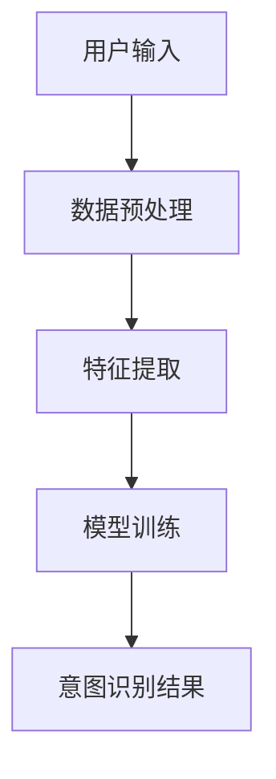
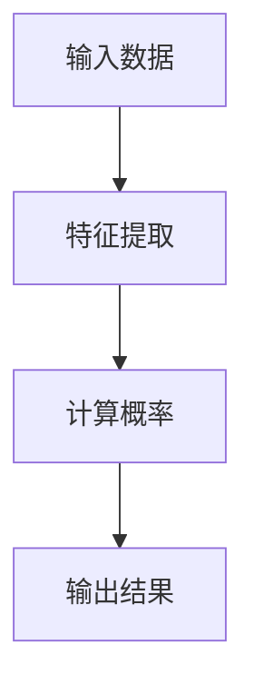
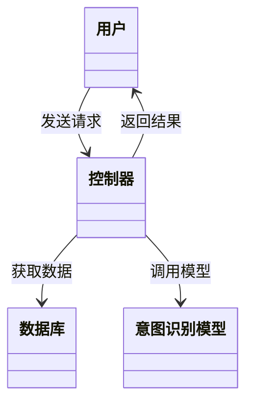
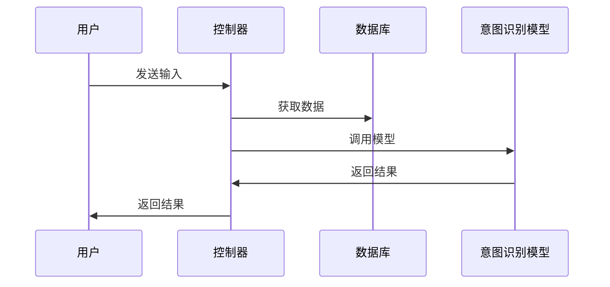

                 


# 意图识别：准确把握用户需求的关键

> 关键词：意图识别，自然语言处理，人机交互，需求分析，数学模型，算法实现

> 摘要：意图识别是准确把握用户需求的关键技术，本文从背景、核心概念、算法实现、系统设计和实际应用等方面详细探讨意图识别的原理和应用。通过数学模型、算法流程图和实际案例的分析，帮助读者全面理解意图识别的技术要点和实现方法。

---

## 第1章: 意图识别概述

### 1.1 什么是意图识别

#### 1.1.1 问题背景与定义

意图识别（Intention Recognition）是自然语言处理和人机交互领域中的核心技术，旨在通过分析用户的行为、语言和语境，准确理解用户的潜在需求和意图。随着人工智能技术的发展，意图识别在智能客服、语音助手、推荐系统等场景中发挥着越来越重要的作用。

#### 1.1.2 意图识别的核心目标

意图识别的核心目标是通过解析用户的输入（文本、语音、行为等），推断出用户的深层需求。例如，在智能客服系统中，用户输入“订单什么时候能到”，意图识别需要识别出用户的需求是“查询订单物流信息”。

#### 1.1.3 意图识别的边界与外延

意图识别的边界在于，它专注于分析用户的需求和意图，而不是具体的行为或动作。其外延则涉及多个相关领域，包括自然语言处理、模式识别、上下文理解等。

### 1.2 意图识别的关键要素

#### 1.2.1 用户行为与需求分析

用户行为包括语言输入、点击行为、历史记录等，这些行为可以为意图识别提供重要的上下文信息。需求分析则是通过解析这些行为，推断出用户的真实需求。

#### 1.2.2 语境信息的作用

语境信息（Context）是指与当前任务相关的背景信息，例如用户的历史行为、当前位置、时间等。这些信息可以帮助意图识别更准确地理解用户的需求。

#### 1.2.3 模糊需求的处理方法

在实际场景中，用户的表达可能存在模糊性，例如用户说“我需要帮助”，意图可能是“查询产品信息”或“投诉产品问题”。意图识别需要结合上下文信息，尽可能准确地识别用户的潜在需求。

### 1.3 意图识别的实现流程

#### 1.3.1 数据采集与预处理

数据采集是意图识别的第一步，通常包括文本数据、语音数据和行为数据的采集。预处理步骤包括分词、去除停用词、词干提取等。

#### 1.3.2 特征提取与模型训练

特征提取是将原始数据转换为模型可以理解的特征向量。模型训练则使用机器学习算法（如支持向量机、随机森林、深度学习模型）对特征向量进行训练，得到分类或回归模型。

#### 1.3.3 结果输出与反馈优化

模型输出识别结果后，需要根据实际场景进行反馈优化，例如调整模型参数、更新特征提取方法等。

### 1.4 意图识别的应用场景

#### 1.4.1 自然语言处理中的应用

在自然语言处理中，意图识别主要用于文本分类、信息抽取等领域。例如，在智能客服中，识别用户的意图可以提高问题解答的效率。

#### 1.4.2 人机交互中的应用

在人机交互中，意图识别用于理解用户的输入，从而提供更智能的服务。例如，在语音助手（如Siri、Alexa）中，意图识别是核心功能之一。

#### 1.4.3 电子商务中的应用

在电子商务中，意图识别可以用于推荐系统、个性化营销等场景。例如，通过分析用户的搜索记录，识别用户的购买意图，从而推荐相关产品。

---

## 第2章: 意图识别的核心概念

### 2.1 意图识别的原理

#### 2.1.1 基于模式识别的意图分析

模式识别是意图识别的重要组成部分，主要通过分析用户的输入模式（如关键词、句式结构）来推断用户的意图。

#### 2.1.2 基于自然语言处理的意图理解

自然语言处理（NLP）技术是意图识别的核心工具，通过语义分析、实体识别等技术，理解用户的深层需求。

#### 2.1.3 基于上下文的意图推理

意图推理需要结合上下文信息，例如用户的历史行为、当前环境等，来更准确地理解用户的意图。

### 2.2 意图识别的关键属性对比

#### 2.2.1 意图与需求的对比分析

| 属性 | 意图 | 需求 |
|------|------|------|
| 定义 | 用户的行为或语言中隐含的意图 | 用户明确或隐含的需求 |
| 识别方式 | 基于行为和语言模式识别 | 基于需求分析和上下文推理 |

#### 2.2.2 不同意图识别方法的优缺点

| 方法 | 优点 | 缺点 |
|------|------|------|
| 传统机器学习 | 简单易实现 | 对数据依赖性强 |
| 深度学习 | 高准确性 | 计算资源需求高 |

#### 2.2.3 意图识别准确率与召回率的对比

准确率是指模型正确识别的意图占所有识别意图的比例，召回率是指模型识别出的所有相关意图的比例。准确率和召回率之间通常存在权衡，需要根据具体场景选择合适的指标。

### 2.3 意图识别的ER实体关系图

```mermaid
er
actor) 用户
role) 提供者
action) 提供意图识别服务
```

### 2.4 意图识别的信息流图



---

## 第3章: 意图识别的数学模型与算法

### 3.1 概率论基础

#### 3.1.1 条件概率公式

$$P(A|B) = \frac{P(A \cap B)}{P(B)}$$

条件概率公式用于计算在给定条件B下，事件A发生的概率。

#### 3.1.2 贝叶斯定理

$$P(B|A) = \frac{P(A|B)P(B)}{P(A)}$$

贝叶斯定理是意图识别中常用的数学工具，用于计算后验概率。

### 3.2 信息论基础

#### 3.2.1 信息熵公式

$$H(X) = -\sum_{x} P(x) \log P(x)$$

信息熵用于衡量数据的不确定性，是意图识别中常用的评估指标。

### 3.3 意图识别的算法实现

#### 3.3.1 朴素贝叶斯算法



```python
import numpy as np
from sklearn.naive_bayes import MultinomialNB

# 数据预处理
X = vectorizer.fit_transform(corpus)
y = [0, 1, 2, ...]  # 类别标签

# 模型训练
model = MultinomialNB()
model.fit(X, y)

# 预测
new_data = vectorizer.transform([new_sentence])
predicted = model.predict(new_data)
```

---

## 第4章: 意图识别的系统分析与架构设计

### 4.1 项目背景与需求分析

#### 4.1.1 项目介绍

本项目旨在设计一个基于意图识别的智能客服系统，帮助用户快速找到所需信息。

#### 4.1.2 系统功能设计

| 功能模块 | 功能描述 |
|----------|----------|
| 数据采集 | 采集用户输入 |
| 特征提取 | 提取文本特征 |
| 模型训练 | 训练意图识别模型 |
| 结果输出 | 输出识别结果 |

#### 4.1.3 系统架构设计



### 4.2 系统交互设计

#### 4.2.1 交互流程图



---

## 第5章: 意图识别的项目实战

### 5.1 环境安装与配置

#### 5.1.1 安装Python和相关库

```bash
pip install numpy scikit-learn nltk
```

### 5.2 核心代码实现

#### 5.2.1 数据预处理

```python
import nltk
from sklearn.feature_extraction.text import TfidfVectorizer

# 分词
corpus = ["I need help with my order", "Where is my package?"]
tokens = [nltk.word_tokenize(sentence) for sentence in corpus]

# 特征提取
vectorizer = TfidfVectorizer()
X = vectorizer.fit_transform([" ".join(t) for t in tokens])
```

#### 5.2.2 模型训练与预测

```python
from sklearn.naive_bayes import MultinomialNB

# 训练模型
model = MultinomialNB()
model.fit(X, [0, 1])  # 假设类别为0和1

# 预测
new_sentence = "Can you track my order?"
new_X = vectorizer.transform([new_sentence])
predicted = model.predict(new_X)
print(predicted)
```

### 5.3 案例分析与经验总结

#### 5.3.1 案例分析

以电商客服系统为例，分析意图识别在实际中的应用。例如，用户输入“订单查询”，系统识别出用户的意图是“查询订单物流信息”。

#### 5.3.2 经验总结

在实际应用中，需要不断优化模型，结合实际场景调整特征提取方法和评估指标。

---

## 第6章: 意图识别的最佳实践

### 6.1 小结

意图识别是准确把握用户需求的关键技术，通过结合自然语言处理、概率论和机器学习算法，可以实现高效准确的意图识别。

### 6.2 注意事项

1. 数据质量对意图识别的准确性有重要影响。
2. 需要结合实际场景选择合适的算法和模型。
3. 模型需要不断优化和更新。

### 6.3 扩展阅读

1. 《自然语言处理实战：基于Python的机器学习和深度学习》
2. 《模式识别与机器学习》
3. TensorFlow和PyTorch框架下的意图识别实现。

---

通过以上内容，您可以全面了解意图识别的核心概念、算法实现和实际应用。希望本文对您在相关领域的研究和实践有所帮助。

