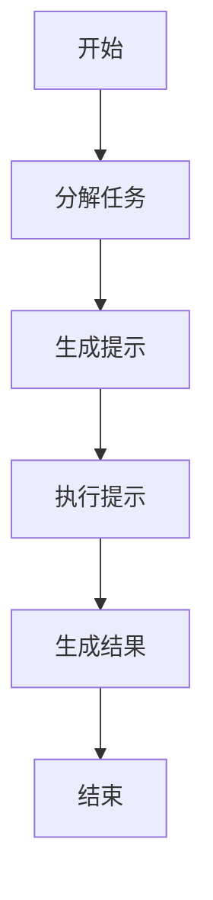
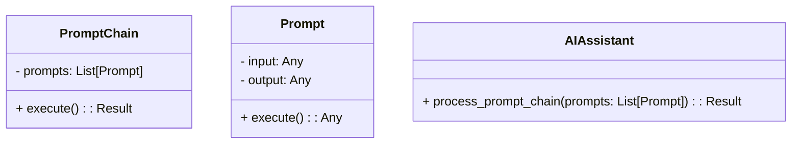
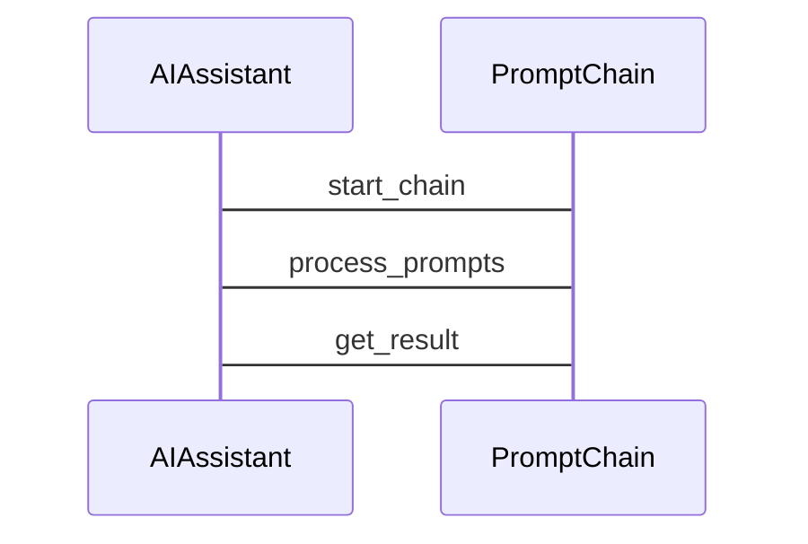

                 


# 提示链：设计复杂任务的AI Agent解决方案

> 关键词：提示链，AI Agent，复杂任务，系统设计，算法原理，项目实战

> 摘要：本文深入探讨了提示链在设计复杂任务中的AI Agent解决方案。通过背景介绍、核心概念、算法原理、系统设计、项目实战和最佳实践等多维度的分析，结合具体的案例和代码实现，详细阐述了提示链如何优化AI Agent的任务处理流程，提升复杂任务的执行效率和准确性。文章旨在为AI Agent的设计者和开发者提供系统化的指导和实践参考。

---

## 第一部分：提示链与AI Agent概述

### 第1章：提示链与AI Agent的背景介绍

#### 1.1 问题背景与问题描述
在现代信息技术快速发展的背景下，复杂任务的处理需求日益增长。传统的任务处理方式往往依赖于人工干预或简单的自动化工具，难以应对复杂性高、涉及多领域协作的任务。例如，在企业中，复杂的项目管理、供应链优化、客户服务等问题，往往需要多个系统协同工作，涉及大量的数据处理和决策。

AI Agent作为一种智能代理系统，能够通过感知环境、自主决策并执行任务，为复杂任务的处理提供了新的可能性。然而，AI Agent在实际应用中面临着任务分解不清晰、信息传递不高效、决策链路复杂等问题。提示链作为一种新的任务处理机制，通过将任务分解为一系列相互关联的提示，为AI Agent提供了更高效的执行路径。

#### 1.2 提示链的定义与特点
提示链（Prompt Chain）是一种将复杂任务分解为多个简单提示（Prompts）的机制。每个提示都是一个独立的任务单元，通过链式结构相互连接，形成完整的任务执行流程。提示链的核心特点包括：
- **可分解性**：复杂任务被分解为多个简单提示，每个提示独立执行。
- **可扩展性**：提示链可以根据任务需求灵活扩展或缩减。
- **高效性**：通过链式结构减少信息传递的冗余，提高任务执行效率。
- **可追溯性**：每个提示的执行结果可以被记录和追溯。

#### 1.3 AI Agent的定义与特点
AI Agent（人工智能代理）是一种能够感知环境、自主决策并执行任务的智能系统。AI Agent的特点包括：
- **自主性**：能够在没有人工干预的情况下自主运行。
- **反应性**：能够根据环境变化动态调整行为。
- **目标导向性**：以实现特定目标为导向执行任务。
- **学习能力**：能够通过数据和经验不断优化自身行为。

#### 1.4 提示链与AI Agent的关系
提示链与AI Agent的关系是协同共生的。提示链为AI Agent提供了高效的任务处理机制，而AI Agent则为提示链的执行提供了智能支持。通过提示链，AI Agent能够更高效地分解任务、执行任务和反馈结果。

#### 1.5 本章小结
本章通过背景介绍，阐述了提示链与AI Agent的核心概念，明确了提示链在复杂任务处理中的作用，为后续内容的展开奠定了基础。

---

## 第二部分：提示链的核心概念与联系

### 第2章：提示链的核心原理

#### 2.1 提示链的原理与机制
提示链的核心原理在于将复杂任务分解为多个提示，并通过链式结构进行任务执行。每个提示都是一个独立的任务单元，提示之间通过明确的输入输出接口进行连接。提示链的执行过程如下：
1. **任务分解**：将复杂任务分解为多个提示。
2. **提示执行**：每个提示依次执行，生成结果作为下一个提示的输入。
3. **结果反馈**：最后一个提示的结果即为整个任务的最终结果。

#### 2.2 AI Agent的决策过程
AI Agent的决策过程包括感知、推理和行动三个阶段：
1. **感知**：通过传感器或接口获取环境信息。
2. **推理**：基于获取的信息，结合知识库和逻辑推理，生成决策。
3. **行动**：根据决策结果执行任务。

提示链通过分解任务，优化了AI Agent的决策过程，减少了信息传递的复杂性。

#### 2.3 提示链与AI Agent的实体关系图
以下是提示链与AI Agent的实体关系图：

```mermaid
er
actor 提示链
actor AI Agent
actor 任务分解
actor 任务执行
```

#### 2.4 本章小结
本章通过分析提示链的核心原理，明确了提示链在AI Agent系统中的作用，为后续的算法设计和系统实现提供了理论基础。

---

## 第三部分：提示链的算法原理与数学模型

### 第3章：提示链的算法原理

#### 3.1 提示链的算法流程
提示链的算法流程如下：



#### 3.2 提示链的数学模型
提示链的数学模型可以表示为一个链式结构：

$$
P_1 \rightarrow P_2 \rightarrow \cdots \rightarrow P_n
$$

其中，$P_i$ 表示第i个提示，$\rightarrow$ 表示提示之间的依赖关系。

#### 3.3 提示链的Python实现示例
以下是提示链的Python实现示例：

```python
def process_prompt_chain(prompts):
    result = None
    for prompt in prompts:
        if result is None:
            result = prompt.execute()
        else:
            prompt.set_input(result)
            result = prompt.execute()
    return result
```

#### 3.4 本章小结
本章通过算法流程图和数学模型，详细阐述了提示链的实现原理，为后续的系统设计提供了技术支撑。

---

## 第四部分：提示链的系统设计与实现

### 第4章：提示链的系统分析与架构设计

#### 4.1 问题场景介绍
以智能客服系统为例，复杂任务包括客户咨询、问题分类、解决方案生成等。

#### 4.2 系统功能设计
以下是系统功能设计的类图：



#### 4.3 系统架构设计
以下是系统架构设计的架构图：

```mermaid
docker
    server AIAssistant {
        service process_prompt_chain
    }
    service PromptChain {
        uses process_prompt_chain
    }
```

#### 4.4 系统接口设计
以下是系统接口设计的序列图：



#### 4.5 本章小结
本章通过系统设计与架构设计，明确了提示链在实际应用中的实现方式，为后续的项目实战提供了指导。

---

## 第五部分：提示链的项目实战与案例分析

### 第5章：提示链的项目实战

#### 5.1 环境安装与配置
- 安装Python 3.8及以上版本
- 安装必要的Python库（如`mermaid`、`graphviz`等）

#### 5.2 系统核心实现源代码
以下是提示链的核心实现代码：

```python
class Prompt:
    def __init__(self):
        self.input = None
        self.output = None

    def execute(self):
        pass

class PromptChain:
    def __init__(self, prompts):
        self.prompts = prompts

    def execute(self):
        result = None
        for prompt in self.prompts:
            if result is None:
                result = prompt.execute()
            else:
                prompt.input = result
                result = prompt.execute()
        return result
```

#### 5.3 代码应用解读与分析
通过上述代码，我们可以看到提示链的核心逻辑是通过遍历提示列表，依次执行每个提示，并将结果传递给下一个提示。这种设计方式使得复杂任务的处理变得简单高效。

#### 5.4 案例分析与详细讲解
以智能客服系统为例，提示链可以将客户的咨询请求分解为多个提示，例如：
1. 提示1：识别客户咨询类型
2. 提示2：检索相关解决方案
3. 提示3：生成回复内容

通过提示链，AI Agent可以高效地完成整个任务流程。

#### 5.5 本章小结
本章通过项目实战，详细讲解了提示链的实际应用，帮助读者理解提示链在复杂任务中的具体实现方式。

---

## 第六部分：提示链的最佳实践与总结

### 第6章：提示链的最佳实践

#### 6.1 小结
提示链作为一种高效的复杂任务处理机制，通过将任务分解为多个提示，优化了AI Agent的任务执行流程。

#### 6.2 注意事项
- 提示链的设计需要考虑任务的分解粒度和顺序。
- 提示链的执行效率依赖于提示之间的依赖关系设计。

#### 6.3 拓展阅读
建议读者进一步阅读以下内容：
- 提示链在其他领域的应用
- AI Agent的最新研究成果

#### 6.4 本章小结
本章通过小结和注意事项，总结了提示链的设计与实现的关键点，为读者提供了实践指导。

---

## 结语

通过本文的系统阐述，我们深入探讨了提示链在设计复杂任务中的AI Agent解决方案。从背景介绍到算法原理，从系统设计到项目实战，我们详细分析了提示链的实现方式和应用价值。希望本文能够为AI Agent的设计者和开发者提供系统化的指导和实践参考。

