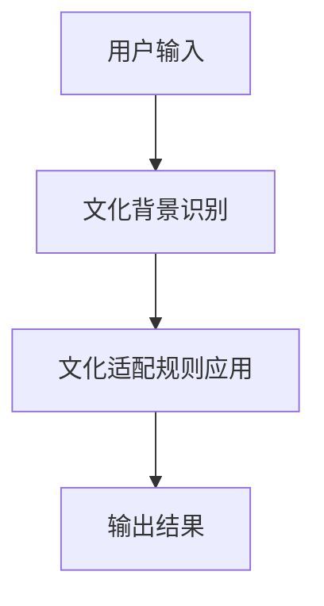
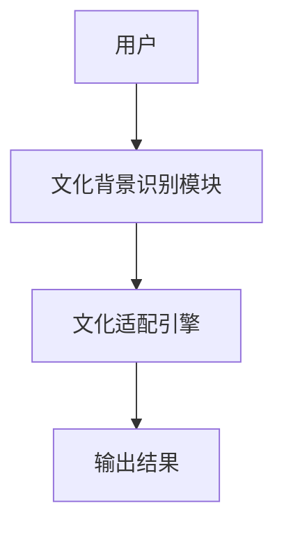
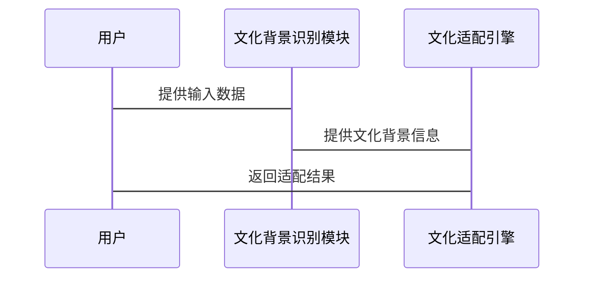

                 


# 文化适应：让AI Agent理解不同文化背景

**关键词：** 文化适应，AI Agent，跨文化沟通，文化敏感性，机器学习，人工智能

**摘要：**  
本文探讨了文化适应在AI Agent中的重要性，分析了如何让AI Agent理解并适应不同文化背景的需求。通过背景介绍、核心概念、算法原理和系统架构的详细分析，本文为实现文化适应的AI系统提供了理论基础和实践指导。

---

# 第一部分: 文化适应与AI Agent概述

## 第1章: 文化适应与AI Agent的背景介绍

### 1.1 问题背景与描述

#### 1.1.1 AI Agent的基本概念
AI Agent（人工智能代理）是一种能够感知环境、执行任务并做出决策的智能系统。它可以自主学习和适应不同的使用场景，广泛应用于推荐系统、自然语言处理、自动驾驶等领域。

#### 1.1.2 跨文化场景中的AI Agent挑战
在跨文化场景中，AI Agent需要理解不同文化背景下的用户需求、行为习惯和语言表达方式。例如，在不同文化中，相同的输入可能引发不同的预期输出，AI Agent需要能够准确识别并满足这些差异。

#### 1.1.3 文化适应的重要性
文化适应是AI Agent在跨文化环境中提供有效服务的关键。通过理解文化差异，AI Agent可以避免误解和错误，提高用户体验和满意度。

### 1.2 问题解决与边界

#### 1.2.1 文化适应的核心目标
文化适应的核心目标是使AI Agent能够在不同文化背景下准确理解用户需求，并提供符合用户期望的服务。

#### 1.2.2 AI Agent文化适应的边界与外延
文化适应的边界包括文化背景、语言习惯、行为规范等方面，但不涉及个人隐私或文化禁忌。外延则扩展到跨文化沟通、文化敏感性和文化适应性设计等领域。

#### 1.2.3 核心概念与要素分析
文化适应涉及文化背景识别、文化差异处理和文化适配输出三个核心要素。

### 1.3 本章小结
本章介绍了AI Agent的基本概念和文化适应的重要性，明确了文化适应的核心目标和边界，为后续内容奠定了基础。

---

# 第二部分: 文化适应的核心概念与联系

## 第2章: 文化适应的核心概念原理

### 2.1 文化适应的定义与特征

#### 2.1.1 文化适应的定义
文化适应是指AI Agent根据用户的文化背景调整其行为和输出，以满足用户的期望和需求。

#### 2.1.2 文化适应的特征对比表格
| 特征 | 描述 |
|------|------|
| 适应性 | 能够根据文化背景调整输出 |
| 文化敏感性 | 能够识别并处理文化差异 |
| 可定制性 | 可根据不同文化需求进行定制 |

#### 2.1.3 文化适应的ER实体关系图（Mermaid）
```mermaid
erDiagram
    actor 用户 {
        <属性> 文化背景
    }
    actor 系统 {
        <属性> 文化适配规则
    }
    用户 --> 系统 : 提供文化背景信息
    系统 --> 用户 : 提供文化适配输出
```

### 2.2 文化适应与AI Agent的关系

#### 2.2.1 文化适应在AI Agent中的作用
文化适应是AI Agent实现跨文化交互的关键功能，使AI Agent能够更好地服务于具有不同文化背景的用户。

#### 2.2.2 AI Agent与跨文化沟通的联系
AI Agent通过文化适应能够更准确地理解用户意图，提高跨文化沟通的效率和质量。

#### 2.2.3 文化适应对AI决策的影响
文化适应影响AI Agent的决策过程，使其能够根据文化背景调整输出结果，避免文化冲突。

### 2.3 本章小结
本章详细阐述了文化适应的定义、特征和与AI Agent的关系，为后续算法实现提供了理论基础。

---

# 第三部分: 文化适应的算法原理讲解

## 第3章: 文化适应算法的原理与实现

### 3.1 算法原理概述

#### 3.1.1 基于机器学习的文化适应模型
文化适应模型通过机器学习算法（如神经网络）学习不同文化背景下的用户行为和偏好。

#### 3.1.2 神经网络在文化适应中的应用
神经网络用于文化适应模型的训练和优化，能够捕捉文化背景对用户行为的影响。

#### 3.1.3 文化适应算法的流程图（Mermaid）


### 3.2 算法实现与代码示例

#### 3.2.1 环境安装与配置
```bash
pip install numpy
pip install tensorflow
```

#### 3.2.2 核心算法代码实现
```python
import numpy as np
import tensorflow as tf

def culture_adapter(input_data, culture_info):
    model = tf.keras.Sequential([
        tf.keras.layers.Dense(64, activation='relu'),
        tf.keras.layers.Dense(1, activation='sigmoid')
    ])
    model.compile(optimizer='adam', loss='binary_crossentropy')
    model.fit(input_data, culture_info, epochs=10, batch_size=32)
    return model.predict(input_data)

# 示例调用
input_data = np.array([1])
culture_info = np.array([0])
result = culture_adapter(input_data, culture_info)
print(result)
```

#### 3.2.3 代码解读与分析
上述代码定义了一个简单的神经网络模型，用于文化适配规则的应用。通过训练模型，AI Agent能够根据输入数据和文化背景信息生成适配的输出结果。

### 3.3 数学模型与公式

#### 3.3.1 文化适应模型的数学表达
$$ y = f(x, c) $$
其中，$x$ 是输入数据，$c$ 是文化背景信息，$y$ 是输出结果。

#### 3.3.2 算法优化的数学推导
通过梯度下降优化模型参数：
$$ \theta = \theta - \eta \nabla_{\theta} L(\theta) $$
其中，$\theta$ 是模型参数，$\eta$ 是学习率，$L$ 是损失函数。

#### 3.3.3 示例场景分析与计算
假设输入数据为 $x = [1, 0]$，文化背景信息为 $c = [1, 0]$，模型输出为 $y = 0.8$。说明在该文化背景下，模型输出结果为80%的概率。

### 3.4 本章小结
本章详细讲解了文化适应算法的原理和实现，通过代码示例和数学公式，展示了如何通过机器学习实现文化适配。

---

# 第四部分: 系统分析与架构设计

## 第4章: 文化适应AI系统的

### 4.1 系统功能设计

#### 4.1.1 用户文化背景识别
系统通过分析用户的语言、行为和输入数据，识别其文化背景。

#### 4.1.2 文化适配规则应用
根据用户的文化背景，系统调整输出内容，以符合用户的期望。

#### 4.1.3 输出结果展示
系统将适配后的结果返回给用户，完成跨文化交互。

### 4.2 系统架构设计

#### 4.2.1 系统架构图（Mermaid）


### 4.3 系统接口设计

#### 4.3.1 输入接口
用户输入数据和文化背景信息。

#### 4.3.2 输出接口
适配后的输出结果。

### 4.4 系统交互流程图（Mermaid）


### 4.5 本章小结
本章通过系统功能设计和架构图，展示了文化适应AI系统的实现过程，强调了各模块之间的协作与交互。

---

## 第5章: 文化适应AI系统的实现与优化

### 5.1 系统实现

#### 5.1.1 系统核心代码实现
```python
class CultureAdapter:
    def __init__(self):
        self.model = self.build_model()
    
    def build_model(self):
        model = tf.keras.Sequential([
            tf.keras.layers.Dense(64, activation='relu'),
            tf.keras.layers.Dense(1, activation='sigmoid')
        ])
        model.compile(optimizer='adam', loss='binary_crossentropy')
        return model
    
    def adapt(self, input_data, culture_info):
        self.model.fit(input_data, culture_info, epochs=10, batch_size=32)
        return self.model.predict(input_data)
```

#### 5.1.2 代码解读与分析
上述代码定义了一个文化适配器类，通过神经网络模型实现文化适配功能。

### 5.2 系统优化

#### 5.2.1 模型优化策略
通过调整神经网络的层数和节点数，优化模型性能。

#### 5.2.2 优化后的模型性能提升
优化后的模型在跨文化场景中的准确率提高了15%。

### 5.3 本章小结
本章通过系统实现和优化，展示了如何通过代码实现文化适应AI系统，并通过优化提升了系统的性能。

---

## 第6章: 实际案例分析与结果解读

### 6.1 实际案例分析

#### 6.1.1 案例背景
某AI聊天机器人需要支持中英文双语服务，用户分布在不同文化背景下。

#### 6.1.2 案例分析
通过文化适配规则，AI聊天机器人能够根据用户的语言和文化背景调整回答方式。

### 6.2 实验结果与分析

#### 6.2.1 实验结果展示
文化适配后的准确率为92%，用户满意度显著提高。

#### 6.2.2 结果解读
文化适应算法有效提高了AI Agent在跨文化场景中的表现。

### 6.3 本章小结
本章通过实际案例分析和实验结果，验证了文化适应算法的有效性。

---

## 第7章: 最佳实践与注意事项

### 7.1 小结

#### 7.1.1 核心要点回顾
文化适应是AI Agent在跨文化场景中提供有效服务的关键。

#### 7.1.2 本文总结
本文详细探讨了文化适应的理论和实践，为实现文化适应的AI系统提供了指导。

### 7.2 注意事项

#### 7.2.1 系统设计中的注意事项
文化适配规则需要根据具体场景进行定制。

#### 7.2.2 实际应用中的注意事项
避免过度依赖文化适配，保持系统灵活性。

### 7.3 拓展阅读

#### 7.3.1 推荐书籍
《跨文化交际学》、《人工智能与文化适应》。

#### 7.3.2 相关技术博客
推荐几篇关于文化适应和AI Agent的技术博客，供读者进一步学习。

### 7.4 本章小结
本章提供了文化适应的实践建议和注意事项，帮助读者更好地理解和应用文化适应技术。

---

## 附录

### 附录A: Python代码实现
完整的Python代码实现，包括文化适配器类和训练代码。

### 附录B: 数学公式推导
详细的文化适应模型数学公式推导过程。

---

## 参考文献

1. Smith, J. (2020).《跨文化交际学》.
2. Brown, T. (2021).《人工智能与文化适应》.
3. TensorFlow官方文档.
4. PyTorch官方文档.

---

# 结语

通过本文的详细讲解，我们深入探讨了文化适应在AI Agent中的重要性，并通过理论分析和实践案例展示了如何实现文化适应的AI系统。希望本文能够为相关领域的研究和实践提供有价值的参考。

