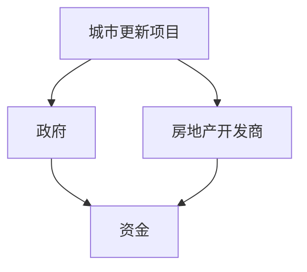

                 


# 新兴市场股市估值与城市更新项目的互动

> 关键词：新兴市场、股市估值、城市更新项目、互动关系、算法模型、系统架构、案例分析

> 摘要：本文探讨新兴市场中股市估值与城市更新项目的互动关系，分析其核心概念、算法原理、系统架构，并通过实际案例进行详细解读，最后总结最佳实践和未来研究方向。

---

# 第一部分：新兴市场股市估值与城市更新项目概述

## 第1章：背景介绍

### 1.1 新兴市场的定义与特点
- **1.1.1 新兴市场的经济特征**
  - 新兴市场是指那些经济增长迅速、市场机制逐步完善但尚未完全成熟的国家或地区。
  - 经济特征包括高增长率、产业升级、政策驱动等。
- **1.1.2 新兴市场的股市特点**
  - 股市波动性大，受政策和外部环境影响显著。
  - 市场参与者结构多元化，包括机构投资者和个人投资者。
- **1.1.3 新兴市场的城市化趋势**
  - 城市化进程加快，城市人口比例持续上升。
  - 城市更新项目成为推动城市发展的重要手段。

### 1.2 股市估值的基本概念
- **1.2.1 股市估值的定义**
  - 股市估值是对上市公司价值的评估，通常基于财务指标和市场因素。
- **1.2.2 股市估值的主要方法**
  - 市盈率（P/E）：市价与每股收益的比率。
  - 市净率（P/B）：市价与每股净资产的比率。
  - 股息率：股息与股价的比率。
- **1.2.3 股市估值的影响因素**
  - 宏观经济环境、行业发展趋势、公司财务状况等。

### 1.3 城市更新项目的定义与属性
- **1.3.1 城市更新的定义**
  - 城市更新是指对城市区域进行重新规划和改造，以提升城市功能和居民生活质量。
- **1.3.2 城市更新的核心要素**
  - 建筑改造、基础设施升级、公共空间优化等。
- **1.3.3 城市更新的实施过程**
  - 项目规划、资金筹集、实施阶段、效果评估等。

### 1.4 新兴市场股市估值与城市更新的互动关系
- **1.4.1 互动关系的定义**
  - 股市估值的变化与城市更新项目的推进相互影响。
- **1.4.2 互动关系的背景与现状**
  - 新兴市场中，城市更新项目通常由政府或企业主导，股市估值受政策和经济环境影响显著。
- **1.4.3 互动关系的核心要素**
  - 政策支持、资金流动、市场预期等。

---

## 第2章：核心概念与联系

### 2.1 股市估值的核心原理
- **2.1.1 股市估值的理论基础**
  - 基于基本面分析和市场情绪分析。
- **2.1.2 股市估值的关键公式**
  - $$P = \frac{E}{P/E}$$，其中E为每股收益，P/E为市盈率。
- **2.1.3 股市估值的数学模型**
  - 使用回归分析预测股票价格。

### 2.2 城市更新项目的实体关系
- **2.2.1 实体关系图**
  - 使用Mermaid绘制城市更新项目的实体关系图，包括项目、参与者、资金来源等。

- **2.2.2 实体属性分析**
  - 项目属性：位置、规模、投资金额。
  - 参与者属性：角色、责任、资金分配。

### 2.3 股市估值与城市更新的互动模型
- **2.3.1 互动模型的定义**
  - 描述股市估值与城市更新项目之间的相互作用。
- **2.3.2 互动模型的构建过程**
  - 确定变量之间的关系，建立数学模型。
- **2.3.3 互动模型的数学表达**
  - 使用多元回归模型分析城市更新项目对股市估值的影响。

---

## 第3章：算法原理与数学模型

### 3.1 股市估值的算法原理
- **3.1.1 算法原理概述**
  - 基于历史数据预测未来股价。
- **3.1.2 算法流程图**
  ```mermaid
  graph TD
      A[输入数据] --> B[清洗数据]
      B --> C[选择模型]
      C --> D[训练模型]
      D --> E[预测结果]
  ```
- **3.1.3 算法的数学模型**
  - 线性回归模型：$$y = \beta x + \epsilon$$，其中y为股价，x为自变量，β为回归系数。

### 3.2 城市更新项目的算法原理
- **3.2.1 算法原理概述**
  - 基于项目可行性分析评估投资价值。
- **3.2.2 算法流程图**
  ```mermaid
  graph TD
      A[项目需求] --> B[数据收集]
      B --> C[分析评估]
      C --> D[制定方案]
      D --> E[实施项目]
  ```
- **3.2.3 算法的数学模型**
  - 成本收益分析模型：$$\text{净现值} = \sum \frac{\text{现金流}}{(1 + r)^t}$$，其中r为折现率，t为时间。

### 3.3 互动模型的算法实现
- **3.3.1 互动模型的算法设计**
  - 使用多元回归分析股市估值与城市更新项目的关系。
- **3.3.2 互动模型的代码实现**
  ```python
  import numpy as np
  from sklearn.linear_model import LinearRegression

  # 示例数据
  X = np.array([[1], [2], [3], [4], [5]])
  y = np.array([2, 4, 5, 4, 6])

  # 训练模型
  model = LinearRegression()
  model.fit(X, y)

  # 预测
  print(model.predict([[6]]))
  ```
- **3.3.3 互动模型的测试与验证**
  - 使用交叉验证评估模型的准确性。

---

## 第4章：系统分析与架构设计

### 4.1 问题场景介绍
- **4.1.1 问题背景**
  - 新兴市场中，城市更新项目和股市估值的互动关系复杂。
- **4.1.2 问题分析**
  - 需要量化城市更新项目对股市的影响。
- **4.1.3 问题解决目标**
  - 建立一个模型来预测城市更新项目对股市估值的影响。

### 4.2 系统功能设计
- **4.2.1 功能模块划分**
  - 数据收集模块、模型训练模块、结果展示模块。
- **4.2.2 功能模块的交互设计**
  - 用户输入城市更新项目数据，系统输出对股市估值的影响预测。
- **4.2.3 功能模块的实现方式**
  - 使用Python和机器学习库（如scikit-learn）进行实现。

### 4.3 系统架构设计
- **4.3.1 系统架构图**
  ```mermaid
  graph TD
      A[数据源] --> B[数据预处理]
      B --> C[模型训练]
      C --> D[结果展示]
  ```
- **4.3.2 系统组件的交互设计**
  - 数据预处理模块负责清洗和整理数据。
  - 模型训练模块基于预处理后的数据进行训练。
  - 结果展示模块将预测结果以图表形式展示。

### 4.4 系统接口设计
- **4.4.1 接口定义**
  - RESTful API接口，提供数据上传和结果查询功能。
- **4.4.2 接口的实现方式**
  - 使用Flask框架搭建Web服务。
- **4.4.3 接口的测试与验证**
  - 使用Postman进行接口测试。

### 4.5 系统交互序列图
- **4.5.1 系统交互流程**
  ```mermaid
  graph TD
      User[用户] --> A[上传数据]
      A --> B[数据处理]
      B --> C[训练模型]
      C --> D[返回结果]
      User <-- D[查看结果]
  ```

---

## 第5章：项目实战

### 5.1 环境安装
- **5.1.1 安装Python**
  - 使用Anaconda安装Python 3.8及以上版本。
- **5.1.2 安装依赖库**
  - 安装numpy、pandas、scikit-learn、flask。

### 5.2 系统核心实现源代码
- **5.2.1 数据预处理代码**
  ```python
  import pandas as pd
  df = pd.read_csv('data.csv')
  df = df.dropna()
  ```

- **5.2.2 模型训练代码**
  ```python
  from sklearn.linear_model import LinearRegression
  model = LinearRegression()
  model.fit(X_train, y_train)
  ```

- **5.2.3 结果展示代码**
  ```python
  import matplotlib.pyplot as plt
  plt.scatter(X_test, y_test, color='b', alpha=0.5)
  plt.plot(X_test, model.predict(X_test), color='r', linewidth=1)
  plt.show()
  ```

### 5.3 实际案例分析
- **5.3.1 案例背景**
  - 新兴市场中某城市启动城市更新项目，影响当地股市估值。
- **5.3.2 数据分析**
  - 收集城市更新项目和股市数据，进行相关性分析。
- **5.3.3 模型验证**
  - 使用实际数据验证模型的准确性。

### 5.4 项目小结
- **5.4.1 项目总结**
  - 成功建立模型，能够预测城市更新项目对股市估值的影响。
- **5.4.2 经验总结**
  - 数据质量和模型选择对结果影响较大。
- **5.4.3 问题与改进方向**
  - 数据不足时，可以考虑引入更多的特征变量。

---

## 第6章：最佳实践与注意事项

### 6.1 最佳实践
- **6.1.1 数据收集**
  - 确保数据的完整性和准确性。
- **6.1.2 模型选择**
  - 根据具体情况选择合适的模型。
- **6.1.3 模型验证**
  - 使用交叉验证评估模型的性能。

### 6.2 小结
- **6.2.1 互动关系的重要性**
  - 新兴市场中，股市估值与城市更新项目的互动关系需要引起重视。
- **6.2.2 本文的核心贡献**
  - 提供了一种量化分析互动关系的方法。

### 6.3 注意事项
- **6.3.1 数据风险**
  - 数据不足或不准确可能影响模型的性能。
- **6.3.2 模型局限性**
  - 现有的模型可能无法完全捕捉复杂的关系。

### 6.4 拓展阅读
- **6.4.1 相关文献**
  - 建议阅读关于新兴市场和城市更新的最新研究。
- **6.4.2 学术资源**
  - 关注相关领域的学术会议和期刊。

---

# 结论

本文系统地探讨了新兴市场中股市估值与城市更新项目的互动关系，从理论分析到算法实现，再到实际应用，提供了全面的解决方案。通过本文的分析，读者可以更好地理解这两者之间的相互作用，并在实际工作中加以应用。

--- 

**注意：** 以上内容是一个详细的思考过程和结构安排，实际撰写时需要根据具体情况进行调整和补充。

