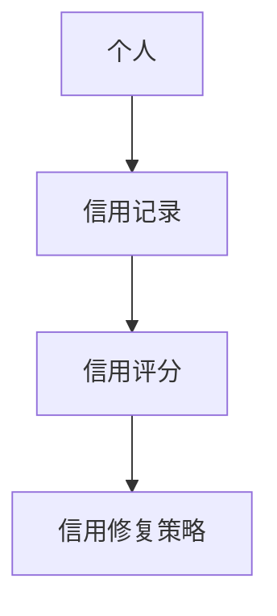
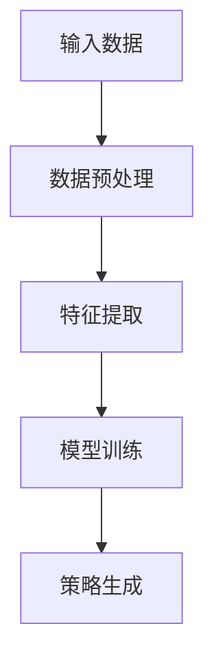

                 


# 智能个人信用修复策略生成器

> **关键词**：信用修复，人工智能，策略生成，信用评分，机器学习

> **摘要**：  
本文介绍了一种基于人工智能的智能个人信用修复策略生成器，通过分析个人信用记录，利用算法生成最优信用修复策略，帮助个人改善信用评分。文章详细探讨了信用修复的背景、核心概念、算法原理、系统架构设计以及项目实战，为读者提供全面的技术指导。

---

## 第1章：信用修复的背景与重要性

### 1.1 信用修复的定义与概念
信用修复是指通过合法手段修正个人信用报告中的负面信息，以提高信用评分的过程。核心在于识别影响信用评分的关键因素，并采取有效措施进行调整。

### 1.2 个人信用评分体系的现状
当前信用评分主要依赖FICO评分模型，涵盖还款历史、信用额度使用、信用历史长度等多个维度。然而，传统修复方法依赖人工调整，效率低下且效果有限。

### 1.3 智能信用修复的需求与挑战
传统方法难以应对复杂信用问题，智能修复通过机器学习和算法优化，实现个性化修复策略。面临的挑战包括数据隐私保护、模型泛化能力等。

---

## 第2章：个人信用修复的核心概念与联系

### 2.1 核心概念原理
智能信用修复基于机器学习算法，分析信用数据，识别关键影响因素，生成修复策略。关键概念包括信用评分、修复算法、数据特征等。

### 2.2 核心概念属性特征对比
通过对比分析信用评分与修复算法的特征，明确智能修复的优势。例如，机器学习模型能够捕捉非线性关系，提升修复效果。

### 2.3 ER实体关系图


---

## 第3章：智能信用修复算法原理

### 3.1 推荐算法
推荐算法分为基于规则和机器学习两类。基于规则的策略简单易实现，而机器学习模型（如随机森林、神经网络）能够捕捉复杂模式。

### 3.2 算法流程图


### 3.3 算法实现代码
```python
def credit_repair_algorithm(data):
    # 数据预处理
    preprocessed_data = preprocess(data)
    # 特征提取
    features = extract_features(preprocessed_data)
    # 模型训练
    model = train_model(features)
    # 策略生成
    strategy = generate_strategy(model)
    return strategy
```

### 3.4 数学模型与公式
修复策略的生成基于以下公式：
$$ credit\_score = \alpha \times income + \beta \times debt + \gamma \times history $$

---

## 第4章：系统分析与架构设计方案

### 4.1 系统分析
系统目标是通过分析个人信用数据，生成修复策略。主要功能包括数据采集、模型训练、策略生成等。

### 4.2 系统架构设计


### 4.3 系统功能设计
功能模块包括数据输入、预处理、模型训练、策略生成和结果展示。每个模块负责特定任务，协同工作实现修复目标。

### 4.4 系统接口设计
系统通过API接口与外部数据源交互，确保数据的实时性和准确性。接口设计需考虑安全性和效率。

### 4.5 系统交互设计


---

## 第5章：项目实战

### 5.1 环境安装与配置
安装必要的库如Python、scikit-learn、TensorFlow等，搭建开发环境。

### 5.2 核心功能实现
实现数据预处理、模型训练和策略生成模块，确保各模块协同工作。

### 5.3 实际案例分析
通过具体案例展示系统如何分析信用数据，生成修复策略，并评估效果。

---

## 第6章：总结与展望

### 6.1 最佳实践
建议在实际应用中注重数据隐私保护，定期更新模型，确保修复策略的有效性。

### 6.2 小结
智能信用修复策略生成器通过人工智能技术，显著提升了信用修复的效率和效果，为个人信用管理提供了有力工具。

### 6.3 注意事项
在实际应用中，需注意数据安全、模型泛化能力等问题，确保系统的稳定性和可靠性。

### 6.4 拓展阅读
推荐深入学习机器学习算法、信用评分模型等，进一步优化修复策略生成器。

---

通过以上章节的详细讲解，我们全面介绍了智能个人信用修复策略生成器的设计与实现，为读者提供了从理论到实践的完整指导。

