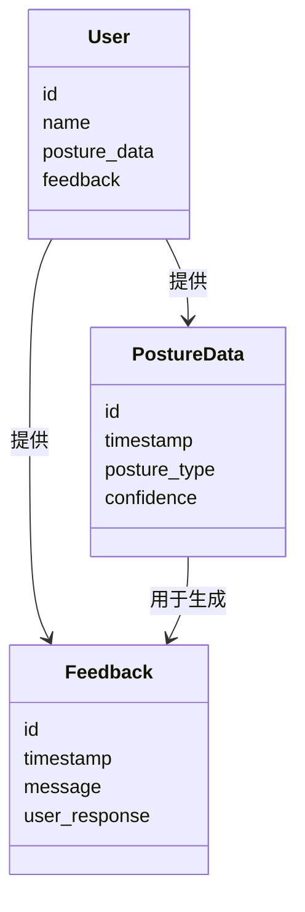
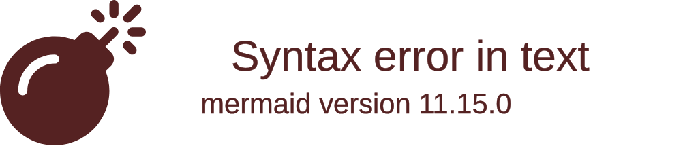
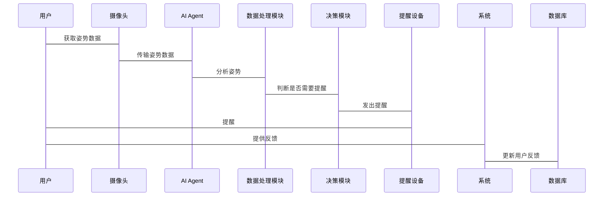

                 


# 智能书桌：AI Agent的姿势提醒系统

> 关键词：智能书桌，AI Agent，姿势提醒，计算机视觉，健康监测，人工智能

> 摘要：本文介绍了一种基于AI Agent的姿势提醒系统，旨在帮助用户在办公环境中保持正确的坐姿。通过结合计算机视觉技术和智能算法，该系统能够实时监测用户姿势，并在不正确时发出提醒。本文详细探讨了系统的设计思路、算法原理、系统架构以及实现方法，为开发类似系统提供了参考。

---

# 第一部分: 智能书桌与AI Agent的背景介绍

## 第1章: 背景与问题背景

### 1.1 问题背景与需求分析

#### 1.1.1 现代办公环境中的姿势问题
在现代办公环境中，许多人长时间坐在电脑前工作，姿势不正确的问题日益严重。长时间的不良姿势可能导致颈椎病、腰椎病等健康问题，影响工作效率和生活质量。

#### 1.1.2 长时间不良姿势的危害
不良姿势不仅会导致身体疼痛，还可能降低工作效率和注意力。研究显示，姿势问题还可能影响心理健康，导致压力增加。

#### 1.1.3 智能提醒系统的必要性
传统的提醒系统（如闹钟）缺乏智能化和个性化，无法根据用户的实际姿势和行为提供有效的提醒。AI Agent可以通过实时监测和分析，提供精准的姿势提醒和建议。

### 1.2 问题描述与目标设定

#### 1.2.1 姿势提醒系统的核心目标
- 实时监测用户的坐姿。
- 在姿势不正确时发出提醒。
- 提供改善姿势的建议。
- 学习用户的习惯，优化提醒策略。

#### 1.2.2 系统的边界与外延
- 边界：仅关注用户的坐姿问题，不涉及其他健康指标。
- 外延：未来可能扩展到其他健康监测功能，如心率、压力水平等。

#### 1.2.3 核心要素与功能模块
- 数据采集模块：收集用户的姿势数据。
- 数据处理模块：分析姿势是否正确。
- 决策模块：触发提醒或建议。
- 用户反馈模块：收集用户反馈以优化系统。

## 第2章: AI Agent与姿势提醒系统的核心概念

### 2.1 AI Agent的基本概念与原理

#### 2.1.1 AI Agent的定义与分类
AI Agent是一种智能体，能够在环境中感知、推理并采取行动。根据智能体的复杂性，可以分为简单智能体和复杂智能体。

#### 2.1.2 姿势提醒系统中的AI Agent角色
在姿势提醒系统中，AI Agent负责数据采集、分析和决策，确保系统能够实时监测和提醒。

#### 2.1.3 AI Agent与传统提醒系统的区别
- 传统提醒系统：简单的定时提醒，缺乏个性化和智能化。
- AI Agent：能够根据用户行为和环境变化，动态调整提醒策略。

### 2.2 姿势检测与提醒机制

#### 2.2.1 姿势检测的原理与方法
姿势检测主要依赖于计算机视觉技术，通过摄像头捕捉用户姿势，利用深度学习模型进行分析。

#### 2.2.2 姿势提醒的触发条件与策略
- 触发条件：检测到用户姿势不正确时，触发提醒。
- 提醒策略：根据用户习惯和偏好，选择合适的提醒方式（如声音、震动）。

#### 2.2.3 用户反馈与系统优化
用户反馈是优化系统的重要依据，系统可以根据用户反馈调整提醒频率和方式。

### 2.3 核心概念的ER实体关系图

```mermaid
erDiagram
    user {
        id : int
        name : string
        posture_data : posture
        feedback : feedback
    }
    posture_data {
        id : int
        timestamp : datetime
        posture_type : string
        confidence : float
    }
    feedback {
        id : int
        timestamp : datetime
        message : string
        user_response : string
    }
    user --> posture_data : 提供
    user --> feedback : 提供
    posture_data --> feedback : 用于生成
```

---

# 第二部分: 算法原理与实现

## 第3章: 姿势检测算法原理

### 3.1 姿势检测的核心算法

#### 3.1.1 基于深度学习的姿势检测
使用深度学习模型（如HourglassNet）进行姿势估计，能够准确捕捉人体关键点。

#### 3.1.2 姿势估计的流程
1. 图像输入：摄像头捕捉用户姿势。
2. 关键点检测：模型检测人体关键点（如肩、肘、腕）。
3. 姿势分类：根据关键点位置判断姿势是否正确。

#### 3.1.3 姿势分类的数学模型
姿势分类可以通过支持向量机（SVM）或随机森林（Random Forest）实现。

### 3.2 姿势检测的优化策略

#### 3.2.1 数据增强技术
- 数据增强：通过旋转、缩放等方式增加训练数据多样性。

#### 3.2.2 模型优化
- 模型压缩：减少模型参数，提高推理速度。
- 模型蒸馏：通过知识蒸馏技术优化模型性能。

#### 3.2.3 实时推理优化
- 使用轻量级模型：如MobileNet，适合移动端实时推理。
- 硬件加速：利用GPU加速推理过程。

---

# 第三部分: 系统架构与实现

## 第4章: 系统架构设计

### 4.1 系统功能设计

#### 4.1.1 领域模型


#### 4.1.2 系统架构


#### 4.1.3 接口设计
- 数据采集接口：从摄像头获取图像数据。
- 数据处理接口：接收姿势数据并进行分类。
- 提醒接口：根据分类结果触发提醒。

#### 4.1.4 交互流程图


---

# 第四部分: 项目实战与实现

## 第5章: 项目实战

### 5.1 环境搭建

#### 5.1.1 安装必要的库
- OpenCV
- TensorFlow
- PyTorch
- matplotlib

#### 5.1.2 环境配置
- 安装Python 3.8及以上
- 安装GPU支持（如NVIDIA CUDA）

### 5.2 核心代码实现

#### 5.2.1 姿势检测代码
```python
import cv2
import numpy as np

def detect_posture(image):
    # 调用姿势检测模型进行预测
    model = load_model()
    output = model.predict(image)
    return output
```

#### 5.2.2 提醒机制代码
```python
def trigger_reminder(posture_type):
    if posture_type == "bad":
        # 发出声音提醒
        os.system("playreminder.mp3")
    elif posture_type == "good":
        print("Good posture!")
```

#### 5.2.3 数据存储与反馈
```python
def store_feedback(feedback):
    # 存储用户反馈到数据库
    db.insert(feedback)
```

### 5.3 代码功能解读

#### 5.3.1 姿势检测模块
- 使用预训练模型进行姿势分类。
- 返回姿势类型和置信度。

#### 5.3.2 提醒模块
- 根据姿势类型触发提醒。
- 支持多种提醒方式（如声音、震动）。

#### 5.3.3 用户反馈模块
- 收集用户对提醒的反馈。
- 更新数据库中的反馈信息。

### 5.4 实际案例分析

#### 5.4.1 实验环境
- 摄像头：内置摄像头
- 系统：Linux
- 硬件：普通PC

#### 5.4.2 实验结果
- 系统能够准确检测姿势，发出提醒。
- 用户反馈显示，系统有效改善了坐姿。

---

# 第五部分: 总结与展望

## 第6章: 总结与展望

### 6.1 最佳实践 tips
- 定期校准模型，确保检测准确性。
- 根据用户反馈优化提醒策略。

### 6.2 小结
通过AI Agent和计算机视觉技术，姿势提醒系统能够有效改善用户的坐姿问题，提升办公环境的健康水平。

### 6.3 注意事项
- 确保系统数据安全，保护用户隐私。
- 定期更新模型，适应用户习惯的变化。

### 6.4 拓展阅读
- 深度学习在姿势检测中的应用
- 多模态健康监测系统
- 智能办公环境的设计与实现

---

通过本文的详细讲解，读者可以了解智能书桌AI Agent的姿势提醒系统的原理和实现方法。该系统结合了AI技术和人体工程学，为用户提供了一个健康、智能的办公环境。未来，随着技术的进步，类似系统将更加智能化和个性化，为用户提供更全面的健康支持。

