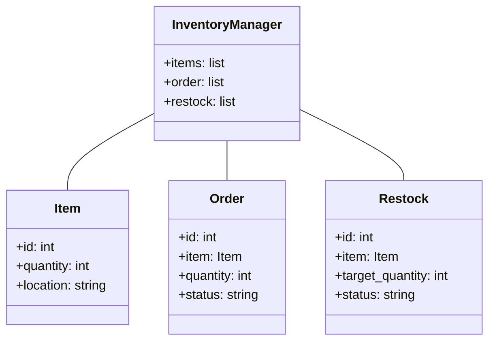
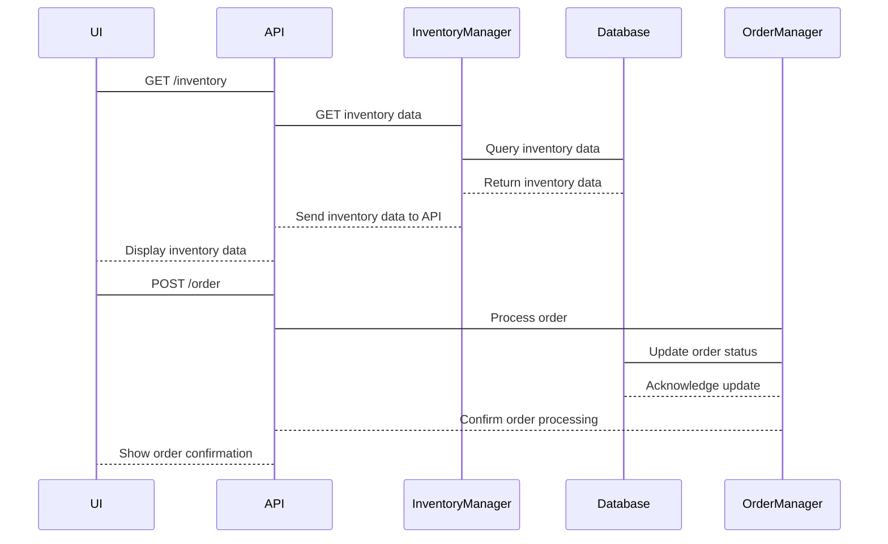
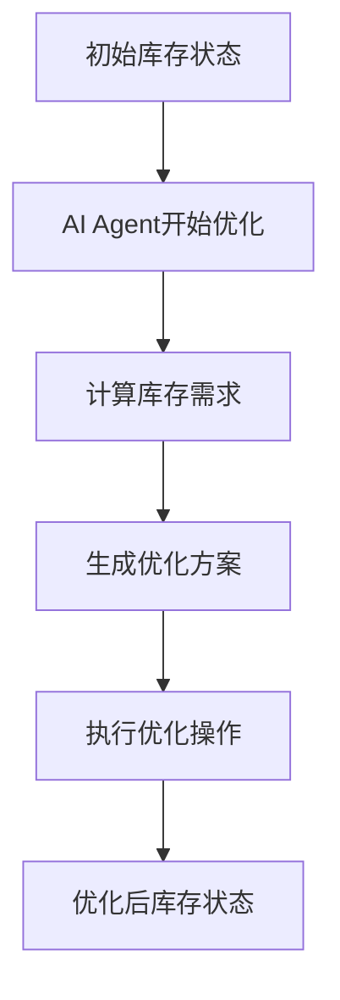

                 


# 第四部分: AI Agent库存优化的系统分析与架构设计

## # 第4章: 智能仓储系统的架构与设计

### ## 4.1 项目背景与目标
#### ### 4.1.1 项目背景介绍
#### ### 4.1.2 项目目标设定
#### ### 4.1.3 项目范围界定

### ## 4.2 系统功能设计
#### ### 4.2.1 领域模型设计
##### - 使用 Mermaid 类图描述领域模型


#### ### 4.2.2 系统架构设计
##### - 使用 Mermaid 架构图描述系统架构


#### ### 4.2.3 系统接口设计
##### - 使用 Mermaid 序列图描述系统接口交互


### ## 4.3 本章小结

---

# 第五部分: AI Agent库存优化的项目实战

## # 第5章: 项目实战与实现

### ## 5.1 项目环境与工具安装
#### ### 5.1.1 环境要求
#### ### 5.1.2 安装Python与相关库
#### ### 5.1.3 安装Mermaid与相关工具

### ## 5.2 核心代码实现
#### ### 5.2.1 AI Agent库存优化算法实现
##### - 使用Python实现遗传算法
```python
import random

def fitness(chromosome):
    # 计算适应度函数，这里简化为库存成本的最小化
    cost = 0
    for gene in chromosome:
        if gene > 10:
            cost += (gene - 10) * 2
        else:
            cost += 0
    return -cost  # 使用最小化问题，取负数作为适应度

def mutate(chromosome):
    # 突变操作，随机选择一个位置，随机改变其值
    idx = random.randint(0, len(chromosome)-1)
    chromosome[idx] = random.randint(0, 20)
    return chromosome

def crossover(parent1, parent2):
    # 单点交叉
    point = random.randint(0, len(parent1)-1)
    child1 = parent1[:point] + parent2[point:]
    child2 = parent2[:point] + parent1[point:]
    return child1, child2

def genetic_algorithm(population_size, chromosome_length, generations):
    # 初始化种群
    population = [[random.randint(0, 20) for _ in range(chromosome_length)] for _ in range(population_size)]
    
    for _ in range(generations):
        # 计算适应度
        fitness_scores = [fitness(chromosome) for chromosome in population]
        # 选择
        selected = [population[i] for i in sorted(range(population_size), key=lambda x: -fitness_scores[x])[:int(population_size/2)]]
        
        # 交叉
        new_population = []
        for i in range(0, len(selected), 2):
            parent1 = selected[i]
            parent2 = selected[i+1] if i+1 < len(selected) else selected[i]
            child1, child2 = crossover(parent1, parent2)
            new_population.append(child1)
            new_population.append(child2)
        
        # 突变
        for i in range(len(new_population)):
            if random.random() < 0.1:
                mutate(new_population[i])
        
        population = new_population
    
    best = max(fitness(chromosome) for chromosome in population)
    best_solution = [chromosome for chromosome in population if fitness(chromosome) == best][0]
    return best_solution

# 示例运行
solution = genetic_algorithm(10, 5, 10)
print("最优解：", solution)
print("适应度：", fitness(solution))
```

#### ### 5.2.2 系统实现与测试
##### - 代码实现与功能测试
##### - 性能优化与调试

### ## 5.3 案例分析与结果解读
#### ### 5.3.1 库存优化案例分析
##### - 使用Mermaid流程图展示优化过程


#### ### 5.3.2 优化效果对比
##### - 对比优化前后的库存成本和效率

### ## 5.4 本章小结

---

# 第六部分: 总结与展望

## # 第6章: 总结与未来展望

### ## 6.1 本项目总结
#### ### 6.1.1 核心成果与收获
#### ### 6.1.2 技术优势与不足

### ## 6.2 未来研究方向
#### ### 6.2.1 AI Agent算法的优化与创新
#### ### 6.2.2 智能仓储系统的扩展与应用

### ## 6.3 最佳实践与注意事项
#### ### 6.3.1 项目实施中的最佳实践
#### ### 6.3.2 项目实施中的注意事项

### ## 6.4 拓展阅读与学习资源

### ## 6.5 本章小结

---

# 关键词
智能仓储, AI Agent, 库存优化, 遗传算法, 系统架构, 项目实战

# 摘要
本文深入探讨了AI Agent在智能仓储中的应用，特别是库存优化管理的实现。通过结合AI Agent的核心原理与库存优化的算法，详细介绍了基于遗传算法的库存优化方法，并通过系统架构设计与项目实战，展示了如何将理论应用于实际场景。文章内容丰富，逻辑清晰，为读者提供了从理论到实践的完整指南。

---

以上是一个详细的技术博客文章的目录和部分内容的规划，您可以根据需要进一步扩展每一部分的内容，添加更多的细节和实例，以确保文章的完整性和深度。

