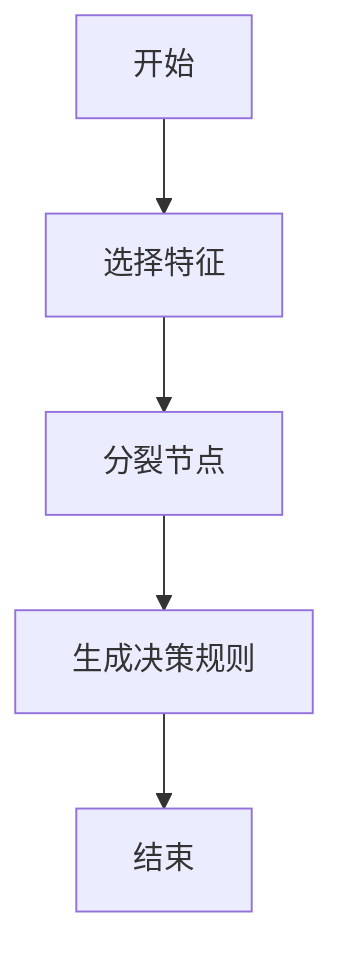
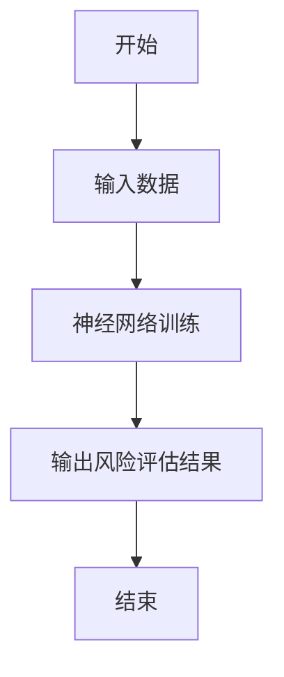
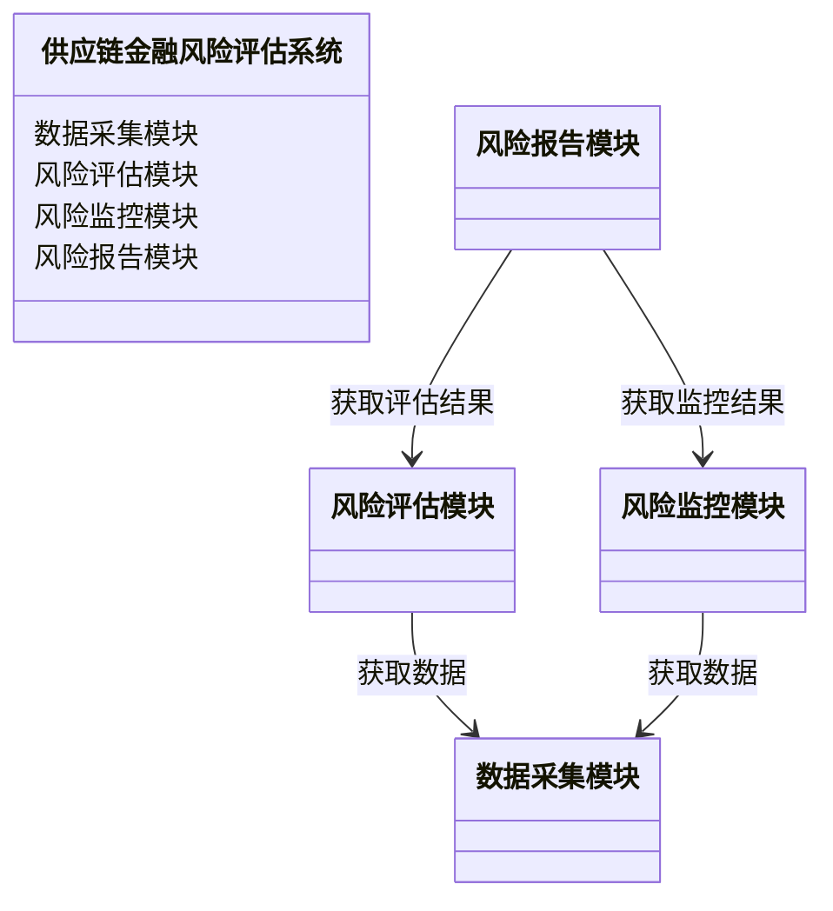
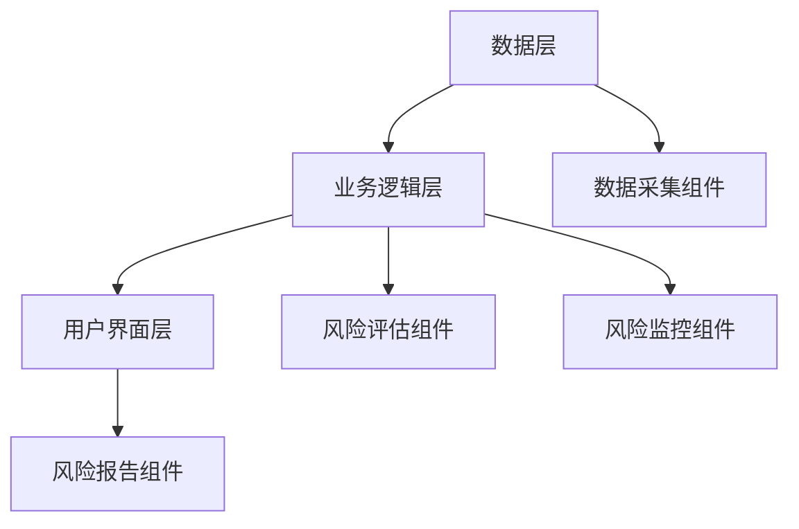

                 


# 智能供应链金融风险评估

> 关键词：智能供应链，金融风险评估，机器学习，大数据分析，供应链金融

> 摘要：本文深入探讨了智能供应链金融风险评估的核心概念、算法原理、系统架构及实际应用。通过分析供应链金融的传统模式与智能模式的差异，结合机器学习和大数据分析技术，提出了一套高效的风险评估方法。文章详细讲解了基于决策树和神经网络的算法实现，并通过系统架构设计展示了如何将这些技术应用于实际场景中。最后，通过具体案例分析，验证了智能供应链金融风险评估的有效性和优势。

---

# 第一部分: 智能供应链金融风险评估概述

## 第1章: 供应链金融与智能供应链金融概述

### 1.1 供应链金融的基本概念

#### 1.1.1 供应链金融的定义

供应链金融（Supply Chain Finance, SCF）是指围绕供应链上下游企业之间的交易活动，通过整合物流、信息流和资金流，为供应链上的企业提供融资支持的一种金融模式。其核心在于通过优化资金流动，降低企业间的交易风险，提高整体供应链的效率。

#### 1.1.2 供应链金融的核心要素

供应链金融的核心要素包括：

1. **供应链结构**：包括核心企业、上游供应商、下游客户及物流、仓储等支持企业。
2. **资金流**：供应链上的企业之间的资金流动，包括应收账款、应付账款等。
3. **信息流**：供应链上的交易信息、物流信息和资金信息的整合。
4. **风险控制**：通过信用评估、担保、抵押等方式控制供应链金融风险。

#### 1.1.3 供应链金融的参与方与角色

供应链金融的参与方主要包括：

- **核心企业**：供应链中的主导企业，通常是采购方或销售方。
- **供应商**：为供应链提供原材料或服务的企业。
- **客户**：供应链的最终消费者或下游企业。
- **金融机构**：包括银行、保理公司等，提供融资服务。
- **物流与仓储企业**：负责供应链中的物流和仓储管理。

### 1.2 智能供应链金融的背景与意义

#### 1.2.1 传统供应链金融的局限性

传统供应链金融存在以下问题：

1. **信息不对称**：供应链上的企业之间信息分散，难以全面掌握交易信息。
2. **效率低下**：传统融资流程复杂，审批周期长，难以满足中小企业的快速融资需求。
3. **风险控制不足**：传统供应链金融主要依赖于核心企业的信用，难以全面评估供应链上的风险。

#### 1.2.2 智能供应链金融的定义与特点

智能供应链金融（Intelligent Supply Chain Finance, ISCF）是通过人工智能、大数据、区块链等技术，对供应链金融的各个环节进行智能化改造，实现高效的风险评估、融资管理和流程优化。其特点包括：

1. **数据驱动**：利用大数据技术整合供应链上的多源数据，进行精准的风险评估。
2. **智能化决策**：通过机器学习算法，自动化识别风险点，优化融资方案。
3. **实时监控**：通过实时数据分析，动态调整风险评估结果，提升风险控制能力。

#### 1.2.3 智能供应链金融的应用价值

智能供应链金融的应用价值主要体现在以下几个方面：

1. **降低融资成本**：通过智能化评估，减少人工干预，降低金融机构的运营成本。
2. **提高融资效率**：快速响应企业融资需求，缩短融资周期。
3. **增强风险控制**：通过实时监控和智能化评估，提高风险识别和控制能力。

### 1.3 智能供应链金融与传统供应链金融的区别

#### 1.3.1 业务模式的差异

传统供应链金融主要依赖于核心企业的信用，融资方式单一，融资效率低。而智能供应链金融通过整合多源数据，采用智能化技术，实现多维度的风险评估和融资管理。

#### 1.3.2 技术手段的差异

传统供应链金融主要依赖于人工审核和传统数据分析方法，而智能供应链金融则利用大数据、人工智能、区块链等技术，实现数据的深度挖掘和智能分析。

#### 1.3.3 风险控制方式的差异

传统供应链金融的风险控制主要依赖于核心企业的信用评估，而智能供应链金融则通过整合供应链上的多源数据，结合机器学习算法，实现精准的风险评估和动态监控。

### 1.4 本章小结

本章主要介绍了供应链金融的基本概念、核心要素和参与方，分析了传统供应链金融的局限性，提出了智能供应链金融的定义和特点，并探讨了其应用价值和与传统供应链金融的区别。通过本章的学习，读者可以理解智能供应链金融的基本框架及其与传统模式的差异。

---

# 第二部分: 智能供应链金融风险评估的核心概念与联系

## 第2章: 风险评估的核心概念

### 2.1 风险评估的基本原理

#### 2.1.1 风险的定义与分类

风险是指在供应链金融活动中，由于内外部因素的影响，可能导致供应链中断、资金损失等负面结果的可能性。风险可以分为系统性风险和非系统性风险两大类。

#### 2.1.2 风险评估的步骤与方法

风险评估的步骤包括：

1. **识别风险**：识别供应链金融中可能存在的各种风险因素。
2. **量化风险**：通过数据分析，量化各风险因素的影响程度。
3. **评估风险**：根据风险的量化结果，评估其对供应链金融的影响。
4. **制定风险应对策略**：根据风险评估结果，制定相应的风险控制措施。

#### 2.1.3 风险评估的核心要素

风险评估的核心要素包括：

1. **风险源**：可能导致风险的因素，如市场波动、企业信用状况等。
2. **风险影响**：风险对供应链金融的具体影响，如资金损失、供应链中断等。
3. **风险概率**：风险发生的可能性大小。

### 2.2 智能供应链金融风险评估的模型与方法

#### 2.2.1 供应链金融风险的主要类型

供应链金融中的风险主要包括：

1. **信用风险**：由于企业信用状况恶化导致的融资风险。
2. **操作风险**：由于操作失误或欺诈行为导致的融资风险。
3. **市场风险**：由于市场波动导致的融资风险。
4. **流动性风险**：由于资金流动性不足导致的融资风险。

#### 2.2.2 基于机器学习的风险评估模型

基于机器学习的风险评估模型可以通过对供应链上的多源数据进行分析，识别潜在的风险因素。常用的机器学习算法包括决策树、随机森林、支持向量机（SVM）和神经网络等。

#### 2.2.3 基于大数据分析的风险评估方法

基于大数据分析的风险评估方法通过对供应链上的交易数据、物流数据、资金数据等进行分析，识别潜在的风险因素。常用的大数据分析方法包括数据挖掘、自然语言处理（NLP）和图分析等。

### 2.3 实体关系图与数据流图

#### 2.3.1 实体关系图（ER图）设计

以下是一个供应链金融风险评估系统的ER图示例：

```mermaid
erDiagram
    participant 企业A {
        <属性>
        id : integer
        name : string
        credit_score : integer
    }
    participant 企业B {
        <属性>
        id : integer
        name : string
        credit_score : integer
    }
    participant 金融机构 {
        <属性>
        id : integer
        name : string
    }
    participant 供应链平台 {
        <属性>
        id : integer
        name : string
    }
    企业A --> 金融机构 : 提交融资申请
    企业B --> 金融机构 : 提交融资申请
    供应链平台 --> 金融机构 : 提供供应链数据
```

#### 2.3.2 数据流图的构建

以下是一个供应链金融风险评估系统的数据流图示例：

```mermaid
flowchart TD
    A[供应链平台] --> B[企业A] : 提供供应链数据
    B --> C[金融机构] : 提交融资申请
    C --> D[风险管理模块] : 进行风险评估
    D --> C : 返回风险评估结果
    C --> E[融资决策模块] : 制定融资方案
    E --> B : 提供融资支持
```

### 2.4 本章小结

本章主要介绍了风险评估的基本原理、供应链金融风险的主要类型，以及基于机器学习和大数据分析的风险评估模型和方法。通过ER图和数据流图的构建，展示了供应链金融风险评估系统的数据结构和流程。

---

# 第三部分: 智能供应链金融风险评估的算法原理

## 第3章: 基于机器学习的风险评估算法

### 3.1 机器学习在风险评估中的应用

#### 3.1.1 机器学习的基本概念

机器学习是一种人工智能技术，通过数据训练模型，使其能够自动识别数据中的模式和特征。机器学习可以分为监督学习、无监督学习和半监督学习三类。

#### 3.1.2 机器学习在供应链金融中的应用场景

机器学习在供应链金融中的应用场景包括：

1. **信用风险评估**：通过机器学习模型，评估企业的信用状况。
2. **欺诈检测**：通过机器学习算法，识别供应链中的欺诈行为。
3. **市场风险预测**：通过机器学习模型，预测市场波动对供应链的影响。

#### 3.1.3 常见的机器学习算法介绍

常用的机器学习算法包括：

1. **决策树**：通过构建树状结构，对数据进行分类或回归。
2. **随机森林**：通过集成多个决策树，提高模型的准确性和稳定性。
3. **支持向量机（SVM）**：通过构建超平面，实现数据的分类和回归。
4. **神经网络**：通过构建人工神经网络，实现数据的深度学习和特征提取。

### 3.2 基于决策树的供应链金融风险评估算法

#### 3.2.1 决策树算法的基本原理

决策树是一种基于树状结构的分类和回归方法。决策树的构建过程包括特征选择、分裂节点、剪枝和生成决策规则。

#### 3.2.2 决策树在供应链金融风险评估中的应用

以下是一个基于决策树的供应链金融风险评估算法的流程图：



#### 3.2.3 决策树算法的优缺点

决策树算法的优点包括：

1. **易于理解**：决策树的结构直观，易于解释。
2. **适合多分类问题**：决策树可以处理多分类问题。

决策树算法的缺点包括：

1. **过拟合风险**：决策树容易出现过拟合问题。
2. **计算复杂度高**：决策树的构建过程计算复杂度较高。

### 3.3 基于神经网络的风险评估算法

#### 3.3.1 神经网络的基本原理

神经网络是一种人工神经网络，通过构建多层神经元，实现数据的深度学习和特征提取。

#### 3.3.2 神经网络在供应链金融风险评估中的应用

以下是一个基于神经网络的供应链金融风险评估算法的流程图：



#### 3.3.3 神经网络算法的优缺点

神经网络算法的优点包括：

1. **非线性建模能力**：神经网络可以处理复杂的非线性关系。
2. **高维数据处理能力**：神经网络可以处理高维数据。

神经网络算法的缺点包括：

1. **计算资源消耗大**：神经网络的训练过程需要大量的计算资源。
2. **解释性差**：神经网络的内部 workings 难以解释。

### 3.4 算法实现的流程图

#### 3.4.1 决策树算法流程图


#### 3.4.2 神经网络算法流程图


### 3.5 本章小结

本章主要介绍了机器学习在供应链金融风险评估中的应用，详细讲解了基于决策树和神经网络的算法原理和实现流程。通过流程图的展示，读者可以直观地理解机器学习算法在风险评估中的应用过程。

---

# 第四部分: 智能供应链金融风险评估的系统架构与设计

## 第4章: 系统功能设计

### 4.1 供应链金融风险评估系统的需求分析

#### 4.1.1 系统目标与范围

供应链金融风险评估系统的目标是通过整合供应链上的多源数据，实现对供应链金融风险的智能化评估和管理。系统的范围包括数据采集、风险评估、风险监控和风险报告四个主要部分。

#### 4.1.2 系统功能模块划分

供应链金融风险评估系统的功能模块可以划分为以下几部分：

1. **数据采集模块**：负责采集供应链上的交易数据、物流数据和资金数据。
2. **风险评估模块**：负责对供应链金融风险进行智能化评估。
3. **风险监控模块**：负责对供应链金融风险进行实时监控和预警。
4. **风险报告模块**：负责生成风险评估报告和风险监控报告。

#### 4.1.3 系统功能需求描述

供应链金融风险评估系统的功能需求包括：

1. **数据采集**：支持多种数据源的接入，包括数据库、API接口和文件上传等。
2. **风险评估**：支持基于机器学习和大数据分析的风险评估方法，提供多种风险评估模型。
3. **风险监控**：支持实时监控供应链金融风险，提供风险预警和风险报告。
4. **风险报告**：支持生成多种格式的风险评估报告和风险监控报告。

### 4.2 系统架构设计

#### 4.2.1 系统架构的分层设计

供应链金融风险评估系统的架构可以分为以下几层：

1. **数据层**：负责数据的存储和管理。
2. **业务逻辑层**：负责业务逻辑的实现和风险评估算法的调用。
3. **用户界面层**：负责用户与系统的交互。

#### 4.2.2 系统架构的组件设计

供应链金融风险评估系统的组件包括：

1. **数据采集组件**：负责数据的采集和预处理。
2. **风险评估组件**：负责对供应链金融风险进行智能化评估。
3. **风险监控组件**：负责对供应链金融风险进行实时监控和预警。
4. **风险报告组件**：负责生成风险评估报告和风险监控报告。

### 4.3 系统功能的详细设计

#### 4.3.1 领域模型类图

以下是一个供应链金融风险评估系统的领域模型类图：



#### 4.3.2 系统架构图

以下是一个供应链金融风险评估系统的系统架构图：



### 4.4 本章小结

本章主要介绍了供应链金融风险评估系统的功能设计和系统架构设计，展示了系统的分层架构和组件设计。通过领域模型类图和系统架构图的绘制，读者可以清晰地理解系统的整体结构和各部分的功能关系。

---

# 第五部分: 智能供应链金融风险评估的项目实战

## 第5章: 项目实战

### 5.1 项目背景与目标

#### 5.1.1 项目背景

本项目旨在通过智能化技术，实现对供应链金融风险的精准评估和管理。通过整合供应链上的多源数据，构建基于机器学习的风险评估模型，实现对供应链金融风险的智能化评估和实时监控。

#### 5.1.2 项目目标

1. **构建数据采集模块**：实现对供应链上的多源数据的采集和预处理。
2. **构建风险评估模块**：基于机器学习算法，实现对供应链金融风险的智能化评估。
3. **构建风险监控模块**：实现对供应链金融风险的实时监控和预警。
4. **构建风险报告模块**：生成风险评估报告和风险监控报告。

### 5.2 项目实现

#### 5.2.1 环境安装与配置

1. **安装Python**：建议使用Python 3.6及以上版本。
2. **安装机器学习库**：包括scikit-learn、xgboost、keras等。
3. **安装数据处理库**：包括pandas、numpy、scipy等。
4. **安装可视化库**：包括matplotlib、seaborn等。

#### 5.2.2 系统核心实现源代码

以下是一个基于决策树的供应链金融风险评估算法的Python实现代码：

```python
from sklearn.tree import DecisionTreeClassifier
from sklearn.model_selection import train_test_split
from sklearn.metrics import accuracy_score

# 数据预处理
data = pd.read_csv('supply_chain.csv')
X = data.drop('credit_risk', axis=1)
y = data['credit_risk']

# 划分训练集和测试集
X_train, X_test, y_train, y_test = train_test_split(X, y, test_size=0.2, random_state=42)

# 构建决策树模型
model = DecisionTreeClassifier()
model.fit(X_train, y_train)

# 模型预测
y_pred = model.predict(X_test)

# 模型评估
print("Accuracy:", accuracy_score(y_test, y_pred))
```

#### 5.2.3 代码应用解读与分析

上述代码实现了一个基于决策树的供应链金融风险评估模型。首先，数据预处理部分对数据进行了清洗和特征选择。然后，使用scikit-learn库中的DecisionTreeClassifier构建决策树模型，并通过train_test_split函数将数据划分为训练集和测试集。最后，通过模型训练和预测，评估了模型的准确率。

### 5.3 案例分析与详细讲解

#### 5.3.1 案例背景

假设我们有一个供应链金融风险评估项目，需要对供应链上的企业进行信用风险评估。我们收集了以下数据：

1. 企业基本信息：包括企业规模、成立时间、行业类别等。
2. 企业财务数据：包括收入、利润、资产负债率等。
3. 供应链数据：包括供应商信息、客户信息、物流信息等。

#### 5.3.2 案例实现

以下是基于上述数据的供应链金融风险评估模型的实现代码：

```python
import pandas as pd
from sklearn.ensemble import RandomForestClassifier
from sklearn.model_selection import train_test_split
from sklearn.metrics import classification_report

# 数据预处理
data = pd.read_csv('supply_chain.csv')
X = data.drop('credit_risk', axis=1)
y = data['credit_risk']

# 划分训练集和测试集
X_train, X_test, y_train, y_test = train_test_split(X, y, test_size=0.2, random_state=42)

# 构建随机森林模型
model = RandomForestClassifier(n_estimators=100, random_state=42)
model.fit(X_train, y_train)

# 模型预测
y_pred = model.predict(X_test)

# 模型评估
print("Classification Report:", classification_report(y_test, y_pred))
```

#### 5.3.3 案例分析与详细讲解

上述代码实现了一个基于随机森林的供应链金融风险评估模型。通过随机森林算法，模型可以对供应链上的企业进行信用风险评估。模型的准确率和分类报告可以通过代码输出结果。

### 5.4 项目总结

通过本章的项目实战，读者可以了解如何将机器学习算法应用于供应链金融风险评估的实际场景中。通过数据预处理、模型训练和模型评估的过程，读者可以掌握供应链金融风险评估的核心技术。

---

# 第六部分: 智能供应链金融风险评估的最佳实践

## 第6章: 最佳实践

### 6.1 小结

供应链金融风险评估是供应链金融的核心环节，通过智能化技术的应用，可以实现对供应链金融风险的精准评估和管理。通过机器学习和大数据分析技术，可以提高风险评估的准确性和效率。

### 6.2 注意事项

在实际应用中，需要注意以下几点：

1. **数据质量**：数据的质量直接影响模型的准确性和可靠性。
2. **模型选择**：根据实际需求选择合适的机器学习算法，避免盲目使用复杂的模型。
3. **风险监控**：需要实时监控供应链金融风险，及时发现和处理潜在风险。

### 6.3 拓展阅读

以下是一些推荐阅读的书籍和论文：

1. **《机器学习实战》**：李航著，详细讲解了机器学习算法的实现和应用。
2. **《大数据分析与挖掘》**：张礼忠著，介绍了大数据分析与挖掘的核心技术。
3. **《供应链金融风险管理》**：王鹏著，系统地介绍了供应链金融风险管理的方法和实践。

### 6.4 本章小结

本章主要总结了智能供应链金融风险评估的核心技术和最佳实践，提出了在实际应用中需要注意的事项，并推荐了一些拓展阅读的书籍和论文。

---

# 结语

通过本文的学习，读者可以系统地了解智能供应链金融风险评估的核心概念、算法原理、系统架构及实际应用。通过具体的案例分析和项目实战，读者可以掌握供应链金融风险评估的核心技术，并能够将其应用于实际的供应链金融管理中。

