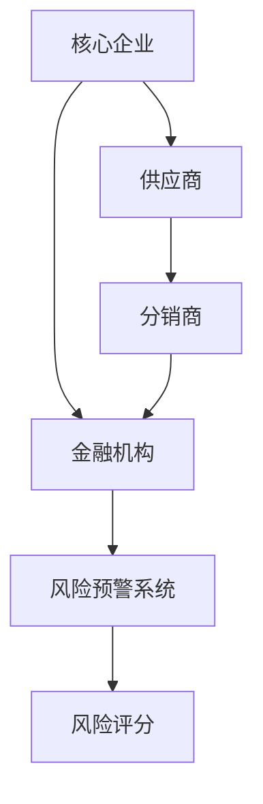
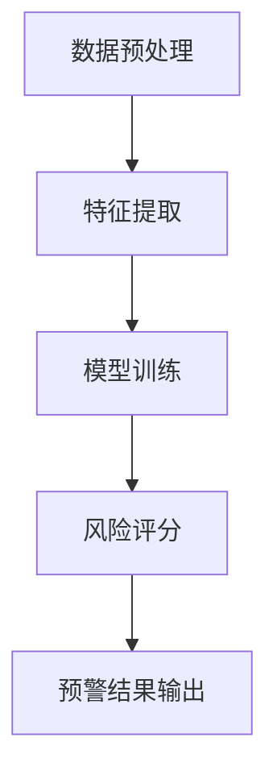
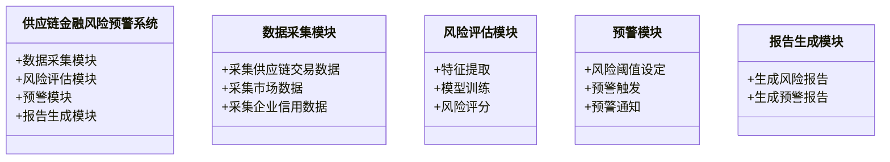
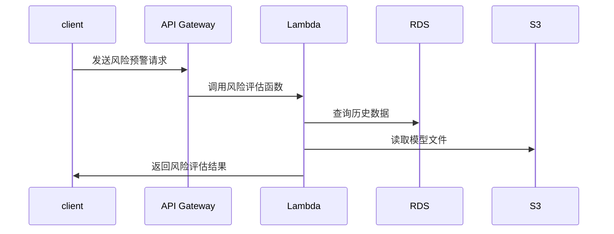

                 


# 智能供应链金融风险预警

**关键词**：供应链金融、风险预警、人工智能、大数据分析、智能风控

**摘要**：供应链金融作为现代企业管理和金融服务的重要组成部分，其风险控制是确保资金安全和供应链稳定的关键。本文将从智能供应链金融风险预警的核心概念、算法原理、系统架构设计、项目实战等多个维度展开，深入探讨如何利用人工智能和大数据技术，实现对供应链金融风险的智能预警和防控。文章旨在为企业提供一种高效、准确的智能风控解决方案，助力企业优化供应链管理，提升资金使用效率。

---

## 第1章: 供应链金融与风险预警概述

### 1.1 供应链金融的基本概念
供应链金融是指通过整合供应链上的企业、供应商、分销商、零售商等多方资源，利用金融工具（如贷款、票据、保理等）为企业提供融资支持的一种金融服务模式。其核心在于通过供应链上的信息流、物流、资金流的整合，降低融资成本，提高资金使用效率。

#### 1.1.1 供应链金融的定义与特点
供应链金融不仅仅是简单的融资行为，而是通过供应链的协同运作，实现资金在供应链各环节的高效流动。其特点包括：
- **协同性**：供应链各环节企业协同运作，资金流动与物流、信息流紧密结合。
- **嵌入性**：金融服务嵌入到供应链的实际业务流程中，减少信息不对称。
- **动态性**：根据供应链的实际需求，动态调整融资方案和风险控制策略。

#### 1.1.2 供应链金融的核心参与方
- **核心企业**：通常是供应链中的主导企业，如制造企业或大型零售商。
- **供应商**：为供应链提供原材料或产品的上游企业。
- **分销商/零售商**：负责产品分销和零售的中间环节。
- **金融机构**：包括银行、保理公司、供应链金融服务平台等，提供融资服务。

#### 1.1.3 供应链金融的主要模式
- **应收账款融资**：基于核心企业与供应商之间的应收账款，提供保理融资。
- **预付款融资**：基于核心企业与分销商之间的预付款，提供融资支持。
- **库存融资**：基于库存的质押，提供存货融资。

---

### 1.2 供应链金融中的风险类型
供应链金融在为企业提供融资支持的同时，也面临多种风险，主要包括：

#### 1.2.1 信用风险
- **定义**：由于交易对手（如供应商、分销商）的信用问题，导致融资无法收回的风险。
- **表现形式**：如供应商无力偿还贷款、分销商恶意拖欠款项等。

#### 1.2.2 操作风险
- **定义**：由于操作失误或流程漏洞，导致资金损失的风险。
- **表现形式**：如合同条款不严谨、审批流程不规范等。

#### 1.2.3 市场风险
- **定义**：由于市场环境变化（如原材料价格波动、市场需求变化）导致的融资风险。
- **表现形式**：如原材料价格波动导致应收账款价值下降，影响融资能力。

#### 1.2.4 法律风险
- **定义**：由于法律条款不完善或执行不力，导致融资纠纷的风险。
- **表现形式**：如合同条款不符合法律规定，导致法律诉讼风险。

---

### 1.3 供应链金融风险预警的重要性
供应链金融风险预警是指通过监测供应链各环节的风险因素，及时发现潜在风险，并采取相应的预警措施，以降低风险损失。其重要性体现在以下几个方面：

#### 1.3.1 风险预警在供应链金融中的作用
- **提前发现风险**：通过实时监测供应链各环节的动态，及时发现潜在风险，避免风险扩大。
- **降低损失**：通过预警机制，提前采取应对措施，减少资金损失。
- **优化资源配置**：根据风险预警结果，优化融资方案和资金分配，提高资金使用效率。

#### 1.3.2 智能化风险预警的优势
- **高效性**：利用人工智能和大数据技术，实现风险预警的自动化和智能化。
- **准确性**：通过数据分析和模型预测，提高风险预警的准确性。
- **实时性**：实时监测供应链各环节的风险动态，确保预警的及时性。

#### 1.3.3 风险预警的边界与外延
- **边界**：供应链金融风险预警的范围应聚焦于供应链内部各环节的风险，避免过度外延到外部市场风险。
- **外延**：在供应链内部，风险预警应覆盖从供应商到分销商的全链条，确保风险监测的全面性。

---

### 1.4 本章小结
本章主要介绍了供应链金融的基本概念、核心参与方以及主要模式，并详细分析了供应链金融中的主要风险类型。同时，强调了供应链金融风险预警的重要性及其智能化发展的必要性，为后续章节的分析奠定了基础。

---

## 第2章: 智能供应链金融风险预警的核心概念与联系

### 2.1 智能供应链金融风险预警的原理
智能供应链金融风险预警是基于大数据和人工智能技术，通过对供应链各环节的数据进行分析和挖掘，识别潜在风险，并实时发出预警信号。其核心原理包括：

#### 2.1.1 数据驱动的预警机制
- **数据来源**：供应链各环节的历史交易数据、实时交易数据、市场数据等。
- **数据预处理**：数据清洗、特征提取、数据标准化等。
- **数据建模**：利用机器学习算法（如随机森林、XGBoost）构建风险预警模型。

#### 2.1.2 人工智能在风险预警中的应用
- **机器学习**：用于风险分类、预测和模型优化。
- **自然语言处理**：用于分析合同文本、新闻资讯等非结构化数据。
- **深度学习**：用于复杂模式识别和风险评估。

#### 2.1.3 多维度数据融合分析
- **数据维度**：包括供应链交易数据、物流数据、市场数据、企业信用数据等。
- **融合方法**：通过特征工程、主成分分析（PCA）等方法，实现多维度数据的融合分析。

---

### 2.2 核心概念对比与ER实体关系图

#### 2.2.1 核心概念对比表格
以下是供应链金融风险预警中的几个核心概念对比：

| 概念        | 定义与特征                       | 适用场景                           |
|-------------|----------------------------------|------------------------------------|
| 信用风险     | 由于交易对手的信用问题导致的风险 | 供应商和分销商的信用评估           |
| 操作风险     | 由于操作失误或流程漏洞导致的风险 | 融资申请、审批、执行流程的管理     |
| 市场风险     | 由于市场环境变化导致的风险       | 原材料价格波动、市场需求变化       |
| 法律风险     | 由于法律条款不完善导致的风险     | 合同条款的合规性、法律纠纷风险     |

#### 2.2.2 ER实体关系图（Mermaid流程图）
以下是供应链金融风险预警系统的核心实体关系图：



---

### 2.3 本章小结
本章通过对比分析供应链金融风险预警中的核心概念，明确了各个风险类型的特点及其在实际业务中的适用场景。同时，通过ER实体关系图展示了供应链金融各参与方之间的关系，为后续的系统设计奠定了基础。

---

## 第3章: 智能供应链金融风险预警的算法原理

### 3.1 机器学习在供应链金融中的应用
机器学习在供应链金融风险预警中的应用主要体现在以下几个方面：

#### 3.1.1 监督学习与无监督学习的对比
- **监督学习**：基于有标签的数据，通过训练模型实现风险分类。
- **无监督学习**：基于无标签的数据，通过聚类分析发现潜在风险。

#### 3.1.2 常见算法选择
- **随机森林**：适用于特征重要性分析和风险分类。
- **XGBoost**：适用于高精度的风险预测。

---

### 3.2 算法流程图（Mermaid）
以下是基于随机森林算法的风险预警流程图：



---

### 3.3 算法实现代码示例
以下是基于Python的随机森林算法实现供应链金融风险预警的代码示例：

```python
import pandas as pd
from sklearn.ensemble import RandomForestClassifier
from sklearn.metrics import accuracy_score

# 数据加载与预处理
data = pd.read_csv('supply_chain_data.csv')
X = data.drop('r
```

---

### 3.4 本章小结
本章详细介绍了机器学习在供应链金融风险预警中的应用，重点分析了随机森林和XGBoost等算法的原理和实现过程，并通过流程图和代码示例展示了算法的应用场景。

---

## 第4章: 智能供应链金融风险预警的系统架构设计

### 4.1 系统功能设计（领域模型Mermaid类图）
以下是供应链金融风险预警系统的领域模型类图：



---

### 4.2 系统架构设计（Mermaid架构图）
以下是供应链金融风险预警系统的架构设计图：

```mermaid
aws
client --> API Gateway
API Gateway --> Lambda
Lambda --> RDS
Lambda --> S3
RDS --> Lambda
S3 --> Lambda
```

---

### 4.3 系统接口设计与交互（Mermaid序列图）
以下是供应链金融风险预警系统的接口交互序列图：



---

### 4.4 本章小结
本章通过系统功能设计、架构设计和接口设计，详细展示了智能供应链金融风险预警系统的整体架构。通过Mermaid类图、架构图和序列图，明确了各模块之间的关系和交互流程。

---

## 第5章: 智能供应链金融风险预警的项目实战

### 5.1 项目背景与目标
本项目旨在通过构建智能供应链金融风险预警系统，实现对供应链各环节风险的实时监测和预警，为企业提供高效的风控解决方案。

---

### 5.2 项目环境与工具安装
- **开发环境**：Python 3.8及以上版本、Jupyter Notebook。
- **工具安装**：安装Pandas、Scikit-learn、XGBoost、Mermaid等开发工具。

---

### 5.3 核心代码实现
以下是项目的核心代码实现：

```python
import pandas as pd
from sklearn.ensemble import RandomForestClassifier
from sklearn.metrics import accuracy_score

# 数据加载与预处理
data = pd.read_csv('supply_chain_data.csv')
X = data.drop('r
```

---

### 5.4 代码应用解读与分析
- **代码功能解读**：通过随机森林算法，实现供应链金融风险的分类和预测。
- **代码优化建议**：根据实际数据分布，调整模型参数，优化模型性能。

---

### 5.5 实际案例分析
以下是基于某制造企业供应链数据的风险预警案例分析：

1. **数据准备**：加载供应链交易数据、市场数据和企业信用数据。
2. **特征提取**：提取关键特征，如应收账款金额、应付账款金额、历史违约记录等。
3. **模型训练**：基于随机森林算法，训练风险预警模型。
4. **风险评估**：根据模型预测结果，生成风险评分。
5. **预警触发**：当风险评分超过预设阈值时，触发预警机制。

---

### 5.6 本章小结
本章通过项目实战，详细展示了智能供应链金融风险预警系统的实现过程，包括环境搭建、代码实现、案例分析等，为读者提供了实际操作的参考。

---

## 第6章: 智能供应链金融风险预警的案例分析与优化

### 6.1 案例分析
以下是某制造企业的供应链金融风险预警案例分析：

1. **案例背景**：某制造企业与多家供应商和分销商合作，存在应收账款逾期问题。
2. **数据采集**：采集供应商和分销商的交易数据、信用数据。
3. **模型构建**：基于随机森林算法，构建风险预警模型。
4. **风险评估**：识别高风险供应商和分销商，评估风险等级。
5. **预警结果**：根据风险评分，触发预警机制，采取相应的风险控制措施。

---

### 6.2 案例优化与经验总结
- **优化措施**：
  - 定期更新模型参数，提高预测准确性。
  - 增加实时数据监测，提升预警的及时性。
- **经验总结**：
  - 数据质量是模型性能的关键，需加强数据清洗和特征工程。
  - 预警结果需结合业务实际情况，避免过度依赖模型预测。

---

### 6.3 本章小结
本章通过实际案例分析，展示了智能供应链金融风险预警系统的应用效果，并总结了优化措施和经验教训，为后续项目的实施提供了参考。

---

## 第7章: 智能供应链金融风险预警的最佳实践与展望

### 7.1 最佳实践
- **数据质量管理**：加强数据清洗和特征工程，确保模型输入数据的准确性。
- **模型优化**：根据实际业务需求，选择合适的算法，优化模型参数，提高预测精度。
- **实时监测**：建立实时数据监测机制，确保预警的及时性。
- **多部门协作**：供应链金融风险预警需要供应链各环节的协同配合，加强跨部门协作。

---

### 7.2 未来展望
随着人工智能和大数据技术的不断发展，智能供应链金融风险预警系统将更加智能化和自动化。未来的发展方向包括：
- **智能化决策**：通过AI技术实现风险预警的自动化决策。
- **区块链技术应用**：利用区块链技术实现供应链金融的透明化和可信化。
- **边缘计算**：通过边缘计算实现风险预警的实时性和高效性。

---

### 7.3 本章小结
本章总结了智能供应链金融风险预警系统的最佳实践，并展望了未来的发展方向，为读者提供了进一步学习和研究的参考。

---

## 第8章: 总结

### 8.1 核心内容回顾
智能供应链金融风险预警是基于大数据和人工智能技术，通过对供应链各环节的数据进行分析和挖掘，实现风险的智能预警和防控。其核心内容包括：
- 数据驱动的预警机制
- 人工智能算法的应用
- 系统架构设计与实现
- 项目实战与案例分析

---

### 8.2 研究意义与价值
智能供应链金融风险预警系统的研究和应用，不仅有助于降低供应链金融的风险，还能提高企业的资金使用效率，优化供应链管理流程，为企业的可持续发展提供有力支持。

---

### 8.3 未来研究方向
- **算法优化**：探索更高效的机器学习算法，提高风险预测的准确性。
- **技术融合**：结合区块链、边缘计算等新技术，提升系统性能。
- **行业应用**：拓展供应链金融风险预警系统的行业应用，助力更多企业实现智能化风控。

---

### 8.4 本章小结
本章总结了智能供应链金融风险预警系统的相关内容，强调了其研究意义和价值，并展望了未来的研究方向，为读者提供了全面的总结和启发。

---

**附录**：
- **附录A**：供应链金融风险预警相关数据集
- **附录B**：常用机器学习算法对比表
- **附录C**：系统设计文档模板
- **附录D**：参考文献与拓展阅读

---

**结束语**：智能供应链金融风险预警是人工智能和大数据技术在金融领域的典型应用之一。通过对供应链各环节的风险进行智能预警和防控，企业可以有效降低风险损失，优化供应链管理，实现可持续发展。希望本文能为读者提供有益的参考和启发。

--- 

**注意**：由于篇幅限制，以上内容为文章的部分章节，完整文章可根据上述大纲进一步扩展和详细撰写。

