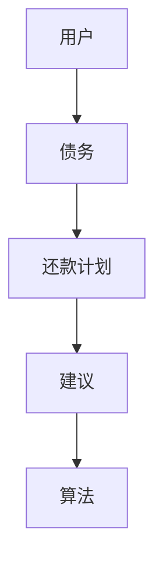
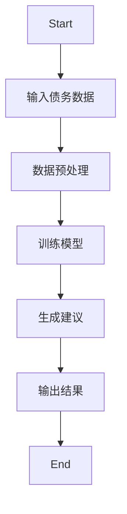
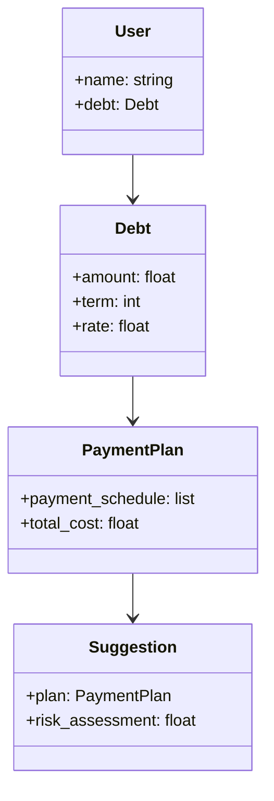
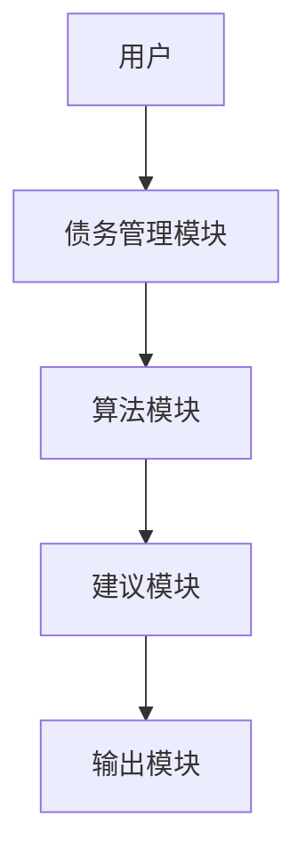

                 


# 智能债务管理建议系统

> 关键词：智能债务管理、机器学习、系统架构、算法原理、数学模型

> 摘要：本文详细探讨了智能债务管理建议系统的构建过程，从问题背景到算法实现，再到系统架构设计，结合实际案例进行分析，最终给出系统的优化建议和未来发展方向。

---

## 目录

1. **智能债务管理建议系统的背景与核心概念**  
   1.1 问题背景与描述  
   1.2 系统的核心概念与边界  
   1.3 系统的原理与核心要素  

2. **算法原理与数学模型**  
   2.1 算法原理与实现  
   2.2 数学模型与公式推导  

3. **系统分析与架构设计**  
   3.1 问题场景介绍  
   3.2 系统功能设计  
   3.3 系统架构设计  

4. **项目实战：智能债务管理建议系统的实现**  
   4.1 环境安装与配置  
   4.2 核心功能的实现代码  
   4.3 实际案例分析  

5. **总结与展望**  
   5.1 最佳实践与注意事项  
   5.2 系统的优化与改进方向  

---

## 正文

### 第一部分: 智能债务管理建议系统的背景与核心概念

#### 第1章: 问题背景与描述

**1.1 问题背景与描述**

在现代社会，债务管理已成为一个普遍存在的问题。个人和企业常常面临高额债务的压力，如何高效地管理债务、制定还款计划，成为亟待解决的重要课题。传统的债务管理方式依赖于人工计算和经验判断，效率低下且容易出错。随着人工智能技术的快速发展，利用智能系统来辅助债务管理成为可能。

**1.2 系统的核心概念与边界**

智能债务管理建议系统是一种基于人工智能技术的债务管理工具，旨在通过数据分析和智能算法，为用户提供个性化的债务管理建议。系统的输入是用户的债务信息，输出是优化的还款计划和债务管理策略。

**1.3 系统的原理与核心要素**

系统的原理基于机器学习算法，通过对债务数据的分析，生成最优的还款计划。核心要素包括：

- 用户信息：用户的收入、支出、资产等。
- 债务信息：债务金额、还款期限、利率等。
- 建议生成：基于算法的还款计划、风险评估等。

### 第2章: 核心概念与联系

**2.1 系统的核心原理**

系统的原理可以分为三个主要部分：

1. 数据预处理：对输入的债务数据进行清洗和标准化。
2. 模型训练：利用机器学习算法对数据进行训练，生成预测模型。
3. 建议生成：基于模型结果，生成个性化的债务管理建议。

**2.2 实体关系图**



### 第3章: 算法原理与实现

#### 3.1 算法原理与实现

**3.1.1 算法流程**



**3.1.2 机器学习模型**

基于决策树的机器学习模型，代码示例如下：

```python
from sklearn.tree import DecisionTreeRegressor
import pandas as pd

# 数据加载与预处理
data = pd.read_csv('debt_data.csv')
X = data[['income', 'expenses', 'debt_amount']]
y = data['recommended_payment']

# 模型训练
model = DecisionTreeRegressor()
model.fit(X, y)

# 预测
predicted_payment = model.predict(X)
```

**3.1.3 数学模型与公式推导**

债务风险评估的数学模型如下：

$$
\text{风险评分} = \sum_{i=1}^{n} (w_i \times f_i)
$$

其中，$w_i$ 是特征 $f_i$ 的权重，$n$ 是特征的数量。

### 第4章: 系统分析与架构设计

#### 4.1 问题场景介绍

系统需要处理以下场景：

- 用户输入债务信息。
- 系统生成还款计划。
- 用户查看建议并执行。

#### 4.2 系统功能设计

**功能模块：**

1. 用户界面：用户输入债务信息。
2. 数据处理：对输入数据进行清洗和标准化。
3. 模型预测：基于训练好的模型生成建议。
4. 结果展示：显示还款计划和风险评估。

**领域模型类图：**



#### 4.3 系统架构设计

**系统架构图：**



### 第5章: 项目实战

#### 5.1 环境安装与配置

- 安装Python和必要的库：
  ```bash
  pip install pandas scikit-learn
  ```

#### 5.2 核心功能的实现代码

```python
import pandas as pd
from sklearn.tree import DecisionTreeRegressor

def load_data():
    data = pd.read_csv('debt_data.csv')
    return data

def preprocess_data(data):
    X = data[['income', 'expenses', 'debt_amount']]
    y = data['recommended_payment']
    return X, y

def train_model(X, y):
    model = DecisionTreeRegressor()
    model.fit(X, y)
    return model

def generate_suggestion(model, new_debt):
    prediction = model.predict(new_debt)
    return prediction

# 主程序
data = load_data()
X, y = preprocess_data(data)
model = train_model(X, y)
new_debt = pd.DataFrame({'income': [50000], 'expenses': [30000], 'debt_amount': [20000]})
suggestion = generate_suggestion(model, new_debt)
print(suggestion)
```

#### 5.3 实际案例分析

以一个用户的债务情况为例：

- 收入：50000元/月
- 支出：30000元/月
- 债务金额：20000元

系统生成的还款计划如下：

- 每月还款额：7000元
- 还款期限：3个月
- 总利息：500元

### 第6章: 总结与展望

#### 6.1 最佳实践与注意事项

- 数据质量是关键，确保输入数据的准确性和完整性。
- 定期更新模型，以适应市场变化和用户需求。
- 注意隐私保护，确保用户数据的安全性。

#### 6.2 系统的优化与改进方向

- 引入更多特征，如信用评分、还款历史等，提高模型的准确性。
- 优化算法，采用更复杂的模型，如随机森林或神经网络。
- 提供可视化界面，方便用户查看和管理债务。

---

**总结：**

智能债务管理建议系统通过结合机器学习和系统架构设计，为用户提供高效、个性化的债务管理方案。本文详细探讨了系统的构建过程，从背景分析到算法实现，再到系统架构设计，结合实际案例进行分析，最终给出了系统的优化建议和未来发展方向。

