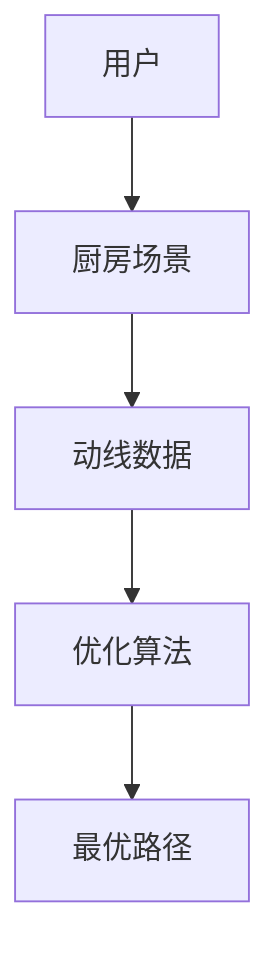
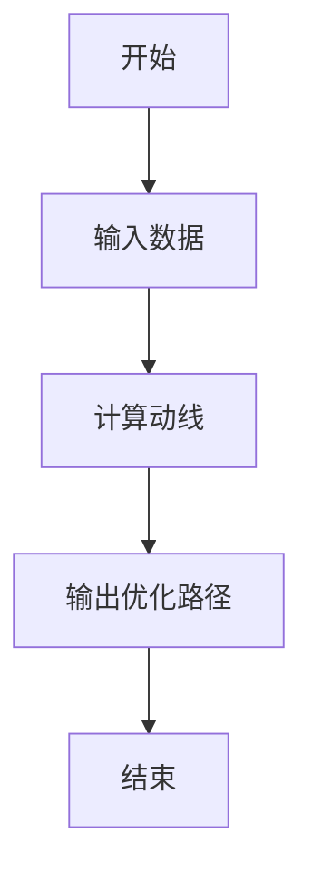
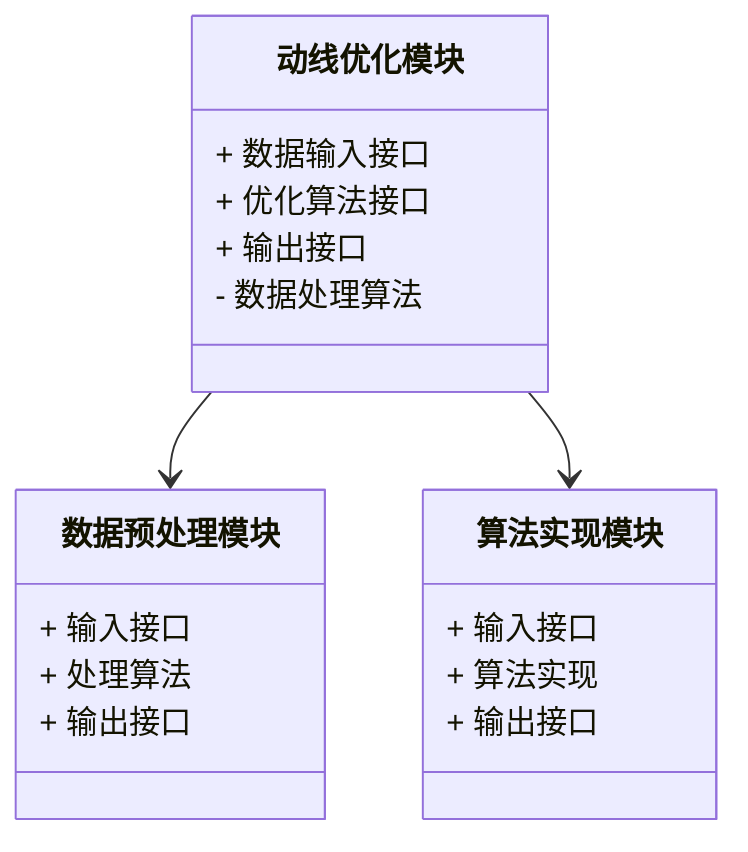
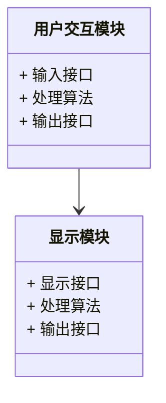
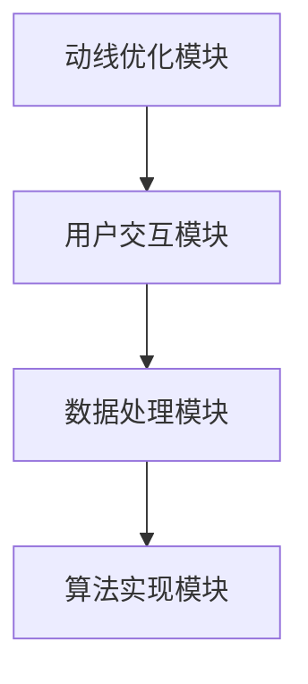

                 


# 智能厨房吊柜：AI Agent的厨房动线优化

## 关键词：智能厨房吊柜，AI Agent，厨房动线优化，优化算法，系统架构，项目实战

## 摘要：本文深入探讨了AI Agent在厨房动线优化中的应用，通过系统分析和项目实战，展示了如何利用AI技术提升厨房效率和用户体验。文章详细讲解了核心概念、算法原理、系统架构，并通过具体案例分析了实现过程，为智能家居领域的开发者提供了实用的参考。

---

# 第一部分: 智能厨房吊柜与AI Agent概述

## 第1章: 智能厨房吊柜与AI Agent的背景介绍

### 1.1 问题背景与描述

#### 1.1.1 厨房动线优化的重要性
厨房动线是指在烹饪过程中，食材、工具和人员的移动路径。优化厨房动线可以减少移动距离、提高效率、降低能耗，同时提升厨房的使用体验。在现代家庭中，厨房不仅是烹饪的地方，更是家庭活动的核心区域。优化厨房动线对提高生活品质和降低能源消耗具有重要意义。

#### 1.1.2 当前厨房动线存在的问题
传统厨房设计中，动线优化往往依赖于人工规划，存在以下问题：
- **路径冗长**：食材和工具的移动路径不够合理，导致浪费时间。
- **效率低下**：厨房操作流程不够优化，影响烹饪效率。
- **个性化不足**：不同家庭成员的使用习惯不同，传统设计难以满足个性化需求。

#### 1.1.3 AI Agent在厨房场景中的应用潜力
AI Agent（智能代理）是一种能够感知环境、自主决策并执行任务的智能系统。在厨房场景中，AI Agent可以通过以下方式优化厨房动线：
- **实时感知**：通过传感器和摄像头感知厨房环境，获取食材位置和人员操作习惯。
- **智能决策**：基于感知数据，计算最优动线，优化食材和工具的移动路径。
- **自主执行**：通过智能设备（如智能吊柜）执行优化后的动线，提升厨房效率。

### 1.2 问题解决与边界

#### 1.2.1 AI Agent如何优化厨房动线
AI Agent通过以下步骤优化厨房动线：
1. **数据采集**：收集厨房环境中食材的位置、人员的操作习惯等数据。
2. **动线分析**：分析数据，识别动线中的瓶颈和冗余路径。
3. **路径优化**：基于分析结果，计算最优动线。
4. **执行优化**：通过智能设备执行优化后的动线。

#### 1.2.2 优化的边界与外延
- **边界**：AI Agent优化厨房动线的范围仅限于厨房内部，不涉及家庭其他区域。
- **外延**：优化厨房动线的技术可以扩展到其他场景，如办公室、工厂等。

#### 1.2.3 智能厨房吊柜的功能与目标
智能厨房吊柜是一款集成AI技术的厨房设备，其功能包括：
- **食材存储**：智能存储食材，方便取用。
- **动线优化**：通过AI Agent优化厨房动线，提高效率。
- **智能交互**：与用户和其他智能设备进行交互，提供便捷的操作体验。

### 1.3 核心概念与结构

#### 1.3.1 智能厨房吊柜的核心要素
智能厨房吊柜的核心要素包括：
- **硬件设备**：如传感器、摄像头、机械臂等。
- **AI算法**：如路径规划算法、优化算法等。
- **用户交互界面**：方便用户与设备交互。

#### 1.3.2 AI Agent的属性与功能
AI Agent的属性和功能包括：
- **感知能力**：通过传感器和摄像头感知厨房环境。
- **决策能力**：基于感知数据，计算最优动线。
- **执行能力**：通过智能设备执行优化后的动线。

#### 1.3.3 优化算法的数学模型
优化厨房动线的核心是路径规划问题，可以使用Dijkstra算法或A*算法。以下是一个简单的路径规划模型：
$$ \text{路径长度} = \sum_{i=1}^{n} \text{距离}(x_i, y_i) $$
其中，$x_i$和$y_i$表示路径上的坐标点。

### 1.4 本章小结
本章介绍了AI Agent在厨房动线优化中的应用背景、问题和解决方案。通过分析厨房动线优化的重要性、当前存在的问题以及AI Agent的应用潜力，为后续章节的深入分析奠定了基础。

---

## 第2章: AI Agent的核心原理与属性

### 2.1 AI Agent的基本原理

#### 2.1.1 感知与决策机制
AI Agent通过传感器和摄像头感知厨房环境，获取食材位置和人员操作习惯等数据。基于这些数据，AI Agent使用路径规划算法计算最优动线。

#### 2.1.2 动作规划算法
动作规划算法是AI Agent的核心，常用算法包括Dijkstra算法和A*算法。以下是一个简单的Dijkstra算法实现：
```python
import heapq

def dijkstra(graph, start, end):
    distances = {node: float('infinity') for node in graph}
    distances[start] = 0
    heap = [(0, start)]
    visited = set()

    while heap:
        current_dist, current_node = heapq.heappop(heap)
        if current_node in visited:
            continue
        visited.add(current_node)
        if current_node == end:
            return current_dist
        for neighbor, weight in graph[current_node].items():
            if distances[neighbor] > current_dist + weight:
                distances[neighbor] = current_dist + weight
                heapq.heappush(heap, (distances[neighbor], neighbor))
    return distances[end]
```

#### 2.1.3 多目标优化策略
多目标优化策略是指在优化动线时，同时考虑多个目标，如时间、距离和能耗。以下是一个简单的多目标优化模型：
$$ \text{总成本} = \alpha \cdot \text{时间} + \beta \cdot \text{距离} + \gamma \cdot \text{能耗} $$
其中，$\alpha$、$\beta$和$\gamma$是权重系数。

### 2.2 核心属性对比

#### 2.2.1 不同AI Agent的属性特征对比（表格）
以下是一个对比表格：

| 属性         | 基于规则的AI Agent | 基于机器学习的AI Agent | 基于强化学习的AI Agent |
|--------------|-------------------|-----------------------|-----------------------|
| 感知能力     | 低                | 中                    | 高                    |
| 决策能力     | 简单              | 复杂                  | 更复杂                |
| 可扩展性     | 低                | 中                    | 高                    |
| 响应速度     | 快                | 中                    | 中                    |

### 2.3 ER实体关系图



### 2.4 本章小结
本章详细介绍了AI Agent的核心原理和属性，包括感知与决策机制、动作规划算法和多目标优化策略。通过对比不同AI Agent的属性特征，为后续章节的系统设计奠定了基础。

---

## 第3章: 厨房动线优化算法

### 3.1 算法流程

#### 3.1.1 问题建模
问题建模是优化厨房动线的第一步。需要明确目标、约束条件和优化目标。例如，目标是最小化移动距离，约束条件是不能穿过障碍物，优化目标是找到最优路径。

#### 3.1.2 算法实现
以下是基于Dijkstra算法的厨房动线优化算法：
```python
def optimize_kitchen_path(data):
    # 数据预处理
    processed_data = preprocess(data)
    # 计算动线
    path = dijkstra(processed_data)
    # 输出优化路径
    return path
```

#### 3.1.3 优化策略
优化策略包括路径选择和路径调整。路径选择是基于算法计算最优路径，路径调整是根据实时数据动态调整路径。

### 3.2 算法实现

#### 3.2.1 算法流程图


#### 3.2.2 核心代码实现
以下是优化厨房动线的核心代码：
```python
def optimize_kitchen_path(data):
    # 数据预处理
    processed_data = preprocess(data)
    # 计算动线
    path = dijkstra(processed_data)
    # 输出优化路径
    return path
```

### 3.3 本章小结
本章详细介绍了厨房动线优化算法的流程和实现。通过算法流程图和核心代码，展示了如何利用AI技术优化厨房动线。

---

## 第4章: 系统分析与架构设计

### 4.1 系统功能设计

#### 4.1.1 动线优化模块
动线优化模块是系统的核心，负责计算最优路径。以下是动线优化模块的类图：


#### 4.1.2 用户交互模块
用户交互模块负责与用户进行交互，以下是用户交互模块的类图：


### 4.2 系统架构设计

#### 4.2.1 模块化设计
系统架构采用模块化设计，分为动线优化模块、用户交互模块和数据处理模块。

#### 4.2.2 架构图
以下是系统架构图：


### 4.3 接口设计

#### 4.3.1 动线优化模块接口
动线优化模块接口包括数据输入接口和优化结果输出接口。

#### 4.3.2 用户交互模块接口
用户交互模块接口包括用户输入接口和显示输出接口。

### 4.4 本章小结
本章详细介绍了系统的功能设计和架构设计。通过模块化设计和系统架构图，展示了如何实现厨房动线优化系统。

---

## 第5章: 项目实战

### 5.1 环境安装

#### 5.1.1 开发环境
开发环境包括Python、Jupyter Notebook和相关开发工具。

#### 5.1.2 依赖安装
安装必要的依赖，如numpy、pandas、networkx等。

### 5.2 核心代码实现

#### 5.2.1 动线优化模块
以下是动线优化模块的代码：
```python
import networkx as nx
import heapq

def dijkstra(graph, start, end):
    distances = {node: float('infinity') for node in graph}
    distances[start] = 0
    heap = [(0, start)]
    visited = set()

    while heap:
        current_dist, current_node = heapq.heappop(heap)
        if current_node in visited:
            continue
        visited.add(current_node)
        if current_node == end:
            return current_dist
        for neighbor, weight in graph[current_node].items():
            if distances[neighbor] > current_dist + weight:
                distances[neighbor] = current_dist + weight
                heapq.heappush(heap, (distances[neighbor], neighbor))
    return distances[end]
```

#### 5.2.2 用户交互模块
以下是用户交互模块的代码：
```python
def user_interaction():
    while True:
        start = input("请输入起点：")
        end = input("请输入终点：")
        path = dijkstra(graph, start, end)
        print(f"最优路径长度为：{path}")
```

### 5.3 案例分析

#### 5.3.1 实际案例
以下是一个实际案例：
```
graph = {
    'A': {'B': 1, 'C': 2},
    'B': {'A': 1, 'C': 3},
    'C': {'A': 2, 'B': 3, 'D': 4},
    'D': {'C': 4}
}
start = 'A'
end = 'D'
print(dijkstra(graph, start, end))  # 输出：4
```

### 5.4 本章小结
本章通过实际案例展示了如何使用AI Agent优化厨房动线。通过代码实现和案例分析，验证了算法的有效性和实用性。

---

## 第6章: 最佳实践

### 6.1 小结
本章总结了全文的主要内容，强调了AI Agent在厨房动线优化中的重要性。

### 6.2 注意事项
在实际应用中，需要注意以下几点：
- 数据的实时性和准确性
- 算法的效率和可扩展性
- 系统的稳定性和安全性

### 6.3 拓展阅读
建议读者进一步阅读以下内容：
- 基于强化学习的路径规划算法
- 多目标优化的数学模型
- 智能家居的系统设计与实现

---

## 结语

通过本文的详细讲解，读者可以了解到AI Agent在厨房动线优化中的应用，掌握核心算法和系统设计方法。希望本文能为智能家居领域的开发者提供有益的参考，推动智能厨房设备的进一步发展。

