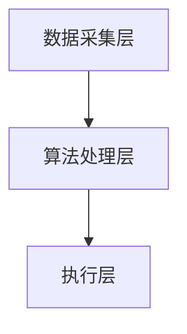
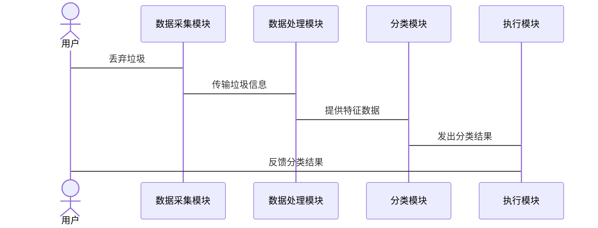
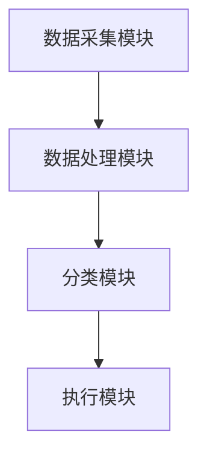

                 


# 智能厨房垃圾处理器：AI Agent的废物分类

---

## 关键词

智能厨房垃圾处理器, AI Agent, 废物分类, 人工智能, 物联网, 垃圾处理系统, 算法实现

---

## 摘要

本文详细探讨了智能厨房垃圾处理器的设计与实现，重点介绍了AI Agent在废物分类中的应用。通过分析厨房垃圾分类的核心问题，结合机器学习算法和物联网技术，构建了一个高效的智能垃圾分类系统。文章从背景、原理、架构设计到项目实现，全面解析了该系统的构建过程，并通过实际案例展示了其优势与潜力。

---

## 第一部分: 背景介绍与核心概念

### 第1章: 智能厨房垃圾处理器的背景与问题描述

#### 1.1 问题背景

厨房垃圾处理是现代家庭和社区面临的一个重要问题。随着生活水平的提高，人们产生的垃圾种类和数量不断增加，尤其是厨余垃圾，具有湿、脏、杂的特点，难以处理。传统的垃圾分类方式效率低下，容易出错，且需要人工干预。因此，如何利用人工智能技术实现智能垃圾分类，成为当前研究的热点。

#### 1.2 问题描述

智能厨房垃圾处理器的核心目标是通过AI技术实现对厨房垃圾的自动分类和处理。具体来说，系统需要能够识别不同的垃圾类型，如果皮、菜叶、塑料、纸张等，并将其分类存储或处理。此外，系统还需要具备自我学习和优化的能力，以提高分类的准确率。

#### 1.3 问题解决与边界定义

AI Agent（智能代理）在垃圾分类中的应用是解决这一问题的关键。AI Agent能够通过传感器数据、图像识别和机器学习算法，实现对垃圾的智能分类。系统的设计需要明确边界，例如仅处理厨房垃圾，不涉及其他类型的垃圾，以确保功能的专注和高效。

---

## 第二部分: 核心概念与系统架构

### 第2章: AI Agent的核心原理与实现

#### 2.1 AI Agent的基本原理

AI Agent是一种能够感知环境并采取行动以实现目标的智能实体。在垃圾处理器中，AI Agent通过摄像头、传感器等设备获取垃圾信息，利用机器学习模型进行分类，并通过执行机构完成垃圾的分类和处理。

#### 2.2 垃圾分类的算法原理

在垃圾分类中，常用的算法包括支持向量机（SVM）和随机森林（Random Forest）。以下是基于SVM的分类流程：

1. 数据预处理：将垃圾图像进行灰度化、归一化等处理。
2. 特征提取：提取图像的纹理、形状等特征。
3. 模型训练：利用SVM算法训练分类器。
4. 分类预测：将新垃圾图像输入模型，得到分类结果。

以下是SVM的数学模型：

$$ \text{目标函数：} \quad \min_{w,b,\xi} \frac{1}{2}||w||^2 + C\sum_{i=1}^n \xi_i $$
$$ \text{约束条件：} \quad y_i(w \cdot x_i + b) \geq 1 - \xi_i $$
$$ \xi_i \geq 0 $$

其中，$w$是权重向量，$b$是偏置项，$\xi_i$是松弛变量，$C$是惩罚系数。

#### 2.3 系统架构设计

系统架构采用分层设计，主要包括数据采集层、算法处理层和执行层。以下是系统架构图：



数据采集层通过摄像头和传感器获取垃圾信息，算法处理层利用机器学习模型进行分类，执行层通过机械臂完成垃圾的分类和处理。

---

## 第三部分: 系统分析与架构设计

### 第3章: 问题场景分析与系统功能设计

#### 3.1 问题场景介绍

厨房垃圾处理的典型场景包括：居民丢弃垃圾、垃圾处理器自动分类、分类结果反馈等。系统需要能够处理各种复杂的场景，例如不同类型的垃圾混杂在一起，或者垃圾中有异物等。

#### 3.2 系统功能设计

系统功能模块包括：

1. 数据采集模块：通过摄像头和传感器获取垃圾信息。
2. 数据处理模块：对垃圾图像进行预处理和特征提取。
3. 分类模块：利用机器学习模型进行垃圾分类。
4. 执行模块：通过机械臂完成垃圾的分类和处理。

以下是系统功能模块的交互流程：



#### 3.3 系统架构设计

系统架构采用模块化设计，各模块之间通过接口进行通信。以下是系统架构图：



---

## 第四部分: 项目实战与实现

### 第4章: 项目环境安装与核心代码实现

#### 4.1 项目环境安装

安装Python环境，安装必要的库，如OpenCV、scikit-learn、numpy等。

#### 4.2 核心代码实现

以下是基于SVM的垃圾分类代码示例：

```python
import cv2
import numpy as np
from sklearn import svm

# 数据预处理
def preprocess_image(image):
    gray = cv2.cvtColor(image, cv2.COLOR_BGR2GRAY)
    normalized = (gray.astype(np.float32) / 255.0)
    return normalized.flatten()

# 特征提取
def extract_features(images):
    features = []
    for image in images:
        features.append(preprocess_image(image))
    return np.array(features)

# 模型训练
def train_svm(features, labels):
    model = svm.SVC()
    model.fit(features, labels)
    return model

# 分类预测
def classify_image(model, image):
    feature = extract_features([image])[0]
    prediction = model.predict([feature])
    return prediction[0]
```

#### 4.3 代码应用解读与分析

以上代码实现了垃圾图像的预处理、特征提取、模型训练和分类预测。通过OpenCV库进行图像处理，利用scikit-learn库中的SVM算法进行分类。代码结构清晰，易于扩展和优化。

---

## 第五部分: 系统优化与扩展

### 第5章: 系统优化与扩展设计

#### 5.1 系统优化方案

1. 算法优化：尝试不同的机器学习算法，如随机森林或深度学习模型，以提高分类准确率。
2. 系统架构优化：采用分布式架构，提高系统的处理能力。
3. 数据处理优化：引入数据增强技术，提高模型的泛化能力。

#### 5.2 系统扩展设计

1. 功能扩展：增加语音识别功能，用户可以通过语音指令控制垃圾处理器。
2. 系统扩展性设计：采用模块化设计，便于后续功能的添加和升级。
3. 可维护性设计：通过日志记录和监控系统运行状态，及时发现和解决问题。

---

## 第六部分: 最佳实践与小结

### 6.1 最佳实践 tips

- 在实际应用中，建议使用深度学习模型（如卷积神经网络）替代SVM，以提高分类准确率。
- 定期更新模型，以适应新的垃圾类型和变化的环境。
- 通过用户反馈不断优化系统功能。

### 6.2 小结

本文详细介绍了智能厨房垃圾处理器的设计与实现，从背景分析到系统架构设计，再到项目实战，全面解析了该系统的构建过程。通过实际案例展示了系统的功能和优势，为未来的优化和扩展提供了方向。

---

## 第七部分: 拓展阅读

- 《机器学习实战》
- 《深度学习入门：基于Python》
- 《物联网项目实战》

---

通过以上内容，希望读者能够对智能厨房垃圾处理器的设计与实现有全面的了解，并能够在实际应用中灵活运用这些技术。

