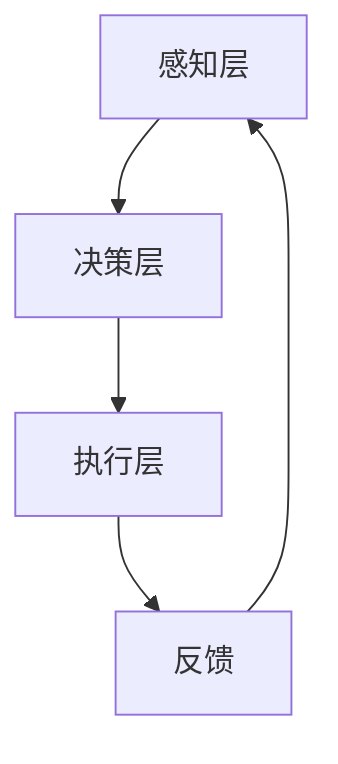
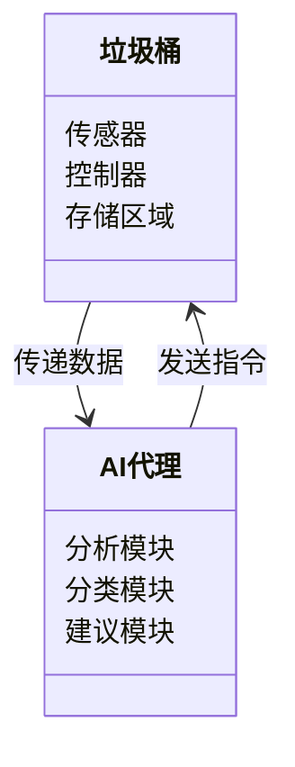
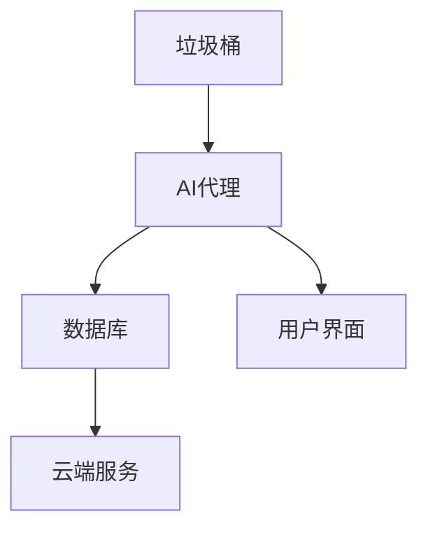

                 


# 智能厨房垃圾桶：AI Agent的废物回收建议

## 关键词：智能垃圾桶，人工智能，废物回收，AI代理，垃圾分类，物联网

## 摘要：本文探讨了智能厨房垃圾桶的设计与实现，结合AI代理优化废物回收流程。从背景介绍到系统架构，详细分析了AI代理的工作原理，并通过项目实战展示了实际应用。文章还提供了算法实现、系统设计和最佳实践，为读者提供全面的技术指导。

---

## 第1章: 智能厨房垃圾桶的背景介绍

### 1.1 智能垃圾桶的定义与特点

#### 1.1.1 智能垃圾桶的定义
智能垃圾桶是一种结合物联网和人工智能技术的智能设备，能够自动识别和分类垃圾类型，并提供回收建议。它通过传感器和AI算法优化废物管理流程，提升回收效率。

#### 1.1.2 智能垃圾桶的核心特点
- **自动化识别**：利用图像识别技术自动分类垃圾。
- **AI驱动**：AI代理提供智能建议和决策支持。
- **物联网连接**：通过网络传输数据，实现远程监控和管理。
- **节能环保**：减少人工操作，降低资源浪费。

#### 1.1.3 厨房垃圾桶的特殊性与需求
厨房垃圾种类繁多，包括有机和无机废弃物，且需要快速处理。智能垃圾桶能够实时分类，避免交叉污染，提升家庭垃圾分类效率。

### 1.2 AI Agent的基本概念

#### 1.2.1 人工智能代理的定义
AI代理是一种智能实体，能够感知环境、自主决策并执行任务。在智能垃圾桶中，AI代理负责分析数据，提供分类建议和操作指导。

#### 1.2.2 AI Agent的核心功能与属性
- **感知能力**：通过摄像头、传感器等获取数据。
- **决策能力**：基于机器学习模型分类垃圾，生成处理建议。
- **执行能力**：控制垃圾桶的机械结构进行分类和存放。

#### 1.2.3 AI Agent在废物回收中的应用潜力
AI代理能够提高分类准确性，减少人工干预，优化回收流程，降低成本，提升效率。

### 1.3 问题背景与目标

#### 1.3.1 废物分类与回收的现状
传统垃圾分类依赖人工操作，效率低且容易出错。智能垃圾桶通过自动化技术解决这些问题。

#### 1.3.2 厨房垃圾桶的智能化需求
厨房垃圾种类多、产生频率高，需要高效的分类和管理方法。

#### 1.3.3 本研究的目标与意义
目标是设计一个基于AI代理的智能垃圾桶，实现高效分类和回收。意义在于提升垃圾分类效率，促进环保。

---

## 第2章: AI Agent与智能垃圾桶的核心概念

### 2.1 AI Agent的基本原理

#### 2.1.1 感知层：数据采集与处理
垃圾桶内置摄像头和重量传感器，采集垃圾图像和重量数据，传输给AI代理进行分析。

#### 2.1.2 决策层：分类与建议生成
AI代理利用机器学习模型识别垃圾类型，生成分类建议并优化存储策略。

#### 2.1.3 执行层：垃圾桶操作与反馈
垃圾桶机械臂根据AI建议进行分类，操作结果反馈给AI代理，形成闭环系统。

### 2.2 智能垃圾桶的系统架构

#### 2.2.1 系统整体架构图


#### 2.2.2 各模块的功能描述
- 感知层：负责数据采集。
- 决策层：进行数据分析和分类。
- 执行层：根据决策结果操作垃圾桶。

#### 2.2.3 系统的边界与外延
系统与用户交互，通过物联网连接云端，实现数据共享和远程管理。

### 2.3 核心概念的ER实体关系图

```mermaid
erDiagram
    class 垃圾类型 {
        类型ID : int
        名称 : string
        描述 : string
    }
    class 用户输入 {
        输入ID : int
        类型ID : int
        时间戳 : datetime
    }
    class AI建议 {
        建议ID : int
        类型ID : int
        建议内容 : string
        时间戳 : datetime
    }
    垃圾类型 --> 用户输入 : 对应
    用户输入 --> AI建议 : 生成
```

### 2.4 AI Agent的决策流程


---

## 第3章: AI Agent的算法原理与实现

### 3.1 算法原理

#### 3.1.1 垃圾分类的机器学习模型
使用卷积神经网络（CNN）进行图像识别，训练模型分类垃圾类型。

#### 3.1.2 基于规则的分类策略
设定规则，如“湿垃圾放入特定区域”，辅助模型分类。

#### 3.1.3 综合分类算法的设计
结合机器学习模型和规则引擎，提升分类准确性和效率。

### 3.2 分类算法实现

#### 3.2.1 CNN模型
```python
import tensorflow as tf
from tensorflow.keras import layers

model = tf.keras.Sequential([
    layers.Conv2D(32, (3,3), activation='relu', input_shape=(128,128,3)),
    layers.MaxPooling2D((2,2)),
    layers.Conv2D(64, (3,3), activation='relu'),
    layers.MaxPooling2D((2,2)),
    layers.Flatten(),
    layers.Dense(128, activation='relu'),
    layers.Dense(num_classes, activation='softmax')
])
```

#### 3.2.2 分类器的训练
使用垃圾图像数据集训练模型，调整超参数优化性能。

#### 3.2.3 分类准确性的评估
通过测试集评估模型准确率，分析误分类情况。

---

## 第4章: 系统分析与架构设计方案

### 4.1 问题场景介绍
厨房环境复杂，垃圾种类多，需要智能垃圾桶高效分类和管理。

### 4.2 项目介绍
项目目标是设计智能垃圾桶，实现高效分类和回收，提升用户体验。

### 4.3 系统功能设计

#### 4.3.1 领域模型


### 4.4 系统架构设计

#### 4.4.1 系统架构图


### 4.5 系统接口设计
垃圾桶与AI代理通过API通信，数据库存储分类数据，用户界面展示建议。

### 4.6 系统交互设计

#### 4.6.1 交互流程
```mermaid
sequenceDiagram
    用户放置垃圾
    垃圾桶 --> AI代理: 上传图像
    AI代理 --> 分类结果
    AI代理 --> 用户: 提供建议
    用户确认操作
    垃圾桶 --> 执行分类
```

---

## 第5章: 项目实战

### 5.1 环境安装
安装Python、TensorFlow、Mermaid等工具，配置开发环境。

### 5.2 核心代码实现

#### 5.2.1 AI代理的实现
```python
class AIAgent:
    def __init__(self, model):
        self.model = model

    def classify(self, image):
        # 图像分类逻辑
        pass

    def suggest(self, classified_type):
        # 提供回收建议
        return f"建议将{classified_type}放入对应区域"
```

#### 5.2.2 垃圾桶的机械控制
```python
class SmartBin:
    def __init__(self, sensors, actuators):
        self.sensors = sensors
        self.actuators = actuators

    def detect(self):
        # 检测垃圾类型
        pass

    def move(self, target_zone):
        # 移动到目标区域
        pass
```

### 5.3 代码应用解读与分析
AI代理调用分类模型，分析结果并生成建议，垃圾桶根据建议执行操作。

### 5.4 实际案例分析
展示实际使用中的分类和建议过程，分析系统的准确性和效率。

### 5.5 项目小结
总结项目实现的效果，提出改进建议和未来发展方向。

---

## 第6章: 总结与展望

### 6.1 总结
智能厨房垃圾桶结合AI代理，显著提升垃圾分类效率和准确性，优化废物回收流程。

### 6.2 未来展望
未来研究可以优化算法，提升分类准确率，降低成本，推动智能垃圾桶的普及。

---

## 关键词：智能垃圾桶，人工智能，废物回收，AI代理，垃圾分类，物联网

## 结语
智能厨房垃圾桶通过AI代理优化废物回收，为环保和智能化生活提供新思路。未来，随着技术进步，智能垃圾桶将在更多场景中发挥重要作用。

--- 

感谢您的阅读，希望这篇文章为您提供有价值的信息和启发。

