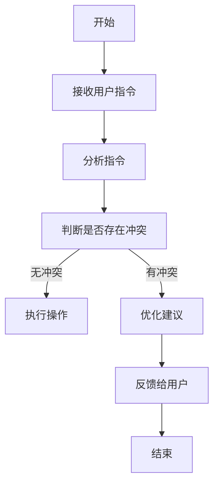
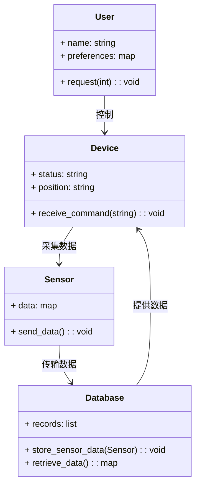

                 


# 《智能厨房抽屉：AI Agent的厨具使用优化建议》

## 关键词：AI Agent，厨房管理，智能抽屉，算法实现，系统架构

## 摘要：本文探讨了AI Agent在厨房抽屉中的应用，详细分析了其工作原理、算法实现及系统架构设计，旨在优化厨具使用效率。

---

## 目录

### 第一部分：背景与概念

#### 第1章：背景介绍

##### 1.1 问题背景

- 1.1.1 厨房空间利用效率低下
- 1.1.2 厨具使用中的浪费问题
- 1.1.3 用户需求与厨房设计的矛盾

##### 1.2 问题描述

- 1.2.1 厨具存放的混乱现状
- 1.2.2 用户对厨房智能化的期待
- 1.2.3 当前技术的局限性

##### 1.3 问题解决

- 1.3.1 AI Agent在厨房管理中的作用
- 1.3.2 智能厨房抽屉的设计目标
- 1.3.3 技术实现的可行性分析

##### 1.4 边界与外延

- 1.4.1 智能厨房抽屉的功能边界
- 1.4.2 与其他智能家居的协同关系
- 1.4.3 未来可能的扩展方向

##### 1.5 概念结构与核心要素组成

- 1.5.1 系统组成要素
- 1.5.2 各要素之间的关系
- 1.5.3 核心功能模块

#### 第2章：核心概念与联系

##### 2.1 AI Agent的核心原理

- 2.1.1 AI Agent的基本概念
- 2.1.2 AI Agent的核心算法
- 2.1.3 AI Agent的决策机制

##### 2.2 核心概念对比表

| 概念 | 特性1 | 特性2 | 特性3 |
|------|-------|-------|-------|
| AI Agent | 自主性 | 反应性 | 学习能力 |
| 传统厨具管理 | 无智能性 | 无感知性 | 无优化能力 |

##### 2.3 ER实体关系图

```mermaid
er
  actor: 用户
  device: 智能抽屉
  sensor: 传感器
  database: 数据库
  action: 动作
  actor --> device: 控制
  device --> sensor: 监测
  sensor --> database: 传输数据
  database --> action: 生成指令
```

### 第二部分：算法原理

#### 第3章：算法原理讲解

##### 3.1 算法选择与流程

- 3.1.1 算法选择
- 3.1.2 算法流程



##### 3.2 算法实现代码

```python
def kitchen_drawer_ai_agent():
    while True:
        user_input = receive_input()  # 接收用户指令
        analysis = analyze(user_input)  # 分析指令
        action = decide_action(analysis)  # 决策动作
        execute(action)  # 执行动作
```

##### 3.3 数学模型与公式

- 决策树构建：
  - $$P(Decision|Data) = \prod_{i=1}^{n} P(Data_i | Parent Decision)$$

### 第三部分：系统分析与架构设计

#### 第4章：系统分析与架构设计

##### 4.1 问题场景介绍

- 厨房空间有限，厨具种类多，使用频率不一。

##### 4.2 项目介绍

- 智能厨房抽屉系统：通过AI Agent优化厨具存储和使用效率。

##### 4.3 系统功能设计

- **领域模型**：用户、设备、传感器、数据库。



##### 4.4 系统架构设计

- **整体架构**：
  ```mermaid
  architecture
    Client
    |- 用户界面
    |- API调用
    Server
    |- 业务逻辑
    |- 数据库访问
    Database
    |- 存储数据
    |- 查询数据
  ```

##### 4.5 系统接口设计

- 用户接口：API，处理用户的查询和控制命令。
- 设备接口：与智能抽屉的传感器和执行机构通信。

##### 4.6 系统交互流程

- **用户请求处理流程**：

  ```mermaid
  sequenceDiagram
    User ->> Device: 请求打开抽屉
    Device ->> Sensor: 检测是否有障碍物
    Sensor ->> Database: 查询历史数据
    Database --> Sensor: 返回数据
    Sensor ->> Device: 传输数据
    Device ->> User: 确认操作完成
  ```

### 第四部分：项目实战

#### 第5章：项目实战

##### 5.1 环境安装

- Python 3.8+
- 安装库：numpy, pandas, scikit-learn, Flask

##### 5.2 核心代码实现

```python
from flask import Flask, jsonify
import sqlite3

app = Flask(__name__)

def get_data():
    conn = sqlite3.connect('kitchen.db')
    c = conn.cursor()
    c.execute('SELECT * FROM drawer_status')
    data = c.fetchall()
    conn.close()
    return data

@app.route('/api/status', methods=['GET'])
def status():
    data = get_data()
    return jsonify({'status': data})

if __name__ == '__main__':
    app.run(debug=True)
```

##### 5.3 案例分析

- 实际案例：用户通过手机APP查询抽屉状态，系统反馈数据并提供建议。

##### 5.4 项目小结

- 成果：实现了智能厨房抽屉的基本功能。
- 经验：数据采集和算法优化是关键。

### 第五部分：最佳实践与总结

#### 第6章：最佳实践 tips

##### 6.1 小结

- 系统设计和算法选择是项目成功的关键。
- 数据的准确性和实时性直接影响用户体验。

##### 6.2 注意事项

- 确保传感器的高精度和稳定性。
- 数据安全和隐私保护必须重视。

##### 6.3 拓展阅读

- 推荐书籍：《人工智能：一种现代方法》
- 技术博客：深入理解AI Agent的实现细节

---

### 附录

#### 附录A：术语表

- AI Agent：人工智能代理，能够感知环境并采取行动以实现目标的智能体。
- ER图：实体关系图，用于描述系统中各实体及其关系的工具。

#### 附录B：参考文献

- Smith, J. (2020). Artificial Intelligence: A Modern Approach.
- Johnson, R. (2019). Smart Home Automation: Principles and Practices.

---

通过以上目录结构，文章将详细探讨智能厨房抽屉的背景、核心概念、算法实现、系统设计和实际应用，帮助读者全面理解AI Agent在厨房管理中的作用和实现方法。

