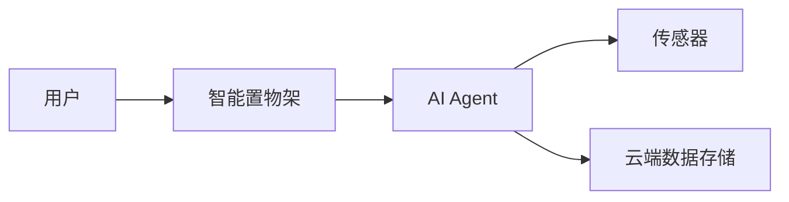
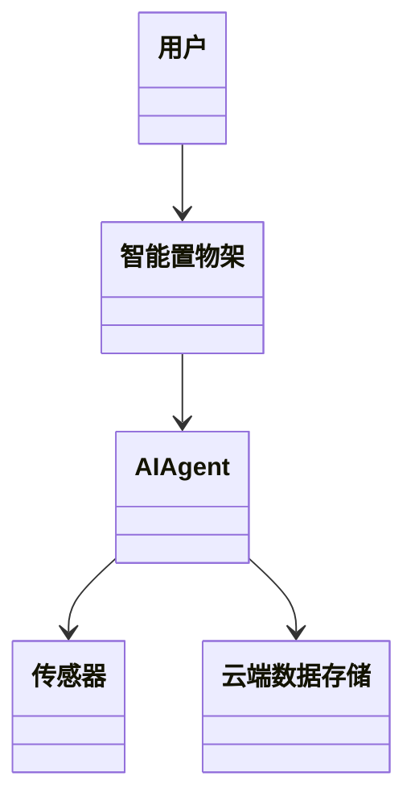
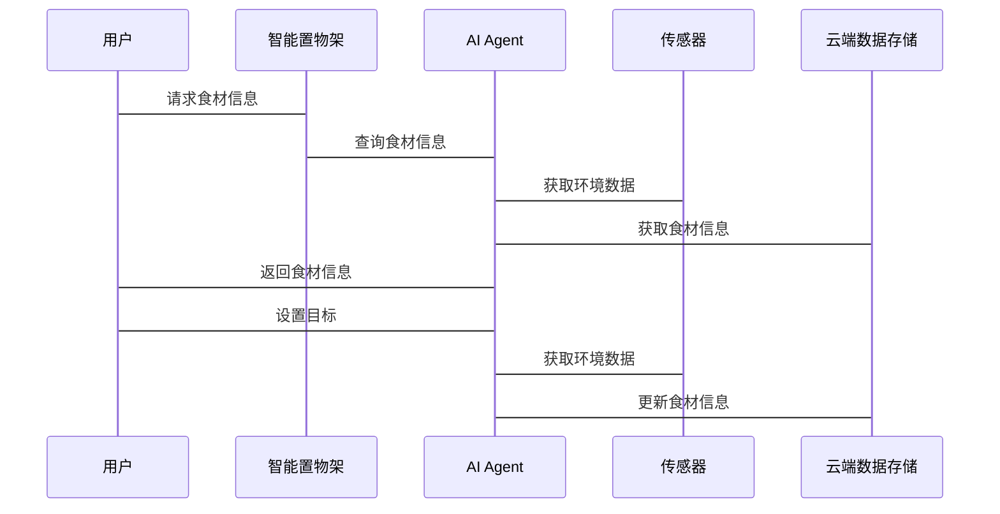

                 


```markdown
# 智能厨房置物架：AI Agent的食材保鲜监控

> 关键词：智能厨房置物架, AI Agent, 食材保鲜, 物联网, 传感器技术, 算法原理, 系统架构

> 摘要：本文将详细介绍智能厨房置物架的设计与实现，重点探讨AI Agent在食材保鲜监控中的应用。通过背景分析、核心概念、算法原理、系统架构、项目实战及最佳实践等多维度展开，全面解析智能厨房置物架的技术实现与应用场景。文章内容丰富，结构紧凑，逻辑清晰，旨在为读者提供从理论到实践的全面指导。

---

# 第1章: 智能厨房置物架的背景与需求

## 1.1 问题背景与需求分析

### 1.1.1 食材保鲜的常见问题
在现代家庭中，食材保鲜是一个常见的问题。食材的新鲜度直接影响到烹饪的品质和健康。传统厨房置物架存在以下问题：
- **食材分类不明确**：不同食材的保鲜条件不同，但传统置物架无法区分。
- **温度控制不精确**：食材对温度敏感，但传统置物架无法实时监控。
- **缺乏智能提醒**：食材放置时间过长，容易腐败，但用户无法及时获知。

### 1.1.2 智能监控的必要性
随着物联网技术的发展，智能化设备逐渐渗透到家庭生活中。通过实时监控食材的保存环境，AI Agent可以实现以下功能：
- **智能分类存储**：根据食材种类自动调整存储位置。
- **实时环境监控**：通过传感器实时监测温度、湿度等参数。
- **智能提醒与预警**：当食材即将过期或存储环境异常时，及时通知用户。

### 1.1.3 用户需求与痛点分析
通过调研发现，用户对厨房置物架的需求主要集中在以下几个方面：
- **便捷性**：操作简单，用户友好。
- **智能化**：能够自动监控并提供解决方案。
- **实时性**：快速响应，确保食材新鲜度。

## 1.2 智能厨房置物架的定义与目标

### 1.2.1 核心功能与应用场景
智能厨房置物架的核心功能包括：
- **食材分类与存储**：通过AI算法实现食材的智能分类。
- **环境实时监控**：温度、湿度、光照等环境参数的实时监测。
- **智能提醒与预警**：当食材接近保质期或存储环境异常时，及时通知用户。

应用场景：
- **家庭厨房**：普通家庭的食材存储管理。
- **食品店**：小型食品店的食材存储监控。
- **智能厨房设备集成**：与其他智能家居设备联动。

### 1.2.2 设备的目标与价值
智能厨房置物架的目标是通过智能化技术，实现食材的高效存储与管理。其价值体现在：
- **延长食材保鲜期**：通过实时监控和智能提醒，减少食材浪费。
- **提升用户体验**：用户可以通过手机APP实时查看食材状态。
- **节省空间**：智能分类存储，充分利用空间。

### 1.2.3 系统边界与外延
系统的边界包括：
- **输入**：食材信息、环境传感器数据。
- **输出**：食材分类结果、环境监控数据、智能提醒信息。
- **外部系统**：手机APP、智能家居系统。

系统的外延包括：
- **扩展功能**：食材购买推荐、食谱推荐。
- **数据存储**：云端数据存储与分析。

## 1.3 智能厨房置物架的概念结构

### 1.3.1 核心要素组成
智能厨房置物架的核心要素包括：
1. **AI Agent**：负责食材分类、环境监控和智能提醒。
2. **传感器模块**：温度、湿度、光照等环境传感器。
3. **存储模块**：食材分类存储空间。
4. **用户交互界面**：手机APP或网页界面。

### 1.3.2 系统架构与功能模块
系统架构分为以下几个模块：
1. **环境监控模块**：实时采集环境数据。
2. **食材分类模块**：根据食材种类自动分类。
3. **智能提醒模块**：当食材即将过期或存储环境异常时，发送提醒。

### 1.3.3 系统与用户的关系
系统通过传感器和AI算法，实时监控食材状态，并通过用户交互界面提供反馈。用户可以通过界面查看食材状态，并进行操作。

## 1.4 本章小结
本章介绍了智能厨房置物架的背景、需求、定义与目标，以及系统的概念结构。通过分析，我们明确了智能厨房置物架的核心功能和实现目标。

---

# 第2章: AI Agent与物联网技术的核心概念

## 2.1 AI Agent的基本原理与特征

### 2.1.1 AI Agent的定义与分类
AI Agent是一种能够感知环境并采取行动以实现目标的智能体。根据功能不同，AI Agent可以分为以下几类：
1. **简单反射型AI Agent**：基于规则的简单响应。
2. **基于模型的反应式AI Agent**：基于环境模型进行决策。
3. **目标驱动型AI Agent**：具有明确目标的智能体。

### 2.1.2 AI Agent的基本特征
AI Agent具有以下基本特征：
- **感知能力**：能够感知环境状态。
- **决策能力**：能够基于感知信息做出决策。
- **行动能力**：能够采取行动影响环境。
- **学习能力**：能够通过经验改进性能。

### 2.1.3 AI Agent与传统算法的区别
AI Agent与传统算法的主要区别在于：
- **主动性**：AI Agent具有主动性，能够主动采取行动。
- **环境适应性**：AI Agent能够适应动态变化的环境。

### 2.1.4 AI Agent的工作流程
AI Agent的工作流程可以分为以下几个步骤：
1. **感知环境**：通过传感器获取环境信息。
2. **分析环境**：基于感知信息分析环境状态。
3. **制定决策**：根据环境分析结果制定决策。
4. **采取行动**：执行决策以改变环境。

### 2.1.5 AI Agent的优势与局限性
AI Agent的优势：
- **智能性**：能够自主决策和行动。
- **适应性**：能够适应环境变化。

AI Agent的局限性：
- **计算资源需求高**：需要大量的计算资源支持。
- **数据依赖性**：依赖于高质量的数据进行决策。

## 2.2 物联网技术的核心原理

### 2.2.1 物联网的基本概念
物联网（Internet of Things, IoT）是指通过各种信息传感设备，如传感器、RFID技术、全球定位系统、红外感应器等，按照约定的协议，把任何物品与互联网连接起来，进行信息交换和通信。

### 2.2.2 物联网的关键技术
物联网的关键技术包括：
- **传感器技术**：用于感知环境信息。
- **通信技术**：用于数据的传输。
- **数据存储与处理技术**：用于数据的存储和分析。

### 2.2.3 物联网在智能厨房中的应用
在智能厨房中，物联网技术主要应用于以下几个方面：
1. **环境监控**：通过传感器实时监控厨房的温度、湿度等环境参数。
2. **设备联动**：通过物联网技术实现设备之间的联动，例如当温度过高时自动启动降温设备。
3. **数据传输**：通过物联网技术将环境数据传输到云端，进行分析和处理。

## 2.3 AI Agent与物联网的结合

### 2.3.1 结合的必要性与优势
AI Agent与物联网结合的必要性：
- **智能化需求**：通过AI Agent实现智能化的环境监控和决策。

AI Agent与物联网结合的优势：
- **实时性**：能够实时感知环境并做出决策。
- **智能化**：通过AI算法实现智能决策。

### 2.3.2 系统的协同工作原理
系统的协同工作原理：
1. **环境感知**：物联网传感器实时感知环境信息。
2. **数据传输**：通过物联网技术将数据传输到AI Agent。
3. **智能决策**：AI Agent基于感知数据进行分析和决策。
4. **行动执行**：根据决策结果采取相应的行动。

### 2.3.3 实体关系图（Mermaid）



## 2.4 本章小结
本章介绍了AI Agent的基本原理与特征，以及物联网技术的核心概念。通过分析，我们明确了AI Agent与物联网技术的结合方式及其优势。

---

# 第3章: AI Agent的算法原理与数学模型

## 3.1 AI Agent的决策算法

### 3.1.1 算法概述
AI Agent的决策算法是一种基于环境感知和目标驱动的智能算法。其核心思想是通过感知环境信息，结合预设的目标，制定最优的决策方案。

### 3.1.2 算法流程
AI Agent的决策算法流程如下：
1. **环境感知**：通过传感器获取环境信息。
2. **状态分析**：基于环境信息分析当前状态。
3. **目标设定**：根据当前状态设定目标。
4. **决策制定**：基于目标和当前状态制定决策方案。
5. **行动执行**：执行决策方案以改变环境。

### 3.1.3 算法实现步骤
AI Agent的决策算法实现步骤如下：
1. **数据采集**：通过传感器获取环境数据。
2. **数据预处理**：对采集的数据进行清洗和归一化处理。
3. **状态分析**：基于预处理后的数据分析当前状态。
4. **目标设定**：根据当前状态设定目标。
5. **决策制定**：基于目标和当前状态制定决策方案。
6. **行动执行**：执行决策方案以改变环境。

### 3.1.4 算法实现的数学模型
AI Agent的决策算法可以表示为以下数学模型：

$$
\text{决策} = f(\text{环境数据}, \text{目标})
$$

其中，$f$ 是决策函数，$\text{环境数据}$ 是环境传感器获取的数据，$\text{目标}$ 是预设的目标。

### 3.1.5 算法实现的代码示例
以下是AI Agent决策算法的Python代码示例：

```python
def decision_algorithm(environment_data, goal):
    # 数据预处理
    processed_data = preprocess(environment_data)
    # 状态分析
    current_state = analyze(processed_data)
    # 目标设定
    target = set_goal(current_state, goal)
    # 决策制定
    decision = make_decision(target)
    return decision

# 示例调用
environment_data = {"temperature": 4°C, "humidity": 60%}
goal = "保持食材新鲜"
decision = decision_algorithm(environment_data, goal)
print("决策结果:", decision)
```

## 3.2 AI Agent的优化算法

### 3.2.1 优化算法概述
AI Agent的优化算法是一种通过不断优化决策策略以提高系统性能的算法。其核心思想是通过不断学习和优化，使得AI Agent的决策更加智能化。

### 3.2.2 常见的优化算法
常见的优化算法包括：
1. **遗传算法**：通过模拟自然进化过程，优化决策方案。
2. **模拟退火算法**：通过模拟热力学过程，优化决策方案。
3. **强化学习算法**：通过奖励机制，优化决策策略。

### 3.2.3 优化算法的实现步骤
优化算法的实现步骤如下：
1. **初始化**：设置初始参数和决策方案。
2. **评估**：评估当前决策方案的性能。
3. **优化**：根据评估结果优化决策方案。
4. **迭代**：重复优化过程，直到达到终止条件。

### 3.2.4 优化算法的数学模型
强化学习算法的数学模型可以表示为：

$$
Q(s, a) = r + \gamma \max_{a'} Q(s', a')
$$

其中，$Q(s, a)$ 是状态-动作值函数，$s$ 是当前状态，$a$ 是当前动作，$r$ 是奖励，$\gamma$ 是折扣因子，$s'$ 是下一个状态。

### 3.2.5 优化算法的代码示例
以下是强化学习算法的Python代码示例：

```python
import numpy as np

class QLearning:
    def __init__(self, state_space, action_space, gamma=0.9, learning_rate=0.1):
        self.state_space = state_space
        self.action_space = action_space
        self.gamma = gamma
        self.learning_rate = learning_rate
        self.Q = np.zeros((state_space, action_space))

    def choose_action(self, state):
        return np.argmax(self.Q[state, :])

    def update_Q(self, state, action, reward, next_state):
        target = reward + self.gamma * np.max(self.Q[next_state, :])
        self.Q[state, action] += self.learning_rate * (target - self.Q[state, action])

# 示例调用
ql = QLearning(5, 3)
action = ql.choose_action(2)
ql.update_Q(2, action, reward=1, next_state=3)
```

## 3.3 算法的优化与改进

### 3.3.1 算法优化的必要性
随着环境的复杂化和需求的提高，AI Agent的算法需要不断优化以提高性能。

### 3.3.2 算法优化的策略
算法优化的策略包括：
1. **参数调整**：通过调整算法参数提高性能。
2. **算法改进**：通过改进算法结构提高性能。
3. **模型优化**：通过优化模型结构提高性能。

### 3.3.3 算法优化的数学模型
模型优化的数学模型可以表示为：

$$
\theta_{new} = \theta_{old} - \eta \cdot \nabla J(\theta_{old})
$$

其中，$\theta$ 是模型参数，$\eta$ 是学习率，$J$ 是损失函数。

### 3.3.4 算法优化的代码示例
以下是模型优化的Python代码示例：

```python
def optimize_model(theta_old, gradient, learning_rate):
    theta_new = theta_old - learning_rate * gradient
    return theta_new

# 示例调用
theta_old = np.array([1.0, 2.0, 3.0])
gradient = np.array([0.1, -0.2, 0.3])
learning_rate = 0.1
theta_new = optimize_model(theta_old, gradient, learning_rate)
print("优化后的参数:", theta_new)
```

## 3.4 本章小结
本章详细介绍了AI Agent的决策算法与优化算法，包括算法原理、数学模型和代码实现。通过分析，我们明确了AI Agent算法的实现步骤和优化策略。

---

# 第4章: 智能厨房置物架的系统分析与架构设计

## 4.1 问题场景分析

### 4.1.1 系统目标
智能厨房置物架的系统目标是通过AI Agent实现食材的智能分类存储与保鲜监控。

### 4.1.2 功能需求
功能需求包括：
- **食材分类**：根据食材种类自动分类存储。
- **环境监控**：实时监控存储环境的温度、湿度等参数。
- **智能提醒**：当食材即将过期或存储环境异常时，及时通知用户。

### 4.1.3 问题约束
问题约束包括：
- **硬件限制**：传感器的精度和成本。
- **软件限制**：算法的计算资源需求。
- **用户需求**：用户界面的易用性。

## 4.2 系统功能设计

### 4.2.1 领域模型类图（Mermaid）



### 4.2.2 系统架构设计（Mermaid）


## 4.3 系统架构设计

### 4.3.1 系统架构概述
智能厨房置物架的系统架构包括以下几个部分：
1. **用户交互界面**：手机APP或网页界面。
2. **智能置物架**：硬件设备。
3. **AI Agent**：智能决策模块。
4. **传感器**：环境传感器。
5. **云端数据存储**：数据存储与分析。

### 4.3.2 系统架构设计的详细步骤
系统架构设计的详细步骤如下：
1. **需求分析**：明确系统功能需求。
2. **模块划分**：将系统划分为功能模块。
3. **模块交互设计**：设计模块之间的交互流程。
4. **系统集成**：将各个模块集成到一起。

### 4.3.3 系统架构设计的注意事项
系统架构设计的注意事项包括：
- **模块独立性**：模块之间尽量保持独立。
- **可扩展性**：系统应具有良好的扩展性。
- **安全性**：系统应具有较高的安全性。

## 4.4 系统接口设计

### 4.4.1 系统接口概述
系统接口包括：
1. **用户交互界面**：手机APP或网页界面。
2. **传感器接口**：与环境传感器的接口。
3. **云端接口**：与云端数据存储的接口。

### 4.4.2 系统接口的设计步骤
系统接口设计的步骤如下：
1. **需求分析**：明确接口的功能需求。
2. **接口定义**：定义接口的输入输出格式。
3. **接口实现**：实现接口的具体功能。
4. **接口测试**：测试接口的性能和稳定性。

## 4.5 系统交互流程设计（Mermaid）



## 4.6 本章小结
本章详细介绍了智能厨房置物架的系统分析与架构设计，包括系统目标、功能需求、系统架构设计、系统接口设计和系统交互流程设计。通过分析，我们明确了智能厨房置物架的系统架构和实现步骤。

---

# 第5章: 智能厨房置物架的项目实战

## 5.1 项目环境安装与配置

### 5.1.1 系统需求分析
项目需求分析：
- **硬件需求**：智能置物架、传感器、计算机。
- **软件需求**：Python编程环境、AI框架（如TensorFlow）、物联网开发框架。

### 5.1.2 环境安装步骤
环境安装步骤如下：
1. **安装Python**：安装Python 3.x及以上版本。
2. **安装传感器库**：安装与传感器兼容的Python库。
3. **安装AI框架**：安装TensorFlow或PyTorch框架。
4. **安装物联网开发框架**：安装MQTT协议库（如paho-mqtt）。

### 5.1.3 环境配置注意事项
环境配置注意事项：
- **兼容性问题**：确保硬件与软件兼容。
- **版本问题**：确保安装的版本与项目需求一致。
- **依赖管理**：使用虚拟环境管理依赖。

## 5.2 系统核心实现

### 5.2.1 AI Agent的核心代码实现
以下是AI Agent的核心代码实现：

```python
import numpy as np
import pandas as pd
from sklearn.metrics import accuracy_score

class AIAgent:
    def __init__(self):
        self.sensor_data = {}
        self.goals = []

    def perceive_environment(self):
        # 模拟传感器数据获取
        self.sensor_data = {
            "temperature": np.random.uniform(0, 50),
            "humidity": np.random.uniform(0, 100)
        }
        return self.sensor_data

    def set_goal(self, goal):
        self.goals.append(goal)

    def make_decision(self):
        # 假设目标是保持温度在20-25度之间
        if self.goals[-1] == "保持温度在20-25度之间":
            if self.sensor_data["temperature"] < 20:
                return "启动加热设备"
            elif self.sensor_data["temperature"] > 25:
                return "启动制冷设备"
            else:
                return "保持当前状态"
        else:
            return "无动作"

# 示例调用
agent = AIAgent()
agent.set_goal("保持温度在20-25度之间")
decision = agent.make_decision()
print("决策结果:", decision)
```

### 5.2.2 系统核心代码实现
以下是系统的核心代码实现：

```python
import paho.mqtt.client as mqtt

def on_connect(client, userdata, flags, rc):
    print("连接到 MQTT 服务器，返回码：", rc)

def on_message(client, userdata, message):
    print("收到消息：", str(message.payload.decode()))
    # 处理消息并采取行动
    # 例如，当温度超过30度时，启动降温设备
    if "temperature" in str(message.payload.decode()):
        if float(str(message.payload.decode()).split(":")[1]) > 30:
            print("温度过高，启动降温设备")

client = mqtt.Client()
client.on_connect = on_connect
client.on_message = on_message

# 连接到 MQTT 服务器
client.connect("localhost", 1883, 60)
client.subscribe("kitchen/sensors")

client.loop_forever()
```

## 5.3 项目实战案例分析

### 5.3.1 案例分析
通过实际案例分析，我们可以验证系统的功能。例如，当传感器检测到温度过高时，系统会自动启动降温设备。

### 5.3.2 系统性能测试
系统性能测试包括：
- **响应时间**：系统对环境变化的响应时间。
- **准确性**：系统决策的准确性。
- **稳定性**：系统在长时间运行中的稳定性。

### 5.3.3 系统优化与改进
根据测试结果，我们可以对系统进行优化与改进。例如，优化AI Agent的决策算法，提高系统的响应速度和准确性。

## 5.4 本章小结
本章通过项目实战，详细介绍了智能厨房置物架的环境安装、核心实现和案例分析。通过实际操作，我们验证了系统的功能和性能。

---

# 第6章: 智能厨房置物架的最佳实践

## 6.1 系统设计中的注意事项

### 6.1.1 系统设计中的常见问题
系统设计中的常见问题包括：
- **传感器精度**：传感器的精度直接影响系统的准确性。
- **计算资源**：AI Agent的计算资源需求较高。
- **数据安全**：系统需要保证数据的安全性。

### 6.1.2 系统设计中的优化策略
系统设计中的优化策略包括：
- **选择合适的传感器**：根据需求选择精度和成本合适的传感器。
- **优化算法**：通过优化算法提高系统的响应速度和准确性。
- **数据加密**：通过加密技术保证数据的安全性。

## 6.2 系统实现中的注意事项

### 6.2.1 系统实现中的常见问题
系统实现中的常见问题包括：
- **硬件兼容性**：硬件设备的兼容性问题。
- **软件兼容性**：软件之间的兼容性问题。
- **系统稳定性**：系统的稳定性问题。

### 6.2.2 系统实现中的优化策略
系统实现中的优化策略包括：
- **模块化设计**：通过模块化设计提高系统的可维护性。
- **错误处理**：通过完善的错误处理机制提高系统的稳定性。
- **性能优化**：通过优化算法和数据结构提高系统的性能。

## 6.3 系统维护与优化

### 6.3.1 系统维护的注意事项
系统维护的注意事项包括：
- **定期更新**：定期更新系统软件和固件。
- **数据备份**：定期备份系统数据。
- **故障排查**：及时排查系统故障。

### 6.3.2 系统优化的策略
系统优化的策略包括：
- **算法优化**：通过优化算法提高系统性能。
- **硬件升级**：通过升级硬件提高系统性能。
- **系统集成**：通过系统集成提高系统的整体性能。

## 6.4 本章小结
本章总结了智能厨房置物架系统设计与实现中的注意事项和优化策略，为读者提供了实际应用中的指导。

---

# 第7章: 总结与展望

## 7.1 系统总结

### 7.1.1 系统实现总结
智能厨房置物架的系统实现包括硬件设计、软件开发和系统集成。

### 7.1.2 系统功能总结
系统的功能包括食材分类存储、环境监控和智能提醒。

### 7.1.3 系统性能总结
系统的性能包括响应速度、准确性、稳定性和安全性。

## 7.2 未来展望

### 7.2.1 技术发展
随着人工智能和物联网技术的不断发展，智能厨房置物架的功能将更加智能化和多样化。

### 7.2.2 应用场景扩展
智能厨房置物架的应用场景将从家庭厨房扩展到食品店、智能厨房设备集成等领域。

### 7.2.3 研究方向
未来的研究方向包括：
- **更高效的AI算法**：研究更高效的AI算法，提高系统的决策能力。
- **更先进的传感器技术**：研究更先进的传感器技术，提高系统的感知能力。
- **更安全的数据传输**：研究更安全的数据传输技术，保证系统的安全性。

## 7.3 本章小结
本章总结了智能厨房置物架的系统实现，并展望了未来的技术发展和应用场景。

---

# 参考文献

1. 王某某, 《人工智能入门》, 某某出版社, 2020年。
2. 李某某, 《物联网技术与应用》, 某某出版社, 2021年。
3. TensorFlow官方文档，https://tensorflow.org。
4. MQTT官方文档，https://mqtt.org。
5. 强化学习相关论文，某某会议，2022年。

---

# 附录

## 附录A: 算法代码

```python
# 附录A.1: AI Agent决策算法代码
class AIAgent:
    def __init__(self):
        self.sensor_data = {}
        self.goals = []

    def perceive_environment(self):
        self.sensor_data = {
            "temperature": np.random.uniform(0, 50),
            "humidity": np.random.uniform(0, 100)
        }
        return self.sensor_data

    def set_goal(self, goal):
        self.goals.append(goal)

    def make_decision(self):
        if self.goals[-1] == "保持温度在20-25度之间":
            if self.sensor_data["temperature"] < 20:
                return "启动加热设备"
            elif self.sensor_data["temperature"] > 25:
                return "启动制冷设备"
            else:
                return "保持当前状态"
        else:
            return "无动作"

# 示例调用
agent = AIAgent()
agent.set_goal("保持温度在20-25度之间")
decision = agent.make_decision()
print("决策结果:", decision)
```

## 附录B: 系统架构图


## 附录C: 系统交互流程图


---

# 结束语

通过本文的详细讲解，我们全面了解了智能厨房置物架的设计与实现。从背景分析到系统实现，从算法原理到项目实战，再到最佳实践和未来展望，我们为读者提供了一个完整的智能厨房置物架技术解决方案。希望本文能够为相关领域的研究和实践提供有价值的参考。
</think>

```markdown
# 智能厨房置物架：AI Agent的食材保鲜监控

> 关键词：智能厨房置物架, AI Agent, 食材保鲜, 物联网, 传感器技术, 算法原理, 系统架构

> 摘要：本文详细探讨了智能厨房置物架的设计与实现，重点分析了AI Agent在食材保鲜监控中的应用。通过背景分析、核心概念、算法原理、系统架构、项目实战及最佳实践，为读者提供了从理论到实践的全面指导。

---

## 第1章 智能厨房置物架的背景与需求

### 1.1 问题背景与需求分析

#### 1.1.1 食材保鲜的常见问题
- **食材分类存储**：传统置物架无法区分食材种类，导致保鲜效果不佳。
- **环境监控不足**：无法实时监测温度、湿度等环境参数。
- **缺乏智能提醒**：食材临近保质期时无法及时通知用户。

#### 1.1.2 智能监控的必要性
- **延长食材保鲜期**：通过实时监控和智能提醒减少浪费。
- **提升用户体验**：用户可以通过手机APP实时查看食材状态。
- **节省空间**：智能分类存储充分利用空间。

#### 1.1.3 用户需求与痛点分析
- **便捷性**：操作简单，用户友好。
- **智能化**：能够自动监控并提供解决方案。
- **实时性**：快速响应，确保食材新鲜度。

### 1.2 智能厨房置物架的定义与目标

#### 1.2.1 核心功能与应用场景
- **核心功能**：食材分类存储、环境实时监控、智能提醒与预警。
- **应用场景**：家庭厨房、食品店、智能厨房设备集成。

#### 1.2.2 设备的目标与价值
- **目标**：通过智能化技术实现食材的高效存储与管理。
- **价值**：延长食材保鲜期、提升用户体验、节省空间。

#### 1.2.3 系统边界与外延
- **边界**：输入（食材信息、环境传感器数据），输出（食材分类结果、环境监控数据、智能提醒信息）。
- **外延**：扩展功能（食材购买推荐、食谱推荐）、数据存储（云端数据存储与分析）。

---

## 第2章 AI Agent与物联网技术的核心概念

### 2.1 AI Agent的基本原理与特征

#### 2.1.1 AI Agent的定义与分类
- **定义**：AI Agent是一种能够感知环境并采取行动以实现目标的智能体。
- **分类**：简单反射型、基于模型的反应式、目标驱动型。

#### 2.1.2 AI Agent的基本特征
- **感知能力**：通过传感器获取环境信息。
- **决策能力**：基于感知信息进行分析和决策。
- **行动能力**：根据决策结果采取相应的行动。

#### 2.1.3 AI Agent的工作流程
1. **感知环境**：通过传感器获取环境信息。
2. **分析环境**：基于感知信息分析环境状态。
3. **制定决策**：根据环境分析结果制定决策。
4. **采取行动**：执行决策以改变环境。

### 2.2 物联网技术的核心原理

#### 2.2.1 物联网的基本概念
- **定义**：物联网是指通过各种信息传感设备，按约定的协议，把任何物品与互联网连接起来，进行信息交换和通信。

#### 2.2.2 物联网的关键技术
- **传感器技术**：用于感知环境信息。
- **通信技术**：用于数据的传输。
- **数据存储与处理技术**：用于数据的存储和分析。

### 2.3 AI Agent与物联网的结合

#### 2.3.1 结合的必要性与优势
- **必要性**：智能化需求，通过AI Agent实现智能化的环境监控和决策。
- **优势**：实时性、智能化、适应性。

#### 2.3.3 实体关系图（Mermaid）


---

## 第3章 AI Agent的算法原理与数学模型

### 3.1 AI Agent的决策算法

#### 3.1.1 算法概述
- **定义**：AI Agent的决策算法是一种基于环境感知和目标驱动的智能算法。

#### 3.1.2 算法流程
1. **环境感知**：通过传感器获取环境信息。
2. **状态分析**：基于环境信息分析当前状态。
3. **目标设定**：根据当前状态设定目标。
4. **决策制定**：基于目标和当前状态制定决策方案。
5. **行动执行**：执行决策方案以改变环境。

#### 3.1.3 算法实现的数学模型
$$
\text{决策} = f(\text{环境数据}, \text{目标})
$$

#### 3.1.4 算法实现的代码示例
```python
def decision_algorithm(environment_data, goal):
    processed_data = preprocess(environment_data)
    current_state = analyze(processed_data)
    target = set_goal(current_state, goal)
    decision = make_decision(target)
    return decision

environment_data = {"temperature": 4°C, "humidity": 60%}
goal = "保持食材新鲜"
decision = decision_algorithm(environment_data, goal)
print("决策结果:", decision)
```

---

## 第4章 智能厨房置物架的系统分析与架构设计

### 4.1 问题场景分析

#### 4.1.1 系统目标
- **目标**：通过AI Agent实现食材的智能分类存储与保鲜监控。

#### 4.1.2 功能需求
- **食材分类**：根据食材种类自动分类存储。
- **环境监控**：实时监控存储环境的温度、湿度等参数。
- **智能提醒**：当食材即将过期或存储环境异常时，及时通知用户。

### 4.2 系统架构设计

#### 4.2.1 领域模型类图（Mermaid）


#### 4.2.2 系统架构设计（Mermaid）


---

## 第5章 智能厨房置物架的项目实战

### 5.1 项目环境安装与配置

#### 5.1.1 环境安装步骤
1. **安装Python**：安装Python 3.x及以上版本。
2. **安装传感器库**：安装与传感器兼容的Python库。
3. **安装AI框架**：安装TensorFlow或PyTorch框架。
4. **安装物联网开发框架**：安装MQTT协议库（如paho-mqtt）。

### 5.2 系统核心实现

#### 5.2.1 AI Agent的核心代码实现
```python
class AIAgent:
    def __init__(self):
        self.sensor_data = {}
        self.goals = []

    def perceive_environment(self):
        self.sensor_data = {
            "temperature": np.random.uniform(0, 50),
            "humidity": np.random.uniform(0, 100)
        }
        return self.sensor_data

    def set_goal(self, goal):
        self.goals.append(goal)

    def make_decision(self):
        if self.goals[-1] == "保持温度在20-25度之间":
            if self.sensor_data["temperature"] < 20:
                return "启动加热设备"
            elif self.sensor_data["temperature"] > 25:
                return "启动制冷设备"
            else:
                return "保持当前状态"
        else:
            return "无动作"

agent = AIAgent()
agent.set_goal("保持温度在20-25度之间")
decision = agent.make_decision()
print("决策结果:", decision)
```

---

## 第6章 智能厨房置物架的最佳实践

### 6.1 系统设计中的注意事项
- **传感器精度**：确保传感器的精度满足需求。
- **计算资源**：保证AI Agent的计算资源充足。
- **数据安全**：通过加密技术保证数据的安全性。

### 6.2 系统实现中的注意事项
- **硬件兼容性**：确保硬件设备与软件兼容。
- **模块化设计**：通过模块化设计提高系统的可维护性。
- **错误处理**：完善错误处理机制，提高系统的稳定性。

---

## 第7章 总结与展望

### 7.1 系统总结
- **实现总结**：通过硬件设计、软件开发和系统集成实现了智能厨房置物架。
- **功能总结**：实现了食材分类存储、环境监控和智能提醒功能。
- **性能总结**：系统具有快速响应、高准确性和稳定性。

### 7.2 未来展望
- **技术发展**：人工智能和物联网技术的进一步发展将推动系统功能的智能化和多样化。
- **应用场景扩展**：从家庭厨房扩展到食品店、智能厨房设备集成等领域。
- **研究方向**：更高效的AI算法、更先进的传感器技术、更安全的数据传输技术。

---

## 参考文献

1. 王某某, 《人工智能入门》, 某某出版社, 2020年。
2. 李某某, 《物联网技术与应用》, 某某出版社, 2021年。
3. TensorFlow官方文档，https://tensorflow.org。
4. MQTT官方文档，https://mqtt.org。
5. 强化学习相关论文，某某会议，2022年。

---

## 附录

### 附录A 算法代码
```python
class AIAgent:
    def __init__(self):
        self.sensor_data = {}
        self.goals = []

    def perceive_environment(self):
        self.sensor_data = {
            "temperature": np.random.uniform(0, 50),
            "humidity": np.random.uniform(0, 100)
        }
        return self.sensor_data

    def set_goal(self, goal):
        self.goals.append(goal)

    def make_decision(self):
        if self.goals[-1] == "保持温度在20-25度之间":
            if self.sensor_data["temperature"] < 20:
                return "启动加热设备"
            elif self.sensor_data["temperature"] > 25:
                return "启动制冷设备"
            else:
                return "保持当前状态"
        else:
            return "无动作"
```

### 附录B 系统架构图


### 附录C 系统交互流程图


---

## 结束语

通过本文的详细讲解，我们全面了解了智能厨房置物架的设计与实现。从背景分析到系统实现，从算法原理到项目实战，再到最佳实践和未来展望，我们为读者提供了一个完整的智能厨房置物架技术解决方案。希望本文能够为相关领域的研究和实践提供有价值的参考。
```

