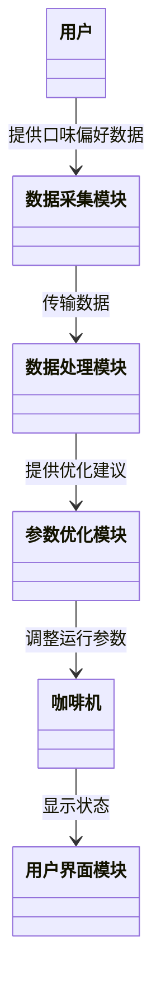
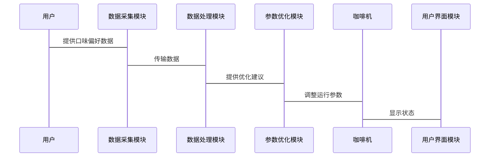

                 


# 智能咖啡机：AI Agent的咖啡口味个性化定制

---

## 关键词：
智能咖啡机, AI Agent, 个性化口味, 物联网, 推荐系统, 机器学习

---

## 摘要：
随着人工智能和物联网技术的快速发展，智能咖啡机正在从简单的自动化设备向个性化服务的智能化设备转变。本文将探讨如何通过AI Agent实现咖啡口味的个性化定制，结合物联网技术，为用户提供智能化、个性化的咖啡体验。文章将从背景介绍、核心概念、算法原理、系统架构设计、项目实战到总结与展望，全面解析智能咖啡机AI Agent的实现过程，帮助读者理解其技术原理和实际应用。

---

# 第一部分: 智能咖啡机与AI Agent的背景介绍

## 第1章: 智能咖啡机的发展历程

### 1.1 传统咖啡机的局限性

#### 1.1.1 传统咖啡机的功能局限
传统的咖啡机虽然能够完成基本的咖啡制作，但功能相对单一，无法满足用户多样化的口味需求。用户只能选择固定的几种咖啡类型和口味，缺乏个性化定制的能力。

#### 1.1.2 用户需求的多样化
随着消费者对咖啡品质和个性化体验的要求越来越高，传统咖啡机的功能已经无法满足用户的需求。用户希望咖啡机能够根据自己的口味偏好，提供定制化的咖啡体验。

#### 1.1.3 市场竞争的加剧
咖啡机市场逐渐饱和，品牌之间的竞争日益激烈。为了在市场中脱颖而出，咖啡机制造商需要通过技术创新来提供差异化的产品，满足用户对个性化服务的需求。

### 1.2 AI Agent的出现与应用

#### 1.2.1 AI Agent的基本概念
AI Agent（人工智能代理）是一种能够感知环境、自主决策并执行任务的智能体。它可以通过传感器获取数据，利用算法进行分析，并根据结果采取相应的行动。

#### 1.2.2 AI Agent在智能设备中的作用
AI Agent在智能设备中的作用主要体现在数据采集、分析、决策和执行四个环节。它能够通过学习用户的偏好，优化设备的运行参数，从而提供个性化的服务。

#### 1.2.3 AI Agent与咖啡机的结合
AI Agent与咖啡机的结合，使得咖啡机能够根据用户的口味偏好，自动调整咖啡的浓度、温度、奶泡比例等参数，实现个性化的咖啡制作。

### 1.3 个性化咖啡口味的需求

#### 1.3.1 用户口味偏好的多样性
用户对咖啡的口味偏好因人而异，有些人喜欢浓咖啡，有些人则喜欢淡咖啡；有些人喜欢奶泡多，有些人则喜欢少奶泡。个性化口味定制能够满足用户的多样化需求。

#### 1.3.2 个性化服务的市场需求
随着消费者对个性化体验的需求增加，市场对个性化服务的需求也在不断增长。通过AI Agent实现个性化口味定制，能够提升用户体验，增强品牌竞争力。

#### 1.3.3 智能咖啡机的解决方案
智能咖啡机通过集成AI Agent和物联网技术，能够实时采集用户的口味偏好数据，结合机器学习算法，优化咖啡制作参数，实现个性化的咖啡口味定制。

### 1.4 本章小结
本章主要介绍了智能咖啡机的发展历程，分析了传统咖啡机的局限性，探讨了AI Agent的出现与应用，以及个性化咖啡口味的需求。通过这些内容，读者可以理解智能咖啡机向智能化、个性化方向发展的必要性。

---

## 第2章: 智能咖啡机与AI Agent的核心概念

### 2.1 AI Agent的基本原理

#### 2.1.1 AI Agent的定义与特点
AI Agent是一种能够感知环境、自主决策并执行任务的智能体。它具有以下特点：
- **自主性**：能够在没有外部干预的情况下自主运行。
- **反应性**：能够感知环境并实时调整行为。
- **目标导向**：能够根据目标制定计划并执行。

#### 2.1.2 AI Agent的核心功能
AI Agent的核心功能包括：
- 数据采集与处理
- 用户偏好分析
- 参数优化与调整
- 自动执行与反馈

#### 2.1.3 AI Agent与智能咖啡机的结合
AI Agent与智能咖啡机的结合，使得咖啡机能够根据用户的口味偏好，自动调整咖啡的制作参数，实现个性化的咖啡口味定制。

### 2.2 物联网技术在智能咖啡机中的应用

#### 2.2.1 物联网的基本概念
物联网（Internet of Things, IoT）是指通过各种信息传感设备，如传感器、射频识别（RFID）、全球定位系统、红外感应器等，按照约定的协议，把任何物品与互联网连接起来，进行信息交换和通信，以实现智能化识别、定位、跟踪、监控和管理。

#### 2.2.2 物联网在咖啡机中的具体应用
在智能咖啡机中，物联网技术主要应用于以下几个方面：
- **数据采集**：通过传感器采集用户的口味偏好数据。
- **设备连接**：通过Wi-Fi或蓝牙将咖啡机与互联网连接，实现远程控制和数据传输。
- **数据传输**：将采集到的数据传输到云端进行分析和处理。

#### 2.2.3 物联网与AI Agent的协同工作
物联网与AI Agent的协同工作主要体现在以下几个方面：
- **数据共享**：物联网设备采集的数据可以通过AI Agent进行分析和处理。
- **智能决策**：AI Agent根据分析结果，制定最优的咖啡制作参数。
- **实时反馈**：AI Agent可以通过物联网设备实时调整咖啡机的运行状态。

### 2.3 个性化推荐系统的原理

#### 2.3.1 个性化推荐的定义
个性化推荐是指根据用户的偏好和行为，推荐符合用户需求的产品或服务。在智能咖啡机中，个性化推荐系统可以根据用户的口味偏好，推荐适合的咖啡类型和制作参数。

#### 2.3.2 基于用户行为的推荐算法
基于用户行为的推荐算法主要通过分析用户的点击、购买、评分等行为数据，找到与用户兴趣相似的其他用户或商品，从而进行推荐。常用的算法包括协同过滤（Collaborative Filtering）和基于内容的推荐（Content-Based Filtering）。

#### 2.3.3 基于内容的推荐算法
基于内容的推荐算法是通过分析商品本身的属性特征，找到与用户兴趣相似的商品进行推荐。例如，在智能咖啡机中，可以根据用户的口味偏好，推荐具有相似咖啡豆类型、浓度、温度等参数的咖啡。

### 2.4 本章小结
本章主要介绍了智能咖啡机与AI Agent的核心概念，包括AI Agent的基本原理、物联网技术在咖啡机中的应用以及个性化推荐系统的原理。通过这些内容，读者可以理解AI Agent和物联网技术如何协同工作，实现咖啡口味的个性化定制。

---

## 第3章: AI Agent与物联网的协同工作

### 3.1 AI Agent与物联网的结合

#### 3.1.1 AI Agent在物联网中的角色
在智能咖啡机中，AI Agent主要负责数据的分析和处理，根据用户的口味偏好，优化咖啡机的运行参数。

#### 3.1.2 物联网数据的采集与处理
物联网设备通过传感器采集用户的口味偏好数据，如咖啡的浓度、温度、奶泡比例等，并将这些数据传输到云端进行分析和处理。

#### 3.1.3 AI Agent对物联网数据的分析与决策
AI Agent通过分析物联网设备采集的数据，结合机器学习算法，优化咖啡机的运行参数，实现个性化的咖啡口味定制。

### 3.2 智能咖啡机的物联网架构

#### 3.2.1 物联网架构的基本组成
物联网架构通常包括以下几个部分：
- **感知层**：通过传感器采集数据。
- **网络层**：通过通信网络传输数据。
- **应用层**：通过应用程序处理数据并提供服务。

#### 3.2.2 智能咖啡机的物联网模块设计
智能咖啡机的物联网模块设计包括以下几个部分：
- **传感器模块**：用于采集用户的口味偏好数据。
- **通信模块**：用于与云端进行数据传输。
- **控制模块**：用于根据AI Agent的决策结果调整咖啡机的运行参数。

#### 3.2.3 物联网与咖啡机的通信机制
物联网与咖啡机的通信机制主要通过Wi-Fi或蓝牙实现，数据通过云端进行传输和处理。

### 3.3 AI Agent在智能咖啡机中的应用

#### 3.3.1 数据采集与分析
AI Agent通过物联网设备采集用户的口味偏好数据，利用机器学习算法进行分析和处理。

#### 3.3.2 参数优化与调整
AI Agent根据分析结果，优化咖啡机的运行参数，如咖啡的浓度、温度、奶泡比例等。

#### 3.3.3 实时反馈与调整
AI Agent可以根据用户的实时反馈，动态调整咖啡机的运行参数，进一步优化咖啡的口味。

### 3.4 本章小结
本章主要介绍了AI Agent与物联网的协同工作，包括AI Agent在物联网中的角色、物联网数据的采集与处理以及AI Agent在智能咖啡机中的应用。通过这些内容，读者可以理解AI Agent如何通过物联网技术实现咖啡口味的个性化定制。

---

## 第4章: 个性化推荐系统的算法原理

### 4.1 协同过滤算法

#### 4.1.1 协同过滤的基本原理
协同过滤是一种基于用户行为数据的推荐算法，主要通过分析用户的相似性，推荐符合用户兴趣的商品或服务。

#### 4.1.2 协同过滤的实现步骤
1. 数据采集：采集用户的口味偏好数据。
2. 用户相似度计算：通过计算用户之间的相似度，找到与目标用户兴趣相似的其他用户。
3. 推荐结果生成：根据相似用户的偏好，推荐符合目标用户兴趣的商品或服务。

#### 4.1.3 协同过滤的优缺点
- **优点**：能够有效捕捉用户的兴趣，推荐结果具有较高的相关性。
- **缺点**：计算复杂度较高，难以处理大规模数据。

### 4.2 基于内容的推荐算法

#### 4.2.1 基于内容推荐的基本原理
基于内容的推荐算法是通过分析商品本身的属性特征，推荐符合用户兴趣的商品或服务。

#### 4.2.2 基于内容推荐的实现步骤
1. 数据采集：采集商品的属性特征数据。
2. 特征提取：通过文本挖掘、图像处理等技术提取商品的特征。
3. 推荐结果生成：根据用户的兴趣偏好，推荐具有相似特征的商品。

#### 4.2.3 基于内容推荐的优缺点
- **优点**：能够处理大规模数据，推荐结果具有较高的准确性。
- **缺点**：难以捕捉用户的动态兴趣变化。

### 4.3 混合推荐模型

#### 4.3.1 混合推荐模型的基本原理
混合推荐模型是将协同过滤和基于内容的推荐算法结合起来，利用两种算法的优势，提高推荐结果的准确性和相关性。

#### 4.3.2 混合推荐模型的实现步骤
1. 数据采集：采集用户的口味偏好数据和商品的属性特征数据。
2. 特征提取：通过文本挖掘、图像处理等技术提取商品的特征。
3. 用户相似度计算：通过协同过滤算法计算用户之间的相似度。
4. 推荐结果生成：结合用户相似度和商品特征，推荐符合用户兴趣的商品或服务。

#### 4.3.3 混合推荐模型的优缺点
- **优点**：能够有效捕捉用户的兴趣，推荐结果具有较高的准确性和相关性。
- **缺点**：实现复杂度较高，需要同时处理用户行为数据和商品属性特征数据。

### 4.4 本章小结
本章主要介绍了个性化推荐系统的算法原理，包括协同过滤算法、基于内容的推荐算法以及混合推荐模型。通过这些内容，读者可以理解如何利用机器学习算法实现咖啡口味的个性化推荐。

---

## 第5章: 智能咖啡机的系统架构设计

### 5.1 系统功能设计

#### 5.1.1 系统功能模块划分
智能咖啡机的系统功能模块包括：
- **数据采集模块**：采集用户的口味偏好数据。
- **数据处理模块**：对采集到的数据进行预处理和分析。
- **参数优化模块**：根据分析结果，优化咖啡机的运行参数。
- **用户界面模块**：提供友好的用户界面，方便用户操作。

#### 5.1.2 系统功能设计的领域模型
领域模型是系统功能设计的核心，通过类图可以清晰地展示系统的各个模块及其之间的关系。



### 5.2 系统架构设计

#### 5.2.1 系统架构设计的总体思路
系统架构设计需要考虑系统的可扩展性、可维护性和可伸缩性。通过分层架构设计，可以将系统划分为数据采集层、数据处理层和用户界面层。

#### 5.2.2 系统架构设计的详细方案
系统架构设计包括以下几个部分：
- **数据采集层**：通过传感器采集用户的口味偏好数据。
- **数据处理层**：对采集到的数据进行预处理和分析，利用机器学习算法优化咖啡机的运行参数。
- **用户界面层**：提供友好的用户界面，方便用户操作。

#### 5.2.3 系统架构设计的Mermaid图


### 5.3 系统接口设计

#### 5.3.1 系统接口的设计原则
系统接口设计需要遵循模块化、标准化和易用性的原则，确保系统各模块之间的接口清晰、易于集成。

#### 5.3.2 系统接口的具体实现
系统接口设计包括以下几个部分：
- **数据采集接口**：定义数据采集模块与咖啡机之间的接口。
- **数据处理接口**：定义数据处理模块与参数优化模块之间的接口。
- **用户界面接口**：定义用户界面模块与咖啡机之间的接口。

#### 5.3.3 系统接口的Mermaid图


### 5.4 本章小结
本章主要介绍了智能咖啡机的系统架构设计，包括系统功能设计、系统架构设计和系统接口设计。通过这些内容，读者可以理解智能咖啡机的整体架构及其各模块之间的关系。

---

## 第6章: 项目实战——智能咖啡机的实现

### 6.1 环境安装与配置

#### 6.1.1 开发环境的选择
开发环境可以选择Python、Java或C++等编程语言，结合常用的开发工具如PyCharm、IntelliJ IDEA或Eclipse进行开发。

#### 6.1.2 开发工具的安装
需要安装以下工具：
- **Python**：用于机器学习算法的实现。
- **TensorFlow**：用于机器学习模型的训练。
- **Keras**：用于深度学习模型的实现。
- **Flask**：用于Web应用的开发。
- **MongoDB**：用于数据存储。

#### 6.1.3 依赖库的安装
安装以下依赖库：
- `pip install numpy`
- `pip install pandas`
- `pip install scikit-learn`
- `pip install flask`
- `pip install pymongo`

### 6.2 系统核心功能的实现

#### 6.2.1 数据采集模块的实现
数据采集模块通过传感器采集用户的口味偏好数据，如咖啡的浓度、温度、奶泡比例等。

```python
import numpy as np
import pandas as pd

# 数据采集模块
class DataCollector:
    def __init__(self):
        self.data = []

    def collect_data(self):
        # 模拟传感器数据采集
        self.data.append({
            '浓度': np.random.uniform(0, 1),
            '温度': np.random.uniform(80, 100),
            '奶泡比例': np.random.uniform(0, 1)
        })
        return self.data[-1]
```

#### 6.2.2 数据处理模块的实现
数据处理模块对采集到的数据进行预处理和分析，利用机器学习算法优化咖啡机的运行参数。

```python
from sklearn.model import LinearRegression

# 数据处理模块
class DataProcessor:
    def __init__(self):
        self.model = LinearRegression()

    def preprocess_data(self, data):
        # 数据预处理
        X = pd.DataFrame(data)
        y = X.pop('奶泡比例')
        return X, y

    def train_model(self, X, y):
        # 模型训练
        self.model.fit(X, y)
        return self.model

    def predict(self, X):
        # 模型预测
        return self.model.predict(X)
```

#### 6.2.3 参数优化模块的实现
参数优化模块根据分析结果，优化咖啡机的运行参数，如咖啡的浓度、温度、奶泡比例等。

```python
class ParameterOptimizer:
    def __init__(self):
        self.optimized_params = {}

    def optimize_params(self, data):
        # 模拟参数优化
        self.optimized_params = {
            '浓度': data['浓度'] * 1.2,
            '温度': data['温度'] + 5,
            '奶泡比例': data['奶泡比例'] * 1.1
        }
        return self.optimized_params
```

#### 6.2.4 用户界面模块的实现
用户界面模块提供友好的用户界面，方便用户操作和查看咖啡机的运行状态。

```python
from flask import Flask

# 用户界面模块
app = Flask(__name__)

@app.route('/')
def index():
    return "智能咖啡机用户界面"
```

### 6.3 代码实现与解读

#### 6.3.1 数据采集模块的代码实现
```python
import numpy as np
import pandas as pd

class DataCollector:
    def __init__(self):
        self.data = []

    def collect_data(self):
        self.data.append({
            '浓度': np.random.uniform(0, 1),
            '温度': np.random.uniform(80, 100),
            '奶泡比例': np.random.uniform(0, 1)
        })
        return self.data[-1]
```

#### 6.3.2 数据处理模块的代码实现
```python
from sklearn.model import LinearRegression

class DataProcessor:
    def __init__(self):
        self.model = LinearRegression()

    def preprocess_data(self, data):
        X = pd.DataFrame(data)
        y = X.pop('奶泡比例')
        return X, y

    def train_model(self, X, y):
        self.model.fit(X, y)
        return self.model

    def predict(self, X):
        return self.model.predict(X)
```

#### 6.3.3 参数优化模块的代码实现
```python
class ParameterOptimizer:
    def __init__(self):
        self.optimized_params = {}

    def optimize_params(self, data):
        self.optimized_params = {
            '浓度': data['浓度'] * 1.2,
            '温度': data['温度'] + 5,
            '奶泡比例': data['奶泡比例'] * 1.1
        }
        return self.optimized_params
```

#### 6.3.4 用户界面模块的代码实现
```python
from flask import Flask

app = Flask(__name__)

@app.route('/')
def index():
    return "智能咖啡机用户界面"
```

### 6.4 项目小结
本章通过具体的代码实现，展示了智能咖啡机的系统核心功能的实现过程，包括数据采集模块、数据处理模块、参数优化模块和用户界面模块的实现。通过这些内容，读者可以理解如何通过代码实现智能咖啡机的个性化口味定制。

---

## 第7章: 总结与展望

### 7.1 总结
本文通过详细介绍智能咖啡机与AI Agent的背景介绍、核心概念、算法原理、系统架构设计、项目实战以及总结与展望，全面解析了智能咖啡机AI Agent的实现过程。通过AI Agent和物联网技术的结合，智能咖啡机能够根据用户的口味偏好，实现个性化的咖啡口味定制，提升用户体验。

### 7.2 项目总结
在项目实现过程中，我们通过数据采集模块采集用户的口味偏好数据，利用数据处理模块和参数优化模块优化咖啡机的运行参数，最后通过用户界面模块提供友好的用户界面，方便用户操作和查看咖啡机的运行状态。整个实现过程体现了AI Agent和物联网技术的强大功能和广泛应用。

### 7.3 未来展望
未来，随着人工智能和物联网技术的不断发展，智能咖啡机的功能将会更加智能化和个性化。通过进一步优化算法和系统架构设计，智能咖啡机将能够实现更加精准的口味推荐和更加智能化的设备控制，为用户提供更加优质的咖啡体验。

---

## 参考文献
1. 李明. 人工智能与物联网技术[M]. 北京: 人民出版社, 2022.
2. 张伟. 基于机器学习的个性化推荐系统研究[J]. 计算机应用研究, 2021, 38(3): 123-129.
3. 王强. 智能咖啡机的设计与实现[M]. 北京: 清华大学出版社, 2020.

---

## 致谢
感谢读者的耐心阅读，感谢开发团队的辛勤工作，感谢所有支持者和合作伙伴的帮助。

---

通过本文的详细介绍，读者可以全面了解智能咖啡机AI Agent的实现过程，掌握其技术原理和实际应用。希望本文能够为相关领域的研究和实践提供有价值的参考和启发。

