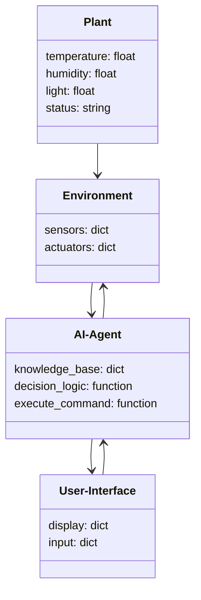
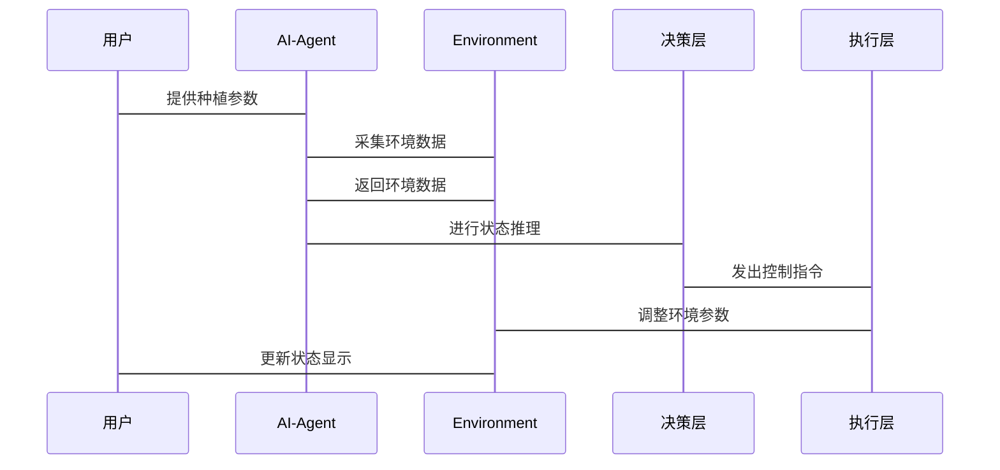

                 


# 智能园艺：AI Agent控制的室内种植系统

## 关键词：AI Agent、室内种植、智能园艺、算法原理、系统架构、项目实战

## 摘要：  
本文探讨了AI Agent在室内种植系统中的应用，从背景、核心概念、算法原理、系统架构到项目实战，详细介绍了智能园艺的实现过程。文章通过分析传统种植的局限性，提出AI Agent在环境监测、决策控制和用户交互中的作用，结合具体的算法实现和系统设计，展示了如何利用AI技术实现室内种植的智能化管理。

---

# 第一部分: 智能园艺与AI Agent的背景介绍

## 第1章: 智能园艺的背景与问题背景

### 1.1 智能园艺的发展背景  
智能园艺是将人工智能技术与传统园艺结合的新兴领域。随着城市化进程加快，土地资源有限，人们对高效、精准的种植方式需求增加。传统种植依赖人工经验，难以满足大规模、高效率的种植需求。AI技术的引入，使得种植系统能够实现自动化、智能化管理，从而解决传统种植中的痛点。

### 1.2 AI Agent在智能园艺中的作用  
AI Agent（智能体）是一种能够感知环境、自主决策并执行任务的智能系统。在室内种植中，AI Agent可以通过传感器实时监测环境数据（如温度、湿度、光照等），结合植物生长模型，自动调整种植条件，优化植物生长状态。相比传统控制系统，AI Agent具有更强的自主性和适应性。

### 1.3 室内种植系统的核心问题  
室内种植系统需要解决以下核心问题：  
1. **环境监测与控制**：如何实时感知环境参数并进行精准控制？  
2. **植物生长状态的实时感知**：如何通过数据准确判断植物的健康状态？  
3. **自动化决策与控制**：如何基于实时数据做出最优决策并执行控制？

### 1.4 问题描述与解决思路  
室内种植系统的核心问题是通过AI Agent实现环境的智能控制。AI Agent需要具备以下能力：  
- **状态识别**：识别当前环境和植物的状态。  
- **决策推理**：根据状态信息做出最优决策。  
- **行为执行**：通过执行机构调整环境参数。  

通过AI Agent的引入，系统能够实现从感知到决策的闭环控制，从而提高种植效率和资源利用率。

### 1.5 本章小结  
本章介绍了智能园艺的发展背景，阐述了AI Agent在室内种植中的作用，并提出了系统需要解决的核心问题。AI Agent通过感知、决策和执行的闭环控制，为室内种植的智能化管理提供了新的解决方案。

---

## 第2章: AI Agent与室内种植系统的核心概念

### 2.1 AI Agent的基本原理  
AI Agent的核心原理包括知识表示、状态识别、决策推理和行为执行。  
- **知识表示**：通过知识库存储环境和植物的相关知识，如光照对植物生长的影响。  
- **状态识别**：通过传感器数据和模型推理，识别当前环境和植物的状态。  
- **决策推理**：基于当前状态和知识库，通过推理算法做出决策。  
- **行为执行**：通过执行机构（如电机、传感器）调整环境参数。  

### 2.2 室内种植系统的组成与功能  
室内种植系统主要由以下部分组成：  
1. **环境感知模块**：包括温度、湿度、光照等传感器。  
2. **中央控制模块**：包括AI Agent和决策算法。  
3. **执行机构模块**：包括电机、LED灯等执行设备。  

### 2.3 AI Agent与室内种植系统的关联  
AI Agent在系统中扮演核心角色，负责数据的感知、处理和决策。  
- **系统整体架构**：AI Agent作为中枢，连接感知模块和执行模块。  
- **AI Agent在系统中的角色**：AI Agent既是决策者，也是执行者。  
- **系统的核心要素**：环境数据、植物模型、决策算法、执行机构。  

### 2.4 核心概念对比分析  
AI Agent与传统控制系统的主要区别如下：  

| 对比维度       | AI Agent                     | 传统控制系统               |
|----------------|----------------------------|--------------------------|
| 决策方式       | 基于机器学习和推理          | 基于固定规则或逻辑        |
| 灵活性          | 高，适应复杂环境变化        | 较低，适应性有限          |
| 学习能力       | 强，可以通过数据优化策略     | 无，无法自适应             |

### 2.5 本章小结  
本章详细介绍了AI Agent的基本原理和室内种植系统的核心组成。AI Agent通过感知、决策和执行的闭环控制，实现了系统的智能化管理。与传统控制系统相比，AI Agent具有更高的灵活性和适应性。

---

## 第3章: AI Agent的算法原理与数学模型

### 3.1 状态识别算法  
状态识别是AI Agent的核心任务之一。  
- **算法原理**：通过传感器数据和机器学习模型，识别当前环境和植物的状态。  
- **数学模型**：基于概率的分类模型，例如朴素贝叶斯分类器。  

#### 代码实现  
```python
from sklearn.naive_bayes import GaussianNB
import numpy as np

# 示例数据：传感器数据和标签
X = np.array([[25, 60], [26, 62], [24, 58]])  # 温度、湿度
y = np.array(['healthy', 'healthy', 'stressed'])  # 状态标签

# 训练模型
model = GaussianNB()
model.fit(X, y)

# 预测新数据
new_X = np.array([[25, 60]])
predicted_y = model.predict(new_X)
print(predicted_y)  # 输出：['healthy']
```

### 3.2 决策推理算法  
决策推理是基于状态识别结果做出决策的过程。  
- **算法原理**：通过状态信息和优化目标，选择最优的控制策略。  
- **数学模型**：基于条件概率的决策树模型。  

#### 代码实现  
```python
import numpy as np
from sklearn.tree import DecisionTreeClassifier

# 示例数据：环境状态和决策
X_decision = np.array([[25, 60, 'day'], [26, 62, 'night'], [24, 58, 'morning']])  # 温度、湿度、时间
y_decision = np.array(['open', 'close', 'adjust'])  # 决策标签

# 训练模型
model_decision = DecisionTreeClassifier()
model_decision.fit(X_decision, y_decision)

# 预测新数据
new_X_decision = np.array([[25, 60, 'day']])
predicted_decision = model_decision.predict(new_X_decision)
print(predicted_decision)  # 输出：['open']
```

### 3.3 本章小结  
本章详细介绍了AI Agent的核心算法，包括状态识别和决策推理。通过机器学习模型和数学模型，AI Agent能够实现对环境和植物状态的准确识别，并做出最优决策。

---

## 第4章: 系统分析与架构设计

### 4.1 问题场景介绍  
室内种植系统需要解决以下问题：  
1. 环境监测与控制：如何实时感知环境参数？  
2. 植物生长状态监测：如何判断植物的健康状态？  
3. 自动化控制：如何根据环境和植物状态调整种植条件？  

### 4.2 系统功能设计  
系统功能包括：  
- **环境监测**：实时采集温度、湿度、光照等数据。  
- **决策控制**：基于传感器数据和模型推理，做出控制决策。  
- **用户交互**：提供友好的操作界面，供用户查看和调整参数。  

#### 领域模型Mermaid类图  


### 4.3 系统架构设计  
系统架构采用分层设计：  
- **感知层**：传感器采集环境数据。  
- **决策层**：AI Agent进行数据处理和决策。  
- **执行层**：执行机构调整环境参数。  

#### 系统架构Mermaid图  


### 4.4 系统接口设计  
系统接口包括：  
- **传感器接口**：采集环境数据。  
- **执行机构接口**：控制电机、LED灯等设备。  
- **用户接口**：提供操作界面。  

#### 系统交互Mermaid序列图  


### 4.5 本章小结  
本章详细介绍了系统的需求分析、功能设计和架构设计。通过分层设计和模块化实现，系统能够实现环境监测、决策控制和用户交互的功能。

---

## 第5章: 项目实战

### 5.1 环境安装  
安装所需的软件环境：  
- 安装Python 3.8以上版本。  
- 安装必要的库：`numpy`, `scikit-learn`, `mermaid`, `matplotlib`。  

#### 安装命令  
```bash
pip install numpy scikit-learn mermaid matplotlib
```

### 5.2 系统核心实现  

#### 代码实现  
```python
import numpy as np
from sklearn.naive_bayes import GaussianNB
from sklearn.tree import DecisionTreeClassifier

# 状态识别模型
class StateRecognizer:
    def __init__(self):
        self.model = GaussianNB()
    
    def train(self, X, y):
        self.model.fit(X, y)
    
    def predict(self, X):
        return self.model.predict(X)

# 决策推理模型
class DecisionAgent:
    def __init__(self):
        self.model = DecisionTreeClassifier()
    
    def train(self, X, y):
        self.model.fit(X, y)
    
    def decide(self, X):
        return self.model.predict(X)

# 系统主程序
class SmartGardeningSystem:
    def __init__(self):
        self.state_recognizer = StateRecognizer()
        self.decision_agent = DecisionAgent()
        self.sensors = {'temperature': 25, 'humidity': 60}
        self.actuators = {'led': 'off', 'motor': 'off'}
    
    def run(self):
        while True:
            # 状态识别
            state = self.state_recognizer.predict(np.array([[self.sensors['temperature'], self.sensors['humidity']]]))
            # 决策推理
            decision = self.decision_agent.decide(np.array([[self.sensors['temperature'], self.sensors['humidity'], 'day']]))
            # 执行决策
            if decision == 'open':
                self.actuators['led'] = 'on'
            elif decision == 'close':
                self.actuators['led'] = 'off'
            print(f"当前状态：{state[0]}，执行决策：{decision[0]}，执行机构状态：{self.actuators}")
```

#### 代码解读  
1. **状态识别模型**：使用朴素贝叶斯算法进行状态分类。  
2. **决策推理模型**：使用决策树算法进行决策推理。  
3. **系统主程序**：整合状态识别和决策推理模块，实现系统的运行逻辑。

### 5.3 实际案例分析  
假设当前环境温度为25℃，湿度为60%，时间是白天。AI Agent会根据传感器数据和模型推理，决定开启LED灯以增加光照。  

### 5.4 项目小结  
本章通过实际案例展示了AI Agent在室内种植系统中的应用。通过代码实现，读者可以理解系统的整体架构和核心算法的实现过程。

---

## 第6章: 最佳实践与拓展阅读

### 6.1 小结  
AI Agent通过感知、决策和执行的闭环控制，实现了室内种植系统的智能化管理。系统的核心算法包括状态识别和决策推理，通过机器学习模型实现对环境和植物状态的准确判断。

### 6.2 注意事项  
1. 数据质量：传感器数据的准确性和实时性直接影响系统的性能。  
2. 模型优化：需要不断优化机器学习模型，提高识别和决策的准确性。  
3. 系统维护：定期维护硬件设备，确保系统的稳定运行。  

### 6.3 拓展阅读  
1. **机器学习在农业中的应用**：深入学习AI技术在农业领域的更多应用。  
2. **智能控制系统的设计**：研究更复杂的系统架构和控制算法。  
3. **物联网技术结合**：探索物联网技术在智能园艺中的应用潜力。  

### 6.4 本章小结  
本章总结了AI Agent在智能园艺中的应用，提出了系统的最佳实践建议，并指出了未来的研究方向。

---

## 总结  
本文详细介绍了AI Agent在室内种植系统中的应用，从背景、核心概念、算法原理到系统设计和项目实战，为读者提供了全面的指导。通过AI Agent的引入，室内种植系统实现了智能化管理，显著提高了种植效率和资源利用率。未来，随着AI技术的不断发展，智能园艺将有更广阔的应用前景。

---

**感谢您的耐心阅读！**

