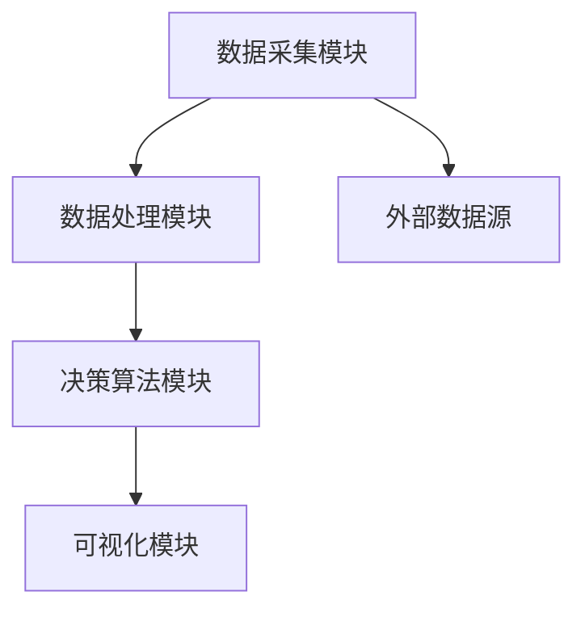
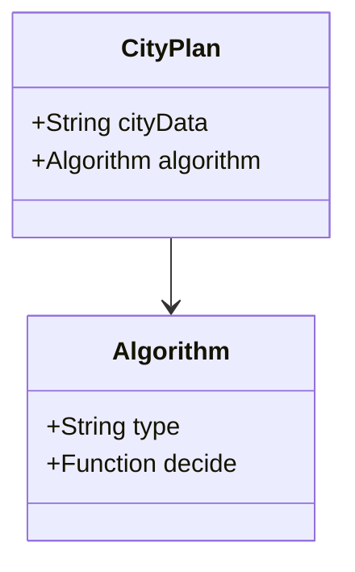
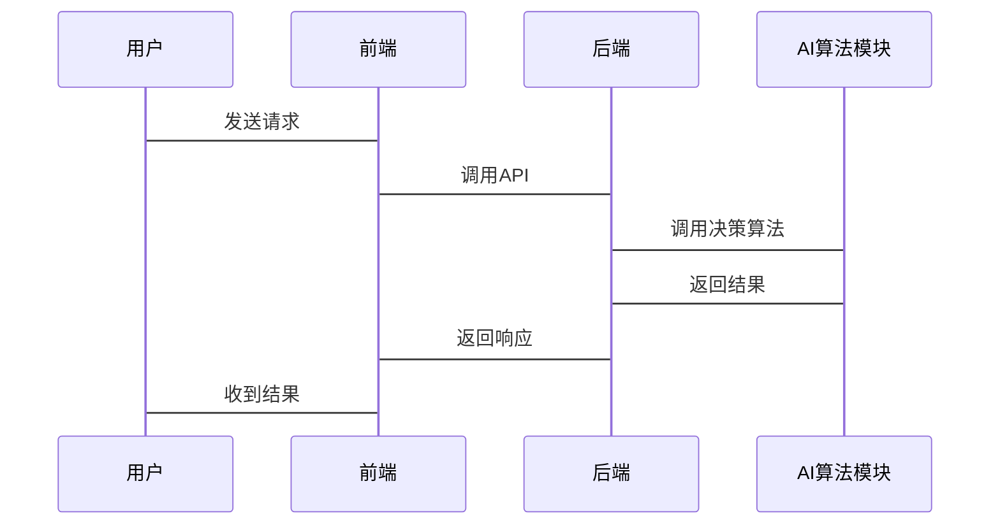

                 


# 智能城市规划中的AI Agent决策支持

> 关键词：智能城市，AI Agent，决策支持，强化学习，系统架构，城市规划

> 摘要：本文探讨AI Agent在智能城市规划中的决策支持应用，涵盖背景、核心概念、算法原理、系统架构、项目实战及最佳实践，结合理论与实践，详细解析AI Agent如何优化城市规划。

---

## 第1章 背景介绍

### 1.1 智能城市规划的背景

#### 1.1.1 城市化与城市规划的演进

城市化进程加速，传统城市规划面临资源有限、效率低下等问题。AI Agent的引入为解决这些问题提供了新思路。

#### 1.1.2 智能城市的概念与特征

智能城市利用AI、大数据等技术，实现城市基础设施和管理的智能化，提升居民生活质量。

#### 1.1.3 AI Agent在智能城市中的作用

AI Agent作为智能城市的核心组件，通过实时数据处理和决策优化，提升城市规划效率和质量。

### 1.2 AI Agent的基本概念

#### 1.2.1 AI Agent的定义

AI Agent是具有感知环境、自主决策和执行任务的智能体，能够在复杂环境中优化决策。

#### 1.2.2 AI Agent的核心特征

- 感知环境
- 自主决策
- 任务执行
- 学习能力

#### 1.2.3 AI Agent与传统决策支持系统的区别

| 特性      | AI Agent                | 传统决策支持系统            |
|-----------|-------------------------|-----------------------------|
| 数据来源  | 多源异构数据             | 结构化数据                   |
| 决策方式  | 自主学习与优化           | 依赖人工规则                 |
| 反馈机制  | 实时反馈与自适应         | 周期性反馈                   |

### 1.3 智能城市规划中的AI Agent应用价值

#### 1.3.1 提高城市规划效率

AI Agent通过自动化处理和优化，显著提升城市规划效率。

#### 1.3.2 优化资源配置

AI Agent帮助实现资源的最优分配，避免浪费，提高效率。

#### 1.3.3 提升城市治理能力

AI Agent通过实时监控和决策支持，增强城市治理能力，应对突发事件。

### 1.4 本章小结

本章介绍了智能城市规划的背景，AI Agent的定义与特征，并分析了其在城市规划中的应用价值，为后续章节打下基础。

---

## 第2章 AI Agent决策支持的核心概念

### 2.1 AI Agent的决策机制

#### 2.1.1 基于模型的推理

通过构建城市模型，AI Agent进行推理和预测，指导决策。

#### 2.1.2 基于数据的预测

利用实时数据，AI Agent进行预测，优化决策。

#### 2.1.3 基于规则的决策

根据预设规则，AI Agent进行判断和执行。

#### 2.1.4 基于强化学习的决策

通过强化学习，AI Agent在不断试错中优化决策策略。

### 2.2 AI Agent在城市规划中的应用领域

#### 2.2.1 交通管理

AI Agent优化交通信号灯控制，缓解交通拥堵。

#### 2.2.2 环境监测

AI Agent实时监测空气质量，预防污染。

#### 2.2.3 公共安全

AI Agent预测犯罪高发区，优化警务部署。

#### 2.2.4 资源分配

AI Agent优化城市资源分配，提高效率。

### 2.3 AI Agent与城市规划的结合

#### 2.3.1 数据驱动的城市规划

AI Agent利用大数据进行城市规划，提升科学性。

#### 2.3.2 智能化决策支持

AI Agent提供实时、动态的决策支持，提升规划质量。

#### 2.3.3 可视化呈现

通过可视化界面，AI Agent帮助城市规划者更好地理解数据和决策结果。

### 2.4 本章小结

本章详细探讨了AI Agent的决策机制及其在城市规划中的应用领域，强调了数据驱动和智能化决策的重要性。

---

## 第3章 AI Agent决策支持的算法原理

### 3.1 基于强化学习的决策算法

#### 3.1.1 强化学习的基本原理

通过试错学习，强化学习智能体在环境中学习策略，最大化累积奖励。

#### 3.1.2 Q-learning算法

- 状态空间：城市交通状况。
- 动作空间：信号灯配时。
- 奖励函数：交通流畅度。

数学模型：

$$ Q(s, a) = Q(s, a) + \alpha \cdot (r + \gamma \cdot \max Q(s', a') - Q(s, a)) $$

#### 3.1.3 算法实现

Python代码示例：

```python
import numpy as np

# 初始化Q表
Q = np.zeros([state_space, action_space])

# 参数设置
alpha = 0.1
gamma = 0.9

def q_learning(state, action, reward, next_state):
    old_q = Q[state, action]
    next_max = np.max(Q[next_state, :])
    Q[state, action] = old_q + alpha * (reward + gamma * next_max - old_q)
    return Q

# 训练过程
for episode in range(episodes):
    state = get_current_state()
    action = choose_action(state)
    reward = get_reward(state, action)
    next_state = get_next_state()
    Q = q_learning(state, action, reward, next_state)
```

### 3.2 基于模型的决策算法

#### 3.2.1 逻辑推理模型

通过构建逻辑推理模型，AI Agent推导出最优决策。

#### 3.2.2 马尔可夫决策过程

状态、动作、奖励和转移概率的马尔可夫决策过程。

数学模型：

$$ P(s' | s, a) = \text{概率转移矩阵} $$

#### 3.2.3 模型的构建与优化

利用历史数据训练模型，优化模型参数。

### 3.3 算法实现与优化

#### 3.3.1 算法实现的步骤

- 数据收集与预处理
- 模型训练与优化
- 算法评估与测试

#### 3.3.2 算法优化的策略

- 参数调优
- 模型压缩
- 并行计算

#### 3.3.3 算法的性能评估

- 决策准确率
- 响应时间
- 资源消耗

### 3.4 本章小结

本章详细介绍了AI Agent的决策算法，包括强化学习和基于模型的算法，分析了其在城市规划中的应用。

---

## 第4章 AI Agent决策支持的系统架构

### 4.1 系统架构设计

#### 4.1.1 系统功能模块划分

- 数据采集模块
- 数据处理模块
- 决策算法模块
- 可视化模块

#### 4.1.2 系统架构图

使用mermaid绘制系统架构图：



### 4.2 系统功能设计

#### 4.2.1 领域模型类图

使用mermaid绘制领域模型类图：



### 4.3 系统架构设计

#### 4.3.1 系统架构图

使用mermaid绘制系统架构图：


### 4.4 系统接口设计

#### 4.4.1 接口设计

- API接口定义：RESTful API
- 数据格式：JSON

#### 4.4.2 接口交互序列图

使用mermaid绘制接口交互序列图：



### 4.5 本章小结

本章详细设计了AI Agent决策支持系统的架构，包括功能模块、系统架构图和接口设计，为后续实现奠定了基础。

---

## 第5章 项目实战

### 5.1 智能交通管理项目

#### 5.1.1 项目介绍

基于AI Agent的智能交通管理系统，优化交通信号灯配时，缓解交通拥堵。

#### 5.1.2 环境安装

- 安装Python、NumPy、TensorFlow等库
- 安装Jupyter Notebook用于开发和测试

#### 5.1.3 系统核心实现源代码

```python
import numpy as np
import pandas as pd

# 定义强化学习算法类
class QLearningAgent:
    def __init__(self, state_space, action_space):
        self.Q = np.zeros([state_space, action_space])
    
    def choose_action(self, state, epsilon=0.1):
        if np.random.random() < epsilon:
            return np.random.randint(action_space)
        else:
            return np.argmax(self.Q[state])
    
    def update_q(self, state, action, reward, next_state):
        self.Q[state, action] = self.Q[state, action] + 0.1 * (reward + 0.9 * np.max(self.Q[next_state]) - self.Q[state, action])

# 数据加载与预处理
data = pd.read_csv('traffic_data.csv')
state_space = 10
action_space = 5
agent = QLearningAgent(state_space, action_space)

# 训练过程
for ep in range(1000):
    state = data.iloc[ep]['state']
    action = agent.choose_action(state)
    reward = get_reward(state, action)
    next_state = data.iloc[ep+1]['state']
    agent.update_q(state, action, reward, next_state)
```

#### 5.1.4 代码应用解读与分析

- 数据预处理：将交通数据转化为模型可处理的形式。
- 强化学习算法：通过不断试错优化信号灯配时。
- 训练过程：利用历史数据训练模型，提升决策准确率。

#### 5.1.5 实际案例分析

以某城市交通数据为例，分析AI Agent如何优化信号灯配时，降低交通拥堵。

### 5.2 本章小结

本章通过一个智能交通管理项目，详细讲解了AI Agent决策支持系统的实现过程，包括环境安装、代码实现和案例分析。

---

## 第6章 最佳实践与总结

### 6.1 最佳实践 tips

- 数据质量：确保数据准确性和完整性
- 算法选择：根据场景选择合适的算法
- 系统优化：优化算法性能和系统架构

### 6.2 项目总结

AI Agent在智能城市规划中的应用前景广阔，通过实时数据处理和智能化决策支持，显著提升城市规划效率和质量。

### 6.3 注意事项

- 数据隐私：保护用户隐私
- 系统稳定性：确保系统稳定运行
- 可扩展性：设计可扩展的系统架构

### 6.4 拓展阅读

- 加强学习在城市规划中的应用
- 联邦学习在城市数据共享中的应用
- 图神经网络在城市交通中的应用

### 6.5 本章小结

本章总结了项目实施中的经验和教训，提出了最佳实践建议，并展望了未来的研究方向。

---

## 附录

### 附录A 算法实现代码

```python
# 强化学习算法实现
class QLearningAgent:
    def __init__(self, state_space, action_space):
        self.Q = np.zeros([state_space, action_space])
    
    def choose_action(self, state):
        return np.argmax(self.Q[state])
    
    def update_q(self, state, action, reward, next_state):
        self.Q[state, action] = self.Q[state, action] + 0.1 * (reward + 0.9 * np.max(self.Q[next_state]) - self.Q[state, action])

# 数据处理与训练
data = pd.read_csv('traffic_data.csv')
agent = QLearningAgent(10, 5)
for ep in range(1000):
    state = data.iloc[ep]['state']
    action = agent.choose_action(state)
    reward = get_reward(state, action)
    next_state = data.iloc[ep+1]['state']
    agent.update_q(state, action, reward, next_state)
```

### 附录B 系统架构图

使用mermaid绘制的系统架构图：


### 附录C 实验结果与分析

分析AI Agent在交通管理中的应用效果，展示优化后的交通流量和拥堵率。

---

## 结语

通过本文的详细讲解，读者可以全面了解AI Agent在智能城市规划中的决策支持应用，从理论到实践，掌握其在城市交通、环境监测等领域的具体应用方法。未来，随着技术进步，AI Agent将在智能城市发展中发挥更大作用。

