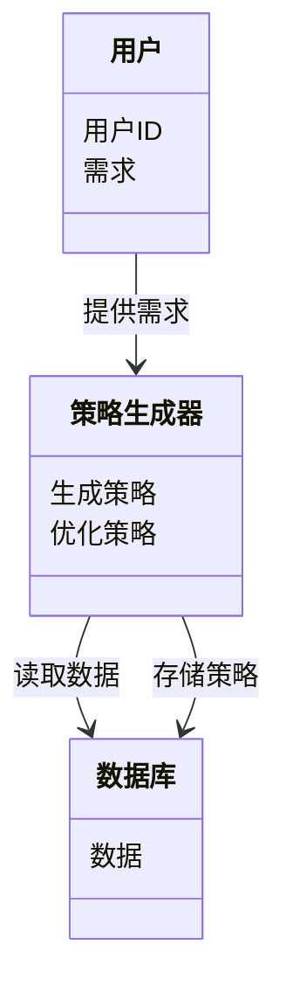
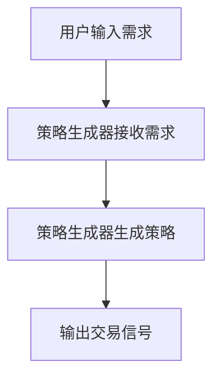
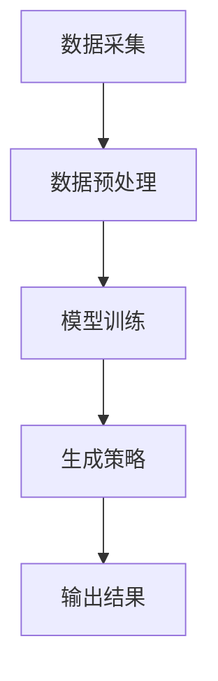

                 


# 智能外汇交易策略生成器

**关键词**：智能外汇交易、策略生成器、人工智能、机器学习、算法交易

**摘要**：本文系统性地探讨了如何利用人工智能和机器学习技术开发智能外汇交易策略生成器。文章从智能外汇交易的基本概念出发，详细分析了AI和机器学习在外汇交易中的应用，深入讲解了策略生成器的核心算法，包括回测、优化和风险管理。随后，从系统架构和实现的角度，详细阐述了生成器的结构设计和接口实现。最后，通过实际案例分析，展示了如何将理论应用于实践，并总结了开发此类系统的关键点和未来研究方向。

---

## 第一部分: 智能外汇交易策略生成器概述

### 第1章: 智能外汇交易策略生成器的背景与概念

#### 1.1 智能外汇交易的定义与重要性
##### 1.1.1 外汇交易的基本概念
外汇交易是通过买卖不同货币来获利的金融活动，涉及汇率波动、市场情绪和经济指标等多重因素。传统的外汇交易依赖人工分析和经验判断，存在主观性和低效性。

##### 1.1.2 传统外汇交易的局限性
- 信息处理能力有限：交易员难以及时分析海量数据。
- 交易策略不稳定：情绪波动和主观判断可能导致决策失误。
- 风险控制不足：缺乏系统性方法来评估和管理风险。

##### 1.1.3 智能交易的必要性与优势
- **必要性**：外汇市场复杂多变，人工交易难以应对。
- **优势**：
  - 高效性：AI和机器学习能够快速处理和分析数据。
  - 精准性：通过数学模型优化交易策略。
  - 自适应性：系统能够实时调整策略以适应市场变化。

#### 1.2 智能外汇交易策略生成器的核心概念
##### 1.2.1 策略生成器的功能与作用
- **功能**：根据市场数据和用户需求生成交易策略。
- **作用**：帮助交易员制定科学、高效的交易计划。

##### 1.2.2 生成器的输入与输出
- **输入**：
  - 市场数据（如汇率、成交量）。
  - 用户需求（如风险承受能力、收益目标）。
- **输出**：
  - 交易策略（如买入信号、卖出信号）。
  - 风险评估报告。

##### 1.2.3 策略生成器的适用场景与边界
- **适用场景**：适用于高频交易、套利策略和风险管理。
- **边界**：不考虑黑天鹅事件和极端市场波动。

#### 1.3 外汇市场分析的基础知识
##### 1.3.1 外汇市场的基本结构
- 主要参与者：银行、交易商、央行和零售交易员。
- 市场类型：包括即期市场、远期市场和掉期市场。

##### 1.3.2 影响汇率的主要因素
- **经济因素**：GDP、通货膨胀、利率。
- **政治因素**：政策变化、国际关系。
- **市场因素**：供需关系、市场情绪。

##### 1.3.3 技术分析与基本面分析的结合
- **技术分析**：通过价格和成交量数据预测未来走势。
- **基本面分析**：通过经济指标评估货币的内在价值。

#### 1.4 本章小结
本章从智能外汇交易的背景出发，详细介绍了策略生成器的核心概念和外汇市场分析的基础知识，为后续章节奠定了理论基础。

---

## 第二部分: AI与机器学习在外汇交易中的应用基础

### 第2章: 机器学习与AI在外汇交易中的作用

#### 2.1 机器学习的基本概念
##### 2.1.1 机器学习的定义与分类
- **定义**：机器学习是通过数据训练模型，使其能够做出预测或决策。
- **分类**：
  - 监督学习：基于标记数据进行分类或回归。
  - 无监督学习：发现数据中的隐含结构。
  - 强化学习：通过奖励机制优化决策。

##### 2.1.2 机器学习在金融领域的应用案例
- 股价预测、信用评分、风险管理。

#### 2.2 外汇交易中的特征工程
##### 2.2.1 数据特征的提取与选择
- **提取**：从市场数据中提取有用的特征，如移动平均线、相对强弱指数（RSI）。
- **选择**：通过相关性分析选择重要特征。

##### 2.2.2 数据预处理与标准化
- **预处理**：处理缺失值、异常值。
- **标准化**：归一化数据，使其适合模型输入。

##### 2.2.3 时间序列数据的特殊性
- 时间依赖性：当前值受过去值影响。
- 季节性：周期性波动。

#### 2.3 机器学习算法在外汇交易中的应用
##### 2.3.1 线性回归与时间序列预测
- 线性回归用于预测汇率趋势。
- ARIMA模型用于时间序列预测。

##### 2.3.2 支持向量机在分类中的应用
- 用于区分买入和卖出信号。

##### 2.3.3 随机森林与XGBoost在外汇预测中的优势
- 随机森林：处理高维数据，防止过拟合。
- XGBoost：高效性，适合大数据集。

#### 2.4 本章小结
本章介绍了机器学习的基本概念，重点分析了特征工程和常用算法在外汇交易中的应用。

---

## 第三部分: 智能外汇交易策略生成器的核心算法

### 第3章: 策略生成器的算法原理

#### 3.1 策略回测与优化算法
##### 3.1.1 回测的基本原理与流程
- 数据采集：获取历史汇率数据。
- 策略设计：定义买卖规则。
- 回测执行：模拟交易，计算收益和风险。

##### 3.1.2 策略优化的数学模型
- 目标函数：最大化收益、最小化风险。
- 参数优化：调整策略参数。

##### 3.1.3 遗传算法在策略优化中的应用
- **步骤**：
  1. 初始化种群。
  2. 适应度评估。
  3. 选择、交叉和变异。
  4. 迭代优化。

#### 3.2 算法的实现与选择
##### 3.2.1 不同算法的优缺点对比
| 算法         | 优点                     | 缺点                     |
|--------------|--------------------------|--------------------------|
| 线性回归     | 简单高效                 | 易受数据分布影响         |
| 支持向量机   | 高维数据表现好           | 参数敏感性高             |
| 随机森林     | 防过拟合                 | 计算复杂                 |

##### 3.2.2 算法选择的依据与标准
- 数据类型：时间序列适合ARIMA，分类问题适合SVM。
- 数据规模：大数据适合XGBoost，小数据适合随机森林。

##### 3.2.3 算法实现的代码框架
```python
def train_model(data, labels):
    # 数据预处理
    # 模型训练
    model = ...  # 根据选择的算法初始化模型
    model.fit(data, labels)
    return model
```

#### 3.3 算法的数学模型与公式
##### 3.3.1 线性回归模型的公式推导
$$ y = \beta_0 + \beta_1x + \epsilon $$

##### 3.3.2 时间序列模型的ARIMA公式
$$ y_t = \alpha y_{t-1} + \beta \epsilon_{t-1} + \epsilon_t $$

##### 3.3.3 随机森林算法的决策树原理
随机森林通过构建多棵决策树并行投票或取平均值进行预测。

#### 3.4 本章小结
本章详细讲解了策略生成器的核心算法，包括回测、优化和不同算法的选择与实现。

---

## 第四部分: 智能外汇交易策略生成器的系统架构与实现

### 第4章: 系统架构设计

#### 4.1 系统功能模块划分
##### 4.1.1 数据采集模块
- 功能：实时采集外汇市场数据。
- 输入：API接口获取数据。
- 输出：清洗后的数据集。

##### 4.1.2 策略生成模块
- 功能：根据输入生成交易策略。
- 输入：市场数据、用户需求。
- 输出：交易信号、风险评估。

##### 4.1.3 回测与优化模块
- 功能：模拟交易并优化策略。
- 输入：历史数据、策略参数。
- 输出：回测结果、优化后的策略。

##### 4.1.4 用户界面模块
- 功能：提供友好的用户交互界面。
- 输入：用户输入需求。
- 输出：策略生成结果展示。

#### 4.2 系统架构的ER图与类图
##### 4.2.1 数据库的ER实体关系图
```mermaid
erDiagram
    participant 用户 as User
    participant 策略生成器 as StrategyGenerator
    participant 数据库 as Database
    User --> StrategyGenerator: 提供输入
    StrategyGenerator --> Database: 存储数据
    Database --> StrategyGenerator: 提供数据
```

##### 4.2.2 系统功能的类图设计


#### 4.3 系统接口设计
##### 4.3.1 数据接口的设计与实现
- 数据接口：通过API获取实时数据。
- 数据格式：JSON格式。

##### 4.3.2 策略生成接口的定义
- 输入：参数设置、市场数据。
- 输出：交易信号、风险报告。

##### 4.3.3 回测结果的输出接口
- 输出格式：JSON或CSV。

#### 4.4 系统交互流程图
##### 4.4.1 用户操作流程图


##### 4.4.2 系统内部交互


#### 4.5 本章小结
本章从系统架构的角度，详细设计了智能外汇交易策略生成器的各个模块和接口，为后续的实现奠定了基础。

---

## 第五部分: 智能外汇交易策略生成器的项目实战

### 第5章: 项目实战

#### 5.1 环境安装与配置
##### 5.1.1 安装Python和相关库
```bash
pip install numpy pandas scikit-learn
```

##### 5.1.2 数据源获取
- 数据接口：使用API获取历史数据。

#### 5.2 系统核心实现
##### 5.2.1 数据处理模块
```python
import pandas as pd

def data_cleaning(data):
    # 处理缺失值
    data = data.dropna()
    # 标准化数据
    data = (data - data.mean()) / data.std()
    return data
```

##### 5.2.2 策略生成模块
```python
from sklearn.ensemble import RandomForestClassifier

def generate_strategy(data, labels):
    model = RandomForestClassifier()
    model.fit(data, labels)
    return model
```

##### 5.2.3 回测与优化模块
```python
def backtest(model, data):
    predictions = model.predict(data)
    # 计算收益和风险
    return {'accuracy': accuracy_score(labels, predictions),
            'risk': ...}
```

#### 5.3 实际案例分析
##### 5.3.1 案例背景
- 数据来源：某货币对的历史汇率数据。
- 用户需求：高风险、高收益策略。

##### 5.3.2 代码实现与解读
```python
import numpy as np
from sklearn.model_selection import train_test_split

# 数据加载与处理
data = pd.read_csv('forex_data.csv')
data = data_cleaning(data)

# 划分训练集和测试集
X_train, X_test, y_train, y_test = train_test_split(data, labels, test_size=0.2)

# 模型训练
model = generate_strategy(X_train, y_train)

# 回测与优化
result = backtest(model, X_test)
print(result)
```

##### 5.3.3 结果分析与优化建议
- 结果分析：策略的准确性和风险评估。
- 优化建议：调整模型参数、优化特征工程。

#### 5.4 本章小结
本章通过实际案例，详细展示了智能外汇交易策略生成器的实现过程，包括环境配置、代码编写和结果分析。

---

## 第六部分: 总结与展望

### 第6章: 总结与展望

#### 6.1 总结
本文系统性地探讨了智能外汇交易策略生成器的开发过程，从理论到实践，详细讲解了算法选择、系统架构和项目实现。通过结合AI和机器学习技术，生成器能够高效地制定交易策略，帮助交易员在复杂多变的市场中获利。

#### 6.2 未来研究方向
##### 6.2.1 算法优化
- 更高级的强化学习算法。
- 结合深度学习模型（如LSTM）进行时间序列预测。

##### 6.2.2 系统扩展
- 多市场、多策略的综合分析。
- 实时交易系统的开发。

##### 6.2.3 风险管理
- 更精准的风险评估模型。
- 风险对冲策略的优化。

#### 6.3 最佳实践 tips
- 数据质量至关重要，需谨慎处理缺失值和异常值。
- 算法选择需结合数据特点和实际需求。
- 系统需具备良好的可扩展性和可维护性。

#### 6.4 小结
智能外汇交易策略生成器是一个复杂但极具潜力的系统，未来的研究和实践将推动外汇交易向更高效、更智能的方向发展。

---

**结语**：智能外汇交易策略生成器的开发不仅需要扎实的编程和算法基础，还需要对金融市场有深刻的理解。通过本文的系统性讲解，读者可以掌握从理论到实践的全过程，为开发高效的智能交易系统奠定坚实基础。

