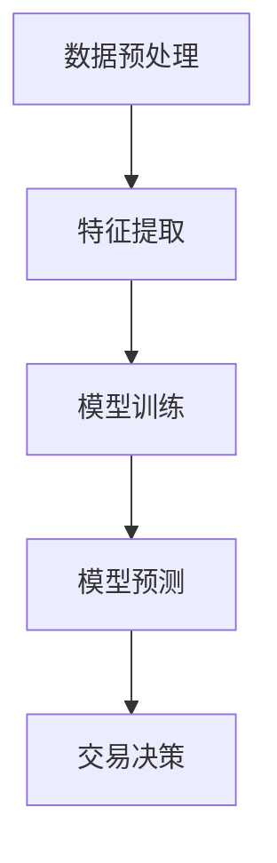
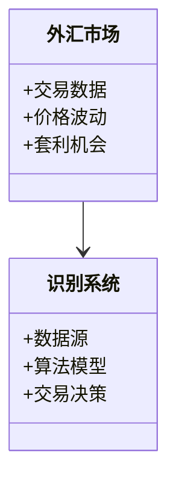

                 


# 智能外汇套利机会识别系统

> **关键词**：智能外汇套利、机会识别、机器学习、深度学习、算法交易、风险管理

> **摘要**：  
> 本文将深入探讨智能外汇套利机会识别系统的构建与实现。通过结合机器学习和深度学习技术，我们能够高效地识别外汇市场中的套利机会。文章从外汇市场的基本概念出发，分析套利机会的类型与特点，详细阐述智能套利系统的算法原理、系统架构设计以及实际应用案例。同时，本文还将探讨系统的核心要素，包括数据源、算法模型和风险管理策略，为读者提供一个全面的视角，理解如何利用人工智能技术在外汇市场中捕捉套利机会。

---

# 智能外汇套利机会识别系统

## 第一部分: 智能外汇套利机会识别系统概述

### 第1章: 外汇市场与套利机会概述

#### 1.1 外汇市场的基本概念

##### 1.1.1 外汇市场的定义与特点
外汇市场是全球最大的金融市场，参与者包括银行、企业、个人和中央银行等。其特点包括24小时连续交易、高流动性、多样化的货币对（如EUR/USD、GBP/USD）以及价格的实时波动。

##### 1.1.2 外汇交易的主要参与者
- **银行与金融机构**：作为主要的做市商，提供流动性并参与交易。
- **企业**：通过外汇交易对冲汇率风险。
- **个人投资者**：参与零售外汇交易，利用价格波动赚取利润。
- **中央银行**：通过干预外汇市场影响汇率。

##### 1.1.3 外汇市场的运作机制
外汇市场的运作机制包括订单驱动、撮合交易和价格形成机制。交易者通过交易平台下单，系统根据订单匹配规则撮合交易，形成实时价格。

#### 1.2 套利的定义与类型

##### 1.2.1 套利的定义
套利是指利用不同市场或资产之间的价格差异，通过同时买入低价资产和卖出高价资产，以期在价格趋同时获利的交易策略。

##### 1.2.2 套利的常见类型
- **跨市场套利**：利用同一资产在不同市场之间的价格差异进行交易。
- **跨期套利**：利用同一资产在不同时间点的价格差异进行交易。
- **套息交易**：借入低利率货币，投资高利率货币，赚取利差。

#### 1.3 智能外汇套利机会识别系统的背景

##### 1.3.1 传统套利方法的局限性
传统套利方法依赖人工分析，存在效率低、误差大、反应慢等问题。此外，市场环境复杂多变，人工分析难以捕捉所有套利机会。

##### 1.3.2 智能系统在外汇套利中的优势
智能系统通过机器学习和深度学习技术，能够快速分析海量数据，发现潜在的套利机会，并实时调整交易策略。

##### 1.3.3 系统的应用场景与目标
智能外汇套利机会识别系统适用于高频交易、算法交易和机构投资等多种场景，其目标是通过技术手段提高套利效率、降低风险并实现收益最大化。

---

## 第2章: 智能外汇套利机会识别系统的核心概念

### 2.1 系统的核心要素

#### 2.1.1 数据源与数据类型
- **数据源**：包括实时市场数据、历史价格数据、经济指标数据等。
- **数据类型**：包括结构化数据（如价格、成交量）和非结构化数据（如新闻、社交媒体信息）。

#### 2.1.2 算法模型与特征提取
- **算法模型**：包括回归分析、支持向量机（SVM）、随机森林（Random Forest）和卷积神经网络（CNN）等。
- **特征提取**：通过技术指标（如MACD、RSI）和市场情绪指标提取特征。

#### 2.1.3 风险管理与收益优化
- **风险管理**：通过止损、止盈和头寸管理控制风险。
- **收益优化**：通过优化算法参数和交易策略提高收益。

### 2.2 核心概念的对比分析

#### 2.2.1 数据源对比表格

| 数据源类型   | 描述                           | 优点               | 缺点               |
|--------------|--------------------------------|--------------------|--------------------|
| 实时数据     | 当前市场交易数据               | 及时性高           | 数据量大           |
| 历史数据     | 过去市场交易数据               | 数据量大           | 无法预测未来       |
| 经济指标     | 经济数据（如GDP、利率）       | 有助于长期趋势分析 | 数据更新较慢       |

#### 2.2.2 算法模型对比表格

| 模型类型     | 描述                           | 优点               | 缺点               |
|--------------|--------------------------------|--------------------|--------------------|
| 回归分析     | 预测变量之间的关系             | 简单易用           | 高度依赖数据假设   |
| 支持向量机   | 分类与回归                      | 高维数据表现优异   | 参数选择敏感       |
| 随机森林     | 基于决策树的集成学习           | 抗噪声能力强       | 计算复杂度高       |
| 卷积神经网络 | 基于深度学习的特征提取         | 高精度             | 训练时间长         |

#### 2.2.3 系统性能对比表格

| 性能指标     | 描述                           | 传统方法表现       | 智能系统表现       |
|--------------|--------------------------------|--------------------|--------------------|
| 响应时间     | 系统对市场变化的反应速度       | 较慢               | 极快               |
| 准确率       | 系统识别套利机会的准确性       | 低                 | 高                 |
| 处理能力     | 系统处理数据的能力             | 有限               | 强大               |

### 2.3 实体关系图


---

## 第三部分: 算法原理与数学模型

### 第3章: 机器学习与深度学习在外汇套利中的应用

#### 3.1 机器学习基础

##### 3.1.1 机器学习的定义与特点
机器学习是一种人工智能技术，通过数据训练模型，使其能够从数据中学习并做出预测或分类。

##### 3.1.2 常见机器学习算法
- **线性回归**：用于预测连续变量。
- **逻辑回归**：用于分类问题。
- **支持向量机（SVM）**：用于分类和回归。
- **随机森林**：用于分类和回归，基于决策树的集成学习。

##### 3.1.3 机器学习在外汇套利中的应用
- **价格预测**：通过历史价格数据预测未来价格。
- **模式识别**：识别价格波动中的模式和趋势。

#### 3.2 深度学习基础

##### 3.2.1 深度学习的定义与特点
深度学习是一种基于人工神经网络的机器学习技术，通过多层网络结构学习数据的高层次特征。

##### 3.2.2 常见深度学习模型
- **卷积神经网络（CNN）**：用于图像识别和时间序列分析。
- **长短期记忆网络（LSTM）**：用于时间序列预测和自然语言处理。
- **Transformer**：用于序列建模，如NLP和时间序列分析。

##### 3.2.3 深度学习在外汇套利中的应用
- **时间序列预测**：利用LSTM预测未来价格。
- **模式识别**：识别复杂的价格波动模式。

#### 3.3 算法流程图



---

## 第4章: 算法实现与数学模型

#### 4.1 线性回归模型

##### 4.1.1 线性回归的数学模型
$$ y = \beta_0 + \beta_1 x + \epsilon $$

##### 4.1.2 案例分析
假设我们有以下数据：

| x   | y   |
|-----|-----|
| 1   | 2   |
| 2   | 3   |
| 3   | 4   |

通过最小二乘法，我们可以求出回归系数：

$$ \beta_1 = \frac{\sum (x_i - \bar{x})(y_i - \bar{y})}{\sum (x_i - \bar{x})^2} $$

$$ \beta_0 = \bar{y} - \beta_1 \bar{x} $$

计算得：

$$ \beta_1 = 1, \beta_0 = 1 $$

模型为：

$$ y = 1 + 1x $$

---

#### 4.2 支持向量机（SVM）模型

##### 4.2.1 SVM的数学模型
$$ \text{目标函数：} \min_{\theta} \frac{1}{2}\|\theta\|^2 + C \sum_{i=1}^n \xi_i $$

$$ \text{约束条件：} y_i (\theta \cdot x_i + \theta_0) \geq 1 - \xi_i $$

##### 4.2.2 案例分析
假设我们有以下两类数据：

| x   | y   |
|-----|-----|
| 1   | -1  |
| 2   | -1  |
| 3   | 1   |
| 4   | 1   |

通过SVM，我们可以找到一个超平面：

$$ \theta \cdot x + \theta_0 = 0 $$

最佳分离超平面为：

$$ \theta = 1, \theta_0 = -1.5 $$

模型为：

$$ y = \text{sign}(x - 1.5) $$

---

## 第5章: 深度学习模型

#### 5.1 LSTM网络

##### 5.1.1 LSTM的数学模型
$$ \text{遗忘门：} f_t = \sigma(W_f a_{t-1} + U_f x_t + b_f) $$

$$ \text{输入门：} i_t = \sigma(W_i a_{t-1} + U_i x_t + b_i) $$

$$ \text{候选单元：} \tilde{c}_t = \tanh(W_c a_{t-1} + U_c x_t + b_c) $$

$$ \text{单元状态：} c_t = f_t \cdot c_{t-1} + i_t \cdot \tilde{c}_t $$

$$ \text{输出门：} o_t = \sigma(W_o a_{t-1} + U_o x_t + b_o) $$

$$ \text{输出：} a_t = o_t \cdot \tanh(c_t) $$

##### 5.1.2 案例分析
假设我们有以下时间序列数据：

| 时间 | 价格 |
|------|------|
| 1    | 100  |
| 2    | 105  |
| 3    | 110  |
| 4    | 115  |

通过LSTM网络，我们可以预测未来的价格：

$$ \text{预测价格：} \hat{y}_t = a_t $$

---

## 第6章: 系统分析与架构设计

### 6.1 系统功能设计

#### 6.1.1 领域模型



### 6.2 系统架构设计

#### 6.2.1 系统架构图


---

## 第7章: 项目实战

### 7.1 环境安装

#### 7.1.1 安装Python

```bash
# 安装Python
python --version
```

#### 7.1.2 安装依赖库

```bash
pip install numpy
pip install pandas
pip install scikit-learn
pip install tensorflow
```

### 7.2 核心实现

#### 7.2.1 数据预处理

```python
import pandas as pd
import numpy as np

data = pd.read_csv('market_data.csv')
data.head()
```

#### 7.2.2 特征提取

```python
from sklearn.preprocessing import StandardScaler

scaler = StandardScaler()
X_scaled = scaler.fit_transform(data.drop('target', axis=1))
```

#### 7.2.3 模型训练

```python
from sklearn.linear_model import LinearRegression

model = LinearRegression()
model.fit(X_scaled, data['target'])
```

#### 7.2.4 模型预测

```python
y_pred = model.predict(X_scaled)
```

### 7.3 案例分析

#### 7.3.1 数据分析

```python
import matplotlib.pyplot as plt

plt.plot(data.index, data['target'], label='Actual')
plt.plot(data.index, y_pred, label='Predicted')
plt.legend()
plt.show()
```

#### 7.3.2 交易策略

```python
from backtrader import Strategy

class MyStrategy(Strategy):
    def __init__(self):
        self.data = self.datas[0]
        self.order = None

    def next(self):
        if self.order is None:
            if self.data.close > self.data.close_mean(10):
                self.order = self.buy()
        else:
            if self.data.close < self.data.close_mean(10):
                self.order.close()
```

---

## 第8章: 最佳实践与小结

### 8.1 最佳实践

#### 8.1.1 系统优化
- 定期更新模型参数。
- 监控系统性能，及时调整算法。

#### 8.1.2 风险管理
- 设置止损和止盈。
- 控制头寸规模。

### 8.2 小结
智能外汇套利机会识别系统通过机器学习和深度学习技术，能够高效地识别套利机会。然而，系统的性能依赖于数据质量和算法选择。未来，随着人工智能技术的发展，套利机会识别系统将更加智能化和高效。

### 8.3 注意事项
- 系统依赖实时数据，需确保数据源的稳定性。
- 算法模型需定期更新，以适应市场变化。
- 交易策略需结合市场实际情况，避免过度依赖模型。

### 8.4 拓展阅读
- 《机器学习实战》
- 《深度学习》
- 《算法交易：机智的投资者的新方法》

---

通过以上内容，我们详细探讨了智能外汇套利机会识别系统的构建与实现。希望本文能够为读者提供一个全面的视角，理解如何利用人工智能技术在外汇市场中捕捉套利机会。

