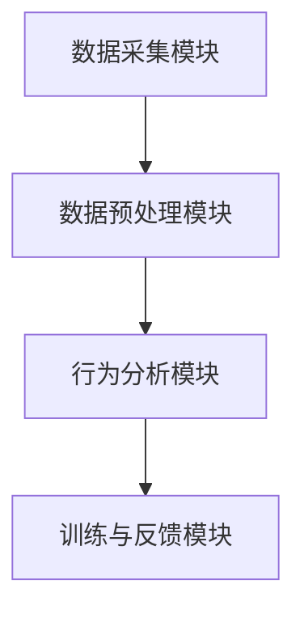
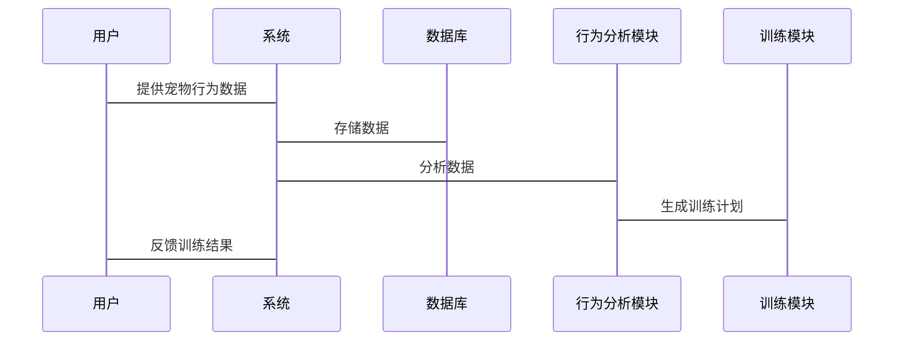
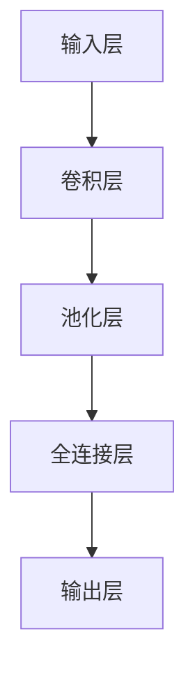

                 


# 第二部分: AI Agent与宠物行为分析的核心概念

## 第3章: 宠物行为分析的算法与系统设计

### 3.1 AI Agent的核心算法原理

#### 3.1.1 监督学习算法

##### 3.1.1.1 线性回归算法
###### 3.1.1.1.1 线性回归的数学模型与公式
$$
y = \beta_0 + \beta_1 x + \epsilon
$$
其中：
- $y$ 是目标变量
- $x$ 是自变量
- $\beta_0$ 是截距
- $\beta_1$ 是回归系数
- $\epsilon$ 是误差项

##### 3.1.1.2 逻辑回归算法
###### 3.1.1.2.1 逻辑回归的数学模型与公式
$$
P(Y=1|X) = \frac{e^{\beta_0 + \beta_1 x}}{1 + e^{\beta_0 + \beta_1 x}}
$$

##### 3.1.1.3 支持向量机(SVM)算法
###### 3.1.1.3.1 SVM的数学模型与公式
$$
\text{最大化} \quad \frac{1}{\nu}\sum_{i=1}^n y_i (x_i \cdot w + b) - 1
$$
$$
\text{约束} \quad y_i (x_i \cdot w + b) \geq 1, \quad i=1,2,...,n
$$

#### 3.1.2 无监督学习算法

##### 3.1.2.1 K均值聚类算法
###### 3.1.2.1.1 K均值聚类的数学模型与公式
$$
\text{目标函数} \quad J = \sum_{i=1}^k \sum_{j=1}^n (x_j - c_i)^2
$$
其中：
- $k$ 是聚类的数量
- $n$ 是样本的数量
- $x_j$ 是第$j$个样本
- $c_i$ 是第$i$个聚类的中心

##### 3.1.2.2 层次聚类算法
###### 3.1.2.2.1 层次聚类的数学模型与公式
$$
\text{距离度量} \quad d(x_i, x_j) = \sqrt{(x_i - x_j)^2 + (y_i - y_j)^2}
$$

#### 3.1.3 加强学习算法

##### 3.1.3.1 Q-Learning算法
###### 3.1.3.1.1 Q-Learning的数学模型与公式
$$
Q(s, a) = (1 - \alpha) Q(s, a) + \alpha (r + \gamma Q(s', a'))
$$
其中：
- $Q(s, a)$ 是状态-动作对的价值
- $\alpha$ 是学习率
- $r$ 是立即奖励
- $\gamma$ 是折扣因子
- $Q(s', a')$ 是下一个状态-动作对的价值

### 3.2 宠物行为分析的系统设计

#### 3.2.1 系统功能模块划分
- 数据采集模块
- 数据预处理模块
- 行为分析模块
- 训练与反馈模块

#### 3.2.2 系统架构设计


#### 3.2.3 系统接口设计
- 数据采集接口：用于采集宠物的行为数据
- 数据预处理接口：用于对采集的数据进行清洗和标准化
- 行为分析接口：用于对预处理后的数据进行分类和聚类
- 训练与反馈接口：用于根据分析结果生成训练计划并反馈给用户

#### 3.2.4 系统交互流程


## 第4章: 智能宠物屋的系统实现

### 4.1 系统核心算法的实现

#### 4.1.1 基于卷积神经网络的行为识别

##### 4.1.1.1 卷积神经网络的数学模型与公式


##### 4.1.1.2 卷积神经网络的Python实现
```python
import tensorflow as tf
from tensorflow.keras import layers

model = tf.keras.Sequential([
    layers.Conv2D(32, (3,3), activation='relu', input_shape=(128, 128, 3)),
    layers.MaxPooling2D((2,2)),
    layers.Conv2D(64, (3,3), activation='relu'),
    layers.MaxPooling2D((2,2)),
    layers.Flatten(),
    layers.Dense(128, activation='relu'),
    layers.Dense(10, activation='softmax')
])
```

#### 4.1.2 基于循环神经网络的时间序列分析

##### 4.1.2.1 循环神经网络的数学模型与公式
$$
h_t = \tanh(W_{hh} h_{t-1} + W_{xh} x_t + b_h)
$$
$$
y_t = W_{hy} h_t + b_y
$$`

##### 4.1.2.2 循环神经网络的Python实现
```python
import tensorflow as tf
from tensorflow.keras import layers

model = tf.keras.Sequential([
    layers.SimpleRNN(32, return_sequences=False, input_shape=(None, 128)),
    layers.Dense(64, activation='relu'),
    layers.Dense(10, activation='softmax')
])
```

### 4.2 系统功能实现

#### 4.2.1 环境安装与配置
```bash
pip install tensorflow numpy scikit-learn matplotlib
```

#### 4.2.2 系统核心代码实现
```python
import numpy as np
import tensorflow as tf
from sklearn.metrics import accuracy_score

# 数据加载与预处理
def load_data():
    # 加载数据
    pass
    # 返回训练数据和标签
    return X_train, y_train, X_test, y_test

# 模型训练
def train_model(model, X_train, y_train):
    model.compile(optimizer='adam', loss='sparse_categorical_crossentropy', metrics=['accuracy'])
    model.fit(X_train, y_train, epochs=10, batch_size=32)
    return model

# 模型评估
def evaluate_model(model, X_test, y_test):
    y_pred = model.predict(X_test)
    accuracy = accuracy_score(y_test, np.argmax(y_pred, axis=1))
    print(f'Accuracy: {accuracy}')
    return accuracy
```

#### 4.2.3 实际案例分析与解读
- 数据集来源与特征
- 模型训练与优化
- 模型评估与分析

#### 4.2.4 项目小结
- 项目实现的关键点
- 系统实现的难点与解决方案
- 系统优化的建议

## 第5章: 智能宠物屋的项目实战

### 5.1 项目背景与目标
- 项目背景介绍
- 项目目标设定
- 项目范围界定

### 5.2 项目实施步骤
#### 5.2.1 环境安装与配置
```bash
pip install tensorflow==2.5.0 numpy==1.21.2 scikit-learn==0.24.2
```

#### 5.2.2 数据采集与预处理
```python
import numpy as np

def collect_data():
    # 采集宠物行为数据
    pass
    return data

def preprocess_data(data):
    # 数据清洗与标准化
    pass
    return preprocessed_data
```

#### 5.2.3 系统实现与测试
```python
import tensorflow as tf
from tensorflow.keras import layers

def build_model(input_shape):
    model = tf.keras.Sequential([
        layers.Conv2D(32, (3,3), activation='relu', input_shape=input_shape),
        layers.MaxPooling2D((2,2)),
        layers.Conv2D(64, (3,3), activation='relu'),
        layers.MaxPooling2D((2,2)),
        layers.Flatten(),
        layers.Dense(128, activation='relu'),
        layers.Dense(10, activation='softmax')
    ])
    return model

# 模型训练与测试
def train_and_evaluate(model, X_train, y_train, X_test, y_test):
    model.compile(optimizer='adam', loss='sparse_categorical_crossentropy', metrics=['accuracy'])
    model.fit(X_train, y_train, epochs=10, batch_size=32)
    _, accuracy = model.evaluate(X_test, y_test)
    print(f'Accuracy: {accuracy}')
    return model

# 实际案例分析
def main():
    X_train, y_train, X_test, y_test = load_data()
    model = build_model((128, 128, 3))
    model = train_and_evaluate(model, X_train, y_train, X_test, y_test)
    return model

if __name__ == '__main__':
    main()
```

#### 5.2.4 系统优化与改进
- 模型调优
- 算法优化
- 系统性能提升

### 5.3 项目总结与经验分享
- 项目实施的关键经验
- 项目中遇到的典型问题及解决方案
- 项目成功与失败的经验总结
- 项目后续的改进方向

## 第6章: 智能宠物屋的扩展阅读

### 6.1 相关技术与研究领域
- 相关技术综述
- 研究领域的扩展
- 未来研究方向

### 6.2 推荐书籍与论文
- 推荐书籍
- 推荐论文
- 其他参考资料

### 6.3 深度学习与强化学习的最新进展
- 最新研究成果
- 技术趋势分析
- 应用前景展望

### 6.4 最佳实践与技术建议
- 技术选型建议
- 开发流程建议
- 系统优化建议

### 6.5 智能宠物屋的未来发展
- 未来发展方向
- 技术挑战与机遇
- 市场前景分析

## 总结
智能宠物屋作为AI Agent在宠物行为分析与训练中的一个重要应用，不仅体现了人工智能技术的强大能力，也为宠物主人和训练者提供了极大的便利。通过本文的详细分析与讲解，我们希望能够帮助读者更好地理解智能宠物屋的核心技术与实现方法，并为相关领域的研究与应用提供有价值的参考与启示。

