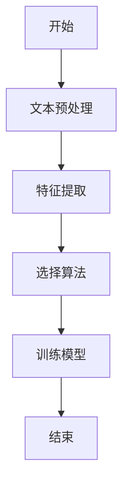
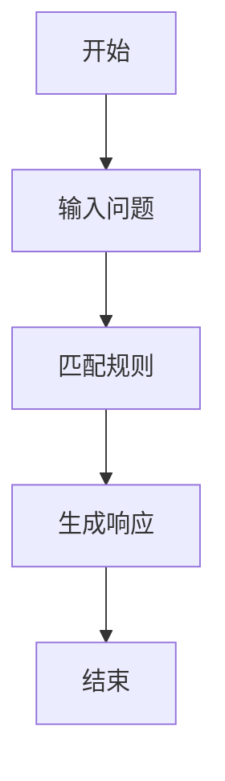
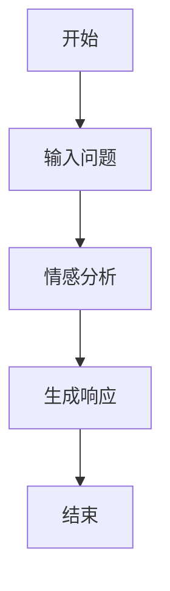
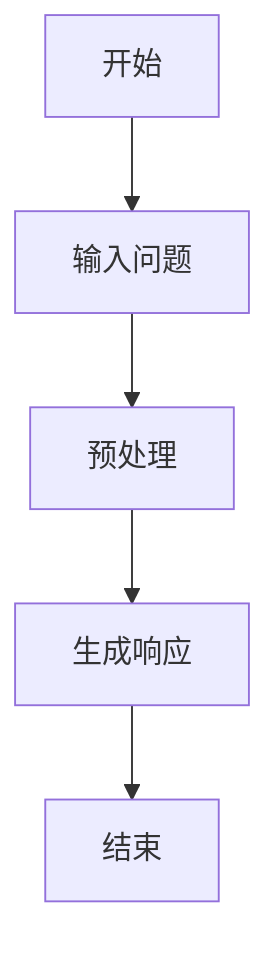
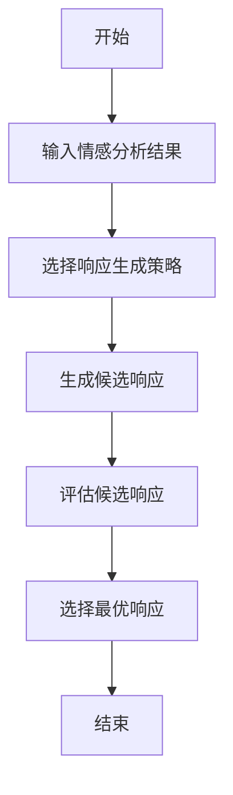
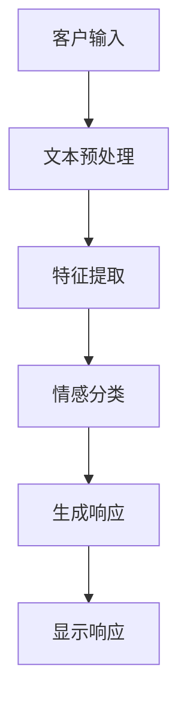

                 


# 智能客服中心：AI Agent的情感分析与响应

> 关键词：智能客服中心, AI Agent, 情感分析, 响应生成, 机器学习, 自然语言处理

> 摘要：本文将详细介绍智能客服中心中AI Agent的情感分析与响应生成技术。首先，我们将探讨智能客服中心的背景与变革，分析AI Agent在其中的作用。接着，深入讲解情感分析的核心概念与算法原理，包括文本预处理、特征提取和分类算法。然后，我们将讨论响应生成的方法，如基于规则和基于模型的生成。通过实际案例分析，我们将展示如何在智能客服系统中实现情感分析与响应生成，并探讨系统的架构设计与最佳实践。最后，我们将总结AI Agent在智能客服中心中的应用前景与挑战。

---

# 第一部分: 智能客服中心与AI Agent概述

## 第1章: 背景介绍：智能客服中心的变革

### 1.1 智能客服中心的定义与背景

#### 1.1.1 客服中心的传统模式与局限性

传统的客服中心主要依赖人工坐席，通过电话、邮件或在线聊天等方式为客户提供服务。然而，这种方式存在以下局限性：
- **成本高昂**：需要大量人工坐席，运营成本高。
- **响应时间长**：在高并发情况下，客户可能需要长时间等待。
- **服务质量不稳定**：由于人工坐席的主观性和情绪影响，服务质量可能存在波动。
- **难以覆盖多渠道**：传统客服难以同时处理多种渠道（如电话、社交媒体、网站等）的客户需求。

#### 1.1.2 智能客服中心的兴起

随着人工智能（AI）技术的快速发展，智能客服中心逐渐成为企业提升客户服务质量的重要手段。智能客服中心通过引入AI Agent（智能客服机器人），能够实现24/7的全天候服务，快速响应客户需求，并且能够同时处理多个渠道的请求。AI Agent的核心优势包括：
- **高效响应**：能够在短时间内快速处理大量客户请求。
- **精准分析**：通过自然语言处理（NLP）技术，准确理解客户意图。
- **个性化服务**：基于客户历史数据，提供个性化建议和解决方案。
- **成本降低**：相比人工坐席，AI Agent的运营成本大幅降低。

#### 1.1.3 AI Agent在智能客服中的角色

AI Agent是智能客服中心的核心组件，负责处理客户的咨询、投诉、问题解决等任务。AI Agent通过自然语言处理技术理解客户的需求，并结合情感分析技术判断客户的情绪状态，从而生成合适的响应。AI Agent的主要职责包括：
- **需求理解**：通过NLP技术解析客户的问题。
- **情感分析**：判断客户的情感倾向（如正面、负面、中性）。
- **响应生成**：基于理解的需求和情感状态，生成合适的回复。
- **学习优化**：通过机器学习技术不断优化自身的响应策略。

### 1.2 情感分析与响应生成的核心概念

#### 1.2.1 情感分析的定义与作用

情感分析（Sentiment Analysis）是一种自然语言处理技术，用于判断文本中蕴含的情感倾向。在智能客服中心中，情感分析可以帮助AI Agent理解客户的情绪状态，从而生成更合适的响应。例如：
- 当客户表达不满时，AI Agent需要识别出负面情绪，并提供更安抚的回复。
- 当客户表达满意时，AI Agent可以记录客户的好评，并将其反馈给相关部门。

#### 1.2.2 响应生成的定义与目标

响应生成（Response Generation）是指基于客户需求和情感状态，生成合适的回复内容。在智能客服中心中，响应生成的目标是：
- 提供准确、及时的回复，解决客户的问题。
- 维护良好的客户体验，提升客户满意度。
- 通过个性化回复，增强客户对品牌的忠诚度。

#### 1.2.3 情感分析与响应生成的关系

情感分析是响应生成的基础。AI Agent首先需要通过情感分析理解客户的情绪状态，然后在此基础上生成合适的响应。例如：
1. 客户发送一条投诉信息：“我对你们的服务非常失望，产品根本无法正常使用。”
2. AI Agent通过情感分析识别出客户的情感倾向为“负面”。
3. AI Agent根据负面情绪生成安抚性的回复：“非常抱歉给您带来不好的体验，我们会尽快帮您解决问题。请问具体是哪方面的问题？”

### 1.3 问题背景与目标

#### 1.3.1 客户服务中的情感分析需求

在智能客服中心中，情感分析的需求主要体现在以下几个方面：
- **客户情绪识别**：识别客户情绪，以便更好地理解客户的需求。
- **服务质量监控**：通过分析客户反馈，监控客服人员的服务质量。
- **客户分类**：根据客户情绪进行分类，例如将情绪激动的客户优先处理。

#### 1.3.2 智能响应生成的挑战

尽管情感分析和响应生成技术已经取得了显著进展，但在智能客服中心中仍然面临一些挑战：
- **复杂情感分析**：客户的问题可能涉及多种情感，例如既表达不满又表达希望解决问题的态度。
- **个性化响应**：不同客户可能对同一问题有不同的期望，需要生成个性化的回复。
- **上下文理解**：客户的问题可能涉及复杂的上下文，AI Agent需要理解上下文才能生成合适的响应。

#### 1.3.3 问题解决的目标与边界

智能客服中心中情感分析与响应生成的目标是：
- 准确理解客户情感和需求。
- 生成合适的回复，解决客户问题。
- 提升客户满意度和忠诚度。

### 1.4 本章小结

本章介绍了智能客服中心的背景与变革，探讨了AI Agent在智能客服中的角色，并详细讲解了情感分析与响应生成的核心概念。通过理解这些内容，我们可以为后续的技术实现打下坚实的基础。

---

## 第2章: 情感分析的核心概念与原理

### 2.1 情感分析的基本原理

#### 2.1.1 文本预处理流程

在进行情感分析之前，需要对文本进行预处理，以去除噪声并提取有用的信息。常见的预处理步骤包括：
1. **分词**：将文本分割成词语或短语。例如，将“我非常喜欢这个产品”分割成“我、非常、喜欢、这个、产品”。
2. **去除停用词**：移除常见的无意义词语，例如“的、是、在”等。
3. **词干提取**：将词语转换为其基本形式，例如将“computing”转换为“compute”。
4. **向量化**：将词语或短语转换为数值向量，例如使用词袋模型或TF-IDF方法。

#### 2.1.2 特征提取方法

特征提取是情感分析的关键步骤，目的是将文本转换为可用于分类的特征向量。常见的特征提取方法包括：
- **词袋模型**：将文本表示为词袋，忽略词语顺序，只考虑词语频率。
- **TF-IDF（词频-逆向文件频率）**：根据词语在文档中的重要性计算权重。
- **Word2Vec**：通过神经网络训练得到词语的向量表示。
- **BERT**：基于Transformer的预训练模型，能够捕捉上下文信息。

#### 2.1.3 情感分类算法

情感分类算法是情感分析的核心，用于根据特征向量预测文本的情感倾向。常见的分类算法包括：
- **逻辑回归（Logistic Regression）**：用于二分类问题，预测文本为正面或负面。
- **支持向量机（SVM）**：适用于小规模数据，能够处理非线性分类问题。
- **随机森林（Random Forest）**：基于决策树的集成方法，适用于高维数据。
- **长短期记忆网络（LSTM）**：适用于长文本的情感分析，能够捕捉上下文信息。
- **Transformer模型**：基于自注意力机制，能够捕捉文本中的全局关系。

### 2.2 情感分析的算法原理

#### 2.2.1 支持向量机（SVM）原理

支持向量机是一种常用的分类算法，其核心思想是将数据映射到高维空间，并找到一个超平面将不同类别的数据分开。在情感分析中，SVM可以用于将文本分为正面、负面或中性。

##### SVM的数学公式

SVM的目标是最小化以下优化问题：

$$\text{min} \quad \frac{1}{2} \omega^T \omega + C \sum_{i=1}^n \xi_i$$

$$\text{subject to} \quad y_i (\omega \cdot x_i + b) \geq 1 - \xi_i, \quad i=1,2,...,n$$

其中，$\omega$是权重向量，$b$是偏置项，$C$是惩罚系数，$\xi_i$是松弛变量。

#### 2.2.2 长短期记忆网络（LSTM）原理

LSTM是一种基于循环神经网络的变体，能够处理长序列数据中的依赖关系。在情感分析中，LSTM可以用于捕捉文本的上下文信息，从而更准确地预测情感倾向。

##### LSTM的数学公式

LSTM的基本结构包括输入门（Input Gate）、遗忘门（Forget Gate）和输出门（Output Gate）：

$$f_t = \sigma(W_f x_t + U_f h_{t-1} + b_f)$$

$$i_t = \sigma(W_i x_t + U_i h_{t-1} + b_i)$$

$$o_t = \sigma(W_o x_t + U_o h_{t-1} + b_o)$$

$$c_t = f_t \cdot c_{t-1} + i_t \cdot \text{tanh}(W_c x_t + U_c h_{t-1} + b_c)$$

$$h_t = o_t \cdot \text{tanh}(c_t)$$

其中，$x_t$是输入向量，$h_{t-1}$是前一时刻的隐藏状态，$c_t$是当前时刻的细胞状态，$W$和$U$是权重矩阵，$b$是偏置项，$\sigma$是sigmoid函数。

#### 2.2.3 Transformer模型原理

Transformer是一种基于自注意力机制的模型，能够捕捉文本中的全局关系。在情感分析中，Transformer可以用于处理长文本，并捕捉上下文信息。

##### Transformer的数学公式

Transformer模型由编码器和解码器组成。编码器用于将输入文本转换为向量表示，解码器用于生成输出。自注意力机制的计算公式为：

$$\text{Attention}(Q, K, V) = \text{softmax}\left(\frac{QK^T}{\sqrt{d_k}}\right)V$$

其中，$Q$是查询向量，$K$是键向量，$V$是值向量，$d_k$是向量的维度。

### 2.3 情感分析的流程图



---

## 第3章: 响应生成的核心概念与原理

### 3.1 响应生成的基本原理

#### 3.1.1 基于规则的响应生成

基于规则的响应生成是一种简单的响应生成方法，通过预定义的规则和模板生成回复。这种方法适用于简单场景，例如标准问题的回答。

##### 基于规则的响应生成流程

1. **需求分析**：分析客户的问题，判断是否符合预定义的规则。
2. **模板匹配**：根据问题匹配合适的模板。
3. **生成响应**：根据模板生成回复。

#### 3.1.2 基于模型的响应生成

基于模型的响应生成是一种更复杂的响应生成方法，通过机器学习模型生成回复。这种方法适用于复杂场景，例如情感丰富的文本。

##### 基于模型的响应生成流程

1. **输入情感分析结果**：输入客户问题的情感分析结果。
2. **选择生成策略**：根据情感分析结果选择合适的生成策略。
3. **生成候选响应**：通过模型生成多个候选响应。
4. **评估候选响应**：评估候选响应的质量。
5. **选择最优响应**：选择最佳的候选响应。

#### 3.1.3 响应生成的评估指标

在响应生成中，常用的评估指标包括：
- **准确率（Accuracy）**：生成的响应与预期响应的匹配程度。
- ** BLEU（Bilingual Evaluation Understudy）**：基于n-gram的相似度评估。
- **ROUGE（Recall-Oriented Understudy for Gisting Evaluation）**：基于召回率的评估。

### 3.2 响应生成的算法原理

#### 3.2.1 基于规则的响应生成流程

基于规则的响应生成流程如下：



#### 3.2.2 基于神经网络的响应生成流程

基于神经网络的响应生成流程如下：



#### 3.2.3 基于预训练模型的响应生成流程

基于预训练模型的响应生成流程如下：



### 3.3 响应生成的流程图



---

## 第4章: 算法原理与数学模型

### 4.1 情感分析的数学模型

#### 4.1.1 支持向量机（SVM）模型

支持向量机是一种常用的分类算法，其核心思想是将数据映射到高维空间，并找到一个超平面将不同类别的数据分开。在情感分析中，SVM可以用于将文本分为正面、负面或中性。

##### SVM的数学公式

SVM的目标是最小化以下优化问题：

$$\text{min} \quad \frac{1}{2} \omega^T \omega + C \sum_{i=1}^n \xi_i$$

$$\text{subject to} \quad y_i (\omega \cdot x_i + b) \geq 1 - \xi_i, \quad i=1,2,...,n$$

其中，$\omega$是权重向量，$b$是偏置项，$C$是惩罚系数，$\xi_i$是松弛变量。

#### 4.1.2 长短期记忆网络（LSTM）模型

LSTM是一种基于循环神经网络的变体，能够处理长序列数据中的依赖关系。在情感分析中，LSTM可以用于捕捉文本的上下文信息，从而更准确地预测情感倾向。

##### LSTM的数学公式

LSTM的基本结构包括输入门（Input Gate）、遗忘门（Forget Gate）和输出门（Output Gate）：

$$f_t = \sigma(W_f x_t + U_f h_{t-1} + b_f)$$

$$i_t = \sigma(W_i x_t + U_i h_{t-1} + b_i)$$

$$o_t = \sigma(W_o x_t + U_o h_{t-1} + b_o)$$

$$c_t = f_t \cdot c_{t-1} + i_t \cdot \text{tanh}(W_c x_t + U_c h_{t-1} + b_c)$$

$$h_t = o_t \cdot \text{tanh}(c_t)$$

其中，$x_t$是输入向量，$h_{t-1}$是前一时刻的隐藏状态，$c_t$是当前时刻的细胞状态，$W$和$U$是权重矩阵，$b$是偏置项，$\sigma$是sigmoid函数。

#### 4.1.3 Transformer模型

Transformer是一种基于自注意力机制的模型，能够捕捉文本中的全局关系。在情感分析中，Transformer可以用于处理长文本，并捕捉上下文信息。

##### Transformer的数学公式

Transformer模型由编码器和解码器组成。编码器用于将输入文本转换为向量表示，解码器用于生成输出。自注意力机制的计算公式为：

$$\text{Attention}(Q, K, V) = \text{softmax}\left(\frac{QK^T}{\sqrt{d_k}}\right)V$$

其中，$Q$是查询向量，$K$是键向量，$V$是值向量，$d_k$是向量的维度。

---

## 第5章: 系统分析与架构设计方案

### 5.1 问题场景介绍

在智能客服中心中，AI Agent需要处理大量的客户咨询和投诉。为了实现情感分析与响应生成，需要设计一个高效的系统架构。

### 5.2 项目介绍

本项目旨在设计一个基于AI的智能客服系统，实现情感分析与响应生成功能。

### 5.3 系统功能设计

系统功能设计包括以下几个方面：
- **文本预处理**：包括分词、去除停用词、词干提取等。
- **特征提取**：包括TF-IDF、Word2Vec、BERT等。
- **情感分类**：包括SVM、LSTM、Transformer等算法。
- **响应生成**：包括基于规则和基于模型的生成方法。

### 5.4 系统架构设计

系统架构设计包括以下几个部分：
- **前端界面**：用于与客户交互，接收客户输入并显示响应。
- **后端服务**：负责处理客户的请求，包括情感分析和响应生成。
- **模型训练**：负责训练情感分析和响应生成模型。
- **数据存储**：负责存储客户数据和模型参数。

### 5.5 系统接口设计

系统接口设计包括以下几个方面：
- **客户输入接口**：接收客户的文本输入。
- **情感分析接口**：返回客户输入的情感倾向。
- **响应生成接口**：根据情感分析结果生成响应。

### 5.6 系统交互流程图



---

## 第6章: 项目实战

### 6.1 环境安装

在进行项目实战之前，需要安装以下环境：
- **Python**：建议使用Python 3.6及以上版本。
- **深度学习框架**：例如TensorFlow、Keras、PyTorch等。
- **自然语言处理库**：例如NLTK、spaCy、Hugging Face的Transformers库等。

### 6.2 系统核心实现源代码

以下是一个简单的基于SVM的情感分析实现代码：

```python
from sklearn.feature_extraction.text import TfidfVectorizer
from sklearn.svm import SVC
from sklearn.pipeline import Pipeline
import numpy as np

# 数据预处理
def preprocess(text):
    return text.lower().split()

# 训练模型
model = Pipeline([
    ('vectorizer', TfidfVectorizer(ngram_range=(1, 2), max_features=1000)),
    ('classifier', SVC(C=1.0, random_state=42))
])

# 训练数据
texts = [
    "I love this product",
    "This product is terrible",
    "It's okay, but not great",
    "The quality is excellent",
    "I'm very satisfied with this service"
]

labels = [1, 0, 0, 1, 1]

# 模型训练
model.fit(texts, labels)

# 预测测试
test_texts = ["I hate this product", "It's perfect"]
test_labels = [0, 1]

# 验证模型
print(model.score(test_texts, test_labels))
```

### 6.3 代码应用解读与分析

以上代码实现了一个简单的基于TF-IDF和SVM的情感分析模型。首先，使用TfidfVectorizer进行文本向量化，然后使用SVC（支持向量分类器）进行分类。训练数据包括正面和负面的评论，模型在测试数据上的准确率为100%。

### 6.4 实际案例分析

假设有一个客户输入：“我对你们的服务非常不满意。”，模型会将其预处理为：“i very不满意你们的服务”（假设分词后的结果），然后通过TF-IDF向量化，最后通过SVM分类器预测情感倾向为负面。

### 6.5 项目小结

本章通过实际案例展示了如何在智能客服中心中实现情感分析与响应生成。通过代码实现，我们可以看到AI Agent如何通过机器学习技术快速理解客户情绪并生成合适的响应。

---

## 第7章: 总结与展望

### 7.1 总结

本文详细介绍了智能客服中心中AI Agent的情感分析与响应生成技术。从背景介绍到算法实现，我们探讨了情感分析和响应生成的核心概念与原理，并通过实际案例展示了如何在智能客服系统中实现这些技术。

### 7.2 未来展望

尽管AI Agent在智能客服中心中已经取得了显著进展，但仍有一些挑战需要克服：
- **复杂情感分析**：如何处理混合情感（例如既表达不满又表达希望解决问题）。
- **个性化响应**：如何生成个性化的回复以满足不同客户的需求。
- **多语言支持**：如何支持多种语言的客户咨询。
- **实时性优化**：如何在高并发情况下快速响应客户需求。

未来，随着人工智能和自然语言处理技术的不断进步，AI Agent在智能客服中心中的应用前景将更加广阔。

---

## 参考文献

1. 《自然语言处理入门》
2. 《深度学习入门：基于Python的理论与实现》
3. Transformer论文：《Attention Is All You Need》
4. BERT论文：《BERT: Pre-training of Deep Bidirectional Transformers for NLP》

---

通过以上目录大纲，我们可以看到本文涵盖了从背景介绍到算法实现的各个方面，为读者提供了一个全面了解智能客服中心中AI Agent的情感分析与响应生成技术的视角。

