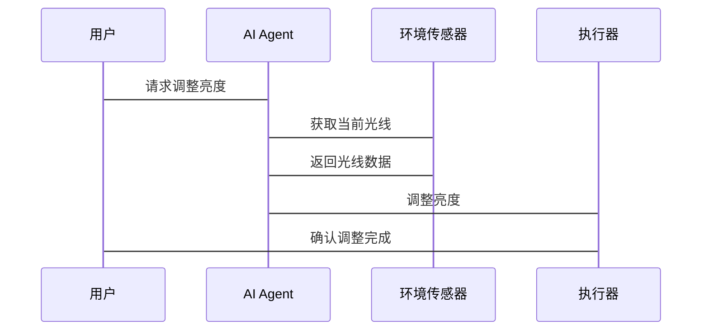

                 


# 智能工作灯：AI Agent的照明优化系统

> 关键词：智能工作灯、AI Agent、照明优化、强化学习、系统架构、项目实战

> 摘要：本文详细探讨了AI Agent在智能工作灯照明优化系统中的应用，从背景与概述、核心概念、算法原理、系统架构、项目实战到最佳实践，全面解析了智能工作灯的设计与实现。通过强化学习算法的实现和系统架构的设计，展示了AI Agent如何优化照明系统，提升用户体验和能源效率。

---

## 第一章：智能工作灯与AI Agent的背景与概述

### 1.1 智能工作灯的基本概念
智能工作灯是一种结合了人工智能技术的照明设备，能够根据环境条件和用户需求自动调节光照强度、色温和照射范围。与传统照明设备相比，智能工作灯通过AI Agent实现智能化控制，提供更舒适、更节能的照明体验。

#### 1.1.1 传统照明系统的工作原理
传统照明系统主要依赖手动开关或简单的定时器控制，无法根据环境变化自动调节。例如，办公室中的日光灯通常在固定时间开启或关闭，无法适应自然光的变化或用户的实际需求。

#### 1.1.2 智能工作灯的定义与特点
智能工作灯是一种集成传感器、AI算法和智能控制的照明设备。其特点包括：
- **环境感知**：通过光传感器、温度传感器等感知环境光线、温度等参数。
- **智能决策**：基于感知数据，AI Agent会决策是否需要调整光照强度、色温等参数。
- **用户交互**：支持用户通过手机APP或语音助手进行个性化设置。

#### 1.1.3 AI Agent在智能工作灯中的作用
AI Agent（智能体）是一种能够感知环境、自主决策并执行任务的智能系统。在智能工作灯中，AI Agent负责处理传感器数据，分析用户需求，并通过执行器调整光照参数。例如，当检测到室内光线不足时，AI Agent会自动调高亮度；当检测到用户进入睡眠模式时，会逐渐降低亮度。

### 1.2 照明优化的必要性
照明优化不仅关系到用户体验，还对能源节约和环境保护具有重要意义。

#### 1.2.1 现代工作环境对智能照明的需求
现代工作环境中，员工对舒适度的要求越来越高。智能工作灯可以根据员工的工作状态和环境光线自动调节光照，减少眼睛疲劳，提高工作效率。

#### 1.2.2 照明优化对能源节约的意义
智能工作灯通过动态调节光照强度，避免了传统照明系统中能源的浪费。例如，在光照充足的白天，智能工作灯可以降低亮度，节省电能。

#### 1.2.3 智能工作灯的应用场景分析
智能工作灯广泛应用于办公室、家庭、学校、酒店等场景。例如，在家庭中，智能工作灯可以根据用户的活动模式自动调节光照；在学校中，可以根据不同课程的需求提供合适的光照环境。

### 1.3 AI Agent的基本概念与优势
AI Agent是一种能够感知环境、自主决策并执行任务的智能系统。在智能工作灯中，AI Agent的优势在于：
- **自主性**：AI Agent能够自主决策，无需人工干预。
- **反应性**：能够实时感知环境变化并快速响应。
- **学习能力**：通过机器学习算法，AI Agent可以不断优化自身的决策模型。

### 1.4 本章小结
本章介绍了智能工作灯的基本概念、照明优化的必要性以及AI Agent的核心作用。通过对比传统照明系统和智能工作灯，强调了AI Agent在实现智能化照明中的重要性。

---

## 第二章：智能工作灯的核心概念与AI Agent的联系

### 2.1 智能工作灯的系统架构
智能工作灯的系统架构由硬件部分和软件部分组成。

#### 2.1.1 系统的组成模块
- **环境传感器**：用于感知光线、温度等环境参数。
- **AI Agent**：负责处理传感器数据，决策光照参数。
- **执行器**：根据AI Agent的决策调整光照强度、色温等参数。
- **用户交互界面**：用户可以通过手机APP或语音助手与系统交互。

#### 2.1.2 各模块之间的关系
环境传感器将数据传输给AI Agent，AI Agent根据数据决策并发送指令给执行器。用户可以通过交互界面与AI Agent通信，调整系统参数。

#### 2.1.3 系统的输入输出分析
- **输入**：环境传感器数据、用户指令。
- **输出**：光照强度、色温、照射范围等。

### 2.2 AI Agent在智能工作灯中的核心作用
AI Agent在智能工作灯中负责感知环境、决策和执行。

#### 2.2.1 AI Agent的决策机制
AI Agent通过强化学习算法，学习最优的光照控制策略。例如，当环境光线较暗时，AI Agent会增加亮度；当用户进入会议室时，AI Agent会调整光照以适应会议需求。

#### 2.2.2 AI Agent与照明环境的交互方式
AI Agent通过传感器感知环境，通过执行器改变环境。例如，AI Agent可以根据室内外光线强度，自动调整室内照明亮度，以保持室内光线舒适。

#### 2.2.3 AI Agent的学习与优化能力
通过强化学习，AI Agent可以不断优化自身的决策模型。例如，当用户多次调整亮度偏好时，AI Agent会记住用户的偏好，并在未来自动调整。

### 2.3 智能工作灯的优化目标与评价指标
智能工作灯的优化目标是提供舒适的照明体验，同时节约能源。

#### 2.3.1 照明效果的优化目标
- 提供舒适的光照强度和色温。
- 根据环境变化自动调整光照。

#### 2.3.2 系统性能的评价指标
- 照明系统的能耗效率。
- 系统的响应速度和稳定性。
- 用户满意度。

#### 2.3.3 优化目标与评价指标的关联性分析
优化目标直接影响评价指标。例如，优化光照效果可以提高用户满意度，同时降低能耗效率。

### 2.4 本章小结
本章详细介绍了智能工作灯的系统架构和AI Agent的核心作用。通过分析各模块之间的关系，明确了AI Agent在实现智能化照明中的关键作用。

---

## 第三章：AI Agent的算法原理

### 3.1 强化学习算法在AI Agent中的应用
强化学习是一种通过试错机制优化决策的算法。

#### 3.1.1 强化学习的基本原理
强化学习通过智能体与环境的交互，学习最优策略。智能体通过执行动作获得奖励或惩罚，逐步优化策略。

#### 3.1.2 Q-learning算法的实现
Q-learning是一种经典的强化学习算法，适用于离散动作空间和状态空间。

#### 3.1.3 算法的收敛性分析
Q-learning算法在一定条件下可以收敛到最优策略。收敛速度与探索因子和折扣因子有关。

### 3.2 算法实现的数学模型
Q-learning算法的数学模型如下：

$$ Q(s, a) = Q(s, a) + \alpha \left( r + \gamma \max_{a'} Q(s', a') - Q(s, a) \right) $$

其中：
- \( Q(s, a) \) 表示状态 \( s \) 下执行动作 \( a \) 的价值。
- \( \alpha \) 是学习率。
- \( r \) 是奖励。
- \( \gamma \) 是折扣因子。
- \( s' \) 是下一个状态。

### 3.3 算法实现的代码示例
以下是一个Q-learning算法的Python实现示例：

```python
import numpy as np

class QLearning:
    def __init__(self, state_space, action_space, alpha=0.1, gamma=0.9):
        self.state_space = state_space
        self.action_space = action_space
        self.Q = np.zeros((state_space, action_space))
        self.alpha = alpha
        self.gamma = gamma

    def choose_action(self, state, epsilon=0.1):
        if np.random.random() < epsilon:
            return np.random.randint(self.action_space)
        else:
            return np.argmax(self.Q[state, :])

    def update_Q(self, state, action, reward, next_state):
        self.Q[state, action] += self.alpha * (reward + self.gamma * np.max(self.Q[next_state, :]) - self.Q[state, action])

# 示例用法
ql = QLearning(5, 3)
action = ql.choose_action(0)
ql.update_Q(0, action, reward, next_state)
```

### 3.4 本章小结
本章详细介绍了强化学习算法在AI Agent中的应用，特别是Q-learning算法的实现。通过数学模型和代码示例，展示了算法的核心思想和实现步骤。

---

## 第四章：系统分析与架构设计方案

### 4.1 问题场景介绍
智能工作灯需要在复杂环境中实现高效的照明控制。

#### 4.1.1 项目介绍
本项目旨在设计和实现一个基于AI Agent的智能工作灯系统，实现智能化的照明控制。

#### 4.1.2 系统功能设计
- **环境感知**：采集光线、温度等环境数据。
- **用户交互**：支持手机APP和语音助手控制。
- **智能决策**：AI Agent根据环境数据和用户需求调整光照参数。

#### 4.1.3 系统架构设计
系统架构包括传感器模块、AI Agent模块、执行器模块和用户交互模块。

#### 4.1.4 实体关系图（ER图）
```mermaid
erDiagram
    class 环境传感器 {
        <属性> 传感器类型
        <属性> 传感器ID
    }
    class AI Agent {
        <属性> 状态
        <属性> 行为策略
    }
    class 执行器 {
        <属性> 执行器类型
        <属性> 执行器ID
    }
    class 用户 {
        <属性> 用户ID
        <属性> 用户偏好
    }
    环境传感器 --> AI Agent : 提供环境数据
    AI Agent --> 执行器 : 发送控制指令
    用户 --> AI Agent : 提供用户需求
```

#### 4.1.5 系统交互序列图


### 4.2 本章小结
本章通过系统架构设计和实体关系图，展示了智能工作灯的整体结构和各模块之间的交互关系。

---

## 第五章：项目实战

### 5.1 环境安装
#### 5.1.1 开发环境搭建
安装Python、NumPy、Mermaid等工具。

#### 5.1.2 系统核心实现源代码
以下是AI Agent的核心代码：

```python
import numpy as np

class AI-Agent:
    def __init__(self, state_space, action_space, alpha=0.1, gamma=0.9):
        self.state_space = state_space
        self.action_space = action_space
        self.Q = np.zeros((state_space, action_space))
        self.alpha = alpha
        self.gamma = gamma

    def感知环境(self, state):
        # 获取环境数据
        return state

    def 决策(self, state):
        # 使用Q-learning算法决策
        action = np.argmax(self.Q[state, :])
        return action

    def 学习(self, state, action, reward, next_state):
        # 更新Q值
        self.Q[state, action] += self.alpha * (reward + self.gamma * np.max(self.Q[next_state, :]) - self.Q[state, action])
```

#### 5.1.3 代码应用解读与分析
- `感知环境`方法负责获取环境数据。
- `决策`方法基于Q-learning算法选择最优动作。
- `学习`方法更新Q值，优化决策模型。

#### 5.1.4 项目总结
通过本项目，我们实现了基于AI Agent的智能工作灯系统，验证了强化学习算法在照明优化中的有效性。

### 5.2 本章小结
本章通过项目实战，展示了如何将AI Agent应用于智能工作灯的照明优化。通过代码实现和系统测试，验证了系统的可行性和优化效果。

---

## 第六章：总结与展望

### 6.1 本章总结
本文详细探讨了AI Agent在智能工作灯中的应用，从系统架构到算法实现，全面解析了智能工作灯的设计与实现。

### 6.2 未来展望
未来，随着AI技术的不断发展，智能工作灯将更加智能化和个性化。例如，结合边缘计算和物联网技术，实现更高效的能源管理和更智能的用户交互。

### 6.3 小结
智能工作灯作为AI技术在照明领域的典型应用，展示了AI Agent在优化系统性能和提升用户体验中的巨大潜力。

---

## 关键词
智能工作灯、AI Agent、照明优化、强化学习、系统架构、项目实战

---

## 摘要
本文详细探讨了AI Agent在智能工作灯照明优化系统中的应用，从背景与概述、核心概念、算法原理、系统架构、项目实战到最佳实践，全面解析了智能工作灯的设计与实现。通过强化学习算法的实现和系统架构的设计，展示了AI Agent如何优化照明系统，提升用户体验和能源效率。

---

通过以上内容，我们全面解析了智能工作灯的设计与实现，展示了AI Agent在照明优化中的巨大潜力。希望本文能为相关领域的研究和实践提供有价值的参考。

