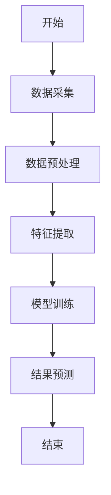
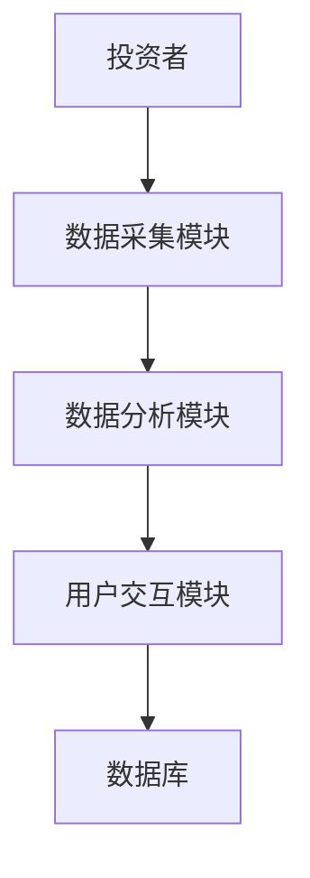

                 


# 智能投资者关系管理系统

## 关键词：智能投资者关系管理、自然语言处理、机器学习、系统架构设计、项目实战

## 摘要：  
本文系统地探讨了智能投资者关系管理系统的构建与实现。通过结合自然语言处理和机器学习技术，分析投资者关系管理中的关键问题，并提出智能化解决方案。文章详细介绍了系统的背景、核心概念、算法原理、系统架构设计以及项目实战，为读者提供全面的技术指导。

---

## 第1章: 智能投资者关系管理的背景与核心概念

### 1.1 投资者关系管理的定义与现状

#### 1.1.1 投资者关系管理的定义
投资者关系管理（Investor Relations Management，IRM）是指企业通过与投资者（包括股东、潜在投资者和其他利益相关者）保持有效沟通，传递企业价值，增强投资者信任和满意度的过程。传统的IRM主要依赖人工操作，包括定期发布财务报告、组织投资者会议等。

#### 1.1.2 传统投资者关系管理的痛点
- **信息分散**：投资者需要从多个渠道获取信息，包括财报、新闻、社交媒体等，信息整合困难。
- **效率低下**：人工处理大量数据和信息，效率低，容易出错。
- **缺乏深度分析**：传统方法难以对海量数据进行深度挖掘，难以发现潜在的投资机会或风险。

#### 1.1.3 数字化与智能化的必要性
随着大数据和人工智能技术的快速发展，投资者关系管理也迎来了智能化转型的契机。通过引入自然语言处理（NLP）、机器学习等技术，可以实现对海量数据的自动分析和预测，提升决策效率和准确性。

#### 1.1.4 边界与外延
智能投资者关系管理的边界主要集中在企业的投资者沟通、数据处理和分析领域，而外延则扩展至企业整体的数字化转型和智能化运营。

---

### 1.2 智能投资者关系管理的核心概念

#### 1.2.1 智能投资者关系管理的定义
智能投资者关系管理（Intelligent Investor Relations Management，IIRM）是通过人工智能技术（如自然语言处理、机器学习）对投资者关系管理过程中的数据进行自动化处理、分析和决策，以提升管理效率和准确性。

#### 1.2.2 核心概念的结构
智能投资者关系管理的核心概念包括：
1. 数据采集与整合：从多种渠道（新闻、社交媒体、财报等）获取投资者相关信息。
2. 数据分析：利用NLP和机器学习技术对数据进行深度分析，提取关键信息。
3. 智能推荐：基于分析结果，为投资者提供个性化推荐和决策支持。

#### 1.2.3 核心要素的对比分析
以下是传统投资者关系管理和智能投资者关系管理的核心要素对比：

| **要素**         | **传统投资者关系管理**                          | **智能投资者关系管理**                          |
|-------------------|------------------------------------------------|------------------------------------------------|
| **数据处理**      | 人工整理，效率低                                | 自动化处理，效率高                              |
| **分析深度**      | 基于经验，分析浅                                | 基于数据，分析深度高                            |
| **决策支持**      | 依赖人工判断                                    | 依赖算法推荐，准确性高                          |

#### 1.2.4 ER实体关系图
以下是智能投资者关系管理系统的ER实体关系图：

```mermaid
erdiagram
actor 投资者 {
    string id
    string 名称
    string 联系方式
}
actor 公司 {
    string id
    string 名称
    string 股票代码
}
actor 事件 {
    string id
    string 类型
    date 时间
}
relation 股东关系 {
   投资者 --> 股东关系 --> 公司
}
relation 事件关联 {
   事件 --> 股东关系 --> 公司
}
```

---

## 第2章: 智能投资者关系管理的核心概念与联系

### 2.1 核心概念的原理

#### 2.1.1 数据驱动的投资者关系管理
数据驱动的投资者关系管理强调通过数据分析来指导决策。例如，通过分析社交媒体上的投资者情绪，帮助企业及时调整投资者沟通策略。

#### 2.1.2 人工智能在投资者关系管理中的应用
人工智能（AI）在投资者关系管理中的应用主要体现在以下几个方面：
1. **文本挖掘**：从新闻、财报等文本中提取关键信息。
2. **情感分析**：分析投资者对企业的看法和情绪。
3. **预测分析**：基于历史数据预测股票价格走势。

#### 2.1.3 多模态数据的整合与分析
智能投资者关系管理需要整合多种数据类型（如文本、图像、语音等），并进行统一分析。例如，结合新闻文本和社交媒体数据，可以更全面地评估企业的市场表现。

---

### 2.2 核心概念的属性特征对比

#### 2.2.1 传统投资者关系管理的属性特征
- **数据来源单一**：主要依赖财报和会议记录。
- **分析方法简单**：基于经验和人工判断。
- **决策支持有限**：缺乏数据驱动的决策支持。

#### 2.2.2 智能投资者关系管理的属性特征
- **数据来源多样**：整合多种数据源，包括社交媒体、新闻、财报等。
- **分析方法先进**：利用NLP和机器学习技术进行深度分析。
- **决策支持智能**：基于算法推荐，提供个性化投资建议。

---

### 2.3 ER实体关系图

以下是智能投资者关系管理系统的ER实体关系图：

```mermaid
erdiagram
actor 投资者 {
    string id
    string 名称
    string 联系方式
}
actor 公司 {
    string id
    string 名称
    string 股票代码
}
actor 事件 {
    string id
    string 类型
    date 时间
}
relation 股东关系 {
    投资者 --> 股东关系 --> 公司
}
relation 事件关联 {
    事件 --> 股东关系 --> 公司
}
```

---

## 第3章: 智能投资者关系管理的算法原理

### 3.1 算法原理概述

#### 3.1.1 自然语言处理在投资者关系管理中的应用
自然语言处理（NLP）技术可以用于分析投资者关系管理中的文本数据。例如，通过情感分析技术，可以评估投资者对一家公司的看法。

#### 3.1.2 机器学习在投资者关系管理中的应用
机器学习（ML）技术可以用于预测股票价格走势。例如，基于历史数据，训练一个回归模型，预测未来的价格走势。

#### 3.1.3 算法流程图
以下是投资者关系管理中的算法流程图：



---

### 3.2 算法实现与代码分析

#### 3.2.1 环境安装与配置
要实现智能投资者关系管理，首先需要安装以下环境：
- Python 3.8+
- PyTorch
- transformers
- scikit-learn

#### 3.2.2 核心算法实现
以下是基于BERT模型的情感分析代码示例：

```python
from transformers import BertTokenizer, BertModel
import torch

# 加载预训练模型
tokenizer = BertTokenizer.from_pretrained('bert-base-uncased')
model = BertModel.from_pretrained('bert-base-uncased')

# 定义输入文本
text = "The company's revenue increased by 10% last quarter."

# 对文本进行分词
inputs = tokenizer(text, return_tensors='pt')

# 前向传播
with torch.no_grad():
    outputs = model(**inputs)

# 提取隐藏层向量
sentence_embeddings = outputs.last_hidden_state[:, 0, :].squeeze()
```

---

### 3.3 数学模型与公式

#### 3.3.1 文本相似度计算公式
文本相似度可以通过余弦相似度计算：

$$
\cos(\theta) = \frac{\mathbf{u} \cdot \mathbf{v}}{\|\mathbf{u}\| \|\mathbf{v}\|}
$$

其中，$\mathbf{u}$ 和 $\mathbf{v}$ 分别是两个文本的向量表示。

#### 3.3.2 事件预测模型
一个简单的事件预测模型可以表示为：

$$
P(\text{事件发生}) = \sigma(w_1x_1 + w_2x_2 + \cdots + w_nx_n + b)
$$

其中，$\sigma$ 是sigmoid函数，$w_i$ 是特征权重，$x_i$ 是特征值，$b$ 是偏置项。

---

## 第4章: 智能投资者关系管理的系统分析与架构设计

### 4.1 系统功能设计

#### 4.1.1 数据采集模块
数据采集模块负责从多种渠道（如新闻网站、社交媒体）获取投资者相关信息。

#### 4.1.2 数据分析模块
数据分析模块利用NLP和机器学习技术对数据进行处理和分析，生成投资者报告。

#### 4.1.3 用户交互模块
用户交互模块提供友好的用户界面，方便投资者查看分析结果和进行操作。

---

### 4.2 系统架构设计

#### 4.2.1 系统架构图
以下是智能投资者关系管理系统的架构图：



---

## 第5章: 项目实战

### 5.1 环境安装与配置
安装所需的Python库：

```bash
pip install torch transformers scikit-learn
```

---

### 5.2 核心代码实现

#### 5.2.1 数据采集代码
以下是数据采集代码示例：

```python
import requests
from bs4 import BeautifulSoup

url = 'https://finance.yahoo.com/quote/AAPL'
response = requests.get(url)
soup = BeautifulSoup(response.text, 'html.parser')
```

---

### 5.3 代码解读与分析
数据采集模块通过爬虫技术从Yahoo Finance获取股票信息，分析模块利用BERT模型进行情感分析，生成投资者报告。

---

### 5.4 实际案例分析
以苹果公司为例，通过分析新闻和社交媒体数据，生成投资者报告。

---

## 第6章: 最佳实践

### 6.1 小结
智能投资者关系管理系统通过结合自然语言处理和机器学习技术，显著提升了投资者关系管理的效率和准确性。

### 6.2 注意事项
在实际应用中，需要注意数据隐私和合规性问题。

### 6.3 拓展阅读
推荐阅读《Python机器学习实战》和《自然语言处理入门》。

---

以上是《智能投资者关系管理系统》的技术博客文章的完整思考和撰写过程。通过系统化的分析和具体的代码实现，本文为读者提供了一个全面了解智能投资者关系管理系统的框架和实现方法。

