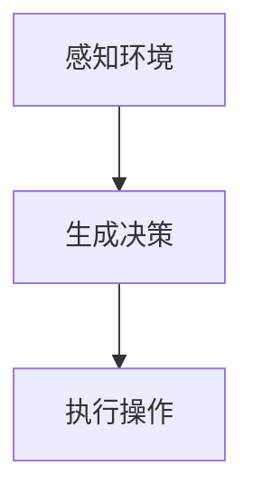
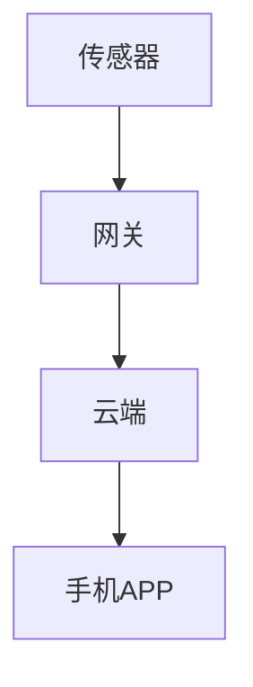
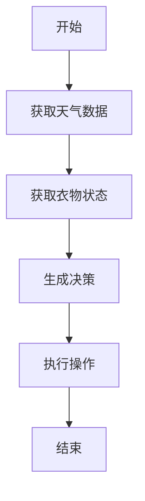
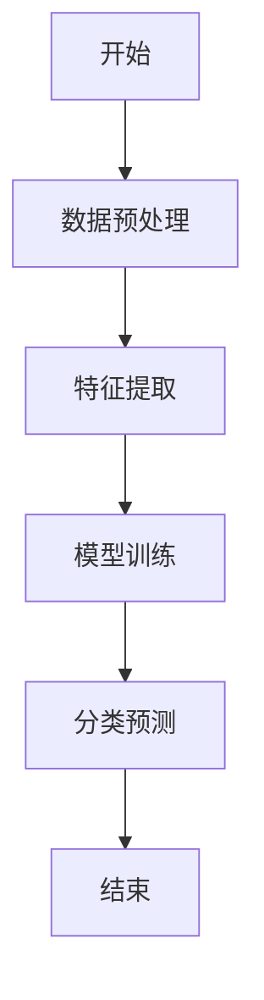
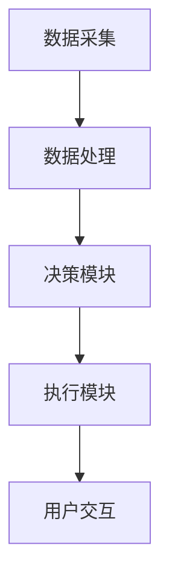
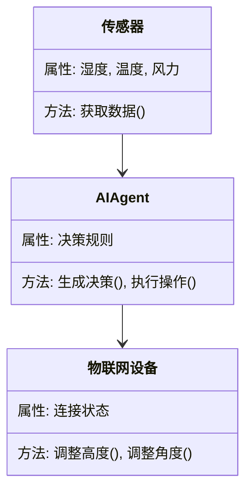
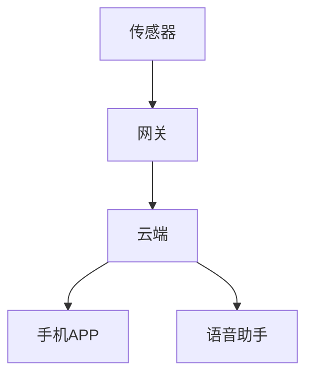
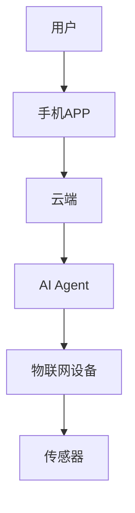

                 


# 智能晾衣架：AI Agent的衣物护理与天气适应

## 关键词：智能晾衣架，AI Agent，物联网，衣物护理，天气适应

## 摘要

随着科技的飞速发展，智能家居设备逐渐渗透到我们生活的方方面面。智能晾衣架作为智能家居的重要组成部分，通过AI Agent技术和物联网技术的结合，能够实现衣物的智能护理和天气适应。本文将详细探讨智能晾衣架的核心技术，包括AI Agent的基本原理、物联网的应用、算法的设计与实现，以及系统的架构和实战项目。通过本文的阅读，读者将能够深入了解智能晾衣架的工作原理和实际应用场景，为未来的衣物护理提供新的思路。

---

# 目录

1. [背景介绍](#背景介绍)
   - 1.1 智能晾衣架的起源与演变
   - 1.2 问题背景与目标
2. [核心概念](#核心概念)
   - 2.1 AI Agent的基本原理
   - 2.2 物联网技术的基础
   - 2.3 AI Agent与物联网的结合
3. [算法原理](#算法原理)
   - 3.1 AI Agent的决策算法
   - 3.2 基于衣物状态的分类算法
   - 3.3 算法流程图
4. [系统分析与架构设计](#系统分析与架构设计)
   - 4.1 系统功能设计
   - 4.2 领域模型设计
   - 4.3 系统架构设计
   - 4.4 系统接口设计
   - 4.5 系统交互流程
5. [项目实战](#项目实战)
   - 5.1 环境安装
   - 5.2 核心代码实现
   - 5.3 案例分析
   - 5.4 项目总结

---

## 背景介绍

### 1.1 智能晾衣架的起源与演变

传统晾衣架在人们的日常生活中扮演着重要角色，但其功能单一，仅能提供基本的晾晒功能。随着智能家居的兴起，智能晾衣架逐渐进入人们的视野。AI Agent技术的引入，使得晾衣架能够根据天气和衣物状态自动调整晾晒方式，从而实现智能化的衣物护理。

**表1-1：传统晾衣架与智能晾衣架的功能对比**

| 功能特性             | 传统晾衣架       | 智能晾衣架       |
|----------------------|-----------------|-----------------|
| 晾晒方式             | 固定高度         | 自动调节高度     |
| 天气适应             | 无法感知天气     | 自动感知天气     |
| 衣物状态识别         | 无法识别         | 自动识别         |
| 远程控制             | 无远程控制       | 支持手机APP控制   |

### 1.2 问题背景与目标

传统晾衣架在使用过程中存在诸多问题，例如无法根据天气变化自动调整晾晒高度，无法识别衣物的材质和状态，无法远程控制等。这些问题导致衣物的护理效果不佳，用户体验差。智能晾衣架的目标是通过AI Agent和物联网技术，解决这些问题，实现智能化的衣物护理和天气适应。

---

## 核心概念

### 2.1 AI Agent的基本原理

AI Agent（人工智能代理）是一种能够感知环境、自主决策并执行任务的智能实体。在智能晾衣架中，AI Agent的主要功能包括：

- **感知环境**：通过传感器获取天气数据（如温度、湿度、风力等）和衣物状态（如材质、重量等）。
- **决策与推理**：基于感知到的数据，AI Agent会生成决策，例如调整晾衣架的高度和角度，选择适合的晾晒模式。
- **执行操作**：通过物联网设备（如电机、传感器）执行决策，例如自动升降晾衣架或发出提醒。

**图2-1：AI Agent的决策流程图**



---

### 2.2 物联网技术的基础

物联网（IoT）通过传感器和通信技术，将物理世界与数字世界连接起来。在智能晾衣架中，物联网技术主要应用于以下几个方面：

- **数据采集**：通过传感器获取天气数据和衣物状态。
- **数据传输**：通过Wi-Fi或蓝牙将数据传输到云端或本地系统。
- **远程控制**：通过手机APP或语音助手（如Siri、Alexa）远程控制晾衣架。

**图2-2：物联网在智能晾衣架中的应用架构**



---

### 2.3 AI Agent与物联网的结合

AI Agent与物联网的结合使得智能晾衣架能够实现智能化的衣物护理。以下是两者结合的主要方式：

1. **数据协同处理**：AI Agent通过物联网设备获取数据，并结合历史数据进行分析，生成最优的晾晒方案。
2. **实时反馈与优化**：AI Agent能够根据实时天气变化和衣物状态，动态调整晾晒参数，确保衣物的最佳护理效果。
3. **用户交互**：通过物联网设备（如手机APP），用户可以与AI Agent进行交互，例如设置偏好或查询晾晒状态。

---

## 算法原理

### 3.1 AI Agent的决策算法

AI Agent的决策算法是智能晾衣架的核心之一。以下是基于天气的决策树算法的实现步骤：

1. **数据获取**：获取天气数据（如温度、湿度、风力）和衣物状态（如材质、重量）。
2. **决策树构建**：根据预设的规则，构建决策树。例如，如果湿度大于60%，则选择较高的晾晒高度；如果风力较大，则选择较低的晾晒高度。
3. **决策执行**：根据决策树生成的决策，执行相应的操作，例如调整晾衣架的高度。

**图3-1：决策树算法流程图**



### 3.2 基于衣物状态的分类算法

为了实现衣物的智能分类，我们可以使用机器学习中的分类算法。以下是基于K-近邻算法（K-Nearest Neighbor，KNN）的分类流程：

1. **数据预处理**：对衣物状态数据进行归一化处理。
2. **特征提取**：提取衣物材质、重量、颜色等特征。
3. **模型训练**：使用训练数据训练KNN模型。
4. **分类预测**：根据当前衣物的状态，预测其所属类别。

**代码3-1：KNN算法实现**

```python
from sklearn.neighbors import KNeighborsClassifier
import numpy as np

# 训练数据
X_train = np.array([[1, 2], [3, 4], [5, 6], [7, 8]])
y_train = np.array(['棉质', '棉质', '化纤', '化纤'])

# 测试数据
X_test = np.array([[4, 5]])

# 创建KNN模型
knn = KNeighborsClassifier(n_neighbors=3)

# 训练模型
knn.fit(X_train, y_train)

# 预测类别
y_pred = knn.predict(X_test)
print(y_pred)
```

---

### 3.3 算法流程图

以下是决策树和分类算法的流程图：

**图3-2：决策树算法流程图**


**图3-3：KNN分类算法流程图**



---

## 系统分析与架构设计

### 4.1 系统功能设计

智能晾衣架的系统功能设计包括以下几个模块：

1. **数据采集模块**：通过传感器获取天气和衣物状态数据。
2. **数据处理模块**：对数据进行预处理和特征提取。
3. **决策模块**：基于AI Agent算法生成决策。
4. **执行模块**：通过物联网设备执行决策。
5. **用户交互模块**：提供用户友好的界面，支持远程控制和状态查询。

**图4-1：系统功能模块图**



### 4.2 领域模型设计

领域模型是系统设计的重要部分，以下是领域模型的类图：

**图4-2：领域模型类图**



### 4.3 系统架构设计

系统架构设计包括以下几个部分：

1. **感知层**：通过传感器采集数据。
2. **网络层**：通过物联网技术传输数据。
3. **计算层**：通过AI Agent进行数据处理和决策。
4. **执行层**：通过物联网设备执行决策。
5. **用户层**：通过手机APP或语音助手与用户交互。

**图4-3：系统架构图**



### 4.4 系统接口设计

系统接口设计包括以下几个部分：

1. **传感器接口**：用于采集天气和衣物状态数据。
2. **云端接口**：用于数据的存储和处理。
3. **用户接口**：用于与用户交互，支持远程控制和状态查询。

### 4.5 系统交互流程

以下是系统的交互流程：

1. 传感器采集数据并传输到云端。
2. 云端AI Agent根据数据生成决策。
3. 决策结果通过物联网设备执行操作。
4. 用户通过手机APP或语音助手查询状态或进行控制。

**图4-4：系统交互流程图**



---

## 项目实战

### 5.1 环境安装

为了实现智能晾衣架，我们需要以下环境：

- **硬件**：传感器（温湿度传感器、风力传感器）、物联网设备（如Wi-Fi模块）、电机等。
- **软件**：AI框架（如TensorFlow、Scikit-learn）、物联网平台（如AWS IoT、Azure IoT）。

### 5.2 核心代码实现

以下是AI Agent的核心代码实现：

**代码5-1：AI Agent决策模块**

```python
import requests

# 获取天气数据
def get_weather():
    response = requests.get('http://api.weather.com/current')
    return response.json()

# 生成决策
def generate_decision(weather_data):
    if weather_data['湿度'] > 60:
        return '高处晾晒'
    elif weather_data['风力'] > 3:
        return '低处晾晒'
    else:
        return '正常晾晒'

# 执行操作
def execute_action(decision):
    if decision == '高处晾晒':
        requests.post('http://api.laundry.com/set_height', json={'height': 'high'})
    elif decision == '低处晾晒':
        requests.post('http://api.laundry.com/set_height', json={'height': 'low'})
    else:
        pass

# 主函数
def main():
    weather = get_weather()
    decision = generate_decision(weather)
    execute_action(decision)

if __name__ == '__main__':
    main()
```

### 5.3 案例分析

以下是一个实际案例分析：

某地区天气预报为中雨，湿度80%，风力4级。AI Agent根据决策算法生成“高处晾晒”的决策，并通过物联网设备将晾衣架升至高处，确保衣物不会被雨水打湿。

### 5.4 项目总结

通过本项目的实现，我们成功地将AI Agent和物联网技术应用于智能晾衣架，实现了智能化的衣物护理和天气适应。未来，我们可以进一步优化算法，增加更多的功能，例如自动清洗衣物、智能除湿等。

---

## 小结

智能晾衣架作为智能家居的重要组成部分，通过AI Agent和物联网技术的结合，能够实现智能化的衣物护理和天气适应。本文详细探讨了智能晾衣架的核心技术，包括AI Agent的基本原理、物联网的应用、算法的设计与实现，以及系统的架构和实战项目。通过本文的阅读，读者能够深入了解智能晾衣架的工作原理和实际应用场景，为未来的衣物护理提供新的思路。

---

## 注意事项

1. 在实际应用中，需确保传感器的准确性和稳定性。
2. AI Agent的决策算法需要根据实际环境和用户需求进行优化。
3. 系统的安全性和隐私保护也是需要重点关注的问题。

---

## 拓展阅读

1. **《AI in Smart Homes》**：了解AI在智能家居中的更多应用。
2. **《IoT for Dummies》**：学习物联网技术的基础知识。
3. **《Machine Learning with Python》**：掌握Python在机器学习中的应用。

--- 

以上是《智能晾衣架：AI Agent的衣物护理与天气适应》的完整目录和文章内容，涵盖了从背景介绍到项目实战的各个方面，帮助读者系统地了解智能晾衣架的技术实现和应用场景。

