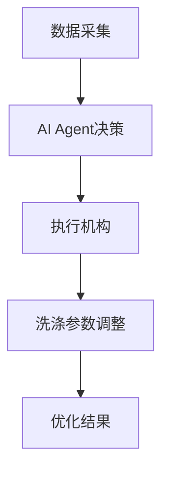

                 


# 智能洗碗机：AI Agent的用水与能源优化系统

## 关键词：AI Agent、智能洗碗机、用水优化、能源优化、强化学习、动态规划、系统架构

## 摘要：  
本文深入探讨了AI Agent在智能洗碗机中的应用，重点分析了如何通过AI技术优化用水和能源消耗。从AI Agent的基本原理到优化算法的设计，再到系统架构的实现，本文详细阐述了智能洗碗机在智能化背景下的优化策略。通过强化学习和动态规划的算法实现，结合系统架构设计，本文展示了如何构建高效、环保的智能洗碗机系统。

---

## 第一部分：背景介绍

### 第1章：智能洗碗机与AI Agent概述

#### 1.1 智能洗碗机的发展历程
1.1.1 传统洗碗机的功能与局限  
传统洗碗机通过固定程序运行，无法根据负载和水质自动调整用水量和能耗。用户需手动选择模式，效率较低且浪费资源。  

1.1.2 智能化趋势的兴起  
随着物联网和人工智能技术的发展，智能家电逐渐普及。智能洗碗机通过传感器和AI技术，实现了自动化感知和优化控制。  

1.1.3 AI Agent在智能洗碗机中的应用  
AI Agent作为智能洗碗机的核心，负责数据采集、决策优化和系统控制，使洗碗机能够实时调整工作模式，提高效率并减少浪费。  

#### 1.2 AI Agent的基本概念
1.2.1 什么是AI Agent  
AI Agent（人工智能代理）是一种智能体，能够感知环境、自主决策并执行任务。在智能洗碗机中，AI Agent负责优化用水和能源消耗。  

1.2.2 AI Agent的核心特征  
- **自主性**：无需人工干预，自动运行。  
- **反应性**：实时感知环境变化并调整策略。  
- **目标导向**：以优化用水和能源消耗为目标。  

1.2.3 AI Agent在智能洗碗机中的作用  
AI Agent通过分析负载、水质和能耗数据，动态调整洗涤模式，实现高效清洁和节能。  

#### 1.3 用水与能源优化的重要性
1.3.1 水资源与能源的现状  
全球水资源短缺和能源价格上涨，要求家电行业必须注重节能减排。  

1.3.2 洗碗机对环境的影响  
传统洗碗机能耗高、水浪费严重，已成为环境问题的重要因素。  

1.3.3 优化用水与能源的意义  
通过AI Agent优化用水和能源，不仅降低了使用成本，还为环保做出了贡献。  

---

## 第二部分：核心概念与联系

### 第2章：AI Agent的原理与实现

#### 2.1 AI Agent的基本原理
2.1.1 感知与决策机制  
AI Agent通过传感器感知环境数据（如负载量、水质、温度等），并基于这些数据进行优化决策。  

2.1.2 行为执行与反馈  
AI Agent根据决策结果执行动作（如调整水压、洗涤时间等），并根据反馈不断优化策略。  

#### 2.2 用水与能源优化的数学模型
2.2.1 模型构建的基本思路  
优化目标：最小化用水量和能耗。约束条件：满足洗涤效果、时间限制等。  

2.2.2 优化目标的数学表达  
$$ \text{目标：} \min \{ W, E \} $$
其中，W为用水量，E为能耗。  

2.2.3 约束条件的数学描述  
$$ \text{约束：} W \geq W_{\text{min}}, E \geq E_{\text{min}} $$  

---

## 第三部分：算法原理

### 第3章：AI Agent的优化算法

#### 3.1 基于强化学习的优化算法
3.1.1 强化学习的基本原理  
强化学习通过奖励机制训练AI Agent，使其在决策过程中不断优化行为。  

3.1.2 在洗碗机优化中的应用  
AI Agent根据环境反馈调整洗涤模式，选择最优动作以减少用水和能耗。  

3.1.3 算法实现的步骤  
1. 初始化：设定初始状态和参数。  
2. 感知：采集环境数据。  
3. 决策：基于策略网络输出动作。  
4. 执行：调整洗涤参数。  
5. 反馈：计算奖励并更新策略。  

#### 3.2 动态规划在用水优化中的应用
3.2.1 动态规划的基本概念  
动态规划通过分阶段决策，逐步优化全局目标。  

3.2.2 在洗碗机优化中的具体应用  
AI Agent通过动态规划算法，优化每一步的用水量，确保整体最优。  

3.2.3 算法实现的步骤  
1. 状态定义：当前水量、负载量等。  
2. 状态转移：根据决策调整水量。  
3. 目标函数：最小化总体用水量。  

---

## 第四部分：系统分析与架构设计

### 第4章：智能洗碗机的系统架构

#### 4.1 系统功能设计
4.1.1 用户需求分析  
用户需求：高效清洁、节能、智能控制。  

4.1.2 系统功能模块划分  
- 数据采集模块：采集负载、水质等数据。  
- AI Agent决策模块：优化洗涤参数。  
- 执行机构：调整洗涤模式。  

#### 4.2 系统架构设计
4.2.1 分层架构设计  
- 传感器层：数据采集。  
- 控制层：AI Agent决策。  
- 执行层：调整洗涤参数。  

4.2.2 模块间的交互关系  
数据采集模块→AI Agent决策模块→执行机构。  

---

## 第五部分：项目实战

### 第5章：AI Agent的实现与应用

#### 5.1 环境安装与配置
5.1.1 开发工具的安装  
安装Python、TensorFlow、Keras等工具。  

5.1.2 依赖库的安装与配置  
安装必要的库：numpy、pandas、scikit-learn等。  

#### 5.2 核心算法实现
5.2.1 强化学习算法的实现  
使用强化学习算法训练AI Agent，优化洗涤参数。  

5.2.2 动态规划算法的实现  
通过动态规划算法实现用水量的优化。  

---

## 第六部分：最佳实践与总结

### 第6章：总结与展望

#### 6.1 项目总结
6.1.1 项目成果回顾  
通过AI Agent实现了智能洗碗机的用水和能源优化。  

6.1.2 经验与教训总结  
- 数据采集的准确性至关重要。  
- 算法的选择需结合实际场景。  

#### 6.2 未来展望
6.2.1 技术发展的趋势  
AI Agent在家电中的应用将更加广泛。  

6.2.2 应用领域的扩展  
AI Agent技术可应用于更多家电领域，如空调、冰箱等。  

---

## 附录

### 附录A：相关代码示例

```python
import numpy as np
import tensorflow as tf
from tensorflow.keras import layers

# 强化学习网络
class AI_Agent:
    def __init__(self):
        self.model = self.build_model()
    
    def build_model(self):
        model = tf.keras.Sequential()
        model.add(layers.Dense(64, activation='relu'))
        model.add(layers.Dense(1, activation='linear'))
        model.compile(optimizer='adam', loss='mse')
        return model
    
    def perceive(self, state):
        return self.model.predict(state)
    
    def act(self, state, action_space):
        prediction = self.perceive(state)
        action = np.argmax(prediction)
        return action
```

### 附录B：系统架构图



---

通过以上详细的内容，我们系统地介绍了AI Agent在智能洗碗机中的应用，从理论到实践，帮助读者全面理解如何通过AI技术优化用水和能源消耗。

