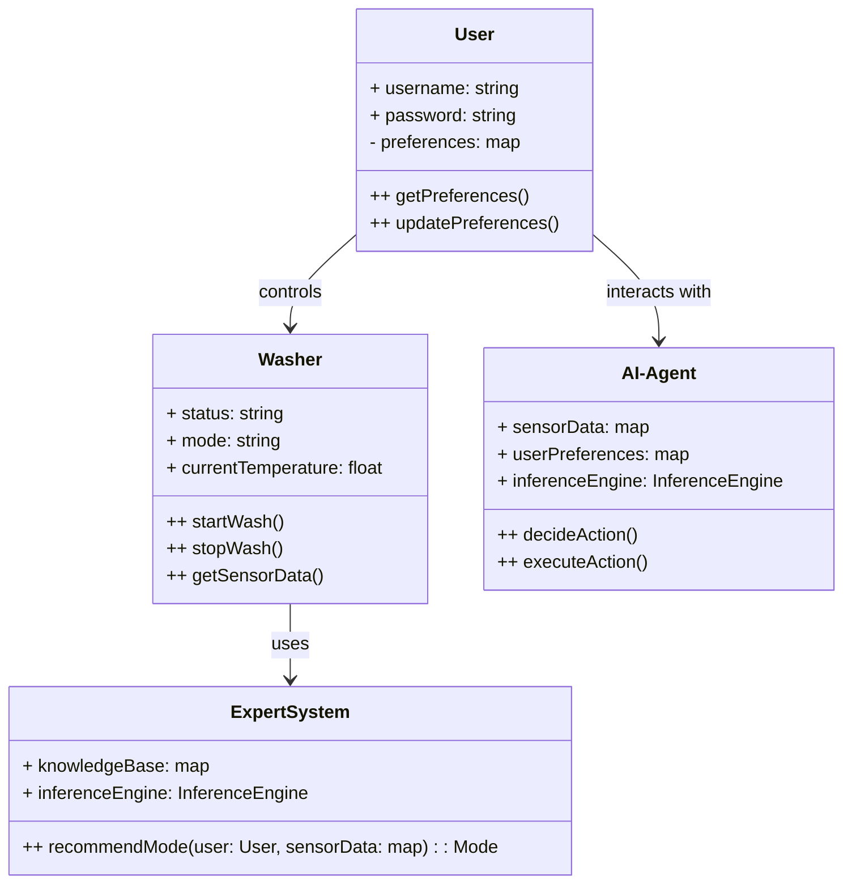
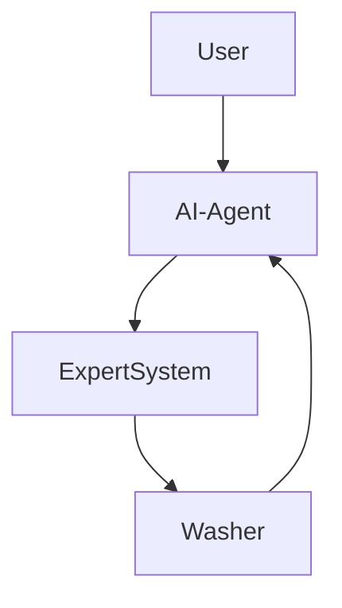
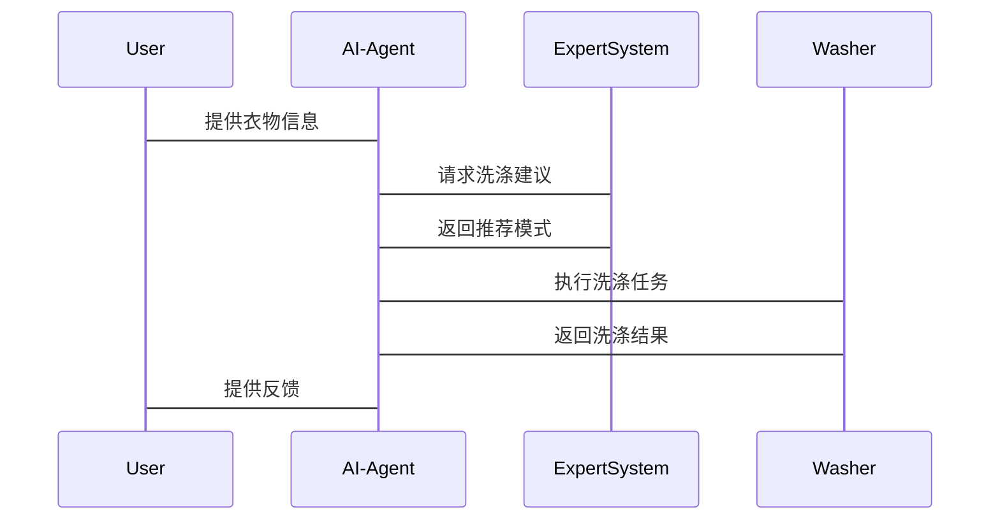

                 


# 智能洗衣机：AI Agent的衣物护理专家系统

## 关键词：
- 智能洗衣机
- AI Agent
- 衣物护理
- 专家系统
- 算法原理
- 系统架构

## 摘要：
本文深入探讨了智能洗衣机结合AI Agent的衣物护理专家系统的原理与实现。通过分析AI Agent的核心算法和衣物护理专家系统的数学模型，结合系统架构设计和实际项目案例，详细讲解了如何利用AI技术提升洗衣机的智能化水平，实现个性化的衣物护理。文章内容涵盖背景介绍、算法实现、系统设计、项目实战等，旨在为读者提供全面的技术解读。

---

# 第1章: 智能洗衣机的发展历程

## 1.1 传统洗衣机的局限性

### 1.1.1 传统洗衣机的功能特点
传统洗衣机的功能相对单一，主要集中在洗涤、漂洗、脱水等基本操作上。用户需要手动选择洗涤模式，无法根据衣物材质、脏污程度等因素自动调整洗涤参数。

### 1.1.2 用户需求的演变
随着生活水平的提高，用户对洗衣机的需求逐渐从“基本功能满足”转向“智能化、个性化”。用户希望洗衣机能够自动识别衣物材质，智能调整洗涤强度，甚至能够预测衣物的使用寿命。

### 1.1.3 洗涤技术的瓶颈
传统洗涤技术在处理特殊材质衣物（如丝绸、羊绒）时，容易导致衣物损坏。此外，洗涤剂的用量和水温的控制也需要更加精准，以减少浪费和提高洗涤效率。

## 1.2 AI Agent的引入与智能洗衣机的结合

### 1.2.1 AI Agent的基本概念
AI Agent（人工智能代理）是一种能够感知环境、自主决策并执行任务的智能实体。在智能洗衣机中，AI Agent可以用于衣物识别、洗涤模式推荐和故障诊断等功能。

### 1.2.2 AI Agent在洗衣机中的应用场景
AI Agent可以实时监测洗衣机的运行状态，分析用户的使用习惯，并根据环境数据（如温度、湿度）调整洗涤参数。例如，当检测到衣物材质较敏感时，AI Agent会自动选择温和的洗涤模式。

### 1.2.3 智能洗衣机的定义与分类
智能洗衣机是指集成了AI技术的洗衣机，能够通过传感器和AI算法实现衣物识别、智能洗涤、远程控制等功能。根据功能复杂度，智能洗衣机可以分为基础智能型和高级专家型。

## 1.3 衣物护理专家系统的概念

### 1.3.1 衣物护理的基本需求
衣物护理不仅仅是清洁，还包括保护衣物材质、延长使用寿命等方面。不同材质的衣物需要不同的护理方式，例如丝绸需要轻柔洗涤，羊毛需要低温烘干。

### 1.3.2 专家系统的核心原理
专家系统是一种基于知识库和推理引擎的智能系统，能够模拟人类专家的决策过程。在衣物护理专家系统中，系统会根据衣物的材质、颜色、脏污程度等因素，推荐最优的洗涤方案。

### 1.3.3 智能洗衣机与专家系统的结合
智能洗衣机通过内置的专家系统，能够根据用户输入的衣物信息，自动调取最优的洗涤程序。例如，当用户选择“羊毛”模式时，系统会自动调整水温、洗涤时间和洗涤剂用量。

## 1.4 本章小结
本章介绍了传统洗衣机的局限性，以及AI Agent和衣物护理专家系统在智能洗衣机中的应用。AI Agent的引入使洗衣机具备了智能化决策能力，而专家系统的应用则进一步提升了衣物护理的精准度和效果。

---

# 第2章: AI Agent的核心原理与算法

## 2.1 AI Agent的基本原理

### 2.1.1 AI Agent的定义与特点
AI Agent是一种能够感知环境、自主决策并执行任务的智能实体。它具有主动性、反应性和社会性等特点，能够在动态环境中灵活应对各种问题。

### 2.1.2 AI Agent的分类与应用场景
AI Agent可以根据智能水平分为简单反应式Agent和基于模型的反思式Agent。在智能洗衣机中，AI Agent主要用于衣物识别、洗涤模式推荐和故障诊断。

### 2.1.3 AI Agent的核心算法
AI Agent的核心算法包括决策树、聚类分析和神经网络等。这些算法帮助AI Agent在复杂环境中做出最优决策。

## 2.2 衣物护理专家系统的算法实现

### 2.2.1 专家系统的基本结构
专家系统由知识库、推理引擎和用户界面三部分组成。知识库存储衣物材质、洗涤参数等信息，推理引擎根据用户输入和知识库中的数据，生成最优的洗涤方案。

### 2.2.2 基于规则的推理算法
基于规则的推理算法通过预定义的规则（如“丝绸材质需低水温洗涤”）进行推理。这种算法简单易懂，但在处理复杂问题时可能会显得不够灵活。

### 2.2.3 基于机器学习的推理算法
基于机器学习的推理算法通过训练数据，自动提取衣物护理的知识。这种算法能够处理复杂的问题，但需要大量的训练数据和计算资源。

## 2.3 AI Agent与专家系统的协同工作

### 2.3.1 AI Agent与专家系统的结合方式
AI Agent可以通过调用专家系统的API，获取衣物护理的建议。例如，AI Agent根据传感器数据判断衣物的脏污程度，然后调用专家系统推荐洗涤模式。

### 2.3.2 协同工作的流程与机制
1. AI Agent感知环境数据（如衣物材质、脏污程度）。
2. AI Agent调用专家系统，获取最优的洗涤方案。
3. AI Agent执行洗涤任务，实时监控洗涤过程。
4. 根据反馈结果，AI Agent调整洗涤参数。

### 2.3.3 协同工作中的数据流与信息交互
数据流包括传感器数据、用户输入和洗涤结果等。信息交互主要通过API和消息队列实现。

## 2.4 本章小结
本章详细介绍了AI Agent的核心原理和算法，以及它与衣物护理专家系统的协同工作方式。通过结合规则推理和机器学习算法，AI Agent能够实现智能化的衣物护理。

---

# 第3章: 衣物护理专家系统的数学模型与算法

## 3.1 基于规则的推理算法

### 3.1.1 规则库的构建
规则库由领域专家编写，包含衣物材质、颜色、脏污程度等条件。例如，规则可以是“如果衣物材质为丝绸，则洗涤水温不超过30℃”。

### 3.1.2 基于规则的推理过程
推理过程包括匹配规则和执行动作两个步骤。当用户输入衣物信息后，系统会匹配与之相关的规则，并执行相应的洗涤操作。

### 3.1.3 规则的冲突解决机制
当多个规则同时满足时，系统需要优先执行优先级较高的规则。例如，洗涤强度优先于水温调整。

## 3.2 基于机器学习的推理算法

### 3.2.1 机器学习的基本原理
机器学习通过训练数据，构建预测模型。在衣物护理中，可以使用分类算法（如决策树、随机森林）来预测洗涤模式。

### 3.2.2 常见的机器学习算法及其应用
- **决策树**：用于分类衣物材质和脏污程度。
- **支持向量机（SVM）**：用于模式识别。
- **神经网络**：用于复杂模式的学习和预测。

### 3.2.3 在衣物护理中的具体应用
通过训练数据，机器学习算法可以自动识别衣物的材质和脏污程度，推荐最优的洗涤模式。

## 3.3 综合推理模型的构建

### 3.3.1 综合推理模型的结构
综合推理模型将规则推理和机器学习推理结合起来，通过加权投票的方式，生成最终的洗涤方案。

### 3.3.2 综合推理模型的优势
综合推理模型结合了规则推理的确定性和机器学习的灵活性，能够更好地应对复杂问题。

## 3.4 本章小结
本章详细讲解了基于规则和机器学习的推理算法，以及如何构建综合推理模型。通过结合不同算法的优势，可以提升衣物护理的智能化水平。

---

# 第4章: 系统分析与架构设计方案

## 4.1 问题场景介绍

### 4.1.1 用户需求分析
用户希望洗衣机能够自动识别衣物材质，智能调整洗涤参数，并提供个性化的洗涤建议。

### 4.1.2 系统功能设计
- 衣物识别与分类
- 洗涤模式推荐
- 洗涤过程监控
- 远程控制与反馈

## 4.2 系统架构设计

### 4.2.1 领域模型的类图


### 4.2.2 系统架构图


### 4.2.3 系统交互序列图


## 4.3 本章小结
本章通过系统架构设计和交互图，详细描述了智能洗衣机的实现方式。通过AI Agent和专家系统的协同工作，系统能够实现智能化的衣物护理。

---

# 第5章: 项目实战

## 5.1 环境安装与配置

### 5.1.1 开发环境
- 操作系统：Linux
- 开发工具：PyCharm
- 依赖库：scikit-learn、numpy、pandas

### 5.1.2 数据集准备
需要收集不同材质和脏污程度的衣物数据，包括衣物材质、颜色、脏污程度等信息。

## 5.2 系统核心实现源代码

### 5.2.1 AI Agent的核心代码
```python
class AI-Agent:
    def __init__(self):
        self.sensor_data = {}
        self.preferences = {}
        self.inference_engine = InferenceEngine()

    def decide_action(self):
        # 获取传感器数据
        data = self.sensor.get_data()
        # 调用推理引擎
        recommendation = self.inference_engine.recommend_mode(data)
        return recommendation

    def execute_action(self, action):
        # 执行具体动作
        pass
```

### 5.2.2 专家系统的代码实现
```python
class InferenceEngine:
    def __init__(self):
        self.rules = {}  # 预定义规则

    def recommend_mode(self, data):
        # 匹配规则并返回推荐模式
        pass
```

### 5.2.3 算法实现
```python
from sklearn.tree import DecisionTreeClassifier
import numpy as np

# 训练决策树模型
model = DecisionTreeClassifier()
model.fit(X, y)

# 预测洗涤模式
predicted_mode = model.predict(X_new)
```

## 5.3 代码应用解读与分析

### 5.3.1 代码功能说明
- `AI-Agent`类负责与用户交互和调用专家系统。
- `InferenceEngine`类负责根据传感器数据推荐洗涤模式。
- `DecisionTreeClassifier`用于训练和预测洗涤模式。

### 5.3.2 代码优化建议
- 增加错误处理机制，确保系统稳定性。
- 优化数据预处理流程，提高训练效率。

## 5.4 实际案例分析

### 5.4.1 案例背景
用户上传一件羊毛材质的深色衣物，脏污程度为中等。

### 5.4.2 系统处理流程
1. AI Agent获取衣物信息。
2. 专家系统推荐洗涤模式。
3. AI Agent执行洗涤任务。
4. 系统监控洗涤过程并反馈结果。

## 5.5 本章小结
本章通过实际项目案例，详细讲解了智能洗衣机的实现过程。通过代码示例和系统交互，读者可以更好地理解AI Agent和专家系统的应用。

---

# 第6章: 最佳实践与总结

## 6.1 最佳实践 tips
- 定期更新规则库和机器学习模型，确保系统适应新的衣物材质和洗涤需求。
- 优化传感器数据采集和处理流程，提高系统的响应速度和准确性。

## 6.2 小结
本文详细探讨了智能洗衣机结合AI Agent的衣物护理专家系统的实现。通过算法原理和系统架构设计，展示了如何利用AI技术提升洗衣机的智能化水平。

## 6.3 注意事项
- 确保系统的安全性，防止数据泄露。
- 优化用户体验，提供友好的交互界面。

## 6.4 拓展阅读
- 《人工智能在家电行业的应用》
- 《基于机器学习的专家系统设计》

---

# 结语
智能洗衣机作为AI技术在家电领域的典型应用，正在逐步改变人们的洗衣习惯。通过AI Agent和衣物护理专家系统的结合，洗衣机将变得更加智能化和个性化，为用户带来更好的使用体验。

