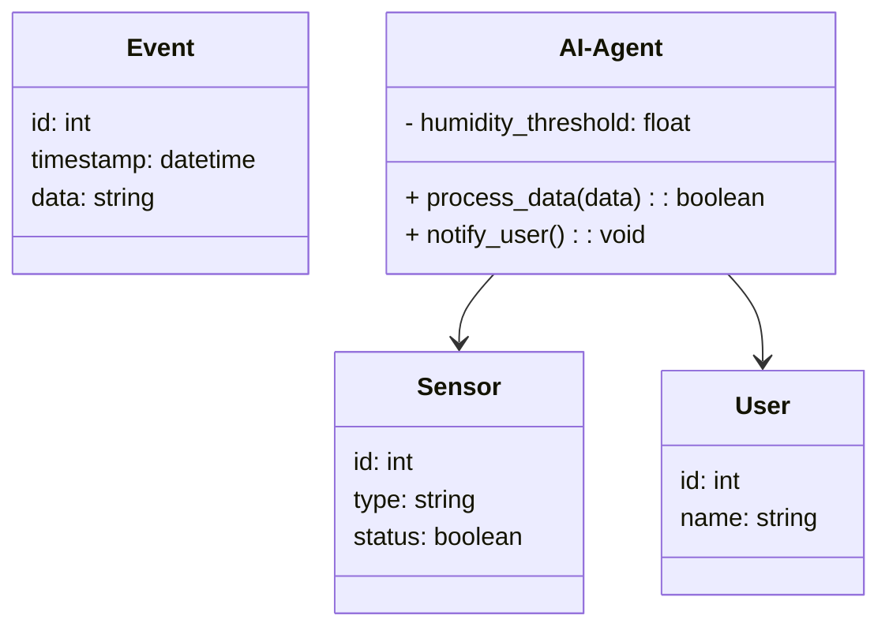
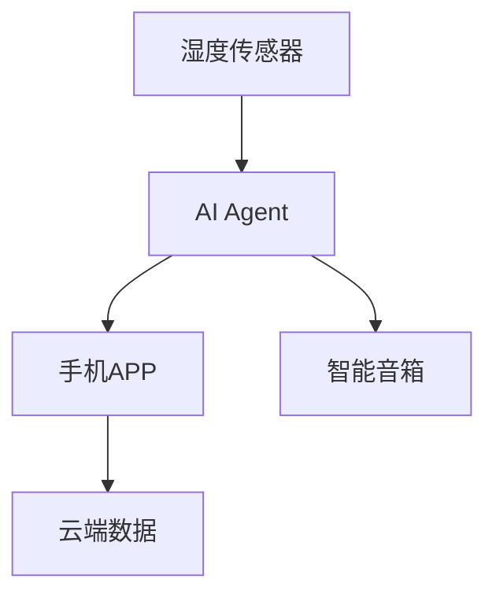

                 


# 智能浴室毛巾架：AI Agent的毛巾更换提醒

> 关键词：智能浴室毛巾架，AI Agent，物联网，传感器，智能家居，数据处理

> 摘要：本文介绍了智能浴室毛巾架的设计与实现，重点探讨了AI Agent在毛巾更换提醒中的应用。通过物联网技术，系统能够实时监测环境湿度和毛巾使用状态，结合AI算法自动触发通知，为用户提供智能化的生活体验。

---

## 第一部分：背景与概述

### 第1章：智能浴室毛巾架的背景与问题描述

#### 1.1 问题背景

浴室是一个湿度较高且容易滋生细菌的地方，毛巾作为日常使用的重要物品，容易受潮、发霉，甚至滋生细菌。传统的浴室毛巾架不具备智能监测和提醒功能，用户往往需要手动检查毛巾的状态，这不仅不方便，还可能导致毛巾长期使用而产生健康隐患。

此外，随着智能家居的普及，用户对卫浴产品的智能化需求日益增加。智能浴室毛巾架不仅要解决毛巾更换的问题，还要具备与其他智能家居设备联动的能力，提升整体的用户体验。

#### 1.2 问题描述

- **问题一**：如何实时监测毛巾的使用状态和环境湿度，确保用户能够及时更换毛巾？
- **问题二**：如何设计一个智能化的系统，能够自动提醒用户更换毛巾？
- **问题三**：如何将AI技术与物联网技术结合，实现智能化的毛巾更换提醒功能？

#### 1.3 问题解决思路

智能浴室毛巾架的核心是通过AI Agent实现 towel更换的智能提醒。系统通过湿度传感器实时监测浴室环境的湿度，结合毛巾使用频率，判断是否需要更换毛巾。当系统判定需要更换时，AI Agent会通过手机APP或语音助手（如智能音箱）通知用户。

#### 1.4 系统边界与外延

智能浴室毛巾架系统包括以下几个核心组件：
- **湿度传感器**：用于监测浴室环境的湿度。
- **AI Agent**：负责数据处理、决策和通知。
- **用户交互界面**：包括手机APP和智能家居设备（如智能音箱）。

系统的外部边界包括与智能家居设备的联动，以及与云端数据平台的交互。

---

## 第二部分：核心概念与联系

### 第2章：AI Agent与智能传感器的核心原理

#### 2.1 AI Agent的基本原理

AI Agent（智能代理）是一种能够感知环境、执行任务的智能实体。在智能浴室毛巾架中，AI Agent的主要功能包括：
1. **数据采集**：接收湿度传感器的数据。
2. **数据处理**：分析数据，判断是否需要更换毛巾。
3. **决策与通知**：当需要更换毛巾时，通过APP或语音助手通知用户。

AI Agent可以基于规则或事件驱动的方式工作。例如：
- **基于规则**：当湿度超过某个阈值时，触发通知。
- **事件驱动**：当传感器检测到特定事件（如湿度突然升高）时，触发通知。

#### 2.2 智能传感器的数据采集与处理

湿度传感器是智能浴室毛巾架的核心传感器之一。传感器通过采集环境湿度数据，传递给AI Agent进行处理。湿度传感器的主要特点包括：
- **高灵敏度**：能够准确感知环境湿度的变化。
- **低功耗**：适合长期运行在智能设备中。

#### 2.3 核心概念的对比分析

以下是AI Agent与传统传感器的对比：

| 对比维度 | AI Agent | 传统传感器 |
|----------|-----------|------------|
| 功能     | 数据处理、决策 | 数据采集   |
| 智能性   | 高         | 低         |
| 应用场景 | 复杂场景   | 简单场景   |

#### 2.4 系统的ER实体关系图

```mermaid
entity User {
  id: int
  name: string
}
entity Sensor {
  id: int
  type: string
  status: boolean
}
entity Event {
  id: int
  timestamp: datetime
  data: string
}
```

---

## 第三部分：算法原理与实现

### 第3章：AI Agent的算法实现

#### 3.1 自然语言处理算法

AI Agent需要通过自然语言处理（NLP）技术与用户交互。例如，当用户询问“今天湿度怎么样？”时，AI Agent需要理解用户的意图并返回相应的信息。

自然语言处理流程如下：

1. **文本分割**：将输入文本分割成单词或短语。
2. **意图识别**：识别用户的意图（如查询湿度）。
3. **生成响应**：根据意图生成相应的回复。

以下是一个简单的自然语言处理示例：

```python
def nlp_process(text):
    # 文本分割
    words = text.split()
    # 意图识别
    if "湿度" in words:
        return "当前湿度为：XX%。"
    else:
        return "抱歉，我不明白您的意思。"
```

#### 3.2 传感器数据处理算法

湿度传感器的数据处理流程如下：

1. **数据采集**：获取传感器的湿度值。
2. **数据预处理**：对数据进行去噪和归一化处理。
3. **数据存储**：将处理后的数据存储在本地或云端。

以下是湿度传感器数据处理的代码示例：

```python
import numpy as np

def process_humidity(data):
    # 数据预处理：去噪
    filtered_data = np.mean(data[-10:])
    # 归一化处理
    normalized_data = (filtered_data - np.min(data)) / (np.max(data) - np.min(data))
    return normalized_data
```

---

## 第四部分：系统分析与架构设计方案

### 第4章：系统架构设计

#### 4.1 问题场景介绍

智能浴室毛巾架的系统架构需要满足以下需求：
- 实时监测浴室环境的湿度。
- 自动判断是否需要更换毛巾。
- 通过APP或语音助手通知用户。

#### 4.2 项目介绍

智能浴室毛巾架项目的目标是通过AI Agent实现 towel更换的智能提醒。系统架构包括以下几个部分：
- **湿度传感器**：用于采集环境湿度数据。
- **AI Agent**：负责数据处理、决策和通知。
- **用户交互界面**：包括手机APP和智能家居设备。

#### 4.3 系统功能设计

以下是系统的功能模块划分：



#### 4.4 系统架构设计

以下是系统的架构图：



#### 4.5 系统接口设计

系统的接口设计如下：
- **传感器接口**：湿度传感器通过I2C或UART接口与AI Agent连接。
- **用户反馈接口**：AI Agent通过蓝牙或Wi-Fi与手机APP和智能音箱连接。

#### 4.6 系统交互流程

以下是系统的交互流程：

```mermaid
sequenceDiagram
    User -> AI-Agent: 查询湿度
    AI-Agent -> Sensor: 获取湿度数据
    Sensor --> AI-Agent: 返回湿度数据
    AI-Agent -> User: 显示湿度信息
    AI-Agent -> Sensor: 判断是否需要更换毛巾
    如果需要更换：
        AI-Agent -> User: 通知更换毛巾
    否则：
        AI-Agent -> User: 不需要更换
```

---

## 第五部分：项目实战

### 第5章：项目实战

#### 5.1 环境安装

以下是项目实战所需的环境和工具：
1. **硬件**：
   - 湿度传感器（如DHT22）
   - ESP32开发板
2. **软件**：
   - Python编程语言
   - TensorFlow（用于AI Agent的训练）
   - MQTT（用于传感器数据的传输）
3. **工具**：
   - Arduino IDE（用于传感器连接）
   - PyCharm（用于Python开发）

#### 5.2 系统核心实现

以下是AI Agent的核心代码实现：

```python
import mqtt
import tensorflow as tf

# 初始化AI模型
model = tf.keras.Sequential([
    tf.keras.layers.Dense(64, activation='relu'),
    tf.keras.layers.Dense(1, activation='sigmoid')
])

# 训练模型
model.compile(optimizer='adam', loss='binary_crossentropy', metrics=['accuracy'])
model.fit(X_train, y_train, epochs=10, batch_size=32)

# MQTT连接
client = mqtt.Client()
client.connect("localhost", 1883)

# AI Agent核心逻辑
def process_data(data):
    prediction = model.predict(data)
    return prediction[0][0] > 0.5

def on_message(msg):
    data = float(msg.payload.decode())
    if process_data(data):
        client.publish("towel_notification", "请更换毛巾！")

client.on_message = on_message
client.subscribe("humidity_sensor")
client.loop_forever()
```

#### 5.3 案例分析与详细讲解

以下是系统的实际运行案例：

1. **传感器数据采集**：湿度传感器每隔5分钟采集一次环境湿度数据。
2. **数据处理**：AI Agent将数据输入训练好的模型，判断是否需要更换毛巾。
3. **通知用户**：当模型预测需要更换毛巾时，AI Agent通过MQTT协议通知手机APP或智能音箱。

---

## 第六部分：最佳实践与小结

### 第6章：最佳实践

#### 6.1 设计AI Agent系统时的注意事项

- **数据隐私**：确保用户数据的安全性，避免数据泄露。
- **系统的可扩展性**：设计时预留接口，方便未来功能的扩展。
- **传感器的准确性**：选择高精度的传感器，确保数据的准确性。

#### 6.2 小结

智能浴室毛巾架通过AI Agent实现了 towel更换的智能提醒，提升了用户体验。系统的实现结合了物联网、AI技术和传感器技术，展示了智能家居产品的巨大潜力。

---

## 第七部分：注意事项与拓展阅读

### 第7章：注意事项

- **传感器的校准**：定期校准湿度传感器，确保数据的准确性。
- **系统的兼容性**：确保AI Agent能够兼容多种智能家居设备。
- **数据的存储与分析**：将传感器数据存储在云端，便于后续的分析和优化。

### 第8章：拓展阅读

- **智能家居**：深入学习智能家居的设计与实现。
- **AI算法优化**：探索如何优化AI Agent的算法，提升系统的智能化水平。
- **物联网安全**：研究如何保障物联网设备的安全性。

---

以上是《智能浴室毛巾架：AI Agent的毛巾更换提醒》的完整目录和内容大纲。

