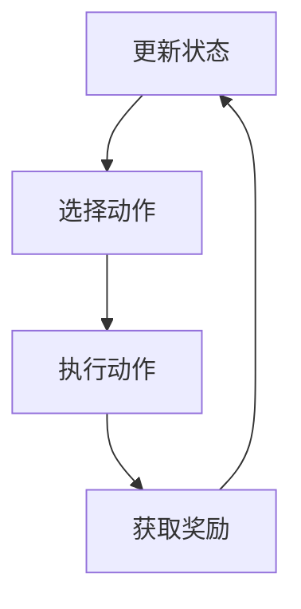
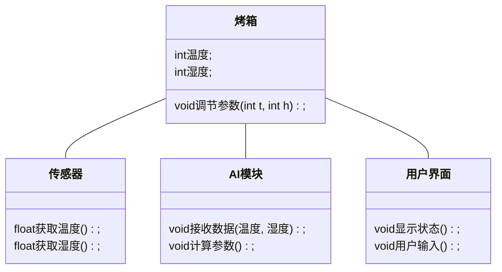
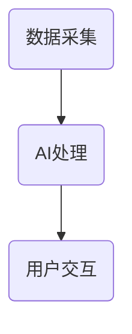
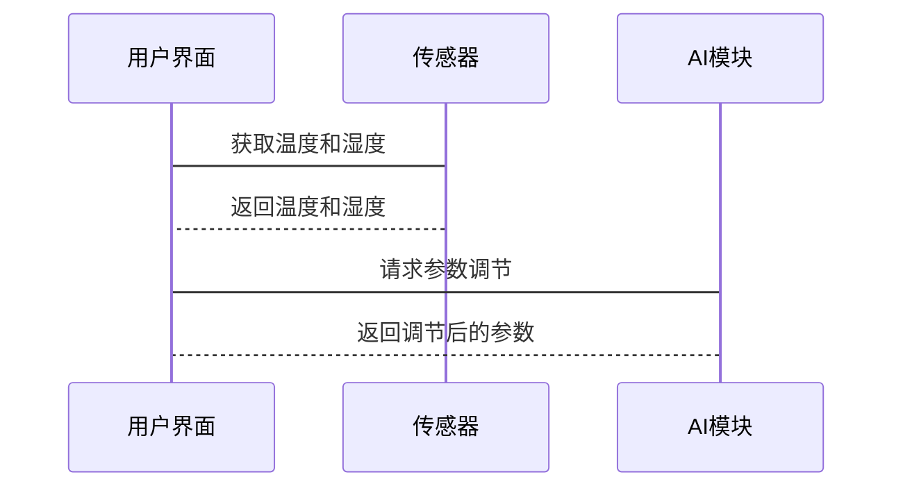

                 


# 智能烤箱：AI Agent的烘焙参数自动调节

## 关键词：智能烤箱，AI Agent，烘焙参数，自动调节，强化学习，系统架构

## 摘要：本文探讨了AI Agent在智能烤箱中的应用，重点分析了烘焙参数的自动调节技术。通过强化学习算法和系统架构设计，展示了如何实现智能烤箱的智能化控制，提升烘焙质量。

---

## 第一部分：背景介绍

### 第1章：智能烤箱的发展历程

#### 1.1 智能家居的发展趋势
智能家居是现代科技发展的重要方向，通过物联网和人工智能技术的结合，智能家居设备能够实现自动化控制和智能化服务。智能厨房设备作为智能家居的重要组成部分，正在迅速普及。

#### 1.2 烘焙技术的历史与现状
传统烘焙方法依赖人工经验，存在效率低、质量不稳定的问题。随着技术的进步，智能烘焙设备通过传感器和AI算法，能够实现精准的参数调节，提升烘焙质量。

#### 1.3 AI Agent的基本概念
AI Agent是一种智能体，能够感知环境、自主决策并执行动作。在智能烤箱中，AI Agent负责接收传感器数据，分析烘焙状态，并调整参数以达到最佳烘焙效果。

---

## 第二部分：核心概念与联系

### 第2章：AI Agent与烘焙参数调节

#### 2.1 AI Agent的基本原理
AI Agent通过感知环境、制定策略和执行动作来实现目标。在智能烤箱中，AI Agent接收温度、湿度等传感器数据，分析当前烘焙状态，并调整参数以优化烘焙效果。

#### 2.2 烘焙参数调节的流程
烘焙参数调节包括温度控制、时间调节和湿度管理。AI Agent根据传感器数据和预设目标，动态调整这些参数，确保烘焙过程的最优。

#### 2.3 系统架构
系统架构包括传感器网络、AI模块和用户界面。传感器负责采集环境数据，AI模块进行数据处理和决策，用户界面提供人机交互。

---

## 第三部分：算法原理

### 第3章：AI Agent的算法实现

#### 3.1 强化学习基础
强化学习是一种通过试错学习优化决策的算法。在智能烤箱中，AI Agent通过强化学习不断优化烘焙参数，提升烘焙质量。

#### 3.2 算法实现
AI Agent采用强化学习算法，通过状态、动作和奖励机制优化烘焙参数。算法流程如下：



Python代码实现如下：

```python
class AIBaker:
    def __init__(self):
        self.temperature = 350
        self.humidity = 50
        self.time = 60

    def adjust_params(self, target_temp, target_humidity):
        if self.temperature < target_temp:
            self.temperature += 10
        if self.humidity < target_humidity:
            self.humidity += 5
        return self.temperature, self.humidity
```

#### 3.3 数学模型
AI Agent的决策模型基于强化学习，目标是最优化烘焙参数。数学模型如下：

损失函数：$$L = \sum_{i=1}^{n} (t_i - p_i)^2$$

优化目标：$$\theta^* = \arg\min_\theta L$$

其中，$t_i$是目标参数，$p_i$是当前参数，$\theta$是模型参数。

---

## 第四部分：系统分析与架构设计

### 第4章：系统分析与架构设计

#### 4.1 领域模型
系统领域模型包括烤箱、传感器、AI模块和用户界面。类图如下：



#### 4.2 系统架构
系统采用微服务架构，包括数据采集、AI处理和用户交互三个部分。架构图如下：



#### 4.3 接口设计
系统接口包括传感器数据接口、AI模块调用接口和用户界面接口。接口设计如下：



---

## 第五部分：项目实战

### 第5章：项目实战

#### 5.1 环境安装
安装Python和TensorFlow环境，配置传感器连接。

#### 5.2 核心代码实现
AI模块代码如下：

```python
import numpy as np
from tensorflow.keras import models

class AIBaker:
    def __init__(self):
        self.model = models.load_model('baking_model.h5')

    def predict_params(self, current_temp, current_humidity):
        input_data = np.array([[current_temp, current_humidity]], dtype=float)
        predicted_params = self.model.predict(input_data)
        return predicted_params[0]
```

#### 5.3 案例分析
通过实际案例分析，展示AI Agent如何根据传感器数据调整烘焙参数，优化烘焙过程。

---

## 第六部分：最佳实践

### 第6章：最佳实践

#### 6.1 小结
AI Agent通过强化学习和系统架构设计，实现了智能烤箱的烘焙参数自动调节，提升了烘焙质量。

#### 6.2 注意事项
在实际应用中，需要注意传感器精度、模型训练数据质量和系统稳定性。

#### 6.3 拓展阅读
推荐阅读《强化学习入门》和《深度学习与AI系统设计》。

---

以上是《智能烤箱：AI Agent的烘焙参数自动调节》的技术博客文章的详细目录和内容结构。通过逐步分析和详细讲解，展示了AI技术在智能厨房设备中的应用潜力和实际价值。

