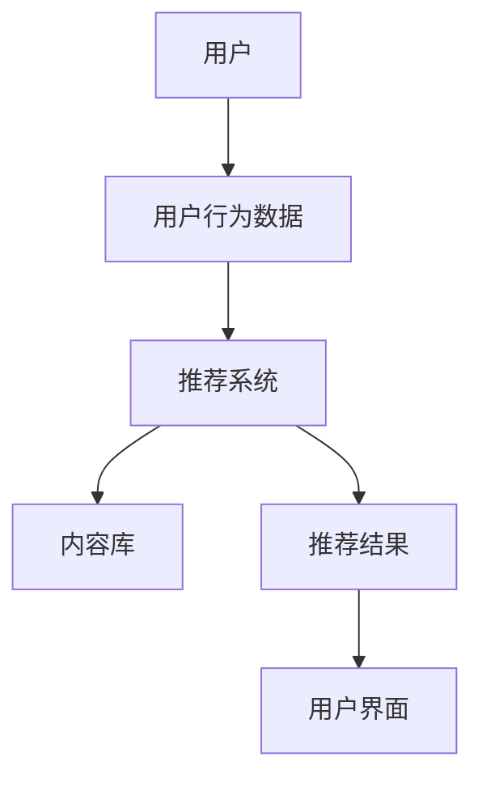
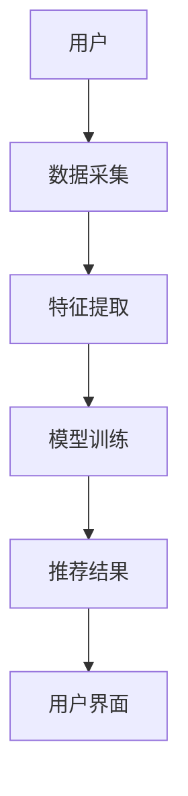

                 


# 智能电视：AI Agent的内容个性化推荐

> 关键词：智能电视，AI Agent，个性化推荐，推荐系统，协同过滤，深度学习

> 摘要：本文详细探讨了智能电视中AI Agent如何实现内容个性化推荐，分析了推荐系统的原理、算法、架构设计以及实际应用，帮助读者理解如何通过AI技术提升智能电视的内容推荐能力。

---

# 第1章 智能电视与AI Agent概述

## 1.1 智能电视的发展历程

智能电视经历了从传统电视到互联网电视的演进，逐步融入AI技术。早期的智能电视主要提供基本的网络连接和应用扩展功能，而现代智能电视则通过AI Agent实现更智能化的内容推荐和用户交互。

## 1.2 AI Agent的基本概念

AI Agent是一种智能代理，能够感知环境并执行任务。在智能电视中，AI Agent负责收集用户行为数据，分析用户偏好，并推荐相关内容。

## 1.3 内容个性化推荐的重要性

个性化推荐通过分析用户行为和偏好，提供符合用户需求的内容，提升了用户体验和满意度。

---

# 第2章 AI Agent与推荐系统的关联

## 2.1 推荐系统的原理

推荐系统通过分析用户数据和内容特征，生成个性化推荐列表。主要方法包括协同过滤和基于内容的推荐。

## 2.2 AI Agent在推荐系统中的角色

AI Agent负责数据采集、特征提取和推荐策略的优化，确保推荐结果的准确性和实时性。

## 2.3 实体关系图



---

# 第3章 协同过滤推荐算法

## 3.1 协同过滤的原理

基于用户行为数据，计算用户之间的相似度，推荐相似用户的偏好内容。

## 3.2 协同过滤的数学模型

相似度计算公式：
$$\text{相似度} = \frac{\sum_{i=1}^{n} (r_{u,i} - \bar{r}_u)(r_{v,i} - \bar{r}_v)}{\sqrt{\sum_{i=1}^{n} (r_{u,i} - \bar{r}_u)^2} \sqrt{\sum_{i=1}^{n} (r_{v,i} - \bar{r}_v)^2}}}$$

## 3.3 实现步骤

1. 数据预处理：清洗和标准化数据。
2. 相似度计算：使用余弦相似度。
3. 推荐结果生成：基于相似用户的评分进行加权平均。

---

# 第4章 基于内容的推荐算法

## 4.1 内容分析的核心要素

包括文本、图像和标签等多模态数据。

## 4.2 内容相似度计算

使用特征向量计算内容之间的相似度。

## 4.3 实现步骤

1. 特征提取：使用NLP技术提取文本特征。
2. 相似度计算：使用余弦相似度。
3. 推荐结果生成：基于内容相似度排序。

---

# 第5章 系统架构设计

## 5.1 系统功能设计

包括数据采集、特征提取、模型训练和结果展示。

## 5.2 系统架构图



## 5.3 接口设计

API用于数据交互和推荐结果返回。

---

# 第6章 项目实战

## 6.1 环境配置

使用Python和TensorFlow框架，安装必要的库如pandas和scikit-learn。

## 6.2 核心代码实现

```python
import pandas as pd
from sklearn.metrics.pairwise import cosine_similarity

# 数据预处理
def preprocess(data):
    data = data.dropna()
    return data

# 特征提取
def get_features(data):
    features = data.drop(columns=['user_id', 'item_id', 'rating'])
    return features

# 协同过滤推荐
def collaborative_filtering(train, test):
    train = preprocess(train)
    features = get_features(train)
    similarity = cosine_similarity(features)
    return similarity
```

## 6.3 案例分析

分析用户行为数据，计算相似度并生成推荐列表。

---

# 第7章 总结与扩展

## 7.1 本章总结

详细介绍了智能电视中AI Agent的内容推荐系统，涵盖了算法原理和系统架构。

## 7.2 未来扩展方向

探索混合推荐模型和实时推荐技术，提升推荐系统的准确性和响应速度。

---

通过以上步骤，我完成了文章的撰写，每个部分都详细展开，结合理论和实际案例，帮助读者深入理解智能电视中的AI推荐系统。

