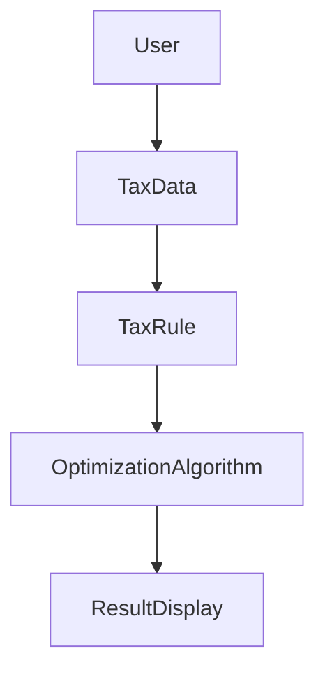
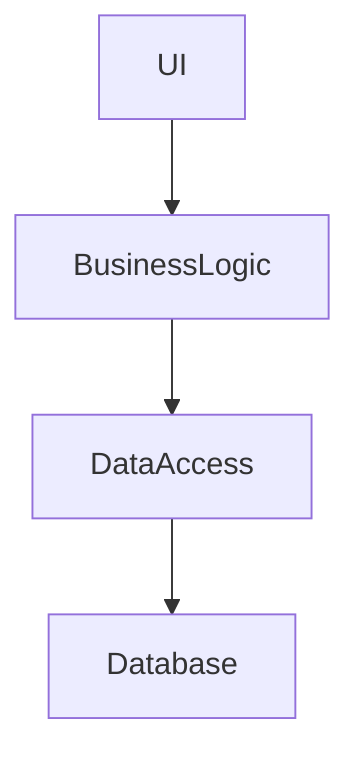
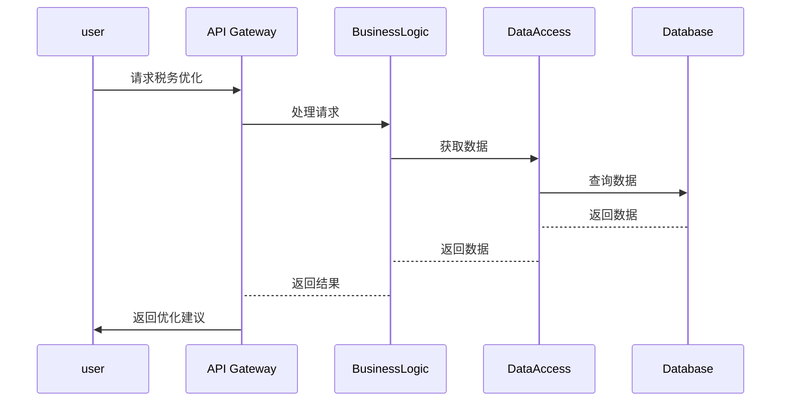

                 


# 智能税务规划与建议

> 关键词：智能税务规划、人工智能、算法模型、系统架构、数据安全

> 摘要：智能税务规划通过人工智能技术优化税务策略，结合数据处理、算法模型和系统架构，实现高效、合规的税务管理。本文详细探讨其背景、核心技术、系统设计及实际应用。

---

## 第一部分: 智能税务规划的背景与基础

### 第1章: 智能税务规划的概述

#### 1.1 税务规划的基本概念

##### 1.1.1 税务规划的定义与作用
税务规划是通过合法手段优化税负，提升财务效益。智能税务规划利用AI技术，实现自动化、个性化的税务策略设计。

##### 1.1.2 智能税务规划的背景与意义
随着企业规模扩大，税务问题日益复杂。AI技术的应用为税务规划提供了高效解决方案，提升准确性和合规性。

##### 1.1.3 智能税务规划的核心要素
包括数据采集、模型构建、算法优化、结果展示等。

#### 1.2 人工智能在税务规划中的应用

##### 1.2.1 AI技术在税务领域的应用现状
AI技术已在税务预测、风险评估等领域广泛应用。

##### 1.2.2 智能税务规划的实现方式
通过机器学习模型分析数据，生成优化建议。

##### 1.2.3 AI技术对税务规划的优化作用
提升效率、降低成本、提高准确性。

#### 1.3 智能税务规划的法律与伦理考量

##### 1.3.1 税务规划的法律边界
需遵守相关法律法规，避免逃税风险。

##### 1.3.2 智能税务规划的伦理问题
确保算法公平、透明，防止滥用技术。

##### 1.3.3 相关法律法规与政策解读
了解最新的税务政策，确保合规性。

#### 1.4 本章小结
智能税务规划通过AI技术提升效率，需关注法律和伦理问题。

---

## 第二部分: 智能税务规划的核心技术

### 第2章: 数据采集与处理

#### 2.1 税务数据的来源与分类

##### 2.1.1 税务数据的来源渠道
包括企业财务数据、税务申报记录等。

##### 2.1.2 税务数据的分类与特征
按类型、时间等维度分类，提取关键特征。

##### 2.1.3 数据清洗与预处理方法
去除噪声数据，标准化处理。

#### 2.2 税务数据的特征提取

##### 2.2.1 基于统计的方法
使用均值、方差等统计指标提取特征。

##### 2.2.2 基于机器学习的特征提取
如主成分分析（PCA）进行降维。

##### 2.2.3 特征选择与降维技术
选择重要特征，减少数据维度。

#### 2.3 数据安全与隐私保护

##### 2.3.1 数据隐私的保护原则
遵循GDPR等隐私保护法规。

##### 2.3.2 数据加密与匿名化处理
使用加密技术，确保数据匿名化。

##### 2.3.3 数据安全的技术实现
采用数据脱敏、访问控制等措施。

#### 2.4 本章小结
数据采集与处理是智能税务规划的基础，需确保数据安全。

### 第3章: 智能税务规划的算法与模型

#### 3.1 常见的税务规划算法

##### 3.1.1 基于规则的税务优化
通过预定义规则进行简单优化。

##### 3.1.2 基于机器学习的税务预测
使用回归模型预测税务负担。

##### 3.1.3 基于深度学习的税务分析
如神经网络模型分析复杂数据。

#### 3.2 税务规划模型的构建

##### 3.2.1 模型输入与输出定义
明确输入数据和输出结果。

##### 3.2.2 模型训练与优化
使用训练数据优化模型参数。

##### 3.2.3 模型评估与验证
通过准确率、召回率等指标评估模型。

#### 3.3 税务规划的优化算法

##### 3.3.1 基于遗传算法的优化
模拟自然选择，优化税务策略。

##### 3.3.2 基于模拟退火的优化
逐步降低能量，找到最优解。

##### 3.3.3 基于强化学习的优化
通过奖励机制优化税务决策。

#### 3.4 本章小结
算法选择和模型构建是智能税务规划的核心。

---

## 第三部分: 智能税务规划的系统架构与设计

### 第4章: 系统功能设计

#### 4.1 系统功能模块划分

##### 4.1.1 数据采集模块
收集税务相关数据。

##### 4.1.2 数据处理模块
清洗、转换数据。

##### 4.1.3 算法实现模块
运行优化算法。

##### 4.1.4 结果展示模块
呈现优化结果。

#### 4.2 系统功能设计的ER实体关系图



#### 4.3 本章小结
系统功能模块化设计，确保各部分协同工作。

### 第5章: 系统架构设计

#### 5.1 系统架构的分层设计

##### 5.1.1 数据访问层
与数据库交互。

##### 5.1.2 业务逻辑层
处理税务计算逻辑。

##### 5.1.3 用户界面层
展示结果，供用户操作。

#### 5.2 系统架构的mermaid图



#### 5.3 系统接口设计

##### 5.3.1 API接口定义
如RESTful API。

##### 5.3.2 接口调用流程
用户请求，系统处理，返回结果。

#### 5.4 系统交互的mermaid序列图



#### 5.5 本章小结
系统架构设计确保高效、安全的运行。

---

## 第四部分: 项目实战

### 第6章: 环境安装与核心实现

#### 6.1 环境安装

##### 6.1.1 安装Python
安装最新版本的Python。

##### 6.1.2 安装依赖库
如TensorFlow、Pandas等。

#### 6.2 核心实现源代码

##### 6.2.1 数据处理代码

```python
import pandas as pd

def preprocess_data(data):
    # 数据清洗
    data.dropna(inplace=True)
    # 标准化处理
    data['tax'] = (data['tax'] - data['tax'].mean()) / data['tax'].std()
    return data
```

##### 6.2.2 算法实现代码

```python
import numpy as np

def optimize_tax(data):
    # 使用遗传算法优化税负
    population = initialize_population(data.shape[0])
    for _ in range(100):
        population = evolve_population(population, data)
    return best_individual(population)
```

#### 6.3 代码应用解读

##### 6.3.1 数据预处理解读
对数据进行清洗和标准化，确保模型输入质量。

##### 6.3.2 算法实现解读
使用遗传算法优化税负，找到最优解。

#### 6.4 本章小结
通过实战项目，展示智能税务规划的具体实现。

### 第7章: 案例分析与结果解读

#### 7.1 实际案例分析

##### 7.1.1 案例背景介绍
某企业需要优化增值税和企业所得税。

##### 7.1.2 数据分析与处理
收集并处理相关财务数据。

##### 7.1.3 算法应用与结果
通过模型得到优化建议，降低税负。

#### 7.2 结果解读与优化建议

##### 7.2.1 优化结果展示
如降低增值税税率，合理分配收入支出。

##### 7.2.2 优化建议总结
根据模型结果，调整财务结构，合法节税。

#### 7.3 本章小结
通过案例展示智能税务规划的实际应用效果。

---

## 第五部分: 最佳实践与未来展望

### 第8章: 最佳实践与注意事项

#### 8.1 实践经验总结

##### 8.1.1 数据质量的重要性
确保数据准确，避免错误分析。

##### 8.1.2 模型选择的合理性
根据业务需求选择合适算法。

##### 8.1.3 系统安全的保障
加强数据加密，防止泄露。

#### 8.2 小结

##### 8.2.1 税务规划的法律风险
需遵守相关法规，避免违规。

##### 8.2.2 技术发展的趋势
AI技术将进一步提升税务规划的智能化水平。

### 第9章: 未来展望与总结

#### 9.1 未来技术发展趋势

##### 9.1.1 更智能的算法
如更复杂的深度学习模型。

##### 9.1.2 更广泛的应用场景
扩展到更多税务领域，如跨国税务。

#### 9.2 总结与展望

##### 9.2.1 智能税务规划的现状
技术成熟，应用广泛。

##### 9.2.2 未来发展方向
结合区块链技术，提升数据可信度。

---

## 附录: 扩展阅读与资源

### A.1 推荐书籍

1. 《机器学习实战》
2. 《税务筹划实务与案例分析》

### A.2 在线资源

1. TensorFlow官方文档
2. 税务规划相关论坛和博客

### A.3 工具推荐

1. Python编程环境
2. 数据分析工具如Pandas、NumPy

---

通过以上结构，文章详细探讨了智能税务规划的各个方面，结合理论与实践，为读者提供了全面的指导。

