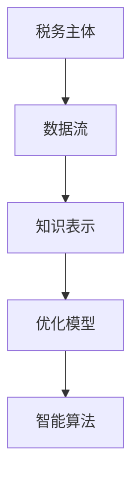
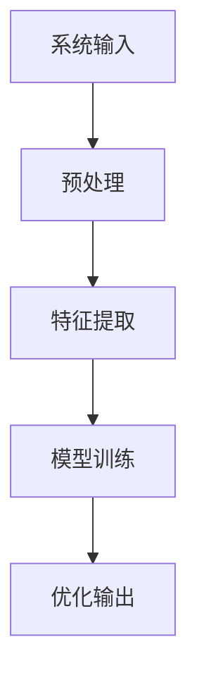
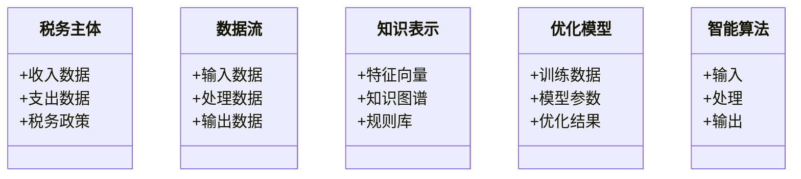
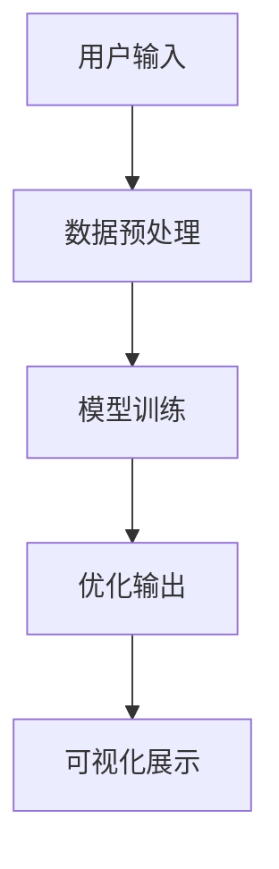

                 


# 智能税收筹划建议系统

## 关键词：
- 智能税收筹划
- 人工智能
- 税务优化
- 机器学习
- 算法优化

## 摘要：
智能税收筹划建议系统结合人工智能技术，通过机器学习和优化算法，为纳税人提供个性化的税务优化建议。系统利用数据流和知识表示构建优化模型，实现智能算法设计与应用，帮助用户合法合规地降低税负，提升财务效率。本文从背景介绍、核心概念、算法原理、系统架构、实现案例等多方面详细阐述智能税收筹划系统的构建与应用。

---

# 第一部分: 背景介绍

## 第1章: 智能税收筹划的定义与必要性
### 1.1 税收筹划的定义
- 税收筹划的定义
- 税收筹划的核心目标
- 税收筹划的合法性与合规性

### 1.2 智能税收筹划的必要性
- 传统税收筹划的局限性
- AI技术在税务领域的应用趋势
- 智能税收筹划的优势与价值

### 1.3 智能税收筹划与传统税收筹划的区别
- 数据驱动 vs. 经验驱动
- 自动化 vs. 人工化
- 高效性 vs. 低效性

## 第2章: 智能税收筹划的背景与现状
### 2.1 税收政策的变化与挑战
- 税收政策的复杂性与多样性
- 税收法规的更新速度
- 税务合规的难度

### 2.2 AI技术在税务领域的应用
- 人工智能技术的基本概念
- AI在税务领域的典型应用
- AI技术在税收筹划中的潜力

### 2.3 智能税收筹划系统的应用场景
- 企业税务优化
- 个人税务规划
- 税务风险预警

---

# 第二部分: 核心概念与联系

## 第3章: 智能税收筹划的核心概念
### 3.1 数据流与知识表示
- 数据流的定义与特点
- 知识表示的含义与方法
- 数据流与知识表示的关系

### 3.2 税收优化模型的构建
- 优化模型的基本概念
- 优化模型的构建步骤
- 优化模型的评估标准

### 3.3 智能算法的特征提取
- 特征提取的定义与作用
- 智能算法中的特征选择
- 特征提取的技术与方法

## 第4章: 核心概念属性特征对比
### 4.1 核心概念对比表
| 概念       | 特征1 | 特征2 | 特征3 |
|------------|-------|-------|-------|
| 数据流     | 实时性 | 关联性 | 可视化 |
| 知识表示    | 结构化 | 半结构化 | 非结构化 |
| 优化模型    | 监督学习 | 无监督学习 | 强化学习 |

### 4.2 ER实体关系图


---

# 第三部分: 算法原理与实现

## 第5章: 算法原理
### 5.1 核心算法流程


### 5.2 机器学习模型实现
- 决策树模型
  ```python
  from sklearn.tree import DecisionTreeClassifier
  model = DecisionTreeClassifier()
  model.fit(X_train, y_train)
  ```

- 随机森林模型
  ```python
  from sklearn.ensemble import RandomForestClassifier
  model = RandomForestClassifier()
  model.fit(X_train, y_train)
  ```

### 5.3 优化算法实现
- 遗传算法
  ```python
  def evaluate_fitness(solution):
      # 计算适应度函数
      pass

  def mutate(solution):
      # 变异操作
      pass

  def crossover(solution1, solution2):
      # 交叉操作
      pass
  ```

---

## 第6章: 系统架构与设计
### 6.1 系统功能模块设计


### 6.2 系统架构设计


---

# 第四部分: 项目实战与案例分析

## 第7章: 项目实战
### 7.1 环境搭建
- Python环境配置
- 依赖库安装
  ```bash
  pip install numpy pandas scikit-learn
  ```

### 7.2 核心实现
- 数据预处理
  ```python
  import pandas as pd
  data = pd.read_csv('tax_data.csv')
  ```

- 模型训练
  ```python
  from sklearn.ensemble import RandomForestClassifier
  model = RandomForestClassifier()
  model.fit(X_train, y_train)
  ```

### 7.3 代码解读与分析
- 数据预处理部分
- 特征选择部分
- 模型训练部分
- 结果输出部分

## 第8章: 案例分析
### 8.1 企业所得税优化案例
- 案例背景
- 数据分析
- 税务优化建议
- 实施效果评估

### 8.2 个人所得税优化案例
- 案例背景
- 数据分析
- 税务优化建议
- 实施效果评估

---

# 第五部分: 总结与展望

## 第9章: 总结与最佳实践
### 9.1 系统总结
- 系统功能总结
- 系统性能总结
- 系统优势总结

### 9.2 最佳实践 tips
- 数据质量管理
- 模型调优技巧
- 系统部署建议

## 第10章: 未来展望
### 10.1 系统优化方向
- 模型优化
- 算法改进
- 系统扩展

### 10.2 税务领域的未来趋势
- AI技术的深入应用
- 区块链技术的应用
- 大数据技术的融合

---

# 附录

## 附录A: API接口文档
### A.1 接口定义
- 输入接口
- 输出接口
- 调用方式

### A.2 接口示例
```python
import requests

response = requests.post('http://localhost:8000/api/tax_optimization', json=data)
result = response.json()
```

## 附录B: 参考文献
- 参考文献1
- 参考文献2
- 参考文献3

---

通过以上目录结构，您可以逐步展开每个部分的具体内容，确保文章逻辑清晰、结构紧凑且简单易懂。每个章节的内容需要根据实际需求进行补充和完善。

