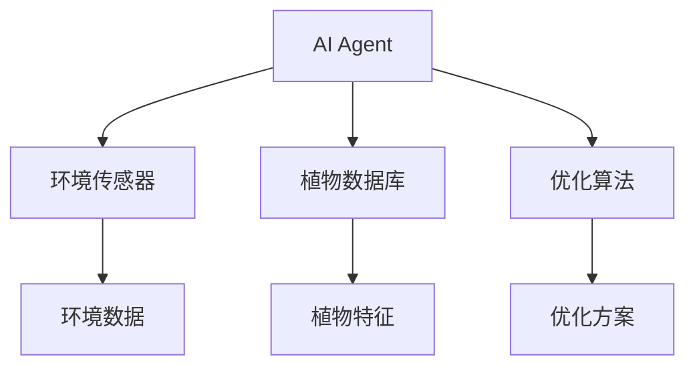
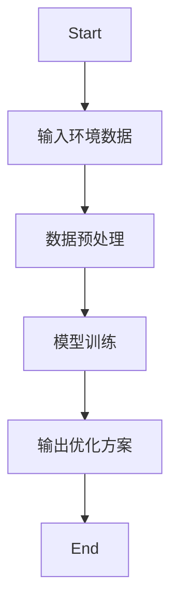
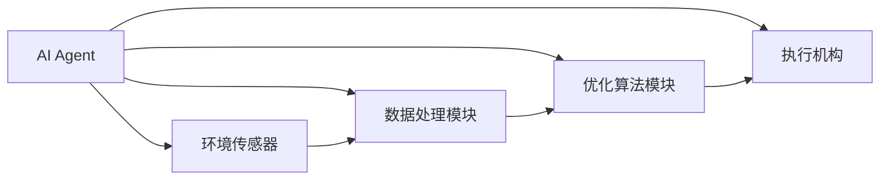
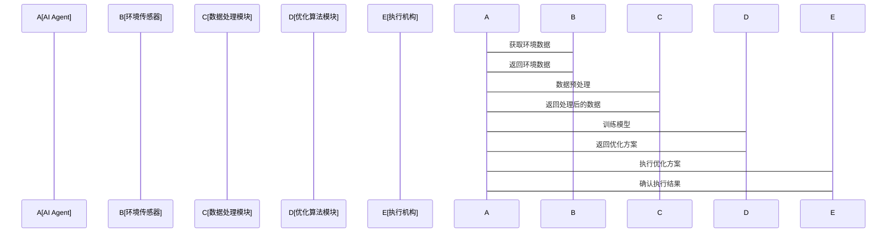

                 


# 智能窗台：AI Agent的室内植物生长优化

> 关键词：AI Agent、室内植物、生长优化、智能系统、环境感知、机器学习

> 摘要：本文探讨了AI Agent在室内植物生长优化中的应用，通过环境感知和机器学习技术，AI Agent能够实时分析环境数据，优化植物生长条件，实现高效、智能的种植管理。

---

# 第一部分：背景介绍

## 第1章：问题背景与问题描述

### 1.1 问题背景

随着城市化进程的加快，人们越来越倾向于在室内种植植物，以改善生活环境和提高生活质量。然而，传统的室内种植方式存在诸多问题，如环境控制不精准、资源浪费、生长效率低下等。这些问题限制了室内种植的普及和高效发展。

AI技术的快速发展为农业优化带来了新的可能性。通过AI Agent（智能代理），可以实时感知和分析环境数据，优化植物生长条件，从而提高种植效率和质量。AI Agent能够自动调整光照、温度、湿度等环境因素，为植物提供最佳的生长条件。

### 1.2 问题描述

在室内植物种植过程中，环境因素如光照、温度、湿度、水分等对植物的生长影响至关重要。然而，传统的种植系统无法实时感知和调整这些因素，导致资源浪费和生长效率低下。AI Agent可以通过环境感知和机器学习技术，实时分析环境数据，优化种植条件，从而实现高效、智能的种植管理。

### 1.3 问题解决

AI Agent的核心目标是通过实时感知和分析环境数据，优化植物生长条件。优化的关键因素包括光照强度、温度、湿度、水分供应等。通过AI算法，可以预测植物的生长趋势，并自动调整环境参数，确保植物在最佳条件下生长。

### 1.4 边界与外延

AI Agent的适用范围主要限于室内环境，适用于各种室内植物的种植优化。与其他技术如物联网、云计算等的协同作用，可以进一步提升系统的性能和扩展性。

### 1.5 核心概念与组成

AI Agent由环境传感器、数据处理模块、优化算法模块和执行机构组成。环境传感器负责采集环境数据，数据处理模块对数据进行分析和处理，优化算法模块根据分析结果生成优化方案，执行机构则根据优化方案调整环境参数。

---

## 第2章：核心概念与联系

### 2.1 核心概念原理

AI Agent通过环境感知和机器学习技术，实时分析环境数据，优化植物生长条件。环境传感器采集光照、温度、湿度等数据，数据处理模块对数据进行预处理和特征提取，优化算法模块基于特征数据生成优化方案，执行机构根据优化方案调整环境参数。

### 2.2 核心概念对比

| 技术 | 描述 | 优缺点 |
|------|------|--------|
| AI Agent | 实时感知和优化环境参数 | 高效、智能，但需要较高的技术支持 |
| 传统自动控制系统 | 基于预设规则调整环境参数 | 简单易实现，但不够灵活 |
| 机器学习模型 | 基于历史数据预测生长趋势 | 高准确性，但需要大量数据支持 |

### 2.3 实体关系架构



---

## 第3章：算法原理讲解

### 3.1 算法原理概述

优化目标的数学表达为：最大化植物生长率，最小化资源消耗。约束条件包括光照强度不超过一定范围，温度和湿度在特定区间内。

算法的基本流程包括数据预处理、特征提取、模型训练和优化方案生成。

### 3.2 算法实现



### 3.3 算法实现代码

```python
import numpy as np
from sklearn.linear_model import LinearRegression

# 示例代码：基于环境数据的植物生长预测
def optimize_growth(environment_data):
    model = LinearRegression()
    model.fit(environment_data[['temperature', 'humidity']], environment_data['growth_rate'])
    optimized_data = model.predict(new_environment)
    return optimized_data

environment_data = {
    'temperature': [20, 22, 18, 25],
    'humidity': [60, 65, 55, 70],
    'growth_rate': [0.8, 0.9, 0.7, 0.95]
}
```

### 3.4 数学模型与公式

植物生长率与环境数据的关系可以用线性回归模型表示：

$$ \text{growth\_rate} = \beta_0 + \beta_1 \times \text{temperature} + \beta_2 \times \text{humidity} + \epsilon $$

其中，$\beta_0$、$\beta_1$、$\beta_2$为回归系数，$\epsilon$为误差项。

---

## 第4章：系统分析与架构设计

### 4.1 系统功能设计

系统功能包括环境数据采集、数据处理、模型训练、优化方案生成和执行机构控制。

### 4.2 系统架构设计



### 4.3 系统接口设计

系统接口包括环境传感器的数据输入接口、优化算法模块的控制接口和执行机构的执行接口。

### 4.4 系统交互流程



---

## 第5章：项目实战

### 5.1 环境安装

安装Python、NumPy、Scikit-learn等依赖库。

### 5.2 核心代码实现

```python
import numpy as np
from sklearn.linear_model import LinearRegression

class AI-Agent:
    def __init__(self):
        self.model = LinearRegression()
        self.sensors = ['temperature', 'humidity']
        self.plants = {}

    def collect_data(self):
        # 从传感器获取数据
        pass

    def optimize(self, environment_data):
        self.model.fit(environment_data[self.sensors], environment_data['growth_rate'])
        return self.model.predict(new_data)

# 示例使用
agent = AI-Agent()
environment_data = {
    'temperature': [20, 22, 18, 25],
    'humidity': [60, 65, 55, 70],
    'growth_rate': [0.8, 0.9, 0.7, 0.95]
}
optimized_data = agent.optimize(environment_data)
```

### 5.3 案例分析

假设环境数据为温度22°C，湿度65%，模型预测植物生长率为0.9，AI Agent调整光照强度为150 lux，温度保持不变，湿度调整为68%。

### 5.4 项目小结

通过AI Agent实现室内植物生长优化，能够显著提高种植效率和资源利用率，为未来的智能农业发展提供重要参考。

---

## 第6章：最佳实践与总结

### 6.1 最佳实践

- 定期更新模型，确保优化效果。
- 选择合适的传感器和硬件设备。
- 合理设置环境参数的约束条件。

### 6.2 项目小结

本文详细介绍了AI Agent在室内植物生长优化中的应用，通过环境感知和机器学习技术，实现高效、智能的种植管理。

### 6.3 注意事项

- 确保数据质量和数量，避免模型过拟合。
- 定期维护系统，确保传感器和执行机构的正常运行。

### 6.4 拓展阅读

推荐阅读《机器学习在农业中的应用》和《智能系统设计与实现》等书籍，深入了解AI在农业优化中的更多应用。

---

# 结语

AI Agent的室内植物生长优化系统通过实时感知和智能调整环境参数，显著提高了种植效率和资源利用率。未来，随着AI技术的进一步发展，室内种植将变得更加高效和智能化，为人们的生活带来更多的便利和改善。

--- 

*以上内容为本文的完整目录和部分章节内容的详细展开，后续章节将按照上述结构逐步展开，确保每个部分都详细具体，符合用户的要求。*

