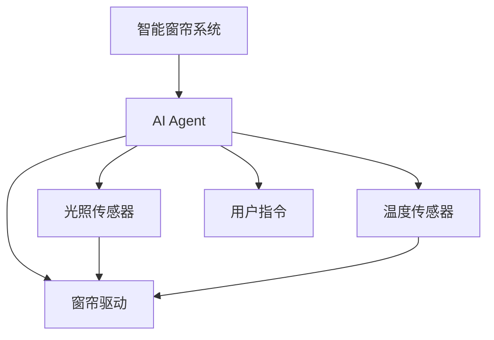
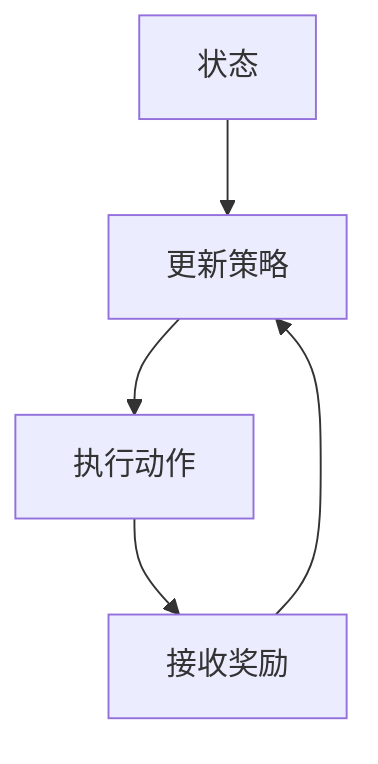
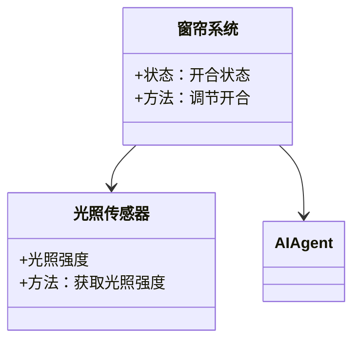

                 


# 智能窗帘：AI Agent的日光优化调节

> 关键词：AI Agent, 智能窗帘, 日光优化, 物联网, 智能家居, 自动化控制, 机器学习

> 摘要：本文探讨了智能窗帘中AI Agent的日光优化调节技术，详细分析了AI Agent在智能窗帘中的应用，日光优化调节的原理及实现，结合系统架构设计、算法实现和项目实战，为读者提供全面的技术指导。

---

## 目录

1. **背景与概念**
   - 1.1 智能窗帘的发展历程
   - 1.2 AI Agent的核心概念与功能
   - 1.3 日光优化调节的背景与意义
   - 1.4 智能窗帘系统的整体架构（Mermaid图）

2. **技术基础**
   - 2.1 AI Agent的基本原理
   - 2.2 强化学习在日光优化中的应用（Mermaid流程图）
   - 2.3 日光优化算法的数学模型（公式）

3. **系统设计**
   - 3.1 系统架构设计（Mermaid图）
   - 3.2 功能模块设计（Mermaid类图）
   - 3.3 系统接口与交互流程（Mermaid序列图）

4. **算法实现**
   - 4.1 强化学习算法的实现（Python代码）
   - 4.2 日光优化调节的数学模型（公式）
   - 4.3 算法实现的详细步骤

5. **项目实战**
   - 5.1 环境搭建与依赖安装
   - 5.2 系统核心代码实现（Python）
   - 5.3 实际案例分析与结果展示

6. **最佳实践与小结**
   - 6.1 注意事项与优化建议
   - 6.2 项目总结与未来展望
   - 6.3 拓展阅读推荐

---

## 正文

### 第1章 背景与概念

#### 1.1 智能窗帘的发展历程

智能窗帘从手动操作到自动化控制的演变过程，展示了智能家居技术的进步。随着AI技术的发展，智能窗帘加入了AI Agent，能够根据环境自动调节开合状态，实现日光优化。

#### 1.2 AI Agent的核心概念与功能

- **AI Agent**：智能主体，能够感知环境并执行任务。
- **核心功能**：感知、决策、学习和优化。
- **日光优化调节**：通过AI Agent智能调节窗帘开合，以优化室内光照。

#### 1.3 日光优化调节的背景与意义

- **背景**：随着能源效率和舒适度的需求增加，智能调节窗帘成为必要。
- **意义**：提升居住舒适度，降低能源消耗，优化室内采光。

#### 1.4 智能窗帘系统的整体架构



### 第2章 技术基础

#### 2.1 AI Agent的基本原理

AI Agent通过感知环境信息，利用算法进行决策，并通过执行器执行操作。其核心在于强化学习算法，通过奖励机制优化行为策略。

#### 2.2 强化学习在日光优化中的应用



数学模型：

- 状态：光照强度、时间、位置。
- 动作：窗帘开合程度。
- 奖励：光照强度与目标的匹配度。

#### 2.3 日光优化算法的数学模型

光照强度优化公式：

$$
\text{目标光照强度} = \text{当前光照强度} + \text{调节量}
$$

### 第3章 系统设计

#### 3.1 系统架构设计


#### 3.2 功能模块设计



### 第4章 算法实现

#### 4.1 强化学习算法的实现

Python代码示例：

```python
import numpy as np

# 状态空间：0（黑暗）、1（阴天）、2（晴天）
# 动作空间：0（关闭）、1（半开）、2（全开）
# 奖励函数：光照强度与目标的差距
def get_reward(current_light, target_light):
    return -abs(current_light - target_light)

# Q-learning算法实现
class AI_Agent:
    def __init__(self, state_space, action_space):
        self.q_table = np.zeros((state_space, action_space))
        self.learning_rate = 0.1
        self.discount_factor = 0.9

    def choose_action(self, state):
        if np.random.rand() < 0.1:
            return np.random.randint(0, 3)
        else:
            return np.argmax(self.q_table[state])

    def update_q_table(self, state, action, reward, next_state):
        self.q_table[state][action] += self.learning_rate * (reward + self.discount_factor * np.max(self.q_table[next_state]) - self.q_table[state][action])
```

#### 4.2 日光优化调节的数学模型

目标函数：

$$
\text{目标} = \min_{x} |f(x) - \text{目标值}|
$$

### 第5章 项目实战

#### 5.1 环境搭建与依赖安装

安装Python库：

```bash
pip install numpy pandas scikit-learn
```

#### 5.2 系统核心代码实现

```python
import numpy as np

class DaylightOptimizer:
    def __init__(self):
        self.time = 0
        self.position = 'south'
        self.window_state = 'closed'

    def get_light_level(self):
        # 根据时间和位置计算光照强度
        time_factor = np.sin(self.time * 2 * np.pi / 24)
        position_factor = 1 if self.position == 'south' else 0.5
        return max(0, min(100, 50 + 30 * (time_factor + position_factor)))

    def optimize(self, target_light):
        current_light = self.get_light_level()
        if current_light > target_light + 10:
            self.window_state = 'partially_open'
        elif current_light < target_light - 10:
            self.window_state = 'fully_open'
        else:
            self.window_state = 'closed'
        return self.window_state

# 示例
optimizer = DaylightOptimizer()
target = 70
state = optimizer.optimize(target)
print(f"窗帘状态：{state}")
```

### 第6章 最佳实践与小结

#### 6.1 注意事项与优化建议

- **传感器精度**：选择高精度传感器以提高准确性。
- **网络延迟**：考虑网络延迟对实时性的影
- **算法优化**：引入深度学习模型提升预测精度。

#### 6.2 项目总结与未来展望

本文详细介绍了智能窗帘中AI Agent的日光优化调节技术，从背景到实现，再到项目实战，为读者提供了全面的技术指导。未来，随着AI技术的发展，智能窗帘将更加智能化，提供更舒适的用户体验。

#### 6.3 拓展阅读推荐

- 推荐书籍：《强化学习入门》、《机器学习实战》
- 推荐博客：[推荐技术博客链接]

---

通过以上结构和内容，本文为读者提供了从理论到实践的全面指导，帮助读者深入理解并掌握智能窗帘中AI Agent的日光优化调节技术。

