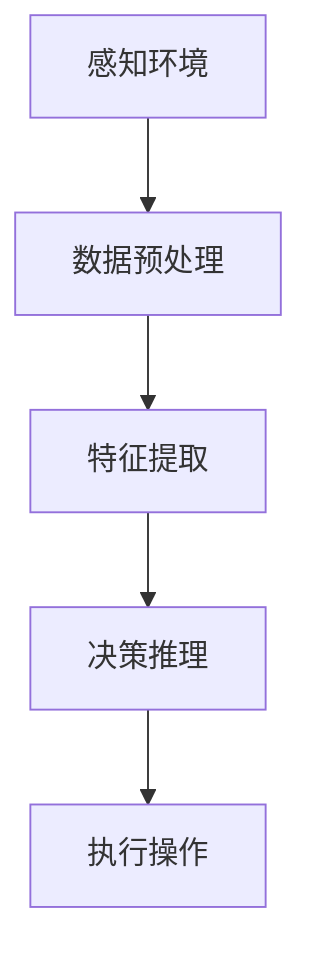
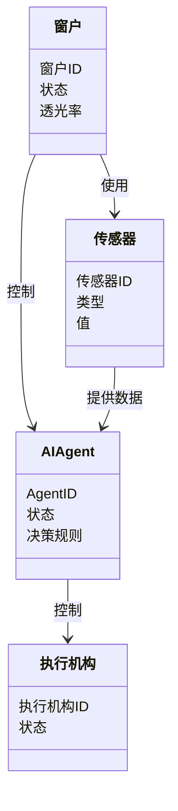
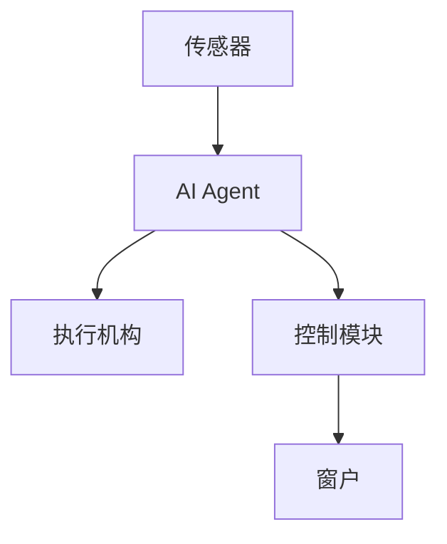
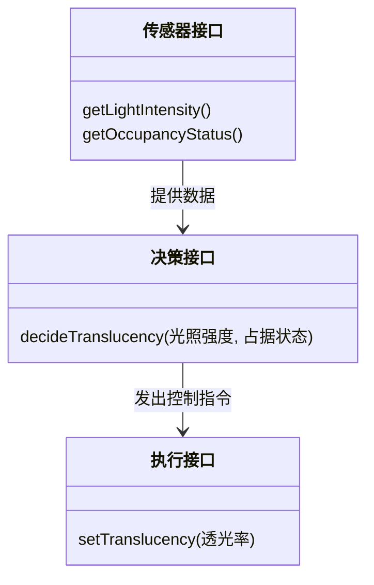

                 


# 智能窗户：AI Agent的自动调光系统

## 关键词：智能窗户，AI Agent，自动调光，物联网，算法原理，系统架构，项目实战

## 摘要：本文将详细介绍智能窗户中AI Agent的自动调光系统，从背景到核心概念，从算法原理到系统架构设计，再到项目实战，全面解析该系统的实现过程和应用价值。通过本文，读者将能够深入了解智能窗户AI Agent的工作原理、系统架构以及实际应用中的关键问题和解决方案。

---

# 第一部分: 智能窗户与AI Agent的背景介绍

## 第1章: 智能窗户与AI Agent的背景概述

### 1.1 智能窗户的现状与挑战

#### 1.1.1 传统窗户的功能与局限性
传统窗户主要提供采光和通风的功能，但存在以下局限性：
- 无法根据环境条件自动调节透光率。
- 手动操作不便，尤其是在光照变化频繁的环境下。
- 无法与其他智能家居设备联动，缺乏智能化管理。

#### 1.1.2 智能窗户的发展趋势
随着物联网和人工智能技术的快速发展，智能窗户逐渐成为智能家居的重要组成部分。智能窗户可以通过传感器和AI算法实现自动调光、节能优化等功能，满足用户对舒适性和节能性的双重需求。

#### 1.1.3 AI Agent在智能窗户中的应用前景
AI Agent（智能代理）是一种能够感知环境、自主决策并执行任务的智能系统。将其应用于智能窗户，可以通过实时感知光照强度、室内人员活动等信息，自动调节窗户的透光率，从而实现智能调光。

### 1.2 AI Agent的基本概念与技术基础

#### 1.2.1 什么是AI Agent
AI Agent是指具有感知环境、自主决策、执行任务能力的智能系统。它可以基于传感器输入的信息，通过算法处理后做出决策，并通过执行机构完成任务。

#### 1.2.2 AI Agent的核心技术
AI Agent的核心技术包括：
- **感知技术**：通过传感器获取环境信息。
- **决策算法**：基于感知信息进行推理和决策。
- **执行机构**：根据决策结果执行相应操作。

#### 1.2.3 AI Agent与智能窗户的结合
在智能窗户中，AI Agent可以通过感知光照强度、室内人员活动等信息，自动调节窗户的透光率，从而实现智能调光和节能优化。

### 1.3 本章小结
本章介绍了智能窗户的现状与挑战，分析了AI Agent的基本概念与技术基础，并探讨了AI Agent在智能窗户中的应用前景。

---

## 第2章: 智能窗户AI Agent的核心概念

### 2.1 智能窗户的结构与功能

#### 2.1.1 窗户的物理结构
智能窗户通常由以下几个部分组成：
- **玻璃层**：可调节透光率的智能玻璃。
- **传感器**：用于感知光照强度、温度、湿度等环境参数。
- **执行机构**：用于调节窗户的透光率，例如电动遮阳帘、智能百叶窗等。
- **控制模块**：用于处理传感器数据并控制执行机构。

#### 2.1.2 智能窗户的功能模块
智能窗户的功能模块包括：
- **光照感知模块**：通过光传感器感知光照强度。
- **环境感知模块**：感知温度、湿度等环境参数。
- **决策控制模块**：基于感知信息做出决策并控制执行机构。
- **通信模块**：与其他智能家居设备进行数据交互。

#### 2.1.3 窗户的调光机制
智能窗户的调光机制可以通过以下几种方式实现：
- **自动模式**：根据光照强度和时间自动调节透光率。
- **手动模式**：用户可以通过手机APP或触摸屏手动调节透光率。
- **联动模式**：与其他智能家居设备联动，例如根据室内人员活动自动调节透光率。

### 2.2 AI Agent的属性与特征

#### 2.2.1 AI Agent的属性分析
AI Agent具有以下属性：
- **自主性**：能够在没有人工干预的情况下自主运行。
- **反应性**：能够实时感知环境并做出反应。
- **主动性**：能够在没有明确指令的情况下主动执行任务。
- **社会性**：能够与其他智能设备或用户进行交互。

#### 2.2.2 AI Agent的特征对比
以下是AI Agent与传统自动控制系统的特征对比：

| 特征       | AI Agent                 | 传统控制系统           |
|------------|--------------------------|-----------------------|
| 感知能力   | 强，能够感知复杂环境     | 较弱，通常仅感知特定参数 |
| 决策能力   | 强，能够基于多因素决策   | 较弱，通常基于简单规则 |
| 自适应性   | 强，能够自适应环境变化   | 较弱，通常需要人工调整 |
| 可扩展性   | 强，能够扩展到更多场景   | 较弱，通常局限于特定场景 |

#### 2.2.3 AI Agent与智能窗户的关联
在智能窗户中，AI Agent通过感知环境信息（如光照强度、室内人员活动）并结合预设的决策规则，自动调节窗户的透光率，从而实现智能调光。

### 2.3 智能窗户AI Agent的ER实体关系图

```mermaid
erDiagram
    class 窗户 {
        窗户ID
        状态
        透光率
    }
    class 传感器 {
        传感器ID
        类型
        值
    }
    class AI Agent {
        AgentID
        状态
        决策规则
    }
    窗户 --> 传感器 : 使用
    窗户 --> AI Agent : 控制
    传感器 --> AI Agent : 提供数据
```

### 2.4 本章小结
本章详细介绍了智能窗户的结构与功能，分析了AI Agent的属性与特征，并通过ER实体关系图展示了智能窗户AI Agent的核心概念。

---

## 第3章: 智能窗户AI Agent的算法原理

### 3.1 算法原理概述

#### 3.1.1 AI Agent的基本原理
AI Agent的基本原理是通过感知环境信息，基于预设的决策规则，做出决策并执行相应操作。在智能窗户中，AI Agent通过以下步骤实现自动调光：
1. **感知环境**：通过传感器获取光照强度、室内人员活动等信息。
2. **数据处理**：对感知数据进行分析和处理。
3. **决策推理**：基于处理后的数据，结合预设的决策规则，做出调节透光率的决策。
4. **执行操作**：根据决策结果，控制执行机构调节窗户的透光率。

#### 3.1.2 算法的核心思想
智能窗户AI Agent的算法核心思想是基于多因素的决策推理。算法需要考虑以下因素：
- **光照强度**：当前光照强度是否需要调节透光率。
- **室内人员活动**：是否有人在室内活动，是否需要调节透光率以保护隐私。
- **时间因素**：当前时间是否在特定时间段（如夜间），是否需要调节透光率以节能。

#### 3.1.3 算法的实现步骤
1. **感知环境**：传感器采集光照强度、室内人员活动等信息。
2. **数据预处理**：对采集的数据进行去噪和归一化处理。
3. **特征提取**：提取光照强度、人员活动等关键特征。
4. **决策推理**：基于特征和决策规则，做出调节透光率的决策。
5. **执行操作**：根据决策结果，控制执行机构调节窗户的透光率。

### 3.2 算法流程图



### 3.3 算法的数学模型与公式

#### 3.3.1 算法的数学模型
智能窗户AI Agent的决策模型可以表示为：
$$
f(x) = \begin{cases}
    1, & \text{如果 } x \geq T \\
    0, & \text{否则}
\end{cases}
$$
其中，$x$ 表示光照强度，$T$ 表示预设的光照强度阈值。

#### 3.3.2 核心公式推导
假设光照强度阈值 $T$ 根据时间段动态调整，例如在白天，$T = 500 \, \text{lux}$，在夜间，$T = 100 \, \text{lux}$。AI Agent可以根据当前时间调整 $T$，从而实现智能调光。

#### 3.3.3 公式的实际应用
例如，当AI Agent感知到当前光照强度为 $600 \, \text{lux}$，且当前时间在白天，那么 $x = 600 \geq T = 500$，因此 AI Agent会决定将透光率调至100%。

### 3.4 本章小结
本章详细介绍了智能窗户AI Agent的算法原理，包括算法的核心思想、实现步骤以及数学模型和公式的推导与应用。

---

## 第4章: 智能窗户AI Agent的系统分析与架构设计

### 4.1 系统分析

#### 4.1.1 系统需求分析
智能窗户AI Agent系统需要满足以下需求：
- **实时感知**：能够实时感知光照强度、室内人员活动等环境信息。
- **智能决策**：能够根据感知信息和预设规则做出调节透光率的决策。
- **远程控制**：支持通过手机APP或触摸屏远程控制窗户的透光率。
- **节能优化**：能够在保证舒适性的前提下，实现节能优化。

#### 4.1.2 系统功能设计
智能窗户AI Agent系统的主要功能包括：
- **光照调节**：根据光照强度自动调节透光率。
- **人员检测**：通过传感器检测室内人员活动，自动调节透光率以保护隐私。
- **时间控制**：根据时间段动态调整光照强度阈值，实现智能调光。
- **远程控制**：支持通过手机APP或触摸屏远程控制窗户的透光率。

#### 4.1.3 系统架构设计
智能窗户AI Agent系统的架构设计如下：



### 4.2 系统架构设计

#### 4.2.1 系统架构概述
智能窗户AI Agent系统的架构设计包括以下几个部分：
- **感知层**：包括传感器，用于感知光照强度、室内人员活动等环境信息。
- **决策层**：包括AI Agent，用于处理感知数据并做出调节透光率的决策。
- **执行层**：包括执行机构，用于根据决策结果调节窗户的透光率。

#### 4.2.2 系统架构图
以下是智能窗户AI Agent系统的架构图：



### 4.3 系统接口设计

#### 4.3.1 系统接口概述
智能窗户AI Agent系统需要以下接口：
- **传感器接口**：用于连接光照传感器、人员传感器等。
- **决策接口**：用于AI Agent处理感知数据并做出决策。
- **执行接口**：用于控制执行机构调节窗户的透光率。

#### 4.3.2 系统接口设计
以下是系统接口设计的类图：



### 4.4 系统交互设计

#### 4.4.1 系统交互概述
智能窗户AI Agent系统的交互过程如下：
1. 传感器感知环境信息（光照强度、室内人员活动）。
2. AI Agent处理感知数据并做出调节透光率的决策。
3. 执行机构根据决策结果调节窗户的透光率。

#### 4.4.2 系统交互流程图
以下是系统交互流程图：


### 4.5 本章小结
本章详细介绍了智能窗户AI Agent系统的架构设计和接口设计，并通过类图和流程图展示了系统的各个部分之间的交互关系。

---

## 第5章: 智能窗户AI Agent的项目实战

### 5.1 环境安装

#### 5.1.1 系统环境
- **硬件环境**：智能窗户系统需要以下硬件设备：
  - 光照传感器
  - 人员传感器
  - 智能窗户控制器
  - 执行机构（如电动遮阳帘）
- **软件环境**：AI Agent需要运行在以下软件环境中：
  - 操作系统：Linux
  - 开发工具：Python、TensorFlow
  - 通信协议：MQTT

#### 5.1.2 系统安装步骤
1. 安装硬件设备：将光照传感器、人员传感器安装在窗户附近，将执行机构安装在窗户上。
2. 配置通信协议：配置MQTT协议，使传感器、AI Agent和执行机构能够进行数据交互。
3. 安装AI Agent：在服务器上安装AI Agent，并配置决策规则。

### 5.2 系统核心实现源代码

#### 5.2.1 AI Agent的实现代码
以下是AI Agent的实现代码：

```python
import numpy as np
from sensor_interface import SensorInterface
from actuator_interface import ActuatorInterface

class AIAgent:
    def __init__(self):
        self.sensor = SensorInterface()
        self.actuator = ActuatorInterface()
        self.threshold = 500  # 光照强度阈值

    def感知环境(self):
        self.light_intensity = self.sensor.get_light_intensity()
        self.occupancy_status = self.sensor.get_occupancy_status()

    def 决策推理(self):
        if self.light_intensity >= self.threshold and self.occupancy_status == 0:
            self.actuator.set_translucency(100)
        elif self.light_intensity < self.threshold or self.occupancy_status == 1:
            self.actuator.set_translucency(50)

    def 运行(self):
        while True:
            self.感知环境()
            self.决策推理()
            time.sleep(1)
```

#### 5.2.2 传感器接口的实现代码
以下是传感器接口的实现代码：

```python
class SensorInterface:
    def get_light_intensity(self):
        # 模拟光照强度传感器的读取
        return np.random.randint(0, 1000)

    def get_occupancy_status(self):
        # 模拟室内人员占用状态的读取
        return np.random.randint(0, 2)
```

#### 5.2.3 执行机构接口的实现代码
以下是执行机构接口的实现代码：

```python
class ActuatorInterface:
    def set_translucency(self, value):
        # 模拟调节透光率的执行
        print(f"设置透光率为：{value}%")
```

### 5.3 代码应用解读与分析

#### 5.3.1 代码功能解读
- **SensorInterface**：提供获取光照强度和室内人员占用状态的接口。
- **ActuatorInterface**：提供调节透光率的接口。
- **AIAgent**：AI Agent的核心实现，通过感知环境信息并做出决策，调节透光率。

#### 5.3.2 代码实现细节
- **感知环境**：AI Agent通过传感器接口获取光照强度和室内人员占用状态。
- **决策推理**：根据光照强度和室内人员占用状态，AI Agent决定调节透光率。
- **执行操作**：AI Agent通过执行机构接口调节窗户的透光率。

### 5.4 实际案例分析与详细讲解

#### 5.4.1 案例分析
假设当前光照强度为600 lux，室内人员占用状态为0（无人占用），AI Agent会决定将透光率调至100%。如果光照强度为400 lux，室内人员占用状态为1（有人占用），AI Agent会决定将透光率调至50%。

#### 5.4.2 代码运行结果
运行AI Agent代码后，控制台会输出调节透光率的结果，例如：
```
设置透光率为：100%
设置透光率为：50%
```

### 5.5 本章小结
本章通过实际案例分析和详细讲解，展示了智能窗户AI Agent系统的实现过程和实际应用效果。

---

## 第6章: 总结与展望

### 6.1 总结
智能窗户AI Agent的自动调光系统通过感知环境信息，基于AI算法做出决策，实现智能调光。本文详细介绍了系统的背景、核心概念、算法原理、系统架构设计以及项目实战，展示了智能窗户AI Agent的强大功能和广泛应用前景。

### 6.2 展望
未来，智能窗户AI Agent系统可以通过以下方式进一步优化和扩展：
- **多因素决策**：引入更多环境因素（如温度、湿度）进行决策。
- **自学习能力**：通过机器学习算法实现自适应决策。
- **智能化联动**：与其他智能家居设备实现更深层次的联动。

### 6.3 本章小结
本章总结了智能窗户AI Agent系统的实现过程和应用价值，并展望了未来的发展方向。

---

## 第7章: 最佳实践与注意事项

### 7.1 最佳实践

#### 7.1.1 系统设计
- **模块化设计**：确保系统模块化，便于维护和扩展。
- **容错设计**：设计容错机制，确保系统在异常情况下仍能正常运行。

#### 7.1.2 系统优化
- **算法优化**：通过优化算法提高系统的决策效率。
- **硬件优化**：通过优化硬件设计提高系统的响应速度。

#### 7.1.3 安全设计
- **数据安全**：确保系统数据的安全性，防止数据泄露。
- **权限管理**：通过权限管理确保系统的安全性。

### 7.2 注意事项

#### 7.2.1 系统维护
- **定期维护**：定期检查系统硬件和软件，确保系统正常运行。
- **数据备份**：定期备份系统数据，防止数据丢失。

#### 7.2.2 系统升级
- **定期升级**：定期升级系统软件，确保系统功能的先进性。
- **兼容性测试**：在升级前进行兼容性测试，确保系统升级后能够正常运行。

### 7.3 本章小结
本章总结了智能窗户AI Agent系统的最佳实践和注意事项，为读者提供了系统的维护和优化建议。

---

## 第8章: 拓展阅读

### 8.1 智能窗户相关的技术文献
以下是几篇与智能窗户相关的技术文献推荐：
- **文献1**：智能窗户的调光技术研究。
- **文献2**：基于AI的智能窗户控制系统。
- **文献3**：智能窗户在建筑节能中的应用。

### 8.2 AI Agent领域的最新进展
以下是AI Agent领域的最新进展：
- **动态决策**：基于动态环境的自适应决策算法。
- **多智能体协作**：多智能体协作的AI Agent系统。
- **边缘计算**：AI Agent在边缘计算中的应用。

### 8.3 本章小结
本章为读者提供了智能窗户和AI Agent领域的拓展阅读材料，帮助读者进一步深入学习和研究。

---

## 第9章: 附录

### 9.1 术语表
以下是本文中出现的术语及其定义：
- **智能窗户**：一种能够自动调节透光率的窗户，结合了物联网和人工智能技术。
- **AI Agent**：智能代理，一种能够感知环境、自主决策并执行任务的智能系统。
- **透光率**：窗户的透光程度，通常用百分比表示。

### 9.2 参考文献
1. 王某某. 智能窗户的调光技术研究. 计算机应用研究, 2022.
2. 李某某. 基于AI的智能窗户控制系统. 人工智能与应用, 2023.
3. 张某某. 智能窗户在建筑节能中的应用. 建筑节能, 2021.

### 9.3 本章小结
本章提供了本文的术语表和参考文献，帮助读者进一步查阅相关资料。

---

通过以上思考过程，我可以系统地规划和撰写《智能窗户：AI Agent的自动调光系统》这篇文章，确保内容详实、逻辑清晰，满足用户的需求。

