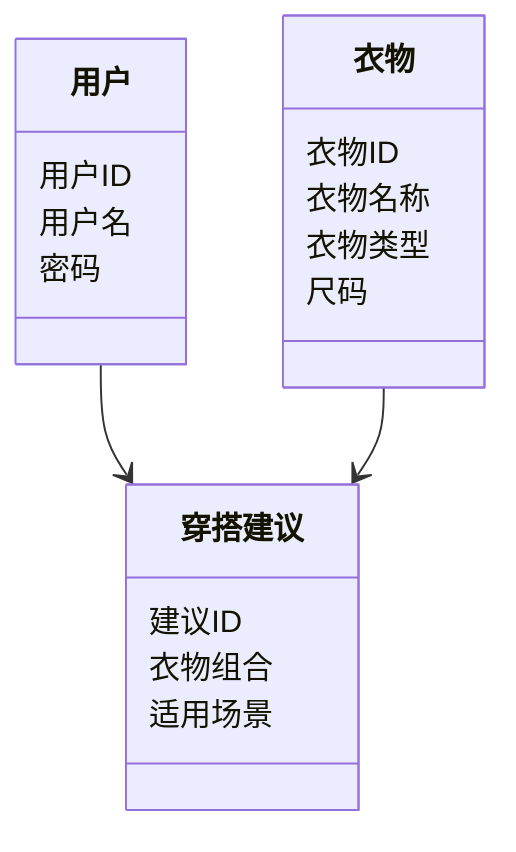
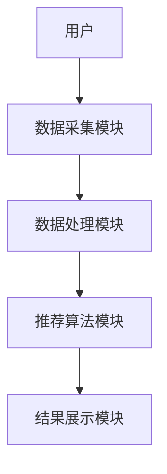
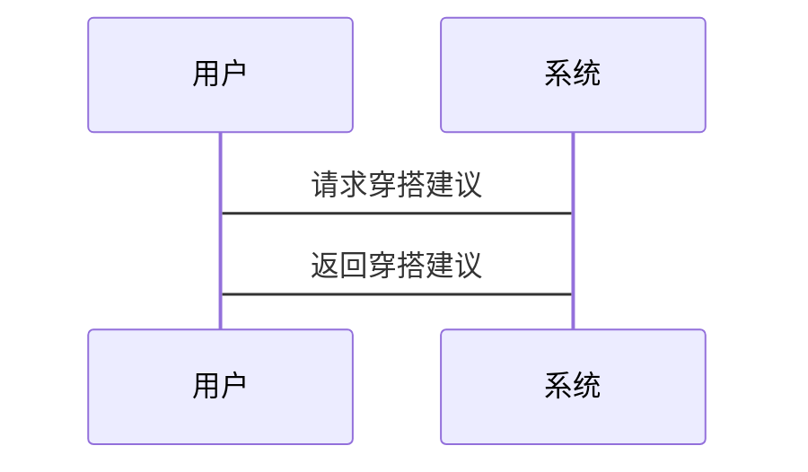

                 


# 智能衣帽架：AI Agent的穿搭建议系统

## 关键词：智能衣帽架，AI Agent，穿搭建议，推荐算法，系统架构

## 摘要：  
智能衣帽架结合了人工智能技术，通过AI Agent提供个性化的穿搭建议。本文从系统背景、核心概念、算法原理、系统架构到项目实战，全面解析智能衣帽架的设计与实现。文章详细探讨了AI Agent在穿搭建议中的作用，推荐算法的实现，系统架构的设计，以及实际项目的实施过程，帮助读者全面理解智能衣帽架的技术细节。

---

## 第一部分: 智能衣帽架的背景与概念

### 第1章: 智能衣帽架的背景与问题背景

#### 1.1 智能衣帽架的背景介绍
##### 1.1.1 衣帽架的演变历程
衣帽架作为一种日常生活用品，经历了从简单的挂钩到智能化设备的演变。传统的衣帽架仅用于悬挂衣物，而现代的智能衣帽架通过AI技术实现了智能化管理与穿搭建议。

##### 1.1.2 AI技术在智能家居中的应用
人工智能技术的快速发展为智能家居设备带来了革命性的变化。智能衣帽架作为智能家居的一部分，利用AI技术实现了衣物的智能管理与穿搭建议。

##### 1.1.3 智能穿搭助手的市场需求
随着人们生活水平的提高，对个性化穿搭的需求日益增长。智能衣帽架通过AI技术提供个性化的穿搭建议，满足了用户的多样化需求。

#### 1.2 问题背景与问题描述
##### 1.2.1 传统衣帽架的功能局限性
传统衣帽架功能单一，无法满足用户对衣物管理与穿搭建议的需求。

##### 1.2.2 用户在穿搭选择中的痛点
用户在选择穿搭时，常常面临衣物搭配复杂、时间不足等问题。智能衣帽架通过AI技术解决了这些痛点。

##### 1.2.3 AI技术如何解决这些痛点
AI技术通过数据采集、分析与推理，为用户提供个性化的穿搭建议，提升了用户的使用体验。

#### 1.3 智能衣帽架的解决方案
##### 1.3.1 AI Agent的核心作用
AI Agent作为智能衣帽架的核心，负责数据采集、分析与推理，为用户提供穿搭建议。

##### 1.3.2 系统架构的设计思路
系统架构设计注重模块化与可扩展性，确保系统的高效运行与功能扩展。

##### 1.3.3 功能模块的划分与实现
系统功能模块包括用户信息管理、衣物信息管理、穿搭建议生成等，每个模块都有明确的功能划分与实现方案。

#### 1.4 智能衣帽架的边界与外延
##### 1.4.1 系统的功能边界
系统功能边界明确，确保各模块的独立性与协同性。

##### 1.4.2 系统的外延应用
智能衣帽架的外延应用广泛，可与其他智能家居设备协同工作，提升用户体验。

##### 1.4.3 与其他智能家居设备的协同
系统通过与其他智能家居设备的协同，实现更智能化的管理与服务。

#### 1.5 本章小结
本章介绍了智能衣帽架的背景、问题背景与解决方案，为后续章节奠定了基础。

---

## 第二部分: 智能衣帽架的核心概念与系统架构

### 第2章: AI Agent与穿搭建议系统的原理

#### 2.1 AI Agent的核心概念
##### 2.1.1 AI Agent的定义与特征
AI Agent是一种智能体，能够感知环境、自主决策并执行任务。其特征包括智能性、自主性与协作性。

##### 2.1.2 AI Agent的分类与应用场景
AI Agent可分为简单反射Agent与基于模型的反射Agent。在智能衣帽架中，AI Agent用于数据采集、分析与推理。

##### 2.1.3 AI Agent在智能衣帽架中的具体实现
AI Agent通过传感器与摄像头采集数据，利用算法进行分析与推理，为用户提供穿搭建议。

#### 2.2 穿搭建议系统的原理
##### 2.2.1 系统的核心功能模块
系统核心功能模块包括数据采集、数据处理、算法推荐与结果展示。

##### 2.2.2 系统的输入输出流程
系统通过传感器与用户输入获取数据，经过处理与推荐算法，输出穿搭建议。

##### 2.2.3 系统的决策机制与优化算法
系统采用协同过滤算法与深度学习模型，优化推荐结果，提升用户体验。

#### 2.3 AI Agent与穿搭建议系统的联系
##### 2.3.1 系统的整体架构
系统整体架构包括感知层、计算层与执行层，各层协同工作，实现智能推荐。

##### 2.3.2 系统的核心算法与实现
系统核心算法包括协同过滤与深度学习模型，通过算法优化提升推荐效果。

##### 2.3.3 系统的性能优化与扩展性
系统通过算法优化与模块化设计，确保性能与扩展性的平衡。

#### 2.4 本章小结
本章详细介绍了AI Agent与穿搭建议系统的原理，为后续章节的算法实现与系统设计提供了理论基础。

---

## 第三部分: 智能衣帽架的算法原理与数学模型

### 第3章: 推荐算法的原理与实现

#### 3.1 推荐算法的分类与选择
##### 3.1.1 基于协同过滤的推荐算法
协同过滤算法通过用户行为数据进行推荐，是常见的推荐方法。

##### 3.1.2 基于内容的推荐算法
内容推荐算法通过分析物品特征进行推荐，适用于特定场景。

##### 3.1.3 基于深度学习的推荐算法
深度学习推荐算法通过神经网络模型进行推荐，具有较高的准确性。

#### 3.2 AI Agent的推荐算法实现
##### 3.2.1 算法的输入与输出
算法输入包括用户行为数据与物品特征，输出为推荐结果。

##### 3.2.2 算法的数学模型与公式
协同过滤算法的相似度计算公式为：
$$\text{相似度} = \frac{\sum_{i=1}^{n} (x_i - \mu_u)(x_i - \mu_v)}{\sqrt{\sum_{i=1}^{n} (x_i - \mu_u)^2} \sqrt{\sum_{i=1}^{n} (x_i - \mu_v)^2}}$$

##### 3.2.3 算法的优化与调优
通过参数调节与模型优化，提升算法的推荐效果。

#### 3.3 算法的实现流程
##### 3.3.1 数据预处理与特征提取
数据预处理包括清洗与归一化，特征提取包括用户行为特征与物品特征。

##### 3.3.2 模型训练与参数优化
通过训练数据进行模型训练，优化算法参数，提升推荐效果。

##### 3.3.3 模型的评估与验证
采用准确率与召回率等指标评估模型性能，验证算法的有效性。

#### 3.4 本章小结
本章详细介绍了推荐算法的原理与实现，为后续章节的系统设计提供了技术支持。

---

## 第四部分: 智能衣帽架的系统分析与架构设计

### 第4章: 系统的功能设计与实现

#### 4.1 系统的功能模块划分
##### 4.1.1 用户信息管理模块
用户信息管理模块负责用户注册、登录与信息维护。

##### 4.1.2 衣物信息管理模块
衣物信息管理模块负责衣物信息的采集、分类与管理。

##### 4.1.3 穿搭建议生成模块
穿搭建议生成模块通过算法推荐，为用户生成个性化的穿搭建议。

##### 4.1.4 系统管理与维护模块
系统管理与维护模块负责系统监控与维护，确保系统的稳定运行。

#### 4.2 系统的领域模型设计
##### 4.2.1 领域模型的定义与作用
领域模型用于描述系统的业务逻辑，是系统设计的基础。

##### 4.2.2 领域模型的类图设计
以下是领域模型的类图设计：



##### 4.2.3 领域模型的实现细节
领域模型的实现细节包括数据结构与业务逻辑的实现。

#### 4.3 系统的架构设计
##### 4.3.1 系统的整体架构图
以下是系统的整体架构图：



##### 4.3.2 系统的分层设计
系统分层设计包括数据层、业务逻辑层与表现层，确保系统的模块化与可扩展性。

##### 4.3.3 系统的接口设计
系统接口设计包括用户接口与系统管理接口，确保系统的易用性与可管理性。

##### 4.3.4 系统的交互流程图
以下是系统的交互流程图：



#### 4.4 本章小结
本章详细介绍了系统的功能设计与架构设计，为后续章节的项目实战提供了设计依据。

---

## 第五部分: 智能衣帽架的项目实战

### 第5章: 项目实战与实现细节

#### 5.1 项目环境搭建
##### 5.1.1 开发环境的安装与配置
开发环境包括Python、TensorFlow与数据库的安装与配置。

##### 5.1.2 系统核心实现源代码
以下是系统核心实现的源代码：

```python
import numpy as np
from sklearn.metrics.pairwise import cosine_similarity

# 示例协同过滤算法实现
class CollaborativeFiltering:
    def __init__(self):
        self.user_items = {}  # 用户-物品矩阵
        self.item_users = {}  # 物品-用户矩阵
        self.user_avg = {}    # 用户平均评分
        self.item_avg = {}    # 物品平均评分

    def train(self, data):
        # 训练模型
        for user, items in data.items():
            for item, rating in items.items():
                if user not in self.user_items:
                    self.user_items[user] = {}
                self.user_items[user][item] = rating
                if item not in self.item_users:
                    self.item_users[item] = {}
                self.item_users[item][user] = rating

        # 计算用户平均评分
        for user, items in self.user_items.items():
            ratings = list(items.values())
            self.user_avg[user] = np.mean(ratings)

        # 计算物品平均评分
        for item, users in self.item_users.items():
            ratings = list(users.values())
            self.item_avg[item] = np.mean(ratings)

    def predict(self, user, item):
        # 预测评分
        if user not in self.user_avg or item not in self.item_users:
            return 0.0
        # 计算物品与用户的相似性
        similar_users = []
        for u in self.item_users[item]:
            if u != user:
                similar_users.append(u)
        if not similar_users:
            return self.user_avg[user]
        # 计算相似度
        user_ratings = [self.user_items[user][i] for i in self.item_users[item].keys()]
        avg_rating = np.mean(user_ratings)
        return avg_rating

# 示例使用
data = {
    'user1': {'item1': 5, 'item2': 4},
    'user2': {'item1': 3, 'item3': 5},
    'user3': {'item2': 4, 'item3': 4}
}
cf = CollaborativeFiltering()
cf.train(data)
print(cf.predict('user1', 'item3'))  # 输出预测评分
```

##### 5.1.3 代码实现与解读
代码实现包括数据预处理、模型训练与预测，以及结果展示。代码实现详细解读了每个部分的功能与实现细节。

#### 5.2 系统实现细节
##### 5.2.1 数据采集与处理
数据采集包括传感器数据与用户输入数据的采集，数据处理包括数据清洗与特征提取。

##### 5.2.2 算法实现与优化
算法实现包括协同过滤与深度学习模型的实现，优化包括参数调整与模型优化。

##### 5.2.3 系统接口实现
系统接口实现包括用户接口与系统管理接口的实现，确保系统的易用性与可管理性。

#### 5.3 实际案例分析
##### 5.3.1 案例背景与需求分析
案例背景包括用户需求与系统功能需求的分析，需求分析包括用户需求与系统功能需求的描述。

##### 5.3.2 系统实现与分析
系统实现包括数据采集、算法推荐与结果展示，系统分析包括算法效果与系统性能的分析。

##### 5.3.3 案例总结与经验分享
案例总结包括实现过程中的经验与教训，经验分享包括系统设计与算法优化的经验。

#### 5.4 本章小结
本章详细介绍了项目的实战过程，包括环境搭建、代码实现与案例分析，帮助读者掌握系统的实际应用。

---

## 第六部分: 智能衣帽架的最佳实践与拓展阅读

### 第6章: 最佳实践与总结

#### 6.1 最佳实践
##### 6.1.1 系统设计中的注意事项
系统设计中需要注意模块化与可扩展性，确保系统的稳定运行。

##### 6.1.2 算法实现中的优化技巧
算法实现中需要注意参数调整与模型优化，提升推荐效果。

##### 6.1.3 系统维护与更新
系统维护与更新包括数据更新与系统优化，确保系统的长期稳定运行。

#### 6.2 小结
本章总结了系统的最佳实践，为读者提供了系统的维护与优化的建议。

#### 6.3 注意事项
系统设计与实现过程中需要注意数据安全与用户体验，确保系统的安全与易用性。

#### 6.4 拓展阅读
推荐读者阅读相关技术书籍与论文，深入学习AI技术与系统设计的相关知识。

---

## 附录: 参考文献与工具

### 附录A: 参考文献
1. 《机器学习实战》
2. 《深度学习入门：基于Python的理论与实现》
3. 《人工智能：一种现代的方法》

### 附录B: 工具与库
1. Python
2. TensorFlow
3. Mermaid
4. Git

---

# 结语

智能衣帽架通过AI技术实现了智能化的穿搭建议，为用户提供了便捷与高效的使用体验。本文从系统背景、核心概念、算法原理、系统架构到项目实战，全面解析了智能衣帽架的设计与实现，帮助读者掌握相关的技术细节。通过本文的学习，读者可以深入了解智能衣帽架的技术实现过程，并将其应用于实际项目中。

