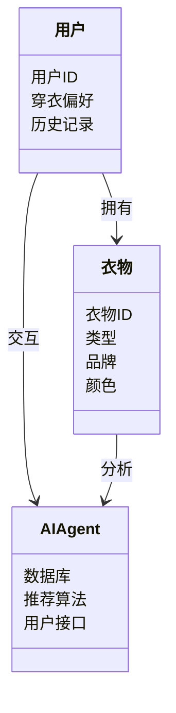

                 


# 智能衣帽架：AI Agent的穿衣风格顾问

> 关键词：智能衣帽架, AI Agent, 穿衣风格, 个性化推荐, 系统架构, 算法原理

> 摘要：本文详细探讨了智能衣帽架与AI Agent在穿衣风格顾问中的应用，从背景介绍、核心概念、算法原理到系统架构和项目实战，全面解析了智能衣帽架的设计与实现。通过本文，读者将了解如何利用AI技术提升穿衣搭配的智能化水平，掌握相关算法原理和系统架构设计方法。

---

## 第一部分: 智能衣帽架与AI Agent的背景介绍

### 第1章: 智能衣帽架的定义与现状

#### 1.1 智能衣帽架的定义
- **智能衣帽架**是一种结合物联网和人工智能技术的智能设备，能够通过传感器和AI算法实现衣物的自动分类、存储和推荐。
- **功能特点**：支持衣物自动分类、智能推荐、远程控制、环境监测（如温湿度）等。
- **市场现状**：随着智能家居的普及，智能衣帽架逐渐成为家庭和个人用户的热门选择。

#### 1.2 AI Agent的基本概念
- **AI Agent**：一种能够感知环境、自主决策并执行任务的智能实体，具备学习、推理和自适应能力。
- **核心功能**：数据采集、分析、推理、决策和执行。
- **应用场景**：广泛应用于智能助手、推荐系统、自动驾驶等领域。

#### 1.3 智能衣帽架与AI Agent的结合
- **需求背景**：传统衣帽架功能单一，无法满足用户对个性化穿衣搭配的需求。
- **AI Agent的作用**：通过AI算法分析用户的穿衣习惯和风格，提供智能化的推荐服务。
- **未来发展**：随着AI技术的进步，智能衣帽架将更加智能化和个性化。

---

## 第二部分: 智能衣帽架的核心概念与联系

### 第2章: 核心概念原理

#### 2.1 AI Agent的核心算法
- **推荐算法**：基于用户的穿衣数据，通过协同过滤和内容推荐算法，提供个性化建议。
- **学习算法**：利用机器学习模型（如神经网络）不断优化推荐效果。

#### 2.2 智能衣帽架的数据处理流程
1. **数据采集**：通过传感器采集衣物的类型、颜色、品牌等信息。
2. **数据存储**：将采集到的数据存储在数据库中。
3. **数据分析**：利用AI算法对数据进行分析，提取用户的穿衣偏好。
4. **结果输出**：生成推荐的穿衣搭配，并通过人机交互界面展示给用户。

#### 2.3 穿衣风格顾问的实现逻辑
- **用户需求分析**：通过问卷调查或行为数据分析用户的穿衣偏好。
- **数据处理与特征提取**：对衣物数据进行预处理，提取关键特征。
- **推荐模型构建**：基于特征构建推荐模型，并进行训练和优化。

### 第3章: 概念属性特征对比表格和ER实体关系图

#### 3.1 概念属性特征对比表格
| 概念       | 属性特征             |
|------------|----------------------|
| 智能衣帽架 | 自动分类、智能推荐、用户交互 |
| AI Agent   | 数据分析能力、学习能力、推理能力 |

#### 3.2 ER实体关系图
```mermaid
er
  actor: 用户
  agent: AI Agent
  item: 衣物
  relation: 属于
  actor -[拥有]-> item
  item -[分类]-> agent
```

---

## 第三部分: 算法原理讲解

### 第4章: 推荐算法的数学模型

#### 4.1 协同过滤算法
- **基本原理**：通过用户的行为数据找到相似的用户或物品，进行推荐。
- **数学模型**：
  $$ sim(u, v) = \frac{\sum_{i \in u \cap v} rating_i}{\sqrt{|u| \cdot |v|}} $$
  其中，$sim(u, v)$ 表示用户 $u$ 和用户 $v$ 之间的相似度。

#### 4.2 基于内容的推荐算法
- **基本原理**：通过分析物品的特征，找到与当前物品相似的物品进行推荐。
- **数学模型**：
  $$ score(i, j) = \sum_{k=1}^{n} w_k \cdot feature_k(i, j) $$
  其中，$w_k$ 是特征 $k$ 的权重，$feature_k(i, j)$ 表示物品 $i$ 和 $j$ 在特征 $k$ 上的相似度。

#### 4.3 混合推荐模型
- **基本原理**：结合协同过滤和基于内容的推荐算法，通过加权融合两种方法的结果，提升推荐的准确性和多样性。

---

## 第四部分: 系统分析与架构设计方案

### 第5章: 系统功能设计

#### 5.1 领域模型类图


#### 5.2 系统架构图


---

## 第五部分: 项目实战

### 第6章: 项目实现

#### 6.1 环境安装
- **Python 3.8+**
- **TensorFlow 2.0+**
- **Pandas、NumPy**

#### 6.2 核心代码实现
```python
import numpy as np
from sklearn.metrics.pairwise import cosine_similarity

# 示例数据：用户-物品矩阵
user_item_matrix = np.array([[4, 3, 2], [5, 1, 0], [3, 4, 1]])

# 计算相似度
similarity = cosine_similarity(user_item_matrix)
print(similarity)
```

#### 6.3 案例分析
- **数据处理**：收集用户的穿衣数据，进行清洗和特征提取。
- **模型训练**：基于协同过滤算法训练推荐模型。
- **结果展示**：生成推荐列表，并通过可视化工具展示。

---

## 第六部分: 最佳实践

### 第7章: 小结与建议

#### 7.1 小结
- 智能衣帽架与AI Agent的结合为穿衣搭配提供了智能化解决方案。
- 推荐算法和系统架构设计是实现智能化的关键。

#### 7.2 注意事项
- 数据隐私保护：确保用户数据的安全性。
- 系统稳定性：保证推荐系统的高效性和可靠性。

#### 7.3 拓展阅读
- 推荐系统优化：探索深度学习在推荐系统中的应用。
- 多模态推荐：结合图像识别和自然语言处理技术，提升推荐效果。

---

通过以上内容，读者可以全面了解智能衣帽架与AI Agent的结合，掌握相关技术原理和实现方法，为未来的智能化穿衣搭配提供参考。

