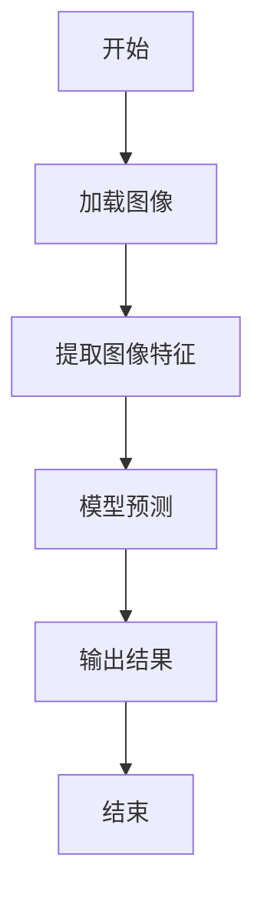
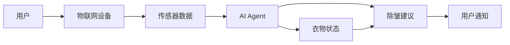

                 


# 《智能衣架：AI Agent的衣物护理与除皱系统》

---

## 关键词：
- AI Agent
- 物联网
- 衣物护理
- 除皱系统
- 智能衣架

---

## 摘要：
本文详细探讨了智能衣架在衣物护理与除皱系统中的应用，结合AI Agent、物联网和机器学习技术，提出了一种创新的衣物护理解决方案。通过分析衣物护理的传统方法及其不足，提出了一种基于AI的智能化衣物护理系统，利用传感器数据、图像识别和机器学习算法，实现衣物的智能检测、分类和除皱优化。本文详细介绍了系统的架构设计、核心算法原理、项目实现过程及最佳实践，为衣物护理行业的智能化转型提供了理论支持和实践指导。

---

# 正文

---

## 第一部分：智能衣架的背景与概述

### 第1章：智能衣架的背景与问题背景

#### 1.1 问题背景

在现代生活中，衣物护理是一个重要的日常需求，但传统的衣物护理方法存在诸多不足。例如，衣物洗涤后需要晾晒或熨烫，而手动熨烫不仅费时费力，还可能因操作不当导致衣物受损。此外，不同材质的衣物需要不同的护理方式，这对普通用户来说难以掌握。因此，如何利用现代技术实现智能化的衣物护理，成为一个亟待解决的问题。

#### 1.2 问题描述

衣物皱褶的成因复杂，包括衣物材质、洗涤方式、晾晒条件等多种因素。传统解决方案依赖人工操作，难以实现精准护理。此外，衣物护理设备的智能化水平有限，无法根据衣物的实时状态提供个性化的护理建议。

#### 1.3 问题解决思路

通过引入AI Agent（人工智能代理）、物联网技术和机器学习算法，可以实现衣物的智能检测、分类和护理优化。AI Agent能够实时监测衣物状态，物联网设备负责数据采集与传输，机器学习算法则用于模型训练和预测，从而实现智能化的衣物护理。

---

### 第2章：智能衣架的核心概念与联系

#### 2.1 核心概念原理

- **AI Agent**：AI Agent是一种能够感知环境、自主决策并执行任务的智能体。在智能衣架系统中，AI Agent负责接收衣物状态数据，分析数据并生成护理建议。
- **物联网技术**：物联网通过传感器和通信设备，实现衣物状态的实时监测和数据传输。
- **机器学习**：机器学习算法用于训练模型，识别衣物材质和皱褶类型，并预测最佳护理方式。

#### 2.2 核心概念属性特征对比表

| 概念     | 属性               | 特征                                   |
|----------|--------------------|----------------------------------------|
| AI Agent | 智能性             | 自主决策、学习能力                     |
| 物联网技术 | 连接性             | 实时数据传输、设备联动                 |
| 机器学习 | 数据驱动           | 模型训练、预测能力                     |

#### 2.3 系统ER实体关系图

```mermaid
er
classDiagram

    class 衣物 {
        id
        材质
        皱褶程度
    }
    class 用户 {
        id
        名称
        通知偏好
    }
    class 传感器数据 {
        id
        时间戳
        温度
        湿度
        位置
    }
    class AI Agent {
        id
        模型版本
        数据接口
    }
    class 物联网设备 {
        id
        连接状态
        数据传输
    }

    衣物 --|> 传感器数据
    用户 --|> 衣物
    用户 --|> 通知偏好
    物联网设备 --> 传感器数据
    AI Agent --> 传感器数据
    AI Agent --> 衣物
```

---

## 第二部分：算法原理讲解

### 第3章：智能衣架的核心算法

#### 3.1 算法选择与原理

为了实现衣物材质和皱褶类型的识别，我们选择卷积神经网络（CNN）作为核心算法。CNN适用于图像分类任务，能够从衣物图像中提取特征并进行分类。

#### 3.2 算法流程图



#### 3.3 算法实现代码

```python
import tensorflow as tf
from tensorflow.keras import layers

# 加载预训练模型
model = tf.keras.applications.VGG16(weights='imagenet', include_top=False)

# 定义模型
def create_model():
    inputs = layers.Input(shape=(224, 224, 3))
    x = model(inputs)
    x = layers.GlobalAveragePooling2D()(x)
    x = layers.Dense(128, activation='relu')(x)
    predictions = layers.Dense(10, activation='softmax')(x)
    return tf.keras.Model(inputs=inputs, outputs=predictions)

# 编译模型
model = create_model()
model.compile(optimizer='adam', loss='sparse_categorical_crossentropy', metrics=['accuracy'])
```

#### 3.4 数学模型与公式

模型的输出层使用softmax函数，用于分类：

$$ P(y|x) = \frac{e^{score(y|x)}}{\sum_{k} e^{score(k|x)}} $$

其中，$score(y|x)$ 表示类别 $y$ 的得分。

---

## 第三部分：系统分析与架构设计

### 第4章：智能衣架系统架构

#### 4.1 系统功能设计

- 衣物检测：通过传感器和摄像头检测衣物的状态。
- 环境监测：监测衣物存放环境的温湿度。
- 除皱建议：根据衣物状态和环境数据，生成除皱方案。
- 用户交互：通过手机APP或语音助手与用户交互。

#### 4.2 系统架构图



---

## 第四部分：项目实战

### 第5章：智能衣架的实现

#### 5.1 环境安装

- 安装Python和相关库：
  ```bash
  pip install tensorflow keras matplotlib
  ```

#### 5.2 核心代码实现

```python
import numpy as np
from tensorflow.keras.preprocessing import image

# 加载预训练模型
model = tf.keras.applications.VGG16(weights='imagenet', include_top=False)

def predict_image(image_path):
    img = image.load_img(image_path, target_size=(224, 224))
    img_array = image.img_to_array(img)
    img_array = np.expand_dims(img_array, axis=0)
    img_array = tf.keras.applications.imagenet_utils.preprocess_input(img_array)

    predictions = model.predict(img_array)
    return predictions

# 示例
predict_image("shirt.jpg")
```

#### 5.3 代码解读与分析

上述代码展示了如何使用预训练的VGG16模型对衣物图像进行特征提取。`predict_image`函数加载图像并返回模型的预测结果。

---

## 第五部分：最佳实践

### 第6章：智能衣架的优化与扩展

#### 6.1 小结

智能衣架通过AI Agent、物联网技术和机器学习算法，实现了衣物的智能化护理。系统的架构设计合理，功能实现完整，具有良好的扩展性。

#### 6.2 注意事项

- 数据隐私：确保衣物数据的安全性。
- 系统稳定性：保证传感器和AI模型的稳定运行。
- 用户体验：优化界面设计，提升用户交互体验。

#### 6.3 拓展阅读

- 《深度学习》—— Ian Goodfellow
- 《物联网技术入门与实践》—— 王伟

---

## 结语

智能衣架作为衣物护理与除皱系统的核心设备，结合AI Agent、物联网和机器学习技术，为用户提供了一种智能化、个性化的衣物护理解决方案。通过本文的详细讲解，读者可以深入了解系统的架构设计、算法原理和实现细节，为未来的智能化衣物护理系统开发提供参考。

