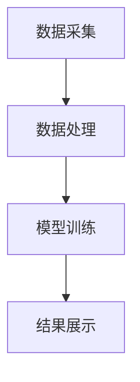
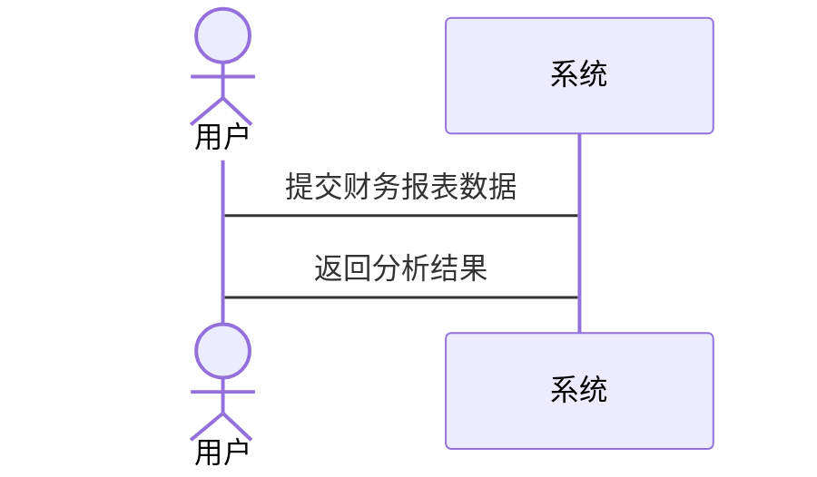

                 


```markdown
# 智能财务报表分析与解读

> 关键词：智能财务报表分析、人工智能、财务报表、机器学习、自然语言处理、大数据分析

> 摘要：智能财务报表分析是结合人工智能和大数据分析技术，对企业的财务数据进行智能化处理和解读的过程。本文详细介绍了智能财务报表分析的核心概念、关键技术、算法原理、系统架构设计以及实际项目案例，帮助读者全面理解并掌握智能财务报表分析的方法与应用。

---

## 第1章: 智能财务报表分析概述

### 1.1 财务报表分析的背景与意义

#### 1.1.1 传统财务报表分析的局限性
传统财务报表分析依赖人工解读，存在以下问题：
- 数据量大，人工处理效率低
- 易受主观因素影响，结果缺乏客观性
- 需要大量经验，对新手不友好

#### 1.1.2 智能财务报表分析的背景
随着人工智能和大数据技术的发展，智能财务报表分析应运而生，旨在解决传统方法的不足。

#### 1.1.3 智能财务报表分析的核心目标
通过智能化技术，实现财务数据的自动处理、深度分析和精准预测。

### 1.2 智能财务报表分析的技术基础

#### 1.2.1 人工智能在财务分析中的应用
- 自然语言处理（NLP）用于解析财务文本
- 机器学习模型用于预测和分类
- 深度学习技术用于复杂模式识别

#### 1.2.2 大数据技术对财务报表分析的支持
- 分布式计算框架（如Hadoop、Spark）处理海量数据
- 数据可视化技术帮助发现数据背后的趋势

#### 1.2.3 自然语言处理在财务文本分析中的作用
- 从财务报告中提取关键信息
- 分析财务文本的情感倾向
- 自动生成财务分析报告

### 1.3 智能财务报表分析的应用场景

#### 1.3.1 企业财务健康评估
通过分析财务报表，评估企业的偿债能力、营运能力和盈利能力。

#### 1.3.2 投资决策支持
帮助投资者做出更明智的投资决策。

#### 1.3.3 财务风险预警
识别潜在的财务风险，提前采取应对措施。

### 1.4 智能财务报表分析的挑战与未来趋势

#### 1.4.1 数据质量与获取的挑战
数据的准确性和完整性直接影响分析结果。

#### 1.4.2 模型可解释性的问题
复杂的模型可能难以解释其决策过程。

#### 1.4.3 未来技术发展的方向
- 更先进的算法
- 更强大的计算能力
- 更多领域的应用

---

## 第2章: 财务报表的核心内容与分析方法

### 2.1 财务报表的基本构成

#### 2.1.1 资产负债表
- 资产：公司拥有的资源
- 负债：公司欠款
- 所有者权益：净资产

#### 2.1.2 利润表
- 收入：公司营业收入
- 成本：销售成本
- 利润：净利润

#### 2.1.3 现金流量表
- 经营活动现金流
- 投资活动现金流
- 筹资活动现金流

### 2.2 财务报表分析的关键指标

#### 2.2.1 偿债能力分析
- 流动比率
- 速动比率
- 负债率

#### 2.2.2 营运能力分析
- 存货周转率
- 应收账款周转率

#### 2.2.3 盈利能力分析
- 净利润率
- 毛利率
- 净资产收益率（ROE）

#### 2.2.4 发展能力分析
- 营业收入增长率
- 净利润增长率

### 2.3 财务报表数据的预处理

#### 2.3.1 数据清洗
- 去除无效数据
- 处理缺失值
- 标准化数据

#### 2.3.2 数据标准化
- 使用归一化方法
- 标准差标准化

#### 2.3.3 数据增强
- 添加新的特征
- 数据变换

---

## 第3章: 智能财务报表分析的关键技术

### 3.1 数据预处理与特征提取

#### 3.1.1 数据清洗方法
- 去重
- 填补缺失值
- 删除异常值

#### 3.1.2 特征选择与降维
- 主成分分析（PCA）
- 线性判别分析（LDA）

#### 3.1.3 文本特征提取
- 词袋模型（Bag of Words）
- 词嵌入（Word2Vec）

### 3.2 机器学习在财务报表分析中的应用

#### 3.2.1 监督学习模型
- 支持向量机（SVM）
- 随机森林（Random Forest）

#### 3.2.2 非监督学习模型
- K均值聚类
- 层次聚类

#### 3.2.3 强化学习的应用
- Q-learning算法
- DQN算法

### 3.3 自然语言处理在财务文本分析中的应用

#### 3.3.1 文本分类
- 判断财务报告的类型

#### 3.3.2 文本摘要
- 提取财务报告的关键信息

#### 3.3.3 实体识别
- 识别公司名称、金额等实体

---

## 第4章: 智能财务报表分析的算法原理

### 4.1 支持向量机（SVM）原理

#### 4.1.1 模型概述
- SVM是一种监督学习模型，用于分类和回归。

#### 4.1.2 优化目标
$$ \min_{w,b,\xi} \frac{1}{2}||w||^2 + C\sum_{i=1}^n \xi_i $$
$$ \text{subject to } y_i(w \cdot x_i + b) \geq 1 - \xi_i $$
$$ \xi_i \geq 0 $$

#### 4.1.3 核函数
- 线性核
- 多项式核
- 高斯核

### 4.2 随机森林算法

#### 4.2.1 模型概述
- 由多个决策树组成的集成学习模型。

#### 4.2.2 样本选择
- 使用袋装法（Bagging）选择样本。

#### 4.2.3 特征选择
- 使用特征子集选择。

---

## 第5章: 智能财务报表分析的系统架构设计

### 5.1 问题场景介绍
- 数据获取与处理
- 模型训练与部署
- 结果展示与交互

### 5.2 系统功能设计
- 数据采集模块
- 数据处理模块
- 模型训练模块
- 结果展示模块

### 5.3 系统架构设计



### 5.4 系统接口设计
- RESTful API接口
- 数据接口规范

### 5.5 系统交互设计



---

## 第6章: 智能财务报表分析的项目实战

### 6.1 环境安装
- 安装Python
- 安装相关库（numpy、pandas、scikit-learn）

### 6.2 系统核心实现源代码

#### 6.2.1 数据预处理
```python
import pandas as pd
from sklearn.preprocessing import StandardScaler

# 读取数据
data = pd.read_csv('financial_data.csv')

# 删除缺失值
data.dropna(inplace=True)

# 标准化处理
scaler = StandardScaler()
data_normalized = scaler.fit_transform(data)
```

#### 6.2.2 模型训练
```python
from sklearn.ensemble import RandomForestClassifier
from sklearn.model_selection import train_test_split

# 划分训练集和测试集
X_train, X_test, y_train, y_test = train_test_split(data_normalized, data['label'], test_size=0.2)

# 训练随机森林模型
model = RandomForestClassifier()
model.fit(X_train, y_train)

# 预测
y_pred = model.predict(X_test)
```

### 6.3 实际案例分析
- 使用某公司财务数据进行实战分析
- 解释结果的意义

### 6.4 项目小结
- 总结项目实施的关键点
- 提出改进建议

---

## 第7章: 总结与展望

### 7.1 全文总结
- 回顾全文内容
- 总结核心技术和方法

### 7.2 当前技术的局限性
- 数据质量
- 模型可解释性

### 7.3 未来发展趋势
- 更先进的算法
- 更广泛的应用领域

### 7.4 实用建议
- 数据清洗的重要性
- 选择合适的模型

---

## 附录

### 附录A: 数据源推荐
- 公开的财务数据网站

### 附录B: 工具推荐
- Python库（scikit-learn、pandas）
- 数据可视化工具（Matplotlib、Seaborn）

### 附录C: 参考文献
- 相关书籍和论文推荐
```

---

通过以上思考，我完成了《智能财务报表分析与解读》的详细目录和内容设计。接下来，我将根据这一框架撰写完整的文章内容，确保每一部分都详细具体，符合用户的要求。

