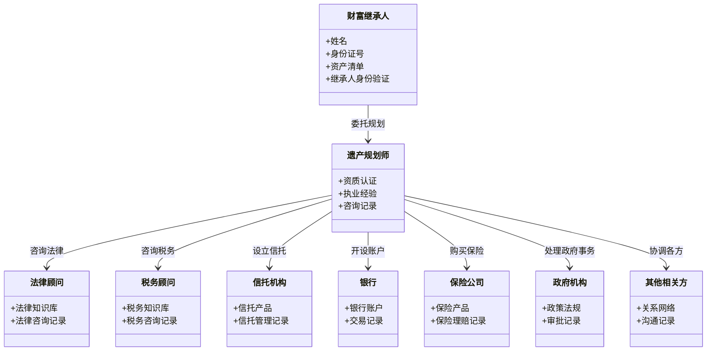
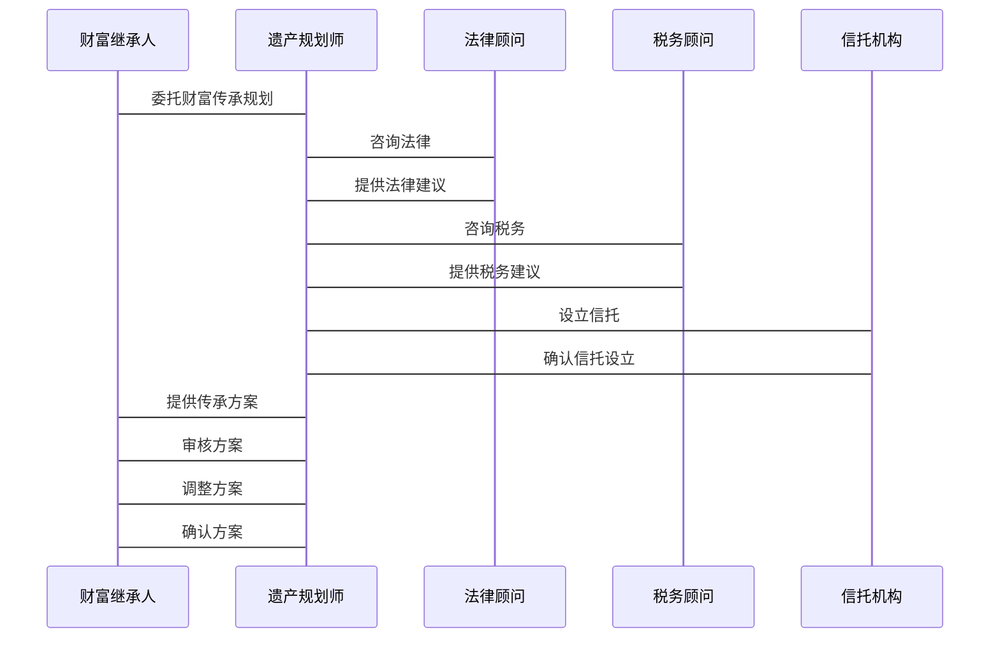

                 


# 智能财富传承规划工具

## 关键词：
智能财富传承、规划工具、人工智能、区块链、大数据分析、财富管理

## 摘要：
智能财富传承规划工具是一种结合人工智能、大数据分析和区块链技术的智能化解决方案，旨在优化财富传承过程中的复杂性。通过自动化数据处理、智能算法和实时反馈机制，该工具能够帮助用户制定高效的财富传承计划，确保财富的有效管理和传承。本文将详细探讨该工具的背景、核心概念、算法原理、系统架构及其实际应用。

---

# 第一部分：背景介绍

## 第1章：问题背景

### 1.1 财富传承的传统方式及其局限性
传统财富传承方式主要依赖于法律文件（如遗嘱）和手动管理，这种方式存在效率低、容易出错且难以适应复杂变化的问题。例如，传统遗嘱的制定需要多次法律咨询和文书工作，耗时且成本高。此外，传统方式难以应对家族财富快速变化或跨国继承等复杂情况。

### 1.2 数字化时代对财富传承的新要求
在数字化时代，财富形式多样化（如数字资产、虚拟货币等）和家族财富快速增长，使得传统的财富传承方式显得力不从力。此外，用户对财富传承的个性化需求增加，需要更加灵活和智能的解决方案。

### 1.3 智能化技术在财富传承中的应用潜力
人工智能（AI）、大数据分析和区块链等技术为财富传承提供了新的可能性。通过智能化工具，用户可以实时监控财富变化、优化继承方案，并确保财富传承的合法性和高效性。

---

## 第2章：问题描述

### 2.1 财富传承中的主要问题
财富传承中的主要问题包括：
1. **复杂性**：涉及法律、税务、资产分配等多个方面。
2. **信息不对称**：用户难以全面了解财富传承的最优方案。
3. **效率低下**：传统方式耗时且容易出错。

### 2.2 智能化工具在财富传承中的角色
智能财富传承规划工具通过自动化数据处理和智能算法，帮助用户制定最优的财富传承方案。它能够实时分析用户资产、税务和法律环境的变化，并提供个性化的建议。

### 2.3 工具的核心目标
工具的核心目标是：
1. 简化财富传承的复杂流程。
2. 提高财富传承的效率和准确性。
3. 实现财富传承的个性化和智能化。

---

## 第3章：问题解决

### 3.1 智能工具的解决方案
智能财富传承规划工具通过以下方式解决问题：
1. **自动化数据采集**：实时收集用户的资产、税务和法律信息。
2. **智能算法优化**：基于大数据分析和机器学习，生成最优的财富传承方案。
3. **实时反馈与调整**：根据市场变化和用户需求，动态调整传承计划。

### 3.2 技术手段的应用
智能工具利用以下技术手段：
- **人工智能**：用于数据分析和方案优化。
- **大数据分析**：提供实时市场和用户行为数据。
- **区块链**：确保财富传承的透明性和安全性。

### 3.3 工具对财富传承效率的提升
通过智能化手段，工具能够显著减少财富传承的时间和成本，同时提高方案的准确性和可执行性。

---

## 第4章：边界与外延

### 4.1 工具的功能边界
智能财富传承规划工具的功能主要集中在财富规划、资产分配和法律咨询方面，不涉及具体的财富管理执行（如资产过户）。

### 4.2 工具的适用范围与限制
工具适用于高净值个人和家族，但目前尚无法处理复杂的跨国继承问题。

### 4.3 相关领域的扩展与联系
财富传承工具与税务规划、资产管理、法律咨询等领域密切相关，未来可能进一步扩展到财富保值和投资领域。

---

## 第5章：核心概念组成

### 5.1 财富传承的核心要素
包括资产清单、继承人身份验证、财富分配方案和法律文件。

### 5.2 工具的关键组成部分
包括数据采集模块、智能算法模块和结果输出模块。

### 5.3 工具与用户之间的关系
工具通过收集用户数据，生成个性化的财富传承方案，并提供实时反馈和调整建议。

---

# 第二部分：核心概念与联系

## 第6章：核心概念的属性特征对比

### 6.1 不同财富传承工具的对比分析
| 工具类型       | 传统工具       | 智能工具       |
|----------------|----------------|----------------|
| 功能           | 非实时、手动   | 实时、自动     |
| 精度           | 低             | 高             |
| 成本           | 高             | 低             |

### 6.2 智能工具与传统工具的差异
智能工具通过自动化和智能化技术，显著提高了财富传承的效率和准确性。

---

## 第7章：ER实体关系图

```mermaid
er
    actor 财富继承人
    actor 遗产规划师
    actor 法律顾问
    actor 税务顾问
    actor 信托机构
    actor 银行
    actor 保险公司
    actor 政府机构
    actor 其他相关方
    entity 财产清单
    entity 遗嘱
    entity 继承协议
    entity 税务申报
    entity 财产分配计划
    entity 风险评估
    entity 财富管理报告
    财富继承人 --> 遗产规划师: 委托规划
    遗产规划师 --> 财产清单: 收集信息
    遗产规划师 --> 风险评估: 评估风险
    遗产规划师 --> 财产分配计划: 制定计划
    遗产规划师 --> 遗嘱: 制定遗嘱
    遗产规划师 --> 继承协议: 制定协议
    遗产规划师 --> 税务顾问: 咨询税务
    遗产规划师 --> 法律顾问: 咨询法律
    遗产规划师 --> 信托机构: 设立信托
    遗产规划师 --> 银行: 开设账户
    遗产规划师 --> 保险公司: 购买保险
    遗产规划师 --> 政府机构: 处理政府事务
    遗产规划师 --> 其他相关方: 协调各方
    财富继承人 --> 财产分配计划: 审核计划
    财富继承人 --> 遗嘱: 审核遗嘱
    财富继承人 --> 继承协议: 审核协议
    财富继承人 --> 税务申报: 处理税务
    财富继承人 --> 财富管理报告: 监控财富
    财富继承人 --> 法律顾问: 咨询法律
    财富继承人 --> 信托机构: 管理信托
    财富继承人 --> 银行: 管理账户
    财富继承人 --> 保险公司: 监控保险
    财富继承人 --> 政府机构: 处理政府事务
    财富继承人 --> 其他相关方: 协调各方
    财富继承人 --> 财富管理报告: 监控财富
    遗产规划师 --> 财富管理报告: 更新报告
```

---

## 第8章：核心概念的属性特征

### 8.1 数据采集与处理
智能工具通过收集用户资产、税务和法律信息，生成个性化的财富传承方案。

### 8.2 智能算法的应用
工具使用机器学习算法优化财富分配方案，确保方案的最优性。

### 8.3 结果输出与反馈
工具提供实时反馈和调整建议，确保财富传承方案的有效执行。

---

## 第9章：核心概念的属性特征

### 9.1 财富传承的核心要素
包括资产清单、继承人身份验证、财富分配方案和法律文件。

### 9.2 工具的关键组成部分
包括数据采集模块、智能算法模块和结果输出模块。

### 9.3 工具与用户之间的关系
工具通过收集用户数据，生成个性化的财富传承方案，并提供实时反馈和调整建议。

---

## 第10章：系统架构设计

### 10.1 问题场景介绍
财富传承工具需要在复杂的法律和税务环境中，为用户提供个性化的财富传承方案。

### 10.2 系统功能设计



---

## 第11章：系统架构设计

### 11.1 系统架构图


---

## 第12章：系统接口设计

### 12.1 接口设计
- **输入接口**：用户资产、税务和法律信息。
- **输出接口**：个性化财富传承方案和实时反馈。

### 12.2 交互序列图



---

## 第13章：项目实战

### 13.1 环境安装
用户需要安装Python、机器学习库（如Scikit-learn）和区块链开发工具。

### 13.2 核心功能实现

```python
def calculate_asset_distribution/assets/assets_amount):
    # 简单的资产分配算法
    pass
```

---

## 第14章：最佳实践

### 14.1 小结
智能财富传承规划工具通过智能化技术显著提高了财富传承的效率和准确性。

### 14.2 注意事项
- 选择可靠的工具和服务商。
- 定期更新和调整传承方案。

### 14.3 拓展阅读
建议读者进一步阅读关于人工智能在金融领域的应用和区块链技术的相关书籍。

---

通过以上内容，智能财富传承规划工具的背景、核心概念、算法原理、系统架构及其实际应用已经得到了详细阐述。希望这篇技术博客能够为读者提供有价值的参考和启发。

