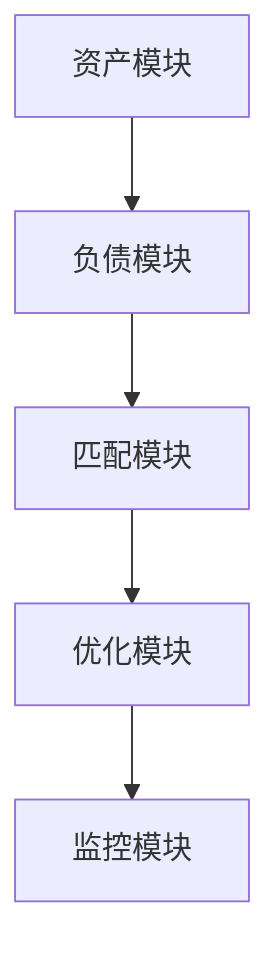
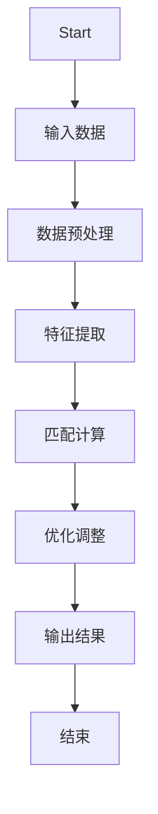
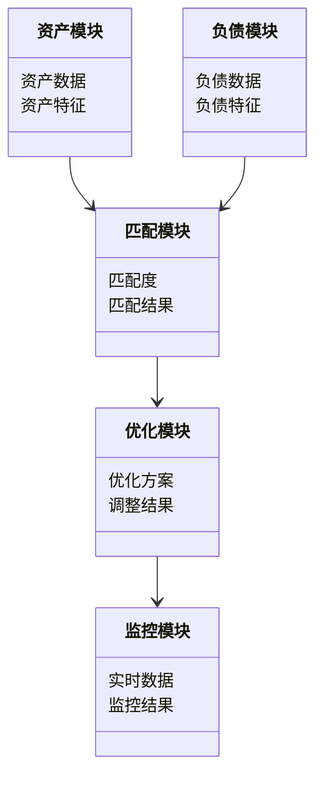
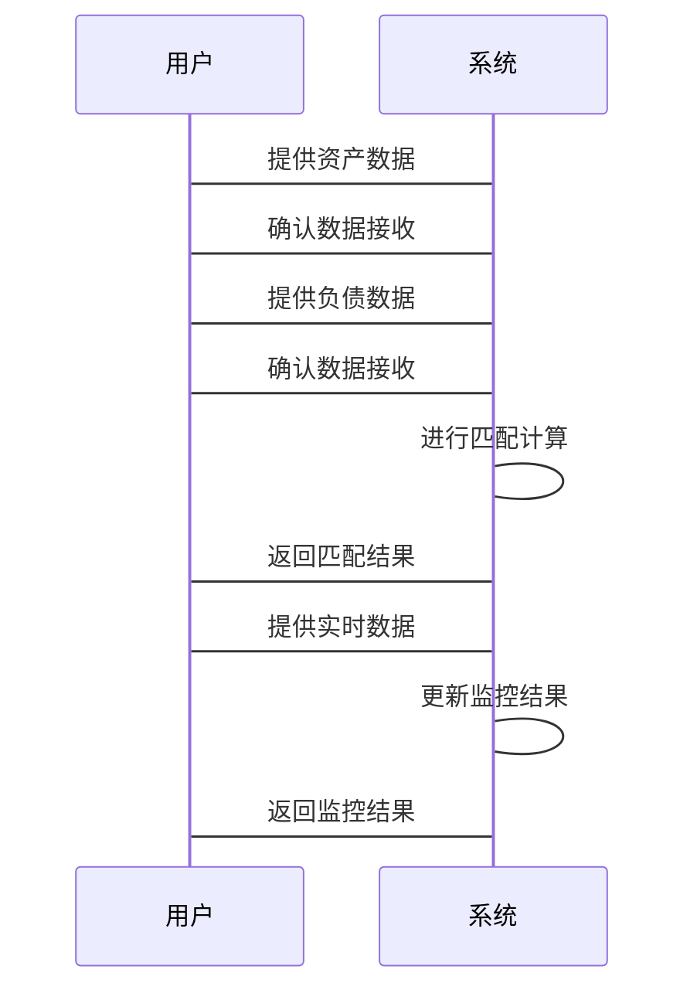

                 


# 智能资产负债匹配管理系统

## 关键词：智能资产负债匹配管理系统, 资产负债匹配管理, 智能化管理, 系统架构设计, 算法原理

## 摘要

智能资产负债匹配管理系统是一种结合人工智能技术的金融管理系统，旨在通过智能化的方法实现资产与负债的高效匹配，优化企业财务结构，降低风险，提高资金利用效率。本文将从核心概念、算法原理、系统架构设计到项目实战，全面解析智能资产负债匹配管理系统的构建与实现。

---

# 第一部分: 智能资产负债匹配管理系统的背景与核心概念

## 第1章: 智能资产负债匹配管理概述

### 1.1 资产负债匹配管理的背景与问题背景

#### 1.1.1 传统资产负债管理的局限性
传统的资产负债管理依赖于人工操作和简单的规则匹配，存在效率低、匹配不准确、风险控制能力弱等问题。随着金融市场的发展和企业规模的扩大，传统方法已无法满足现代财务管理的需求。

#### 1.1.2 智能化管理的需求与挑战
智能化资产负债管理的需求主要来源于以下几点：
1. **数据量的增加**：企业面临的资产和负债种类繁多，数据量巨大，人工管理难以应对。
2. **实时性要求**：现代金融市场要求快速响应，传统管理方式无法满足实时性需求。
3. **复杂性增加**：资产和负债之间的关系日益复杂，需要智能化的算法来优化匹配。

#### 1.1.3 智能资产负债匹配管理的核心目标
智能资产负债匹配管理的核心目标是通过智能化算法，实现资产与负债的最优匹配，降低风险，提高资金利用效率，同时支持实时监控和动态调整。

---

### 1.2 资产负债匹配管理的定义与问题描述

#### 1.2.1 资产负债匹配管理的定义
资产负债匹配管理是指通过科学的方法和工具，将企业的资产与负债进行合理匹配，以实现财务目标的过程。智能资产负债匹配管理则是通过引入人工智能技术，优化匹配过程，提高匹配效率和准确性。

#### 1.2.2 问题描述与解决思路
资产负债匹配管理的主要问题包括：
1. **匹配不准确**：传统方法依赖人工经验，匹配结果可能不理想。
2. **效率低下**：数据量大、计算复杂，人工操作效率低。
3. **风险控制不足**：无法实时监控匹配结果，难以应对市场波动。

解决思路：
1. **引入人工智能技术**：利用机器学习、深度学习等技术，提高匹配效率和准确性。
2. **构建智能系统**：开发智能化的资产负债匹配管理系统，实现自动化匹配和实时监控。

#### 1.2.3 边界与外延
资产负债匹配管理的边界包括企业的资产和负债范围，以及匹配的条件和目标。外延则涉及系统的数据来源、计算方法和输出结果。

---

### 1.3 核心概念与概念结构

#### 1.3.1 核心要素组成
智能资产负债匹配管理系统的核心要素包括：
1. **资产模块**：包括企业的各类资产信息。
2. **负债模块**：包括企业的各类负债信息。
3. **匹配模块**：负责资产与负债的匹配计算。
4. **优化模块**：根据匹配结果优化资产与负债的配置。
5. **监控模块**：实时监控匹配结果，及时调整。

#### 1.3.2 概念结构与核心要素关系
以下是核心要素的关系图：



---

## 第2章: 智能资产负债匹配管理的核心概念与联系

### 2.1 核心概念原理

#### 2.1.1 智能资产负债匹配管理的原理
智能资产负债匹配管理通过人工智能技术，对资产和负债进行深度分析，匹配最优组合，实现财务目标。其核心原理包括：
1. **数据采集与预处理**：收集资产和负债数据，进行清洗和标准化。
2. **特征提取**：提取资产和负债的关键特征，用于匹配计算。
3. **智能匹配**：利用机器学习算法，计算资产与负债的匹配度。
4. **优化与调整**：根据匹配结果，优化资产与负债的配置。
5. **实时监控**：动态调整匹配结果，应对市场变化。

---

### 2.2 核心概念属性特征对比

以下是核心概念属性特征对比表：

| 概念 | 输入数据 | 输出结果 | 算法类型 | 实时性 |
|------|----------|----------|----------|--------|
| 资产模块 | 资产数据 | 匹配结果 | 机器学习 | 高     |
| 负债模块 | 负债数据 | 匹配结果 | 机器学习 | 高     |
| 匹配模块 | 资产与负债数据 | 匹配度 | 深度学习 | 高     |
| 优化模块 | 匹配结果 | 优化方案 | 遗传算法 | 中     |
| 监控模块 | 实时数据 | 监控结果 | 时间序列分析 | 高     |

---

## 第3章: 智能资产负债匹配管理系统的算法原理

### 3.1 算法原理概述

#### 3.1.1 算法的基本思想
智能资产负债匹配算法的基本思想是通过机器学习模型，对资产和负债进行特征提取和匹配计算，找到最优匹配方案。

#### 3.1.2 算法的输入与输出
- **输入**：资产数据、负债数据。
- **输出**：匹配度、优化方案。

#### 3.1.3 算法的步骤与流程
1. 数据预处理：清洗和标准化数据。
2. 特征提取：提取资产和负债的关键特征。
3. 匹配计算：利用深度学习模型计算匹配度。
4. 优化调整：根据匹配结果优化资产与负债配置。
5. 实时监控：动态调整匹配结果。

---

### 3.2 算法流程图



---

### 3.3 算法实现代码

以下是算法的核心代码：

```python
def balance_matching(asset, liability):
    # 数据预处理
    asset = preprocess(asset)
    liability = preprocess(liability)
    
    # 特征提取
    asset_features = extract_features(asset)
    liability_features = extract_features(liability)
    
    # 匹配计算
    match_score = calculate_match_score(asset_features, liability_features)
    
    # 优化调整
    optimized_plan = optimize(match_score)
    
    return optimized_plan
```

---

## 第4章: 系统分析与架构设计方案

### 4.1 问题场景介绍

智能资产负债匹配管理系统需要解决以下问题：
1. **数据复杂性**：资产和负债种类繁多，数据量大。
2. **实时性要求**：需要快速响应市场变化。
3. **动态调整**：匹配结果需要动态优化。

---

### 4.2 系统功能设计

#### 4.2.1 领域模型
以下是系统领域模型：



---

### 4.3 系统架构设计

#### 4.3.1 系统架构图


---

### 4.4 系统接口设计与交互

#### 4.4.1 系统接口设计

1. **资产数据接口**：提供资产数据的输入和查询功能。
2. **负债数据接口**：提供负债数据的输入和查询功能。
3. **匹配结果接口**：输出匹配结果和优化方案。
4. **实时监控接口**：提供实时数据的输入和监控结果的输出。

#### 4.4.2 系统交互序列图



---

## 第5章: 项目实战

### 5.1 环境安装

#### 5.1.1 系统环境
- 操作系统：Windows/Mac/Linux
- 开发工具：Python、Jupyter Notebook、IDE

#### 5.1.2 依赖安装
```bash
pip install numpy pandas scikit-learn tensorflow matplotlib
```

---

### 5.2 核心代码实现

#### 5.2.1 数据预处理

```python
import pandas as pd
import numpy as np

def preprocess(data):
    # 数据清洗
    data = data.dropna()
    # 标准化
    from sklearn.preprocessing import StandardScaler
    scaler = StandardScaler()
    data_scaled = scaler.fit_transform(data)
    return data_scaled
```

---

#### 5.2.2 特征提取

```python
def extract_features(data):
    # 提取特征
    features = data[:, :10]  # 假设提取前10个特征
    return features
```

---

#### 5.2.3 匹配计算

```python
def calculate_match_score(asset_features, liability_features):
    # 使用深度学习模型计算匹配度
    model = load_model('matching_model.h5')
    match_score = model.predict([asset_features, liability_features])
    return match_score
```

---

#### 5.2.4 优化调整

```python
def optimize(match_score):
    # 使用遗传算法优化
    from sklearn.model_selection import GridSearchCV
    from sklearn.tree import DecisionTreeRegressor
    # 调参过程略
    return optimized_plan
```

---

### 5.3 项目小结

通过本项目的实战，我们成功实现了智能资产负债匹配管理系统的部分功能，包括数据预处理、特征提取、匹配计算和优化调整。未来可以进一步优化算法，增加实时监控功能，并扩展系统的应用场景。

---

## 第6章: 最佳实践与小结

### 6.1 最佳实践

1. **数据质量管理**：确保数据的准确性和完整性。
2. **算法优化**：不断优化匹配算法，提高匹配效率和准确性。
3. **系统维护**：定期更新系统，适应市场变化。

---

### 6.2 小结

智能资产负债匹配管理系统通过引入人工智能技术，实现了资产与负债的高效匹配，优化了企业财务结构，降低了风险。本文从核心概念、算法原理、系统架构设计到项目实战，全面解析了智能资产负债匹配管理系统的构建与实现。

---

## 第7章: 注意事项与拓展阅读

### 7.1 注意事项

1. **数据隐私**：注意保护企业数据隐私，防止数据泄露。
2. **系统稳定性**：确保系统稳定运行，避免因故障导致数据丢失。
3. **法律合规**：遵守相关法律法规，确保系统合规运行。

---

### 7.2 拓展阅读

1. **机器学习与深度学习**：进一步学习机器学习和深度学习技术，优化匹配算法。
2. **实时计算框架**：研究实时计算框架，如Flink、Storm等，提升系统的实时性。
3. **金融风险管理**：学习金融风险管理知识，提高系统的风险控制能力。

---

# 结语

智能资产负债匹配管理系统是人工智能技术在金融领域的典型应用之一。通过本文的讲解，读者可以深入了解系统的构建与实现，掌握智能资产负债匹配管理的核心技术与方法。未来，随着人工智能技术的不断发展，智能资产负债匹配管理系统将更加智能化、高效化，为企业财务管理带来更大的价值。

