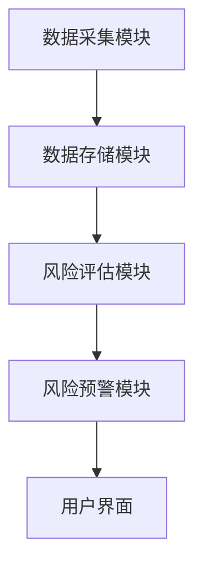
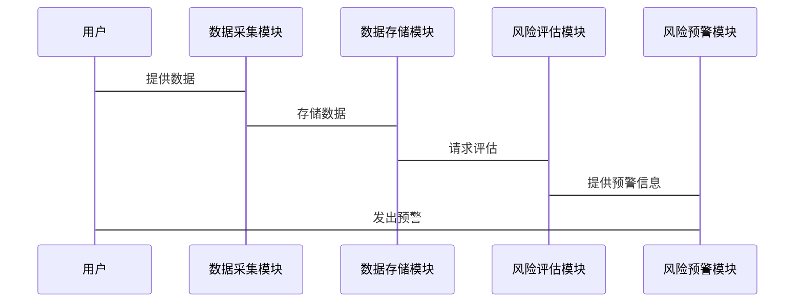

                 


# 智能银行风险管理系统设计

## 关键词：智能银行、风险管理、人工智能、大数据、系统设计

## 摘要：智能银行风险管理系统设计是一门结合人工智能、大数据分析和现代金融风险管理的综合技术。本文将从智能银行的基本概念出发，逐步深入探讨风险管理系统的核心原理、算法实现和系统架构设计。通过详细分析风险识别、评估和控制的关键步骤，结合实际应用场景，为读者提供一套完整的设计思路和实现方案。文章还将涵盖系统的功能模块划分、架构设计、项目实战和最佳实践等内容，帮助读者全面理解并掌握智能银行风险管理系统的设计方法。

---

# 第一部分：智能银行风险管理系统概述

## 第1章：智能银行的基本概念

### 1.1 智能银行的定义与特点

#### 1.1.1 传统银行与智能银行的对比
- **传统银行**：依赖人工操作，服务效率较低，风险控制主要依赖历史数据和经验判断。
- **智能银行**：利用人工智能、大数据、区块链等技术，实现自动化、智能化的金融服务，提高效率和风险管理能力。

#### 1.1.2 智能银行的核心特征
- **数据驱动**：利用大数据技术进行客户行为分析和市场趋势预测。
- **自动化服务**：通过智能系统实现自动化的开户、借贷、结算等业务。
- **实时风控**：利用人工智能技术实时监控和评估风险，及时预警和应对。

### 1.2 风险管理系统的定义与作用

#### 1.2.1 风险管理的基本概念
- **风险**：指在金融活动中可能发生的损失或不利事件。
- **风险管理**：通过识别、评估、控制和监控风险，降低其对银行或客户的影响。

#### 1.2.2 银行风险管理的核心目标
- **保护资产安全**：确保银行资产免受损失。
- **维护客户信任**：通过风险管理降低客户损失，增强客户信任。
- **合规经营**：确保银行的业务符合相关法律法规。

#### 1.2.3 智能化风险管理系统的必要性
- **提高效率**：通过自动化技术快速识别和处理风险。
- **增强准确性**：利用机器学习等技术提高风险评估的准确性。
- **实时监控**：实时跟踪市场变化和客户行为，及时发现潜在风险。

---

## 第2章：智能银行风险管理系统的核心概念

### 2.1 风险管理的核心要素

#### 2.1.1 风险识别
- **定义**：识别可能影响银行的潜在风险。
- **方法**：通过数据分析、客户行为分析等方式识别风险来源。
- **工具**：利用大数据平台和机器学习算法进行风险识别。

#### 2.1.2 风险评估
- **定义**：对识别出的潜在风险进行量化分析，评估其可能带来的损失。
- **指标**：包括风险概率、风险影响程度、风险成本等。
- **方法**：使用数学模型和统计方法进行风险评估。

#### 2.1.3 风险控制
- **定义**：采取措施降低风险发生的概率或减少其影响。
- **策略**：包括风险规避、风险转移、风险缓解等。
- **工具**：利用区块链技术实现风险分散和转移。

### 2.2 智能化技术在风险管理中的应用

#### 2.2.1 人工智能在风险识别中的作用
- **机器学习**：用于客户行为分析、市场趋势预测等。
- **自然语言处理**：用于分析新闻、社交媒体等非结构化数据，识别潜在风险。

#### 2.2.2 大数据技术在风险评估中的应用
- **数据采集**：通过大数据平台采集客户交易数据、市场数据等。
- **数据分析**：利用数据挖掘技术发现潜在风险。
- **预测模型**：建立预测模型，评估风险发生的可能性。

#### 2.2.3 区块链技术在风险控制中的应用
- **数据存储**：利用区块链技术实现数据的分布式存储，确保数据的安全性和不可篡改性。
- **智能合约**：通过智能合约实现自动化的风险控制，例如自动触发止损机制。

### 2.3 系统架构的核心要素

#### 2.3.1 数据采集模块
- **功能**：采集银行内部数据、外部市场数据、客户行为数据等。
- **工具**：使用大数据平台（如Hadoop、Spark）进行数据采集和存储。

#### 2.3.2 风险评估模块
- **功能**：对采集的数据进行分析，评估潜在风险。
- **算法**：使用机器学习算法（如随机森林、支持向量机）进行风险评估。

#### 2.3.3 风险预警模块
- **功能**：实时监控风险指标，当风险超过设定阈值时，触发预警机制。
- **工具**：利用实时数据流处理技术（如Apache Kafka）实现风险预警。

---

## 第3章：智能银行风险管理系统的核心算法原理

### 3.1 风险评估的数学模型

#### 3.1.1 线性回归模型
- **定义**：一种用于预测目标变量与自变量之间线性关系的统计方法。
- **公式**：$$ y = \beta_0 + \beta_1x + \epsilon $$
- **应用**：用于预测客户违约概率，评估风险。

#### 3.1.2 支持向量机（SVM）
- **定义**：一种监督学习算法，用于分类和回归问题。
- **优势**：适用于高维数据，分类准确率高。
- **应用**：用于客户信用评分，判断客户是否具备还款能力。

#### 3.1.3 随机森林
- **定义**：一种基于决策树的集成学习算法，通过构建多个决策树并进行投票或平均来提高预测准确率。
- **优势**：能够处理高维数据，抗过拟合能力强。
- **应用**：用于风险评估，预测客户违约概率。

### 3.2 基于机器学习的风险预测算法

#### 3.2.1 算法原理
- **决策树**：通过特征选择构建树状结构，将数据分成不同的叶子节点，每个叶子节点代表一种风险类别。
- **随机森林**：通过构建多个决策树，提高模型的泛化能力和准确性。

#### 3.2.2 算法实现
- **数据预处理**：对数据进行清洗、特征选择、数据标准化等处理。
- **模型训练**：使用训练数据训练模型，调整模型参数，优化模型性能。
- **结果分析**：通过混淆矩阵、准确率、召回率等指标评估模型性能。

### 3.3 算法实现的代码示例

#### 3.3.1 数据预处理
```python
import pandas as pd
from sklearn.preprocessing import StandardScaler

# 读取数据
data = pd.read_csv('risk_data.csv')

# 删除缺失值
data = data.dropna()

# 标准化数据
scaler = StandardScaler()
data_scaled = scaler.fit_transform(data)
```

#### 3.3.2 模型训练
```python
from sklearn.ensemble import RandomForestClassifier

# 构建模型
model = RandomForestClassifier(n_estimators=100, random_state=42)

# 训练模型
model.fit(data_scaled, target)
```

#### 3.3.3 结果分析
```python
from sklearn.metrics import accuracy_score, confusion_matrix

# 预测结果
y_pred = model.predict(data_scaled)

# 计算准确率
accuracy = accuracy_score(target, y_pred)
print(f'Accuracy: {accuracy}')

# 绘制混淆矩阵
cm = confusion_matrix(target, y_pred)
print(cm)
```

---

## 第4章：智能银行风险管理系统的设计与实现

### 4.1 系统设计的总体思路

#### 4.1.1 系统目标
- 实现银行风险的智能化识别、评估和控制。
- 提高风险管理的效率和准确性。
- 实现风险预警和实时监控。

#### 4.1.2 系统功能模块划分
- 数据采集模块：负责数据的采集和预处理。
- 风险评估模块：负责风险的识别和评估。
- 风险预警模块：负责风险的实时监控和预警。

### 4.2 系统功能模块的设计

#### 4.2.1 数据采集模块
- **功能**：采集银行内部数据、外部市场数据、客户行为数据等。
- **工具**：使用大数据平台（如Hadoop、Spark）进行数据采集和存储。

#### 4.2.2 风险评估模块
- **功能**：对采集的数据进行分析，评估潜在风险。
- **算法**：使用机器学习算法（如随机森林、支持向量机）进行风险评估。

#### 4.2.3 风险预警模块
- **功能**：实时监控风险指标，当风险超过设定阈值时，触发预警机制。
- **工具**：利用实时数据流处理技术（如Apache Kafka）实现风险预警。

### 4.3 系统架构设计

#### 4.3.1 系统架构图


#### 4.3.2 系统交互图


---

## 第5章：智能银行风险管理系统的项目实战

### 5.1 环境安装

#### 5.1.1 安装Python和相关库
- **Python**：3.8及以上版本。
- **库**：Pandas、Scikit-learn、Mermaid、Matplotlib等。

#### 5.1.2 安装大数据平台
- **Hadoop**：用于数据存储和处理。
- **Spark**：用于大数据分析和处理。

### 5.2 系统核心实现源代码

#### 5.2.1 数据预处理
```python
import pandas as pd
from sklearn.preprocessing import StandardScaler

# 读取数据
data = pd.read_csv('risk_data.csv')

# 删除缺失值
data = data.dropna()

# 标准化数据
scaler = StandardScaler()
data_scaled = scaler.fit_transform(data)
```

#### 5.2.2 模型训练
```python
from sklearn.ensemble import RandomForestClassifier

# 构建模型
model = RandomForestClassifier(n_estimators=100, random_state=42)

# 训练模型
model.fit(data_scaled, target)
```

#### 5.2.3 结果分析
```python
from sklearn.metrics import accuracy_score, confusion_matrix

# 预测结果
y_pred = model.predict(data_scaled)

# 计算准确率
accuracy = accuracy_score(target, y_pred)
print(f'Accuracy: {accuracy}')

# 绘制混淆矩阵
cm = confusion_matrix(target, y_pred)
print(cm)
```

### 5.3 实际案例分析

#### 5.3.1 案例背景
- 某银行希望通过智能系统实现客户信用评估和风险预警。

#### 5.3.2 数据分析
- 使用随机森林算法对客户数据进行分析，预测客户违约概率。

#### 5.3.3 系统实现
- 通过数据采集模块采集客户数据，使用风险评估模块进行评估，最后通过风险预警模块实现实时监控。

### 5.4 项目小结

#### 5.4.1 项目成果
- 成功实现智能银行风险管理系统的设计和实现。
- 提高了风险管理的效率和准确性。

#### 5.4.2 经验总结
- 数据预处理是关键，需要仔细清洗和标准化数据。
- 选择合适的算法和模型，能够显著提高系统的性能。

---

## 第6章：智能银行风险管理系统的最佳实践

### 6.1 小结

#### 6.1.1 系统设计的总结
- 系统设计需要考虑数据的采集、存储、处理和分析。
- 算法选择需要根据具体需求和数据特点进行优化。

#### 6.1.2 实际应用中的注意事项
- 数据隐私和安全是需要重点关注的问题。
- 系统的实时性和稳定性需要通过优化架构和算法来保证。

### 6.2 注意事项

#### 6.2.1 数据隐私保护
- 银行数据涉及客户隐私，需要通过加密技术和访问控制来保护数据安全。

#### 6.2.2 系统的可扩展性
- 系统设计需要具有良好的可扩展性，能够适应未来业务的发展和数据的增长。

#### 6.2.3 系统的稳定性
- 系统需要具备高可用性和容错能力，确保在出现故障时能够快速恢复。

### 6.3 拓展阅读

#### 6.3.1 推荐书籍
- 《机器学习实战》
- 《大数据分析与挖掘》

#### 6.3.2 推荐博客和网站
- [Towards Data Science](https://towardsdatascience.com/)
- [Medium - AI and Machine Learning](https://medium.com/ai-and-machine-learning)

---

## 结语

智能银行风险管理系统设计是一门结合人工智能、大数据分析和现代金融风险管理的综合技术。通过本文的详细讲解，读者可以全面理解智能银行风险管理系统的设计方法和实现步骤。希望本文能够为读者在智能银行风险管理系统的开发和应用中提供有价值的参考和指导。

