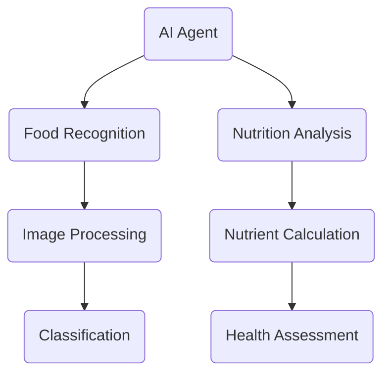
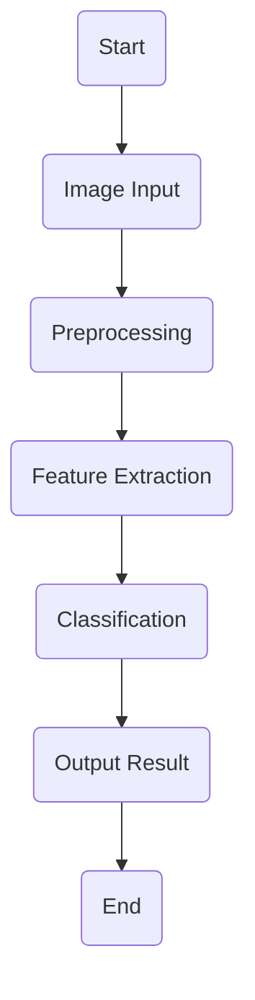
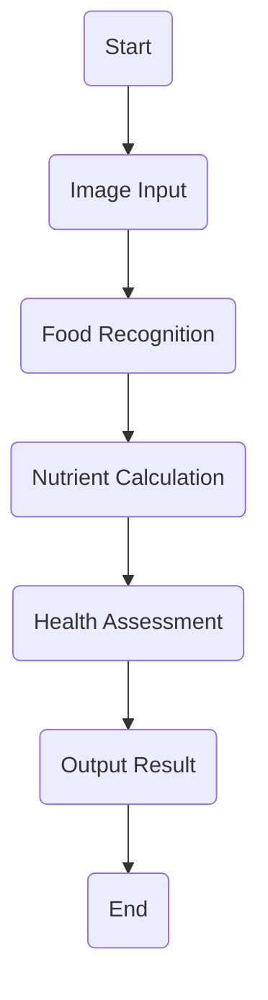
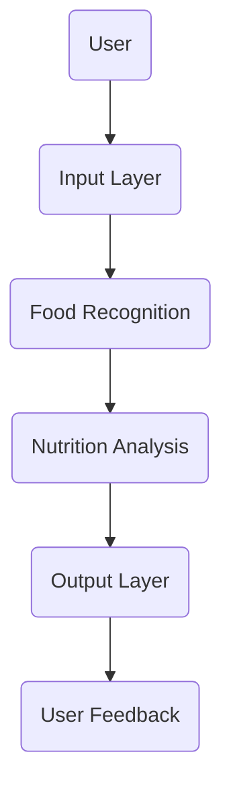
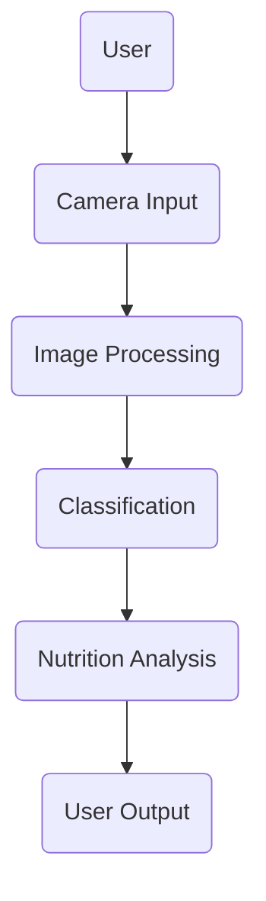

                 


# 《智能餐盘：AI Agent的食物识别与营养分析》

## 关键词：
- AI Agent
- 食物识别
- 营养分析
- 图像识别
- 健康评估

## 摘要：
本文详细探讨了AI Agent在智能餐盘中的应用，重点分析了食物识别与营养分析的核心技术，包括图像识别算法、营养分析模型及其在实际场景中的应用。通过系统架构设计和项目实战，展示了如何利用AI技术提升饮食健康。

---

# 第1章: AI Agent与智能餐盘的背景介绍

## 1.1 问题背景与描述
### 1.1.1 食物识别与营养分析的现状
- 随着生活水平的提高，人们对饮食健康的关注日益增加。
- 手机拍照识别食物已成为用户获取营养信息的重要方式。

### 1.1.2 当前技术的局限性
- 现有技术在食物识别中存在误识别率高、营养分析不够精准等问题。
- 手机拍照识别功能依赖于互联网，数据隐私问题突出。

### 1.1.3 AI Agent在餐饮行业的应用潜力
- AI Agent可以实现本地化、实时化的食物识别和营养分析。
- 通过AI Agent技术，用户可以在无网络环境下获取营养建议。

## 1.2 问题解决与边界
### 1.2.1 AI Agent如何解决食物识别问题
- 通过图像识别技术实现食物的自动识别。
- 结合营养数据库提供个性化健康建议。

### 1.2.2 营养分析的核心挑战
- 多食物混搭识别的准确性问题。
- 营养成分数据库的构建与维护。

### 1.2.3 智能餐盘的边界与外延
- 限定场景：家庭餐桌、餐厅、超市等。
- 边界条件：食物种类有限，营养分析基于标准数据库。

## 1.3 核心概念与结构
### 1.3.1 AI Agent的定义与属性
- AI Agent：具有自主决策能力的智能体，能够感知环境并执行任务。
- 属性：自主性、反应性、社交能力、学习能力。

### 1.3.2 智能餐盘的核心要素
- 食物识别模块：图像采集、预处理、特征提取、分类。
- 营养分析模块：营养成分计算、健康评估、建议生成。
- 用户交互模块：界面设计、结果展示、用户反馈。

### 1.3.3 系统架构与核心功能
- 系统架构：模块化设计，支持扩展。
- 核心功能：食物识别、营养分析、健康建议。

## 1.4 本章小结
本章介绍了AI Agent和智能餐盘的背景，分析了当前技术的局限性，提出了AI Agent在餐饮行业的应用潜力，并明确了系统的边界与核心概念。

---

# 第2章: AI Agent的核心概念与联系

## 2.1 核心概念原理
### 2.1.1 AI Agent的基本原理
- AI Agent通过感知环境信息，执行决策和行动。
- 支持多模态输入，包括图像、文本和语音。

### 2.1.2 图像识别与食物分类
- 基于卷积神经网络（CNN）的图像分类模型。
- 使用目标检测技术定位食物位置。

### 2.1.3 营养分析的数学模型
- 基于营养成分数据库的线性回归模型。
- 综合食物热量、蛋白质、脂肪、碳水化合物等指标进行健康评估。

## 2.2 核心概念对比表
| 比较维度         | AI Agent                  | 传统算法                  |
|------------------|---------------------------|---------------------------|
| 决策能力         | 自主决策，动态调整策略    | 固定规则，无学习能力       |
| 交互方式         | 支持多模态交互             | 单一输入输出               |
| 适应性           | 能够自适应环境变化         | 需人工调整参数             |

## 2.3 实体关系图


## 2.4 本章小结
本章详细讲解了AI Agent的核心概念与原理，分析了图像识别与营养分析的关系，并通过对比和实体关系图明确了各部分之间的联系。

---

# 第3章: 图像识别与食物分类算法原理

## 3.1 算法原理讲解
### 3.1.1 目标检测算法
- 使用YOLOv5进行目标检测，识别食物的位置和类别。
- 算法流程：图像输入、特征提取、边界框回归、分类预测。

### 3.1.2 图像分割算法
- 使用U-Net进行图像分割，精准识别食物区域。
- 分割流程：编码器提取特征，解码器恢复分割结果。

### 3.1.3 食物分类算法
- 基于ResNet的迁移学习，训练食物分类模型。
- 分类流程：图像预处理、特征提取、分类预测。

## 3.2 算法流程图


## 3.3 数学模型与公式
### 3.3.1 YOLO目标检测模型
$$\text{YOLO损失函数} = \text{分类损失} + \text{定位损失} + \text{尺寸损失}$$

### 3.3.2 ResNet网络结构
$$\text{ResNet深度} = \text{层数} \times \text{每个模块层数}$$

## 3.4 本章小结
本章详细讲解了图像识别的核心算法，包括目标检测、图像分割和分类，并通过流程图和数学公式展示了算法的实现过程。

---

# 第4章: 营养分析与健康评估

## 4.1 营养分析的核心算法
### 4.1.1 食物热量计算
- 基于食物成分数据库，计算每100克食物的热量。
- 热量公式：$热量 = 蛋白质 \times 4 + 脂肪 \times 9 + 碳水化合物 \times 4$。

### 4.1.2 营养成分分析
- 综合分析蛋白质、脂肪、碳水化合物、维生素等成分。
- 使用线性回归模型评估营养均衡性。

### 4.1.3 健康评估模型
- 基于个人健康数据（体重、身高、年龄）进行个性化评估。
- 健康评分公式：$健康评分 = \sum (\text{各类别得分})$。

## 4.2 营养分析流程图


## 4.3 本章小结
本章详细介绍了营养分析的核心算法，包括热量计算、营养成分分析和健康评估模型，并通过流程图展示了营养分析的整体流程。

---

# 第5章: 系统架构设计与实现

## 5.1 系统功能设计
### 5.1.1 食物识别模块
- 图像采集与预处理。
- 目标检测与分类。

### 5.1.2 营养分析模块
- 营养成分计算。
- 健康建议生成。

### 5.1.3 用户交互模块
- 图形界面设计。
- 结果展示与反馈。

## 5.2 系统架构设计


## 5.3 系统接口设计
- 输入接口：摄像头、文件上传。
- 输出接口：屏幕显示、语音提示。

## 5.4 系统交互图


## 5.5 本章小结
本章详细设计了系统的架构和接口，并通过交互图展示了系统的整体流程。

---

# 第6章: 项目实战与实现

## 6.1 项目环境安装
### 6.1.1 环境搭建
- 安装Python、TensorFlow、OpenCV、YOLOv5。
- 安装依赖：pip install numpy, matplotlib, etc.

### 6.1.2 数据集准备
- 下载公开食物数据集（如ImageNet、COCO）。
- 构建自定义数据集，进行标注和扩增。

## 6.2 核心代码实现
### 6.2.1 图像识别代码
```python
import cv2
from tensorflow.keras.models import load_model

model = load_model('food_model.h5')
image = cv2.imread('test.jpg')
image = cv2.resize(image, (224, 224))
prediction = model.predict(image)
print("Predicted class:", prediction.argmax())
```

### 6.2.2 营养分析代码
```python
def calculate_nutrition(fat, carbs, protein):
    calories = protein * 4 + fat * 9 + carbs * 4
    return calories

nutrients = {'fat': 10, 'carbs': 20, 'protein': 15}
calories = calculate_nutrition(**nutrients)
print("Calories:", calories)
```

## 6.3 项目案例分析
- 案例1：识别一份沙拉的热量计算。
- 案例2：分析三明治的营养成分并提出健康建议。

## 6.4 本章小结
本章通过项目实战，详细讲解了环境搭建、代码实现和案例分析，帮助读者理解AI Agent在智能餐盘中的实际应用。

---

# 第7章: 最佳实践与总结

## 7.1 最佳实践
### 7.1.1 环境搭建注意事项
- 硬件要求：GPU加速，内存充足。
- 软件配置：确保依赖版本兼容。

### 7.1.2 代码实现技巧
- 数据增强提升模型泛化能力。
- 使用预训练模型降低计算成本。

## 7.2 小结
- AI Agent在智能餐盘中的应用前景广阔。
- 食物识别与营养分析的结合为用户提供了便捷的健康管理工具。

## 7.3 注意事项
- 数据隐私保护。
- 模型的泛化能力需要进一步优化。

## 7.4 拓展阅读
- 《深度学习实战》
- 《Python图像处理 cookbook》

---

# 结语

通过本文的详细讲解，读者可以深入了解AI Agent在智能餐盘中的应用，掌握从算法原理到系统实现的全过程。未来，随着技术的进步，智能餐盘将为人们提供更加精准和个性化的饮食健康服务。

