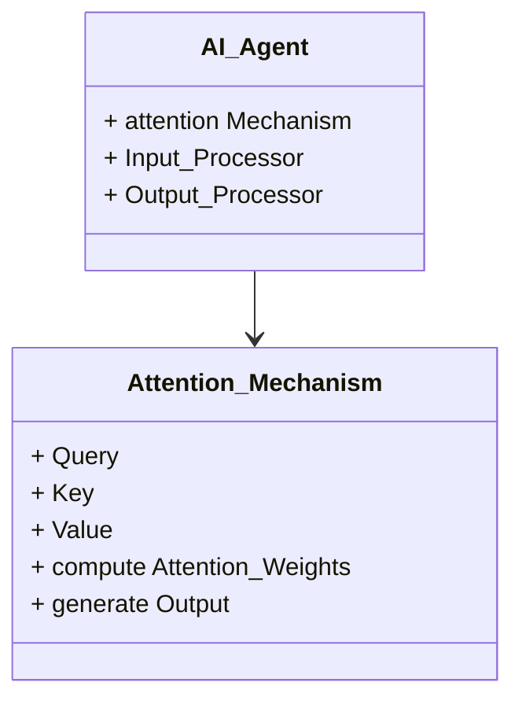
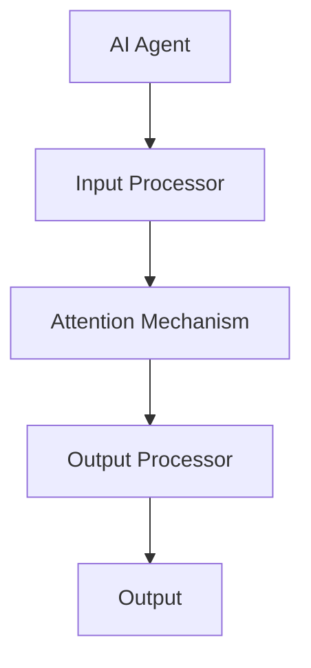
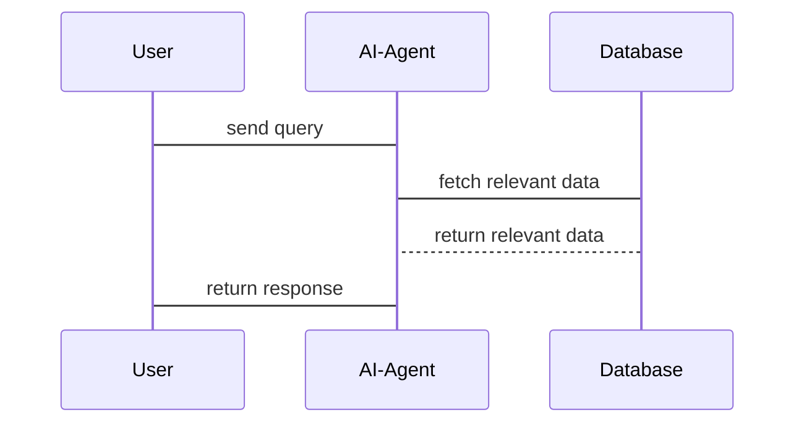

                 


# 第三章: 注意力机制的原理与数学模型

## 3.1 注意力机制的原理

注意力机制的基本思想是：在处理序列数据时，不同的位置对当前输出的影响不同。注意力机制通过计算每个位置的权重，来决定哪些位置对当前输出更重要。这种机制类似于人类在阅读时，会重点关注某些关键词或短语，而忽略不相关的部分。

### 3.1.1 查询、键、值的概念

在注意力机制中，查询（Query）、键（Key）、值（Value）是三个关键的组成部分：

- **查询（Query）**：表示当前需要关注的信息。
- **键（Key）**：用于表示输入序列中每个位置的特征。
- **值（Value）**：用于表示输入序列中每个位置的特征，与键类似，但通常用于存储更丰富的信息。

### 3.1.2 注意力权重的计算

注意力权重的计算公式如下：

$$
\text{score}(q, k) = q \cdot k^T
$$

其中，\( q \) 是查询，\( k \) 是键，\( k^T \) 表示 \( k \) 的转置。

### 3.1.3 最终输出的生成

最终输出是通过对所有位置的值进行加权求和得到的：

$$
\text{output} = \sum_{i=1}^{n} \alpha_i v_i
$$

其中，\( \alpha_i \) 是第 \( i \) 个位置的注意力权重，\( v_i \) 是第 \( i \) 个位置的值。

## 3.2 注意力机制的数学模型

### 3.2.1 查询、键、值的矩阵表示

假设输入序列的长度为 \( n \)，每个位置的特征向量维度为 \( d \)，则查询、键、值的矩阵表示如下：

$$
Q = [q_1, q_2, ..., q_n]
$$

$$
K = [k_1, k_2, ..., k_n]
$$

$$
V = [v_1, v_2, ..., v_n]
$$

### 3.2.2 注意力权重的计算公式

注意力权重的计算公式可以表示为：

$$
\text{Attention}(Q, K, V) = \text{softmax}\left(\frac{QK^T}{\sqrt{d}}\right)V
$$

其中，\( \text{softmax} \) 函数用于将得分归一化为概率分布。

### 3.2.3 输出结果的数学表达

最终的注意力输出可以表示为：

$$
\text{output} = \text{Attention}(Q, K, V)
$$

---

# 第四章: 系统分析与架构设计方案

## 4.1 问题场景介绍

在构建AI Agent时，我们通常需要处理复杂的任务，例如自然语言理解、对话生成等。这些任务通常涉及大量的上下文信息，因此需要一种高效的方式来关注重要的信息。

## 4.2 系统功能设计

### 4.2.1 领域模型

以下是一个简单的领域模型，展示了AI Agent中注意力机制的主要模块：



### 4.2.2 系统架构设计

以下是一个基于注意力机制的AI Agent系统的架构图：



### 4.2.3 接口设计

以下是一个简单的API接口设计：



---

# 第五章: 项目实战

## 5.1 环境安装

安装所需的Python库：

```bash
pip install numpy
pip install tensorflow
pip install matplotlib
```

## 5.2 核心代码实现

以下是一个简单的注意力机制实现代码：

```python
import numpy as np

def compute_attention(Q, K, V):
    # 计算注意力权重
    scores = np.dot(Q, K.T) / np.sqrt(K.shape[1])
    scores = np.exp(scores)
    # 归一化权重
    attention_weights = scores / np.sum(scores, axis=1, keepdims=True)
    # 计算输出
    output = np.dot(attention_weights, V)
    return output, attention_weights

# 示例数据
Q = np.random.randn(1, 5, 10)
K = np.random.randn(1, 5, 10)
V = np.random.randn(1, 5, 10)

output, attention_weights = compute_attention(Q, K, V)
print("Output shape:", output.shape)
print("Attention weights shape:", attention_weights.shape)
```

---

# 第六章: 小结与展望

## 6.1 小结

注意力机制是一种强大的工具，能够帮助AI Agent更好地理解和处理复杂的任务。通过计算注意力权重，模型可以关注到重要的信息，从而提高性能。

## 6.2 注意事项

在实际应用中，需要注意以下几点：

- **计算效率**：注意力机制的计算复杂度较高，需要优化计算效率。
- **模型训练**：需要大量的数据来训练模型，以保证注意力权重的准确性。
- **多头注意力**：可以引入多头注意力机制，进一步提高模型的表达能力。

## 6.3 拓展阅读

推荐以下几本书籍和论文：

- 《Attention is All You Need》（论文）
- 《Effective Sequence Modeling with Attention Mechanisms》（书籍）

---

通过以上内容，我们详细讲解了注意力机制在AI Agent中的设计与实现。希望这篇文章能够帮助读者更好地理解注意力机制的核心原理，并能够在实际项目中灵活运用。

