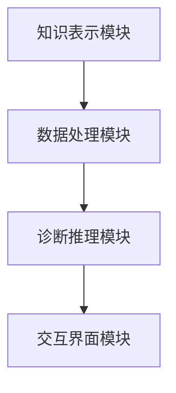

                 


# 《构建AI Agent的认知诊断模型》

> 关键词：AI Agent，认知诊断模型，知识表示，推理机制，算法原理，系统架构，项目实战

> 摘要：本文详细探讨了构建AI Agent的认知诊断模型的关键技术与方法。首先，从问题背景出发，分析了认知诊断模型的定义、作用及应用场景。接着，深入阐述了AI Agent在认知诊断中的角色与功能，并结合认知诊断模型的核心概念与AI Agent的关系，提出了基于数据驱动与知识驱动的诊断模型构建思路。随后，详细分析了模型的算法原理，包括知识表示与推理机制、数据驱动的诊断方法及知识图谱的应用。最后，通过系统架构设计、项目实战和案例分析，展示了如何将认知诊断模型与AI Agent结合，实现高效、智能的诊断过程。

---

# 第一部分: 引言

# 第1章: 问题背景与目标

## 1.1 问题背景

### 1.1.1 认知诊断模型的定义与作用
认知诊断模型是一种通过分析个体的知识掌握情况，识别其在特定领域中的优势与不足的工具。它基于知识表示和推理机制，能够为教育、医疗等领域提供个性化的诊断结果。

### 1.1.2 AI Agent在认知诊断中的应用场景
AI Agent（智能体）是一种能够感知环境、自主决策并执行任务的智能系统。在认知诊断中，AI Agent可以作为交互界面，与用户进行自然对话，实时分析用户的输入，结合认知诊断模型提供诊断结果。

### 1.1.3 当前认知诊断模型的局限性
传统的认知诊断模型往往依赖于固定的规则或统计方法，难以应对复杂多变的实际场景。同时，模型的可解释性不足，难以满足用户对诊断过程透明化的需求。

## 1.2 问题描述

### 1.2.1 认知诊断的核心问题
认知诊断的核心问题在于如何准确地表示和推理个体的知识状态，尤其是在复杂领域中，如何处理多维度的知识关联。

### 1.2.2 AI Agent在诊断过程中的角色
AI Agent需要具备以下功能：知识表示与推理、数据采集与处理、诊断结果生成与解释。

### 1.2.3 诊断模型与AI Agent的结合需求
为了实现高效的诊断过程，诊断模型需要与AI Agent紧密结合，利用AI Agent的交互能力，实时更新和优化诊断模型。

## 1.3 问题解决思路

### 1.3.1 基于AI Agent的认知诊断模型构建
构建一个基于AI Agent的认知诊断模型，需要结合知识表示、推理机制和数据驱动的方法。

### 1.3.2 数据驱动与知识驱动的结合
数据驱动方法通过大量数据训练模型，知识驱动方法则依赖于领域知识的结构化表示。两者的结合可以提高模型的准确性和可解释性。

### 1.3.3 模型的可解释性与实时性要求
为了满足实际应用需求，模型需要具备高可解释性和实时性，能够快速响应用户的输入并提供准确的诊断结果。

## 1.4 本章小结
本章从问题背景出发，明确了认知诊断模型与AI Agent结合的必要性，并提出了构建模型的初步思路。

---

# 第二部分: 核心概念与联系

# 第2章: 认知诊断模型的核心概念

## 2.1 认知诊断模型的原理

### 2.1.1 知识表示与推理机制
知识表示是认知诊断模型的基础，常用的表示方法包括概念图、知识图谱等。推理机制则是基于知识表示，通过逻辑推理得出诊断结果。

### 2.1.2 数据驱动的诊断方法
数据驱动方法通过机器学习算法，从大量数据中学习诊断规则，适用于复杂场景下的诊断任务。

### 2.1.3 知识图谱在诊断中的应用
知识图谱通过结构化的知识表示，能够帮助模型更好地理解领域知识，提高诊断的准确性。

## 2.2 AI Agent的定义与功能

### 2.2.1 AI Agent的基本定义
AI Agent是一种能够感知环境、自主决策并执行任务的智能系统，具备学习、推理和自适应能力。

### 2.2.2 AI Agent的核心功能
- 知识表示与推理
- 数据采集与处理
- 诊断结果生成与解释
- 交互与反馈

### 2.2.3 AI Agent与认知诊断模型的结合
AI Agent作为认知诊断模型的交互界面，负责与用户进行信息交互，实时更新诊断模型。

## 2.3 认知诊断模型与AI Agent的关系

### 2.3.1 模型驱动与数据驱动的结合
认知诊断模型需要结合领域知识和实际数据，通过模型驱动和数据驱动的方法，实现更准确的诊断。

### 2.3.2 AI Agent在诊断过程中的角色演变
AI Agent从最初的单纯数据处理工具，逐步发展为具备自主学习和推理能力的智能诊断助手。

### 2.3.3 模型的可解释性与实时性要求
为了满足实际应用需求，认知诊断模型需要具备高可解释性和实时性，能够快速响应用户的输入并提供准确的诊断结果。

## 2.4 本章小结
本章详细介绍了认知诊断模型和AI Agent的核心概念，并分析了两者之间的关系，为后续的算法设计和系统实现奠定了基础。

---

# 第三部分: 算法原理

# 第3章: 算法原理与实现

## 3.1 知识表示与推理机制

### 3.1.1 知识表示方法
常用的知识表示方法包括概念图、知识图谱和逻辑规则等。知识图谱通过结构化的形式表示知识，能够支持复杂的推理任务。

### 3.1.2 推理算法
推理算法包括逻辑推理、概率推理和深度学习中的推理方法。逻辑推理适用于知识图谱的推理任务，概率推理适用于不确定性的场景。

### 3.1.3 知识表示与推理的实现
通过知识图谱和逻辑推理算法，实现知识的表示与推理。

## 3.2 数据驱动的诊断方法

### 3.2.1 机器学习算法
常用的机器学习算法包括支持向量机、随机森林和神经网络等。这些算法可以通过训练数据学习诊断规则。

### 3.2.2 深度学习模型
深度学习模型如卷积神经网络和循环神经网络，适用于处理非结构化数据，如文本和图像。

### 3.2.3 数据驱动诊断的实现
通过机器学习和深度学习算法，从大量数据中训练出诊断模型。

## 3.3 知识图谱的应用

### 3.3.1 知识图谱的构建
知识图谱的构建包括数据抽取、实体识别和关系抽取等步骤。构建的知识图谱可以用于推理和诊断。

### 3.3.2 知识图谱的推理
基于知识图谱的推理算法，如路径推理和规则推理，可以实现知识的推理与应用。

## 3.4 算法实现的代码示例

### 3.4.1 知识表示与推理的Python代码
```python
# 示例代码：知识图谱的构建与推理
from kgpedia import KnowledgeGraph

kg = KnowledgeGraph()
kg.add_entity("疾病A", "症状B")
kg.add_relation("症状B", "疾病A")
# 推理疾病A的其他症状
inferred_symptoms = kg.infer_symptoms("疾病A")
print(inferred_symptoms)
```

### 3.4.2 数据驱动诊断的Python代码
```python
# 示例代码：基于机器学习的诊断模型
from sklearn import svm
from sklearn.datasets import make_classification

# 生成分类数据
X, y = make_classification(n_samples=100, n_features=2, n_classes=2, random_state=42)
# 训练SVM模型
model = svm.SVC()
model.fit(X, y)
# 预测结果
print(model.predict(X))
```

## 3.5 本章小结
本章详细介绍了认知诊断模型的算法原理，包括知识表示与推理、数据驱动诊断和知识图谱的应用，并通过代码示例展示了算法的实现过程。

---

# 第四部分: 系统分析与架构设计

# 第4章: 系统分析与架构设计

## 4.1 问题场景介绍

### 4.1.1 系统需求
系统需求包括知识表示与推理、数据采集与处理、诊断结果生成与解释等功能。

### 4.1.2 项目介绍
本项目旨在构建一个基于AI Agent的认知诊断模型，实现高效、智能的诊断过程。

## 4.2 系统功能设计

### 4.2.1 领域模型设计
领域模型设计包括知识表示、数据处理和诊断推理三个部分。知识表示部分需要构建知识图谱，数据处理部分需要采集和预处理数据，诊断推理部分需要实现逻辑推理和机器学习算法。

### 4.2.2 系统功能模块
- 知识表示模块
- 数据处理模块
- 诊断推理模块
- 交互界面模块

## 4.3 系统架构设计

### 4.3.1 系统架构图


### 4.3.2 系统交互流程
系统交互流程包括用户输入、知识表示、数据处理、诊断推理和结果输出五个步骤。

### 4.3.3 系统接口设计
系统接口设计包括输入接口、输出接口和内部接口三部分，分别用于数据采集、结果展示和模块间通信。

## 4.4 系统实现

### 4.4.1 系统实现的代码示例
```python
# 示例代码：系统架构设计
class KnowledgeRepresentation:
    def __init__(self):
        self.kg = KnowledgeGraph()

    def represent Knowledge(self):
        self.kg.add_entity("疾病A", "症状B")
        self.kg.add_relation("症状B", "疾病A")

class DataProcessing:
    def __init__(self):
        self.data = []

    def process_data(self):
        pass

class DiagnosisInference:
    def __init__(self):
        self.model = svm.SVC()

    def infer_diagnosis(self):
        pass

class Interface:
    def __init__(self):
        pass

    def display_result(self):
        pass
```

## 4.5 本章小结
本章从系统角度出发，详细分析了认知诊断模型的系统架构设计，包括功能模块、系统架构和交互流程，并通过代码示例展示了系统的实现过程。

---

# 第五部分: 项目实战

# 第5章: 项目实战与案例分析

## 5.1 环境安装与配置

### 5.1.1 环境配置
需要安装的知识图谱库、机器学习库和可视化工具等。

### 5.1.2 代码安装
安装必要的Python库，如kgpedia、scikit-learn等。

## 5.2 系统核心实现

### 5.2.1 知识表示与推理实现
实现知识图谱的构建和推理功能。

### 5.2.2 数据驱动诊断实现
实现基于机器学习的诊断模型。

## 5.3 代码实现与解读

### 5.3.1 知识表示与推理代码
```python
# 示例代码：知识表示与推理
from kgpedia import KnowledgeGraph

kg = KnowledgeGraph()
kg.add_entity("疾病A", "症状B")
kg.add_relation("症状B", "疾病A")
inferred_symptoms = kg.infer_symptoms("疾病A")
print(inferred_symptoms)
```

### 5.3.2 数据驱动诊断代码
```python
# 示例代码：数据驱动诊断
from sklearn import svm
from sklearn.datasets import make_classification

X, y = make_classification(n_samples=100, n_features=2, n_classes=2, random_state=42)
model = svm.SVC()
model.fit(X, y)
print(model.predict(X))
```

## 5.4 案例分析与结果解读

### 5.4.1 案例分析
通过实际案例分析，展示认知诊断模型的诊断过程和结果。

### 5.4.2 诊断结果解读
解读诊断结果，分析模型的准确性和可解释性。

## 5.5 本章小结
本章通过实际项目案例，展示了认知诊断模型的实现过程和应用效果，验证了模型的可行性和有效性。

---

# 第六部分: 总结与展望

# 第6章: 总结与展望

## 6.1 本章总结

### 6.1.1 核心概念回顾
回顾认知诊断模型和AI Agent的核心概念。

### 6.1.2 算法与系统设计总结
总结算法实现和系统设计的关键点。

### 6.1.3 项目实战总结
总结项目实战的实现过程和应用效果。

## 6.2 未来展望

### 6.2.1 模型优化方向
提出模型优化的方向，如提高模型的可解释性、实时性和准确性。

### 6.2.2 技术发展展望
展望认知诊断模型与AI Agent结合的未来发展方向。

### 6.2.3 拓展应用领域
探讨认知诊断模型在教育、医疗等领域的拓展应用。

## 6.3 最佳实践 tips

### 6.3.1 开发建议
在开发过程中，建议结合领域知识和实际数据，实现数据驱动与知识驱动的结合。

### 6.3.2 注意事项
注意模型的可解释性和实时性，确保模型能够满足实际应用需求。

### 6.3.3 拓展阅读
推荐相关领域的书籍和论文，供读者进一步学习和研究。

## 6.4 本章小结
本章总结了认知诊断模型与AI Agent结合的关键技术与方法，并展望了未来的发展方向，为读者提供了宝贵的开发建议和注意事项。

---

# 附录: 代码示例

## 附录A: 知识表示与推理代码

```python
from kgpedia import KnowledgeGraph

kg = KnowledgeGraph()
kg.add_entity("疾病A", "症状B")
kg.add_relation("症状B", "疾病A")
inferred_symptoms = kg.infer_symptoms("疾病A")
print(inferred_symptoms)
```

## 附录B: 数据驱动诊断代码

```python
from sklearn import svm
from sklearn.datasets import make_classification

X, y = make_classification(n_samples=100, n_features=2, n_classes=2, random_state=42)
model = svm.SVC()
model.fit(X, y)
print(model.predict(X))
```

---

# 结束语

本文详细探讨了构建AI Agent的认知诊断模型的关键技术与方法，从问题背景到算法实现，再到系统设计和项目实战，为读者提供了全面的技术指导。未来，随着人工智能技术的不断发展，认知诊断模型与AI Agent的结合将更加紧密，为更多领域提供高效、智能的诊断解决方案。

