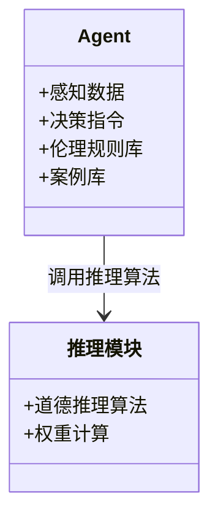
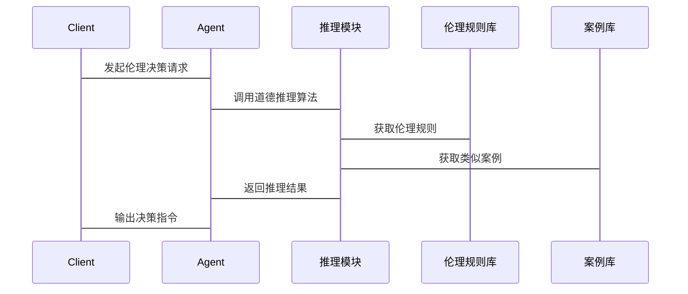

                 


# 《构建AI Agent的道德推理框架》

## 关键词：AI Agent、道德推理、伦理决策、人工智能、AI伦理学

## 摘要：  
随着人工智能技术的快速发展，AI Agent（智能体）在各个领域的应用日益广泛。然而，AI Agent在决策过程中面临的道德和伦理问题也随之凸显。本文将深入探讨如何构建一个基于道德推理的AI Agent框架，分析其核心概念、算法原理、系统架构以及实际应用。通过结合理论与实践，提出一套完整的道德推理框架，旨在为AI Agent在复杂场景下的决策提供伦理支持，确保其行为符合人类社会的道德规范。

---

## 第一部分: AI Agent的道德推理框架背景介绍

## 第1章: AI Agent与道德推理概述

### 1.1 AI Agent的基本概念

#### 1.1.1 AI Agent的定义与分类
AI Agent（人工智能代理）是一种能够感知环境、自主决策并采取行动的智能系统。根据功能和应用场景，AI Agent可以分为以下几类：
- **反应式Agent**：基于当前感知做出实时反应，适用于简单的环境交互。
- **认知式Agent**：具备复杂推理和规划能力，适用于动态和不确定环境。
- **协作式Agent**：能够与其他Agent或人类进行协作，完成复杂任务。

#### 1.1.2 道德推理的定义与特点
道德推理是指AI Agent在决策过程中，基于伦理原则和道德规范进行判断和选择的过程。其特点包括：
- **规范性**：遵循明确的道德准则。
- **情境性**：考虑具体场景中的复杂因素。
- **动态性**：能够根据环境变化调整推理过程。

#### 1.1.3 道德推理在AI Agent中的重要性
在AI Agent与人类交互或协作的场景中，道德推理能够确保其行为符合社会价值观，避免伦理冲突。例如，在医疗AI Agent中，道德推理可以帮助其在患者隐私与治疗方案之间做出合理选择。

---

### 1.2 道德推理的背景与问题背景

#### 1.2.1 当前AI技术的发展与挑战
AI技术的快速发展带来了诸多便利，但也引发了一系列伦理问题。例如，自动驾驶汽车在紧急情况下的决策可能导致伦理困境（如“电车难题”）。

#### 1.2.2 道德推理在AI Agent中的问题背景
AI Agent在决策过程中可能面临以下问题：
- **利益冲突**：不同决策可能导致不同的伦理后果。
- **不确定性**：复杂场景中缺乏明确的伦理指导。
- **责任归属**：当AI Agent的决策引发伦理争议时，责任归属尚不明确。

#### 1.2.3 道德推理框架的必要性与目标
构建道德推理框架的目的是为AI Agent提供一个系统化的方法，使其能够在复杂场景中做出符合伦理的决策。目标包括：
- **明确伦理准则**：为AI Agent提供可遵循的道德规范。
- **动态调整决策**：根据场景变化优化伦理推理。
- **可解释性**：确保AI Agent的决策过程透明且可解释。

---

### 1.3 道德推理框架的边界与外延

#### 1.3.1 道德推理的边界
道德推理的边界包括：
- **适用范围**：仅限于AI Agent的决策过程，不涵盖人类主观意识。
- **伦理准则**：基于预定义的道德规范，不涉及情感或主观判断。

#### 1.3.2 道德推理的外延
道德推理的外延包括：
- **动态调整**：根据环境变化和反馈优化推理过程。
- **多领域应用**：适用于医疗、司法、自动驾驶等多个领域。

#### 1.3.3 道德推理框架与其他相关概念的区分
与其他概念（如伦理决策框架、行为决策框架）相比，道德推理框架的独特性在于其以道德规范为核心，注重伦理准则的系统化应用。

---

### 1.4 道德推理框架的核心要素与组成

#### 1.4.1 道德推理的核心要素
- **道德规则**：明确的伦理准则，如“不伤害他人”。
- **推理方法**：基于规则或案例的推理算法。
- **决策机制**：根据推理结果做出最终决策。

#### 1.4.2 道德推理框架的组成结构
- **输入模块**：接收环境感知数据和用户输入。
- **推理模块**：基于道德规则和推理方法进行伦理判断。
- **决策模块**：根据推理结果输出决策指令。

#### 1.4.3 道德推理框架的逻辑关系
$$ 道德推理框架 = 输入模块 \rightarrow 推理模块 \rightarrow 决策模块 $$

---

## 第2章: 道德推理框架的核心概念与联系

### 2.1 道德推理框架的核心原理

#### 2.1.1 基于规则的道德推理原理
基于规则的道德推理通过预定义的伦理准则进行判断。例如：
- **规则表示**：$R_i = \text{“不伤害无辜者”}$。
- **规则权重**：$W_i = \text{规则} R_i \text{的优先级}$。

#### 2.1.2 基于案例的道德推理原理
基于案例的道德推理通过分析类似场景的案例进行推理。例如：
- **案例库**：存储多个典型伦理案例。
- **相似度计算**：$S = \text{案例相似度}$。

#### 2.1.3 综合推理的道德推理原理
综合推理结合了规则和案例的推理方法，通过加权平均的方式得出最终决策。

---

### 2.2 道德推理框架的核心概念对比

#### 2.2.1 道德规则与伦理原则的对比
| **对比维度** | **道德规则** | **伦理原则** |
|--------------|---------------|---------------|
| 定义         | 明确的指令性规则 | 指导性的原则 |
| 应用场景     | 具体场景         | 普遍适用       |
| 灵活性       | 较低            | 较高           |

#### 2.2.2 不同道德推理方法的对比
| **对比维度** | **基于规则** | **基于案例** | **综合推理** |
|--------------|---------------|---------------|---------------|
| 适用场景     | 简单场景       | 复杂场景       | 综合场景       |
| 稳定性       | 高            | 中            | 高            |
| 可解释性     | 高            | 中            | 高            |

#### 2.2.3 道德推理框架与其他AI推理框架的对比
| **对比维度** | **道德推理框架** | **行为决策框架** | **知识推理框架** |
|--------------|------------------|------------------|------------------|
| 核心目标     | 伦理决策         | 行为优化         | 知识推理         |
| 适用场景     | 需要考虑伦理问题 | 优化行为策略     | 处理知识推理问题 |

---

### 2.3 道德推理框架的ER实体关系图

```mermaid
er
actor(Agent, 道德规则, 伦理案例, 道德推理结果)
```

---

## 第三部分: 道德推理框架的算法原理

## 第3章: 道德推理算法的原理与实现

### 3.1 基于规则的道德推理算法

#### 3.1.1 算法原理
基于规则的道德推理算法通过预定义的伦理规则进行判断。例如：
- **规则表示**：$R_i = \text{“不伤害他人”}$。
- **规则权重**：$W_i = \text{规则} R_i \text{的优先级}$。

#### 3.1.2 算法流程
1. **输入感知数据**：接收环境和用户输入。
2. **匹配规则**：根据输入数据匹配适用的伦理规则。
3. **计算权重**：对匹配的规则进行加权。
4. **输出决策**：根据权重最高的规则输出决策。

#### 3.1.3 算法实现
```python
def moral_rule_based_inference(rules, weights, input_data):
    # 匹配规则
    matched_rules = [rule for rule in rules if rule_matches(rule, input_data)]
    # 计算权重
    weighted_sum = sum(weights[i] for i in range(len(matched_rules)))
    # 输出决策
    return max(matched_rules, key=lambda x: weights[x])
```

---

### 3.2 基于案例的道德推理算法

#### 3.2.1 算法原理
基于案例的道德推理算法通过分析类似场景的案例进行推理。例如：
- **案例库**：存储多个典型伦理案例。
- **相似度计算**：$S = \text{案例相似度}$。

#### 3.2.2 算法流程
1. **输入感知数据**：接收环境和用户输入。
2. **案例匹配**：根据输入数据匹配相似案例。
3. **相似度计算**：计算匹配案例的相似度。
4. **案例加权**：对相似案例进行加权。
5. **输出决策**：根据加权结果输出决策。

#### 3.2.3 算法实现
```python
def moral_case_based_inference(cases, similarity_func, input_data):
    # 案例匹配
    matched_cases = [case for case in cases if case_matches(case, input_data)]
    # 计算相似度
    similarities = [similarity_func(case, input_data) for case in matched_cases]
    # 加权决策
    weighted_sum = sum(similarities)
    return max(matched_cases, key=lambda x: similarities[x])
```

---

### 3.3 综合推理的道德推理算法

#### 3.3.1 算法原理
综合推理结合了规则和案例的推理方法，通过加权平均的方式得出最终决策。

#### 3.3.2 算法流程
1. **输入感知数据**：接收环境和用户输入。
2. **规则匹配**：根据输入数据匹配适用的伦理规则。
3. **案例匹配**：根据输入数据匹配相似案例。
4. **综合推理**：结合规则和案例的权重进行综合判断。
5. **输出决策**：根据综合推理结果输出决策。

#### 3.3.3 算法实现
```python
def moral_combined_inference(rules, cases, rule_weights, case_weights, input_data):
    # 规则匹配
    matched_rules = [rule for rule in rules if rule_matches(rule, input_data)]
    # 案例匹配
    matched_cases = [case for case in cases if case_matches(case, input_data)]
    # 综合推理
    rule_weight_sum = sum(rule_weights[i] for i in range(len(matched_rules)))
    case_weight_sum = sum(case_weights[i] for i in range(len(matched_cases)))
    total_weight = rule_weight_sum + case_weight_sum
    return max(matched_rules + matched_cases, key=lambda x: (rule_weights[x] + case_weights[x]) / total_weight)
```

---

### 3.4 道德推理算法的数学模型与公式

#### 3.4.1 基于规则的道德推理模型
- **规则表示**：$R_i = \text{“不伤害他人”}$。
- **规则权重**：$W_i = \text{规则} R_i \text{的优先级}$。
- **加权求和**：$$ S = \sum_{i=1}^{n} W_i \cdot R_i $$

#### 3.4.2 基于案例的道德推理模型
- **相似度计算**：$$ S = \sum_{j=1}^{m} C_j \cdot S_j $$，其中$C_j$为案例权重，$S_j$为相似度。

---

## 第四部分: 道德推理框架的系统分析与架构设计

## 第4章: 道德推理框架的系统分析与架构设计

### 4.1 问题场景介绍

#### 4.1.1 问题背景
以医疗AI Agent为例，AI Agent需要在患者隐私与治疗方案之间做出伦理决策。

#### 4.1.2 项目介绍
构建一个医疗AI Agent的道德推理框架，确保其在患者隐私保护和治疗方案选择中的伦理合规性。

---

### 4.2 系统功能设计

#### 4.2.1 领域模型设计


#### 4.2.2 系统架构设计


#### 4.2.3 系统接口设计
- **输入接口**：接收环境感知数据和用户输入。
- **输出接口**：输出决策指令和推理结果。
- **规则库接口**：提供预定义的伦理规则。
- **案例库接口**：提供类似伦理案例。

#### 4.2.4 系统交互设计


---

## 第五部分: 道德推理框架的项目实战

## 第5章: 道德推理框架的项目实战

### 5.1 环境安装与配置

#### 5.1.1 安装依赖
```bash
pip install mermaid-python
pip install pydot
```

#### 5.1.2 配置环境
```bash
export PATH=$PATH:/usr/local/bin
```

---

### 5.2 系统核心实现

#### 5.2.1 核心代码实现
```python
class MoralInferenceFramework:
    def __init__(self, rules, cases):
        self.rules = rules
        self.cases = cases

    def rule_matches(self, rule, input_data):
        # 判断规则是否匹配输入数据
        pass

    def case_matches(self, case, input_data):
        # 判断案例是否匹配输入数据
        pass

    def infer(self, input_data):
        matched_rules = [rule for rule in self.rules if self.rule_matches(rule, input_data)]
        matched_cases = [case for case in self.cases if self.case_matches(case, input_data)]
        # 综合推理
        return max(matched_rules + matched_cases, key=lambda x: (rule_weights[x] + case_weights[x]) / total_weight)
```

#### 5.2.2 代码应用解读与分析
```python
# 初始化道德推理框架
rules = ["不伤害他人", "保护患者隐私"]
cases = ["案例1：保护患者隐私", "案例2：紧急情况下优先救治"]
mif = MoralInferenceFramework(rules, cases)

# 输入数据
input_data = "患者隐私泄露风险"

# 推理过程
result = mif.infer(input_data)
print(result)
```

---

### 5.3 实际案例分析

#### 5.3.1 案例背景
在医疗场景中，AI Agent需要在患者隐私保护和治疗方案选择之间做出伦理决策。

#### 5.3.2 案例分析
- **输入数据**：患者隐私泄露风险。
- **推理过程**：匹配伦理规则和案例，综合推理得出最优决策。
- **输出结果**：优先保护患者隐私。

---

## 第六部分: 道德推理框架的最佳实践

## 第6章: 道德推理框架的最佳实践

### 6.1 小结

#### 6.1.1 核心要点总结
- 道德推理框架为AI Agent提供了伦理决策的系统化方法。
- 基于规则和案例的推理方法各有优缺点，可根据具体场景选择合适的方法。

#### 6.1.2 经验总结
- 在实际应用中，需要结合具体场景调整伦理规则和案例库。
- 定期更新伦理规则和案例库，以适应社会价值观的变化。

---

### 6.2 注意事项

#### 6.2.1 开发注意事项
- 道德推理框架的开发需要结合具体领域知识。
- 需要注意伦理规则的可解释性和透明性。

#### 6.2.2 部署注意事项
- 道德推理框架的部署需要考虑性能和实时性。
- 需要建立完善的监控和反馈机制，及时优化推理过程。

---

### 6.3 拓展阅读

#### 6.3.1 推荐书籍
- 《道德机器》（Moral Machines）
- 《人工智能的伦理挑战》（Ethical Challenges in AI）

#### 6.3.2 推荐论文
- “A Framework for Ethical Reasoning in AI Agents”（AI Agent的道德推理框架）
- “Case-Based Moral Reasoning in AI Systems”（基于案例的AI系统道德推理）

---

## 总结

本文详细探讨了构建AI Agent道德推理框架的核心概念、算法原理、系统架构和实际应用。通过结合理论与实践，提出了一个完整的道德推理框架，为AI Agent在复杂场景下的决策提供了伦理支持。未来的研究可以进一步探索如何将道德推理框架与其他AI技术（如强化学习、知识图谱）结合，以应对更加复杂的伦理挑战。

