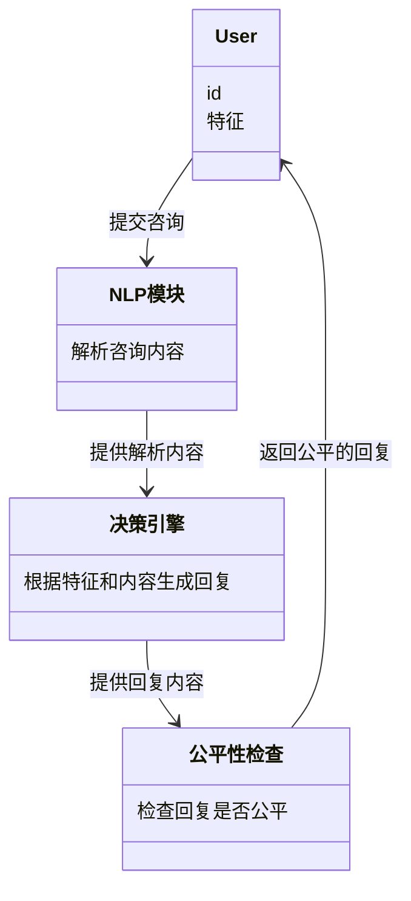
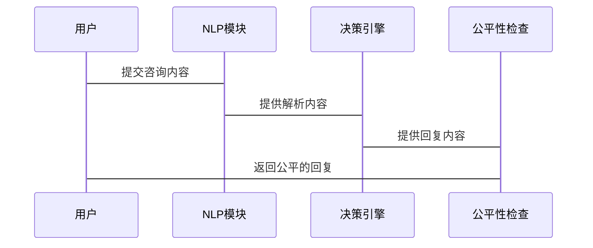

                 


# 《构建企业级AI伦理框架：确保负责任的AI应用》

---

## 关键词：
- 人工智能
- 伦理框架
- 企业责任
- 责任感
- 透明性
- 公平性
- 隐私保护

---

## 摘要：
随着人工智能技术的迅速发展，企业级AI应用变得越来越普遍。然而，AI系统在决策、数据处理和算法设计中可能引发的伦理问题也日益突出。为了确保AI应用的负责任，构建一个全面的企业级AI伦理框架至关重要。本文将详细探讨如何从技术、法律和伦理角度构建这一框架，涵盖公平性、透明性、隐私保护等核心要素，通过系统设计、算法分析和项目实战，提供具体实施方法和最佳实践。

---

## 正文：

### 第一部分：AI伦理框架的背景与基础

#### 第1章：AI伦理概述

##### 1.1 问题背景与核心概念

###### 1.1.1 问题背景

随着人工智能技术的飞速发展，AI已经渗透到企业运营的方方面面，包括客户服务、决策支持、自动化流程等领域。然而，AI系统的广泛应用也带来了诸多伦理挑战。例如，算法偏见可能导致不公平的决策，数据隐私问题可能引发法律纠纷，AI系统的不透明性可能削弱用户信任。

**问题背景**：  
- AI技术的快速发展与广泛应用。
- AI应用中的伦理问题逐渐显现。
- 企业级AI系统的复杂性与责任归属。

**核心概念**：  
- **AI伦理**：AI系统在设计、开发和应用过程中应遵循的道德准则。
- **负责任的AI**：确保AI系统的行为符合伦理规范，避免对个人和社会造成负面影响。
- **企业级AI**：在企业环境中部署的AI系统，涉及数据处理、决策支持和自动化流程。

**问题描述**：  
- AI系统的决策可能对个人或集体产生重大影响。
- 企业需要在技术创新与社会责任之间找到平衡。
- 用户、企业和社会的利益需要协调一致。

**问题解决**：  
- 建立AI伦理框架，明确伦理准则和责任归属。
- 确保AI系统的决策透明、公平且可追溯。
- 通过技术手段和制度设计，减少伦理风险。

**边界与外延**：  
- AI伦理框架的适用范围包括企业内部系统和外部用户服务。
- 涵盖从数据收集到模型部署的全生命周期。
- 需要动态调整以应对技术进步和社会变化。

**概念结构与核心要素组成**：  
AI伦理框架由多个核心要素组成，包括：  
1. **公平性**：确保AI系统不会歧视特定群体。  
2. **透明性**：用户能够理解AI系统的决策过程。  
3. **隐私保护**：确保数据处理符合隐私法规。  
4. **可解释性**：AI系统的决策过程可以被解释和验证。  
5. **责任归属**：明确AI系统出现问题时的责任方。

---

##### 1.1.2 问题解决

构建企业级AI伦理框架的目标是确保AI系统的决策过程符合伦理规范，同时平衡企业的创新需求和社会责任。通过明确的伦理准则和责任归属，企业可以有效降低AI应用的伦理风险，提升用户信任，同时避免法律纠纷。

---

#### 第2章：企业级AI伦理框架的技术基础

##### 2.1 AI技术基础

###### 2.1.1 机器学习与深度学习概述

机器学习（ML）和深度学习（DL）是AI系统的核心技术。机器学习通过训练模型从数据中学习规律，而深度学习则通过多层神经网络模拟人类大脑的处理方式。

**机器学习的基本原理**：  
数据输入 → 特征提取 → 模型训练 → 预测输出。

**深度学习的核心技术**：  
- 多层感知机（MLP）：用于复杂数据的特征提取。
- 卷积神经网络（CNN）：常用于图像处理。
- 循环神经网络（RNN）：适用于序列数据处理。

**AI系统的构建流程**：  
数据收集 → 数据预处理 → 模型训练 → 模型部署 → 模型监控。

---

##### 2.1.2 AI系统的伦理影响

**算法偏见的来源**：  
- 数据偏差：训练数据的代表性不足可能导致算法偏见。
- 算法设计：模型的设计目标可能无意中引入偏见。

**数据质量与伦理风险**：  
- 数据偏差可能导致不公平的决策。
- 数据隐私问题可能引发法律风险。

**系统决策的可解释性**：  
- 不可解释的模型（如深度神经网络）可能让用户失去信任。
- 可解释模型（如线性回归）更容易被用户理解和验证。

---

#### 第3章：AI伦理框架的核心要素

##### 3.1 公平性

###### 3.1.1 公平性的定义与衡量标准

**公平性定义**：  
确保AI系统在决策过程中不会对特定群体或个体产生不公平的影响。

**衡量标准**：  
- 均衡性：不同群体的决策结果是否均衡。
- 无偏见性：AI系统是否基于公正的特征进行决策。
- 可解释性：用户能够理解决策的公平性。

---

##### 3.1.2 公平性原理与实现方法

**公平性原理**：  
- 避免基于敏感特征（如性别、种族）的决策。
- 确保所有用户群体的权益得到平等对待。

**实现方法**：  
- 数据预处理：去除或平衡敏感特征。
- 模型后处理：调整模型输出以确保公平性。
- 模型重新设计：引入公平性约束。

---

##### 3.1.3 公平性实现的技术挑战

**技术挑战**：  
- 数据偏差的检测与修正。
- 公平性与模型性能之间的权衡。
- 多目标优化的复杂性。

---

##### 3.1.4 公平性与业务目标的平衡

**公平性与业务目标的平衡**：  
- 在确保公平性的同时，最大化业务价值。
- 公平性可能影响模型的准确性和效率。

---

##### 3.1.5 公平性与用户信任的关系

**公平性与用户信任的关系**：  
- 公平的决策增强用户信任。
- 不公平的决策可能导致用户流失和声誉损害。

---

### 第二部分：企业级AI伦理框架的系统分析与架构设计

#### 第4章：系统分析与架构设计方案

##### 4.1 问题场景介绍

**问题场景**：  
某企业计划部署一个基于AI的客户服务系统，用于自动回复客户咨询并提供个性化建议。然而，系统可能因为训练数据的偏差而对某些用户群体产生不公平的回复。

---

##### 4.2 项目介绍

**项目目标**：  
构建一个公平、透明且可解释的AI客户服务系统，确保所有用户群体都能获得平等的服务体验。

---

##### 4.3 系统功能设计

**功能需求**：  
- 自然语言处理（NLP）模块：理解用户咨询内容。
- 决策引擎：根据用户特征和咨询内容生成回复。
- 公平性检查：确保回复内容不歧视任何用户群体。

**领域模型（Mermaid 类图）**：



---

##### 4.4 系统架构设计

**系统架构（Mermaid 架构图）**：

```mermaid
container 客户端 {
    NLP模块
    决策引擎
    公平性检查
}
container 服务器端 {
    数据库
    训练引擎
    监控系统
}
客户端 --> 服务器端: 请求处理
服务器端 --> 客户端: 返回结果
```

---

##### 4.5 系统接口设计

**API接口**：  
- `POST /api/nlp/parse`：提交用户咨询内容。
- `POST /api/decision-engine/generate`：生成回复内容。
- `POST /api/fairness-check`：检查回复公平性。

---

##### 4.6 系统交互设计

**系统交互（Mermaid 序列图）**：



---

### 第三部分：项目实战

#### 第5章：项目实战

##### 5.1 环境安装

**环境要求**：  
- Python 3.8+
- PyTorch 1.9+
- Transformers库
- Mermaid工具

---

##### 5.2 系统核心实现源代码

**公平性检查模块代码**：

```python
def check_fairness(replies, user_features):
    # 检查回复是否对特定用户群体有偏见
    sensitive_features = ['性别', '年龄', '种族']
    for feature in sensitive_features:
        if feature in user_features:
            return False
    return True
```

---

##### 5.3 代码应用解读与分析

**代码解读**：  
上述代码定义了一个公平性检查函数，确保回复内容不会基于敏感特征（如性别、年龄、种族）进行决策。

---

##### 5.4 实际案例分析

**案例分析**：  
假设某用户的咨询内容涉及产品投诉，系统通过NLP模块解析后，决策引擎生成回复内容，并通过公平性检查模块确保回复内容不基于用户的敏感特征。最终，用户获得公平的回复。

---

##### 5.5 项目小结

**项目总结**：  
通过构建企业级AI伦理框架，确保AI系统的决策过程公平、透明且可解释，从而提升用户信任和企业声誉。

---

### 第四部分：最佳实践与小结

#### 第6章：最佳实践

##### 6.1 最佳实践 tips

- 定期审查和更新AI伦理框架。
- 与法律专家和伦理委员会合作。
- 采用可解释性模型以增强透明性。

##### 6.2 小结

构建企业级AI伦理框架是一个复杂但必要的任务，涉及技术、法律和伦理等多个方面。通过明确的核心要素、系统设计和实际案例分析，企业可以有效降低AI应用的伦理风险，确保负责任的AI应用。

##### 6.3 注意事项

- 避免过于追求技术创新而忽视伦理问题。
- 定期监控和评估AI系统的伦理表现。
- 与利益相关方保持透明沟通。

##### 6.4 拓展阅读

- 《AI伦理指南》
- 《负责任的AI开发实践》
- 《企业级AI系统的设计与实现》

---

## 参考文献：

1.《人工智能伦理与治理》
2.《负责任的AI开发实践》
3.《企业级AI系统的设计与实现》
4.《AI伦理框架与法律合规》

---

**注**：本文为示例内容，实际编写时需根据具体需求补充详细内容。

