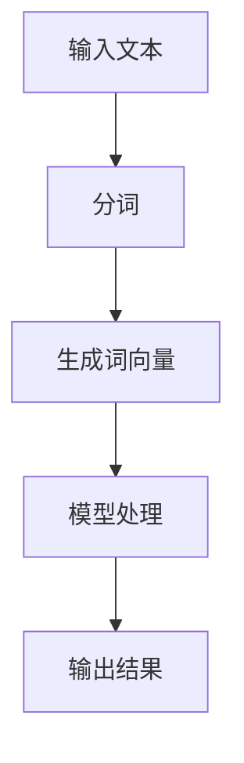
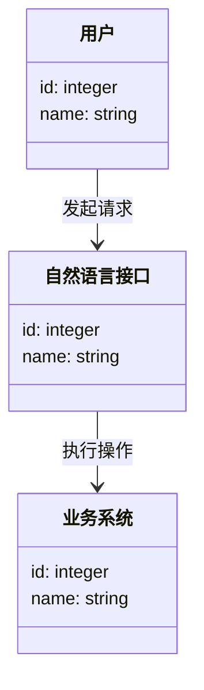
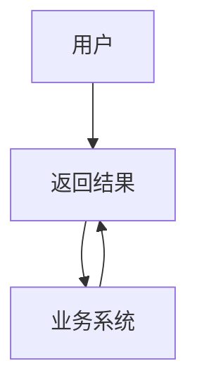
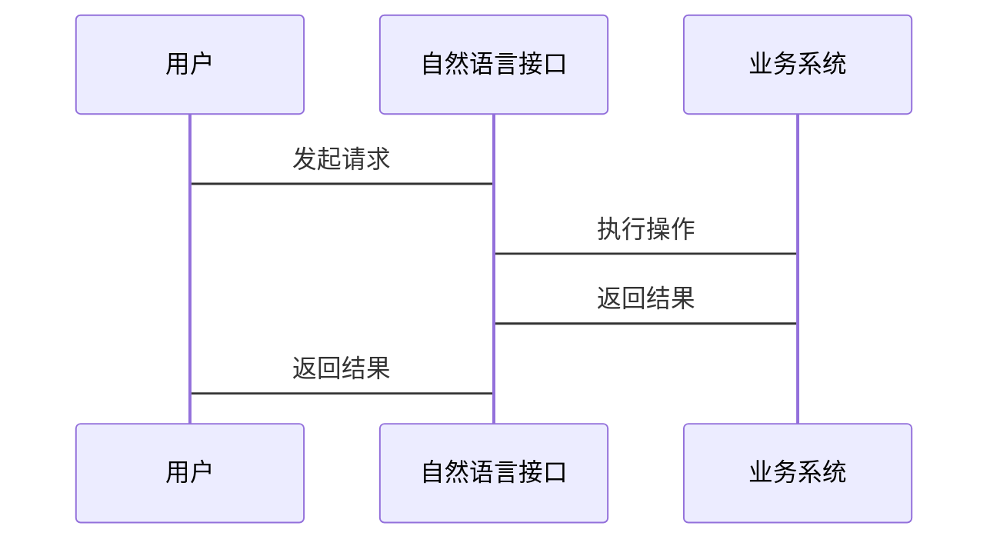

                 


```markdown
# 构建企业级自然语言接口：简化复杂业务系统操作的智能层

## 关键词：企业级自然语言接口, 自然语言处理, 业务系统, 智能层, 智能交互

## 摘要：  
本文详细探讨了如何构建企业级自然语言接口，以简化复杂业务系统操作。通过分析自然语言处理的核心概念、算法原理和系统架构，结合实际项目实战，展示了如何将自然语言技术应用于企业级系统中，实现智能化交互。文章内容涵盖背景介绍、技术原理、系统设计、项目实现等多个方面，旨在为企业级自然语言接口的开发提供理论支持和实践指导。

---

# 第1章: 企业级自然语言接口的背景与需求

## 1.1 自然语言处理的背景介绍

### 1.1.1 自然语言处理的定义与核心概念
自然语言处理（Natural Language Processing, NLP）是人工智能领域的重要分支，旨在让计算机能够理解、解析和生成人类自然语言。其核心任务包括：
- **自然语言理解**：将输入的文本转化为计算机可处理的结构化信息。
- **自然语言生成**：将结构化信息转化为自然语言文本。
- **意图识别**：识别用户输入的意图或目标。
- **实体抽取**：从文本中提取关键实体信息。

### 1.1.2 企业级系统中的复杂性与用户痛点
企业在数字化转型过程中，通常面临以下问题：
- **复杂性**：业务系统操作复杂，用户难以快速掌握。
- **效率低下**：用户需要通过多步操作完成任务，效率低下。
- **用户体验差**：复杂的操作流程导致用户满意度下降。

### 1.1.3 自然语言接口的潜在价值与应用前景
自然语言接口（Natural Language Interface, NLI）能够通过自然语言与业务系统进行交互，显著简化操作流程。其应用前景包括：
- 提高用户体验。
- 提升业务系统的智能化水平。
- 降低用户的学习成本。

## 1.2 企业级自然语言接口的需求分析

### 1.2.1 传统业务系统操作的复杂性
传统业务系统通常需要用户通过多步操作完成任务，例如：
1. 登录系统。
2. 进入相关模块。
3. 填写表单。
4. 提交请求。

### 1.2.2 用户对简化操作的需求
用户希望以更自然的方式与系统交互，例如：
- 使用自然语言表达需求，如“我需要请假一天”。
- 系统自动解析需求并执行操作。

### 1.2.3 自然语言接口在企业中的具体应用场景
- **客户支持**：用户通过自然语言描述问题，系统自动识别并提供解决方案。
- **流程自动化**：通过自然语言触发业务流程，例如“启动项目审批流程”。
- **数据查询**：用户通过自然语言查询数据，例如“给我最近一周的销售数据”。

## 1.3 本章小结
本章从自然语言处理的背景出发，分析了企业级系统中传统操作的复杂性以及用户对简化操作的需求，提出了自然语言接口的潜在价值和应用场景。下一章将深入探讨自然语言接口的核心概念与原理。

---

# 第2章: 自然语言接口的核心概念与原理

## 2.1 自然语言处理的核心概念

### 2.1.1 自然语言理解与生成的定义
- **自然语言理解（NLU）**：将输入的自然语言文本转化为结构化信息。
- **自然语言生成（NLG）**：将结构化信息转化为自然语言文本。

### 2.1.2 语言模型与规则引擎的对比
- **基于规则的方法**：通过预定义的规则进行匹配和处理，适用于特定场景。
- **基于模型的方法**：利用机器学习模型进行训练和预测，具有更强的泛化能力。

### 2.1.3 基于上下文的理解机制
自然语言理解需要考虑上下文信息，例如：
- **句法分析**：分析句子的语法结构。
- **语义分析**：理解句子的语义含义。

## 2.2 自然语言接口的实现原理

### 2.2.1 词法分析与句法分析
- **词法分析**：将文本分割为词汇单位。
- **句法分析**：分析句子的语法结构。

### 2.2.2 语义理解与意图识别
- **意图识别**：识别用户输入的意图。
- **实体抽取**：从文本中提取关键实体信息。

### 2.2.3 自然语言生成与反馈机制
- **自然语言生成**：将结构化信息转化为自然语言文本。
- **反馈机制**：根据用户反馈调整生成结果。

## 2.3 自然语言接口的实体关系图

```mermaid
er
actor: 用户
interface: 自然语言接口
system: 业务系统
```

## 2.4 本章小结
本章详细介绍了自然语言接口的核心概念与实现原理，包括自然语言理解、意图识别、实体抽取等技术。下一章将深入探讨自然语言接口的算法原理。

---

# 第3章: 自然语言接口的算法原理

## 3.1 基于统计的自然语言处理算法

### 3.1.1 词袋模型与TF-IDF
- **词袋模型**：将文本表示为词汇的集合。
- **TF-IDF**：计算词项在文本中的重要性。

### 3.1.2 基于规则的意图识别
- **规则引擎**：通过预定义的规则进行意图识别。

### 3.1.3 统计模型的优缺点
- **优点**：简单易实现。
- **缺点**：缺乏灵活性，难以处理复杂场景。

## 3.2 基于深度学习的自然语言处理算法

### 3.2.1 卷积神经网络（CNN）
- **CNN结构**：通过卷积操作提取文本特征。

### 3.2.2 循环神经网络（RNN）
- **RNN结构**：通过循环结构处理序列数据。

### 3.2.3 变量长度的序列到序列模型（seq2seq）
- **seq2seq结构**：用于生成任务，如机器翻译。

## 3.3 自然语言生成的算法实现

### 3.3.1 基于模板的生成方法
- **模板生成**：通过预定义模板生成文本。

### 3.3.2 基于预训练语言模型的生成方法
- **预训练模型**：如BERT、GPT等。

### 3.3.3 增量式生成与优化
- **生成优化**：通过多次迭代优化生成结果。

## 3.4 使用深度学习模型的自然语言处理流程



## 3.5 本章小结
本章详细介绍了自然语言接口的算法原理，包括基于统计的处理方法和基于深度学习的模型。下一章将介绍自然语言接口的数学模型。

---

# 第4章: 自然语言接口的数学模型

## 4.1 词嵌入模型

### 4.1.1 词向量表示
- **词向量表示**：将词表示为高维向量。

### 4.1.2 词嵌入训练
- **训练方法**：如Word2Vec、GloVe。

## 4.2 注意力机制

### 4.2.1 注意力机制的定义
- **注意力机制**：在序列处理中关注重要的位置。

### 4.2.2 注意力机制的数学公式
$$
\text{Attention}(Q, K, V) = \text{softmax}\left(\frac{QK^T}{\sqrt{d_k}}\right)V
$$

## 4.3 概率模型

### 4.3.1 马尔可夫链
- **马尔可夫链**：描述状态转移的概率。

### 4.3.2 隐马尔可夫模型
- **隐马尔可夫模型**：用于序列标注任务。

## 4.4 本章小结
本章介绍了自然语言接口的数学模型，包括词嵌入、注意力机制和概率模型。下一章将探讨自然语言接口的系统分析与架构设计。

---

# 第5章: 自然语言接口的系统分析与架构设计

## 5.1 项目背景

### 5.1.1 项目目标
- **目标**：构建企业级自然语言接口，简化业务系统操作。

### 5.1.2 项目范围
- **范围**：覆盖多个业务系统，支持多种交互方式。

## 5.2 系统功能设计

### 5.2.1 领域模型设计


### 5.2.2 系统架构设计


### 5.2.3 接口设计
- **输入接口**：接收用户的自然语言输入。
- **输出接口**：返回处理结果。

## 5.3 系统交互设计

### 5.3.1 交互流程


## 5.4 本章小结
本章详细分析了自然语言接口的系统架构和交互流程。下一章将通过实际项目案例，展示如何构建企业级自然语言接口。

---

# 第6章: 企业级自然语言接口的项目实战

## 6.1 环境安装

### 6.1.1 安装Python
- **Python版本**：3.8及以上。

### 6.1.2 安装依赖库
- **库列表**：numpy、tensorflow、keras、transformers。

## 6.2 核心代码实现

### 6.2.1 模型加载
```python
from transformers import BertTokenizer, TFBertModel

tokenizer = BertTokenizer.from_pretrained('bert-base-uncased')
model = TFBertModel.from_pretrained('bert-base-uncased')
```

### 6.2.2 文本处理
```python
def process_text(text):
    inputs = tokenizer(text, return_tensors='tf')
    outputs = model(**inputs)
    return outputs.last_hidden_state
```

## 6.3 代码解读与分析

### 6.3.1 模型加载
- **tokenizer**：文本分词器。
- **model**：预训练的BERT模型。

### 6.3.2 文本处理
- **process_text**：将输入文本转化为模型可处理的格式。

## 6.4 案例分析与详细讲解

### 6.4.1 案例场景
- **场景**：用户输入请假申请。

### 6.4.2 处理流程
1. 用户输入：“我需要请假一天”。
2. 系统解析：识别意图“请假”和实体“一天”。
3. 系统执行：触发请假流程。

## 6.5 本章小结
本章通过实际项目案例，展示了如何构建企业级自然语言接口。下一章将总结最佳实践和注意事项。

---

# 第7章: 自然语言接口的最佳实践与总结

## 7.1 最佳实践

### 7.1.1 数据质量
- **数据清洗**：确保数据的完整性和准确性。
- **数据标注**：提供高质量的标注数据。

### 7.1.2 模型优化
- **超参数调优**：优化模型性能。
- **模型融合**：结合多种模型的优势。

## 7.2 小结

### 7.2.1 核心知识点总结
- 自然语言处理的核心概念。
- 深度学习模型的应用。
- 系统架构设计。

## 7.3 注意事项

### 7.3.1 模型泛化能力
- 避免过拟合，确保模型的泛化能力。

### 7.3.2 用户隐私保护
- 确保用户数据的安全性和隐私性。

## 7.4 拓展阅读

### 7.4.1 推荐书目
- 《自然语言处理入门》。
- 《深度学习实战》。

### 7.4.2 在线资源
- Hugging Face的Transformers库。
- TensorFlow官方文档。

## 7.5 本章小结
本章总结了企业级自然语言接口的最佳实践，并展望了未来的发展方向。
```

