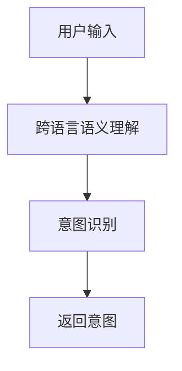

                 


# 构建企业级自然语言理解系统：跨语言语义理解与意图识别

**关键词：自然语言处理，跨语言语义理解，意图识别，企业级系统，NLP算法**

**摘要：**  
本文旨在探讨如何构建企业级自然语言理解系统，重点分析跨语言语义理解与意图识别的核心技术。文章从背景介绍、核心概念、算法原理、系统架构设计、项目实战到最佳实践，全面解析构建此类系统的各个方面。通过详细的技术分析和实例演示，帮助读者掌握构建高效、准确的自然语言理解系统的关键步骤和方法。

---

## 第一部分: 企业级自然语言理解系统概述

### 第1章: 自然语言理解系统背景介绍

#### 1.1 自然语言理解的核心概念

- **1.1.1 问题背景与问题描述**  
  自然语言处理（NLP）旨在使计算机能够理解、解析和生成人类语言。在企业级应用中，NLP技术被广泛用于信息提取、客户服务、内容分析等领域。然而，现有的系统在处理多语言语料和复杂意图识别时仍面临诸多挑战。

- **1.1.2 问题解决方法与边界**  
  本文探讨如何通过跨语言语义理解和意图识别技术，解决多语言环境下的语义理解问题。系统设计需考虑数据多样性、模型鲁棒性以及实时性要求。

- **1.1.3 核心概念与组成要素**  
  包括语言理解模型、意图分类器、实体识别模块等关键组件，以及数据预处理、特征提取、模型训练等核心步骤。

#### 1.2 跨语言语义理解的重要性

- **1.2.1 跨语言语义理解的定义**  
  跨语言语义理解是指在不同语言之间理解文本语义的能力，解决企业在全球化背景下面临的多语言用户支持问题。

- **1.2.2 跨语言语义理解的应用场景**  
  包括多语言客服系统、跨语言信息检索、全球电商平台的用户支持等。

- **1.2.3 跨语言语义理解的技术挑战**  
  包括语言差异、数据稀疏性、模型迁移等问题。

#### 1.3 意图识别的定义与应用

- **1.3.1 意图识别的基本概念**  
  意图识别是指通过分析用户输入，推断其背后的意图，如查询、预订、投诉等。

- **1.3.2 意图识别的典型应用场景**  
  包括智能客服、语音助手、搜索引擎优化等。

- **1.3.3 意图识别的技术难点**  
  包括意图多样性和语义模糊性，如何设计高效的特征提取方法和分类模型。

#### 1.4 本章小结  
  本章介绍了自然语言理解的核心概念、跨语言语义理解的重要性以及意图识别的应用和挑战。

---

## 第二部分: 自然语言理解系统的核心概念与联系

### 第2章: 自然语言理解系统的核心概念原理

#### 2.1 跨语言语义理解的原理

- **2.1.1 跨语言语义理解的实现方法**  
  通过构建跨语言词向量映射，将不同语言的文本映射到相同的语义空间，实现语义理解。

- **2.1.2 跨语言语义理解的关键技术**  
  包括多语言预训练模型（如Marian、XLM）、跨语言对比学习等。

- **2.1.3 跨语言语义理解的优缺点对比**  
  优点：支持多语言场景；缺点：需要大量跨语言数据，模型训练复杂。

#### 2.2 意图识别的原理

- **2.2.1 意图识别的基本原理**  
  通过特征提取、模型训练和分类器设计，将用户输入映射到预定义的意图类别。

- **2.2.2 意图识别的关键技术**  
  包括基于规则的意图识别、统计模型（如SVM、Naive Bayes）和深度学习模型（如LSTM、BERT）。

- **2.2.3 意图识别的优缺点对比**  
  优点：高准确率；缺点：需要大量标注数据，意图类别需及时更新。

#### 2.3 跨语言语义理解与意图识别的关系

- **2.3.1 跨语言语义理解与意图识别的联系**  
  跨语言语义理解为意图识别提供了跨语言的支持，使其能够处理多语言输入。

- **2.3.2 跨语言语义理解与意图识别的区别**  
  跨语言语义理解关注语言间的语义映射，而意图识别关注特定语言文本的意图分类。

- **2.3.3 跨语言语义理解与意图识别的协同作用**  
  结合跨语言语义理解和意图识别技术，可以构建支持多语言、多意图的自然语言理解系统。

#### 2.4 核心概念对比表格

| **核心概念**       | **跨语言语义理解**                          | **意图识别**                              |
|--------------------|--------------------------------------------|--------------------------------------------|
| **定义**           | 在不同语言之间理解文本语义的能力          | 通过分析文本推断用户的意图               |
| **应用场景**        | 多语言客服系统、跨语言信息检索            | 智能客服、语音助手                       |
| **技术挑战**        | 语言差异、数据稀疏性                      | 意图多样性、语义模糊性                   |
| **实现方法**        | 跨语言词向量映射、多语言预训练模型         | 统计模型、深度学习模型                   |
| **优缺点**          | 支持多语言场景，但需要大量跨语言数据      | 高准确率，但需要大量标注数据             |

#### 2.5 ER实体关系图

```mermaid
erDiagram
    actor 用户 {
        string id
        string 查询内容
        string 语言类型
    }
    system NLU系统 {
        string id
        string 处理结果
        string 意图类型
    }
    用户 --> NLU系统: 提交查询
    NLU系统 --> 用户: 返回结果
```

---

## 第三部分: 自然语言理解系统的算法原理

### 第3章: 自然语言理解系统的算法原理

#### 3.1 跨语言语义理解的算法实现

- **3.1.1 跨语言词向量映射**  
  使用预训练的跨语言词嵌入模型（如XLM），将不同语言的词语映射到相同的向量空间。

- **3.1.2 跨语言对比学习**  
  通过对比学习，增强不同语言之间的语义相似性。

- **3.1.3 跨语言模型微调**  
  在特定任务上微调多语言预训练模型，提升任务相关性。

#### 3.2 意图识别的算法实现

- **3.2.1 特征提取**  
  提取文本的词袋模型、TF-IDF特征或词嵌入表示。

- **3.2.2 模型训练**  
  使用支持向量机（SVM）、随机森林（RF）或深度学习模型（如LSTM、BERT）进行训练。

- **3.2.3 模型优化**  
  通过网格搜索、交叉验证等方法优化模型参数。

#### 3.3 跨语言语义理解与意图识别的协同算法

- **3.3.1 跨语言特征融合**  
  将跨语言语义理解的结果与意图识别特征结合，提升意图分类的准确率。

- **3.3.2 跨语言意图分类**  
  在跨语言语义理解的基础上，进行多语言意图分类，支持多种语言的意图识别。

#### 3.4 算法流程图



---

## 第四部分: 自然语言理解系统的系统设计

### 第4章: 自然语言理解系统的系统分析与架构设计

#### 4.1 系统分析

- **4.1.1 项目介绍**  
  构建一个支持多语言、多意图的企业级自然语言理解系统，满足全球化企业的需求。

- **4.1.2 系统功能设计**  
  包括文本预处理、跨语言语义理解、意图识别、结果返回等模块。

- **4.1.3 领域模型设计**  
  使用领域模型对系统功能进行抽象，明确各模块的交互关系。

#### 4.2 系统架构设计

- **4.2.1 分层架构**  
  包括数据层、业务逻辑层和应用层。

- **4.2.2 微服务架构**  
  将系统划分为跨语言处理服务、意图识别服务和结果处理服务。

- **4.2.3 系统架构图**

```mermaid
archiDiagram
    frontend
    service1[跨语言处理服务] --> service2[意图识别服务]
    service2 --> database[数据库]
    frontend --> service1
```

---

## 第五部分: 自然语言理解系统的项目实战

### 第5章: 项目实战

#### 5.1 环境安装

- **5.1.1 安装Python**  
  安装Python 3.8以上版本。

- **5.1.2 安装依赖库**  
  使用pip安装numpy、scikit-learn、transformers等库。

#### 5.2 系统核心实现

- **5.2.1 跨语言语义理解实现**  
  使用预训练的XLM模型进行跨语言文本表示。

- **5.2.2 意图识别实现**  
  使用BERT模型进行意图分类，训练自定义的意图分类器。

#### 5.3 代码分析与应用解读

- **5.3.1 跨语言处理代码**  
  ```python
  from transformers import AutoTokenizer, AutoModelForMaskedLM
  model_name = "facebook/xlm-rc-large-en-ko"
  tokenizer = AutoTokenizer.from_pretrained(model_name)
  model = AutoModelForMaskedLM.from_pretrained(model_name)
  ```

- **5.3.2 意图识别代码**  
  ```python
  from transformers import pipeline
  nlp = pipeline("text-classification", model="bert-base-ko", tokenizer="bert-base-ko")
  ```

#### 5.4 实际案例分析

- **5.4.1 案例背景**  
  某跨国公司需要构建一个多语言客服系统，支持英语、中文、西班牙语等多种语言。

- **5.4.2 案例实现步骤**  
  1. 收集多语言客服数据；2. 构建跨语言语义理解模型；3. 训练意图分类器；4. 部署系统并进行测试。

#### 5.5 项目小结

  通过本项目，读者可以掌握跨语言语义理解和意图识别的核心技术，并能够将其应用于实际的企业级系统中。

---

## 第六部分: 自然语言理解系统的最佳实践

### 第6章: 最佳实践与总结

#### 6.1 最佳实践

- **数据预处理**  
  确保数据的多样性和平衡性，避免数据偏见。

- **模型调优**  
  使用交叉验证和网格搜索优化模型性能。

- **部署与监控**  
  采用容器化部署（如Docker），并实时监控系统性能。

#### 6.2 小结与注意事项

- **小结**  
  本文详细介绍了构建企业级自然语言理解系统的各个方面，从理论到实践，为读者提供了全面的指导。

- **注意事项**  
  在实际应用中，需注意数据隐私、模型泛化能力以及系统的可扩展性问题。

#### 6.3 拓展阅读

- 推荐阅读相关领域的书籍和论文，深入理解NLP前沿技术。

---

**总结：**  
本文通过系统化的结构，详细阐述了构建企业级自然语言理解系统的各个方面，从理论基础到实际应用，为读者提供了全面的指导。通过本文的学习，读者可以掌握跨语言语义理解和意图识别的核心技术，并能够将其应用于实际的企业级系统中，提升企业的智能化水平和用户体验。

